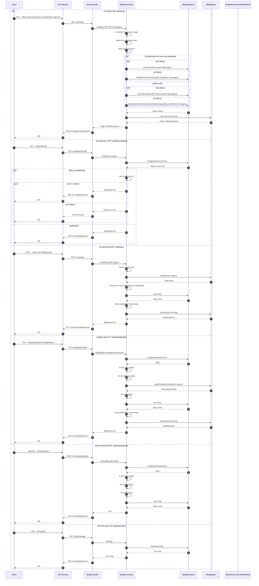

# Manage Blogs — Single Sequence Diagram

This single diagram consolidates Manage Blogs flows in blog-service based on:
- controller/BlogController.java
- service/BlogService.java and service/impl/BlogServiceImpl.java

