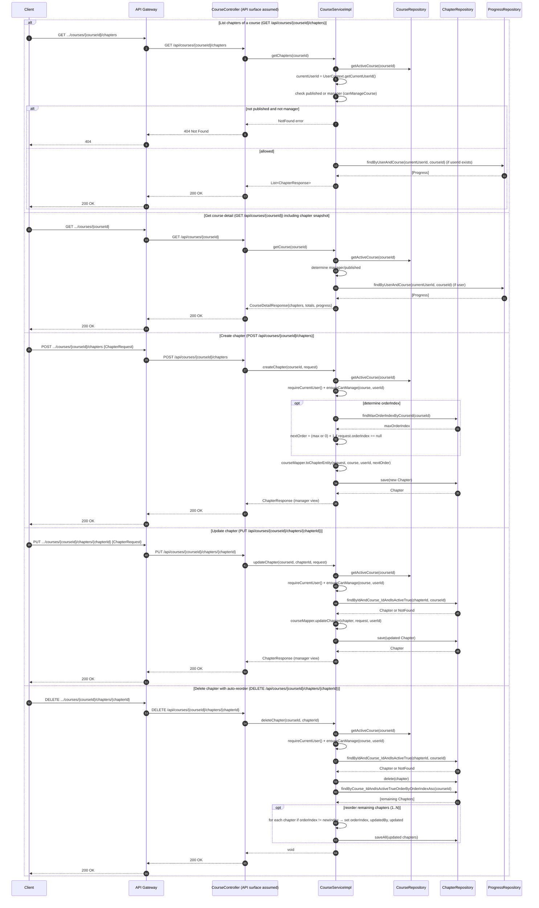

# Manage Chapters — Single Sequence Diagram

This single diagram consolidates Manage Chapters flows in course-service based on:
- service/impl/CourseServiceImpl.java
- repository/ChapterRepository.java

