# Manage Courses — Single Sequence Diagram

This single diagram consolidates Manage Courses flows in course-service based on:
- controller/CourseController.java (endpoints)
- service/impl/CourseServiceImpl.java (business logic)

```mermaid
sequenceDiagram
    autonumber
    participant C as Client
    participant G as API Gateway
    participant CC as CourseController
    participant CS as CourseServiceImpl
    participant CR as CourseRepository
    participant ER as EnrollmentRepository
    participant PR as ProgressRepository
    participant ChR as ChapterRepository
    participant EP as EventPublisher
    participant CM as CourseMapper

    alt List courses (GET /api/courses?search&page&size)
        C->>G: GET .../courses?search&page&size
        G->>CC: GET /api/courses
        CC->>CS: getCourses(search, pageable)
        CS->>CS: normalized = normalizeSearch(search)
        CS->>CS: currentUserId = UserContext.getCurrentUserId()
        CS->>CS: role checks: isAdmin, isInstructor
        alt isAdmin
            CS->>CR: searchCourses(status=null, normalized, pageable)
        else isInstructor && currentUserId
            CS->>CR: searchInstructorCourses(currentUserId, normalized, pageable)
        else general user
            CS->>CR: searchCourses(status=PUBLISHED, normalized, pageable)
        end
        CR-->>CS: Page<Course>
        CS-->>CC: Page<CourseSummaryResponse>
        CC-->>G: 200 OK PageGlobalResponse
        G-->>C: 200 OK
    else Get course detail (GET /api/courses/{courseId})
        C->>G: GET .../courses/{courseId}
        G->>CC: GET /api/courses/{courseId}
        CC->>CS: getCourse(courseId)
        CS->>CR: getActiveCourse(courseId)
        CS->>CS: userId = UserContext.getCurrentUserId()
        CS->>CS: manager = canManageCourse(course, userId)
        CS->>CS: published = course.status == PUBLISHED
        alt !published && !manager
            CS-->>CC: NotFound error (404)
            CC-->>G: 404 Not Found
            G-->>C: 404
        else allowed
            CS->>PR: findByUserAndCourse(userId, courseId) (optional)
            PR-->>CS: [Progress]
            CS->>CS: buildChapterSnapshot + buildCourseSummary
            CS-->>CC: CourseDetailResponse
            CC-->>G: 200 OK
            G-->>C: 200 OK
        end
    else Create course (POST /api/courses)
        C->>G: POST .../courses {CourseRequest}
        G->>CC: POST /api/courses
        CC->>CS: createCourse(request)
        CS->>CS: ensureInstructorOrAdmin()
        CS->>CS: currentUserId = requireCurrentUser()
        CS->>CS: instructorId = resolveInstructorId(request.instructorId, currentUserId)
        CS->>CS: validateDiscount(request.price, request.discountPrice)
        CS->>CM: toEntity(request, instructorId, currentUserId)
        CM-->>CS: Course
        CS->>CR: save(course)
        CR-->>CS: Course (id)
        CS->>CS: mapSkillsToCourse(chooseSkills(request))
        CS->>CS: mapTagsToCourse(request.tags)
        CS->>CR: save(course)
        CS->>EP: publishCourseCreatedEvent(course)
        EP-->>CS: ack
        CS->>CS: getCourse(course.id)
        CS-->>CC: CourseDetailResponse
        CC-->>G: 201 Created GlobalResponse
        G-->>C: 201
    else Update course (PUT /api/courses/{courseId})
        C->>G: PUT .../courses/{courseId} {CourseRequest}
        G->>CC: PUT /api/courses/{courseId}
        CC->>CS: updateCourse(courseId, request)
        CS->>CR: getActiveCourse(courseId)
        CS->>CS: currentUserId = requireCurrentUser()
        alt request.instructorId changes
            alt UserContext.hasAnyRole(ADMIN)
                CS->>CS: course.instructorId = request.instructorId
            else not admin
                CS-->>CC: Forbidden error (403)
                CC-->>G: 403 Forbidden
                G-->>C: 403
            end
        end
        CS->>CS: validateDiscount(request.price or course.price, request.discountPrice)
        CS->>CM: updateEntity(course, request, currentUserId)
        CM-->>CS: Course
        opt update skills/tags if provided
            CS->>CS: mapSkillsToCourse(chooseSkills(request))
            CS->>CS: mapTagsToCourse(request.tags)
        end
        CS->>CR: save(course)
        CR-->>CS: Course
        CS->>EP: publishCourseUpdatedEvent(course)
        EP-->>CS: ack
        CS->>CS: getCourse(courseId)
        CS-->>CC: CourseDetailResponse
        CC-->>G: 200 OK GlobalResponse
        G-->>C: 200 OK
    else Delete course (DELETE /api/courses/{courseId})
        C->>G: DELETE .../courses/{courseId}
        G->>CC: DELETE /api/courses/{courseId}
        CC->>CS: deleteCourse(courseId)
        CS->>CR: getActiveCourse(courseId)
        CS->>CS: currentUserId = requireCurrentUser()
        CS->>CS: ensureCanManage(course, userId)
        CS->>CS: course.isActive = false
        CS->>CS: course.updatedBy = userId
        CS->>CS: course.updated = now
        CS->>CR: save(course)
        CR-->>CS: Course
        CS->>EP: publishCourseDeletedEvent(course)
        EP-->>CS: ack
        CS-->>CC: void
        CC-->>G: 200 OK GlobalResponse
        G-->>C: 200 OK
    else Enroll course (POST /api/courses/{courseId}/enroll)
        C->>G: POST .../courses/{courseId}/enroll
        G->>CC: POST /api/courses/{courseId}/enroll
        CC->>CS: enrollCourse(courseId)
        CS->>CS: currentUserId = requireCurrentUser()
        CS->>CR: getActiveCourse(courseId)
        alt course.status != PUBLISHED
            CS-->>CC: BadRequest error (400) "Course is not open for enrollment"
            CC-->>G: 400 Bad Request
            G-->>C: 400
        else OK
            CS->>ER: findByUserIdAndCourse_Id(currentUserId, courseId) orElse new Enrollment(course,userId)
            ER-->>CS: Enrollment
            alt already active and not DROPPED
                CS-->>CC: BadRequest error (400) "User already enrolled"
                CC-->>G: 400 Bad Request
                G-->>C: 400
            else enroll/update
                CS->>CS: set status=ENROLLED, isActive=true, timestamps, createdBy/updatedBy
                CS->>ER: save(enrollment)
                ER-->>CS: Enrollment
                CS-->>CC: void
                CC-->>G: 200 OK GlobalResponse
                G-->>C: 200 OK
            end
        end
    end
```

