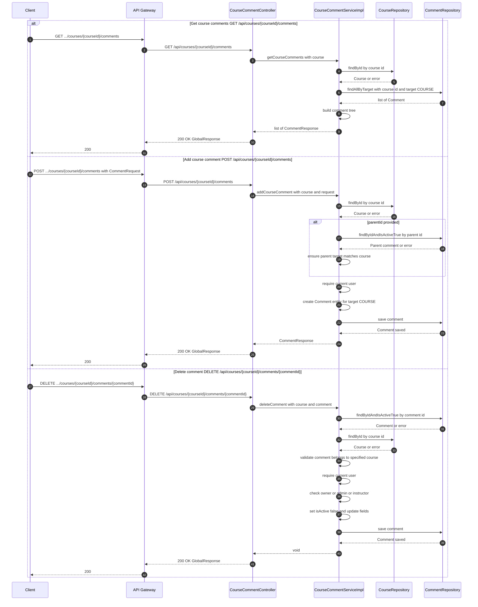

# Manage Course Comments — Single Sequence Diagram

This single diagram consolidates Comments For The Course flows in course-service based on:
- controller/CourseCommentController.java
- service/CourseCommentService.java and service/impl/CourseCommentServiceImpl.java

