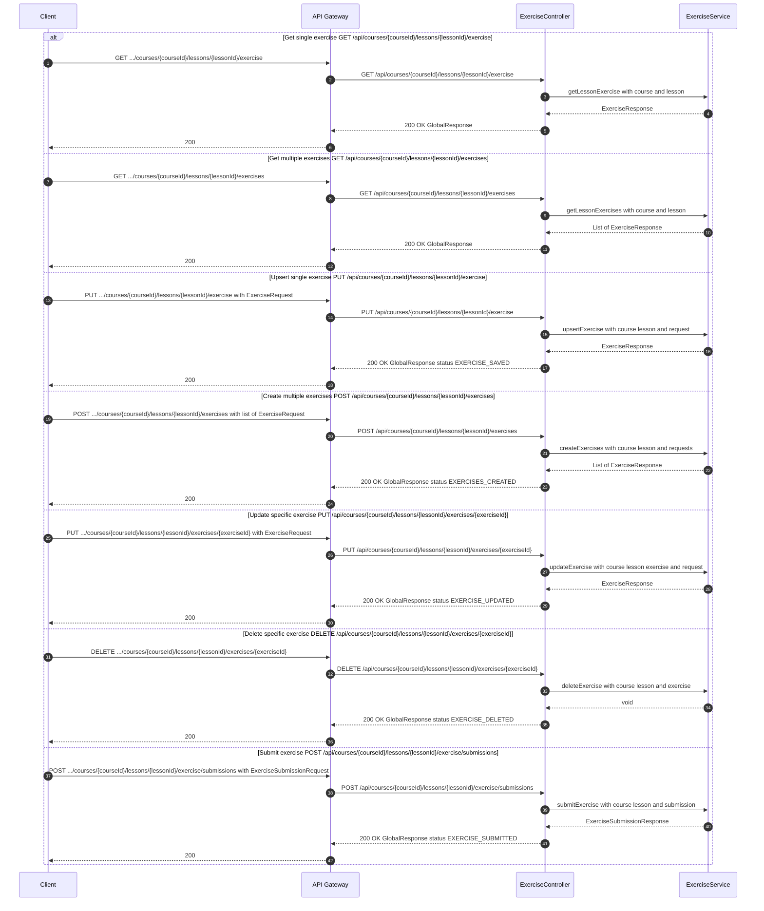

# Manage Exercises — Single Sequence Diagram

This single diagram consolidates Manage Exercises flows in course-service based on:
- controller/ExerciseController.java

```mermaid
sequenceDiagram
    autonumber
    participant C as Client
    participant G as API Gateway
    participant ExCtrl as ExerciseController
    participant ExSvc as ExerciseService

    alt Get single exercise GET /api/courses/{courseId}/lessons/{lessonId}/exercise
        C->>G: GET .../courses/{courseId}/lessons/{lessonId}/exercise
        G->>ExCtrl: GET /api/courses/{courseId}/lessons/{lessonId}/exercise
        ExCtrl->>ExSvc: getLessonExercise with course and lesson
        ExSvc-->>ExCtrl: ExerciseResponse
        ExCtrl-->>G: 200 OK GlobalResponse
        G-->>C: 200
    else Get multiple exercises GET /api/courses/{courseId}/lessons/{lessonId}/exercises
        C->>G: GET .../courses/{courseId}/lessons/{lessonId}/exercises
        G->>ExCtrl: GET /api/courses/{courseId}/lessons/{lessonId}/exercises
        ExCtrl->>ExSvc: getLessonExercises with course and lesson
        ExSvc-->>ExCtrl: List of ExerciseResponse
        ExCtrl-->>G: 200 OK GlobalResponse
        G-->>C: 200
    else Upsert single exercise PUT /api/courses/{courseId}/lessons/{lessonId}/exercise
        C->>G: PUT .../courses/{courseId}/lessons/{lessonId}/exercise with ExerciseRequest
        G->>ExCtrl: PUT /api/courses/{courseId}/lessons/{lessonId}/exercise
        ExCtrl->>ExSvc: upsertExercise with course lesson and request
        ExSvc-->>ExCtrl: ExerciseResponse
        ExCtrl-->>G: 200 OK GlobalResponse status EXERCISE_SAVED
        G-->>C: 200
    else Create multiple exercises POST /api/courses/{courseId}/lessons/{lessonId}/exercises
        C->>G: POST .../courses/{courseId}/lessons/{lessonId}/exercises with list of ExerciseRequest
        G->>ExCtrl: POST /api/courses/{courseId}/lessons/{lessonId}/exercises
        ExCtrl->>ExSvc: createExercises with course lesson and requests
        ExSvc-->>ExCtrl: List of ExerciseResponse
        ExCtrl-->>G: 200 OK GlobalResponse status EXERCISES_CREATED
        G-->>C: 200
    else Update specific exercise PUT /api/courses/{courseId}/lessons/{lessonId}/exercises/{exerciseId}
        C->>G: PUT .../courses/{courseId}/lessons/{lessonId}/exercises/{exerciseId} with ExerciseRequest
        G->>ExCtrl: PUT /api/courses/{courseId}/lessons/{lessonId}/exercises/{exerciseId}
        ExCtrl->>ExSvc: updateExercise with course lesson exercise and request
        ExSvc-->>ExCtrl: ExerciseResponse
        ExCtrl-->>G: 200 OK GlobalResponse status EXERCISE_UPDATED
        G-->>C: 200
    else Delete specific exercise DELETE /api/courses/{courseId}/lessons/{lessonId}/exercises/{exerciseId}
        C->>G: DELETE .../courses/{courseId}/lessons/{lessonId}/exercises/{exerciseId}
        G->>ExCtrl: DELETE /api/courses/{courseId}/lessons/{lessonId}/exercises/{exerciseId}
        ExCtrl->>ExSvc: deleteExercise with course lesson and exercise
        ExSvc-->>ExCtrl: void
        ExCtrl-->>G: 200 OK GlobalResponse status EXERCISE_DELETED
        G-->>C: 200
    else Submit exercise POST /api/courses/{courseId}/lessons/{lessonId}/exercise/submissions
        C->>G: POST .../courses/{courseId}/lessons/{lessonId}/exercise/submissions with ExerciseSubmissionRequest
        G->>ExCtrl: POST /api/courses/{courseId}/lessons/{lessonId}/exercise/submissions
        ExCtrl->>ExSvc: submitExercise with course lesson and submission
        ExSvc-->>ExCtrl: ExerciseSubmissionResponse
        ExCtrl-->>G: 200 OK GlobalResponse status EXERCISE_SUBMITTED
        G-->>C: 200
    end
```

