# Manage Files — Single Sequence Diagram

This single diagram consolidates all Manage Files flows in file-service based on:
- controller/FileController.java
- controller/FolderController.java
- controller/FileUsageController.java
- service/FileManagementService.java and service/impl/FileManagementServiceImpl.java
- service/FolderService.java
- service/FileUsageService.java and service/impl/FileUsageServiceImpl.java

```mermaid
sequenceDiagram
    autonumber
    participant C as Client
    participant G as API Gateway
    participant FCtrl as FileController
    participant FoCtrl as FolderController
    participant FUCtrl as FileUsageController
    participant FMS as FileManagementServiceImpl
    participant FoS as FolderService
    participant FUS as FileUsageServiceImpl
    participant FR as FileRepository
    participant FoR as FileFolderRepository
    participant FUR as FileUsageRepository
    participant CDN as Cloudinary

    alt Upload single file (POST /api/files/upload)
        C->>G: POST .../files/upload multipart{file, userId, folderId?, tags?, description?}
        G->>FCtrl: POST /api/files/upload
        FCtrl->>FMS: uploadFile(file, userId, folderId, tags, description)
        alt folderId provided
            FMS->>FoR: findByIdAndUserIdAndIsActive(folderId, userId, "Y")
            FoR-->>FMS: Folder or error
        end
        FMS->>FMS: determineFileType(mimeType)
        FMS->>CDN: uploader.upload(bytes, {resource_type})
        CDN-->>FMS: {public_id, url, secure_url, width?, height?, duration?}
        FMS->>FR: save(new FileEntity{meta + Cloudinary ids/urls})
        FR-->>FMS: FileEntity
        FMS-->>FCtrl: FileResponse
        FCtrl-->>G: 200 OK {status: success, data}
        G-->>C: 200 OK
    else Upload multiple files (POST /api/files/upload/multiple)
        C->>G: POST .../files/upload/multiple multipart{files[], userId, folderId?, tags?, description?}
        G->>FCtrl: POST /api/files/upload/multiple
        FCtrl->>FMS: uploadMultipleFiles(files, userId, folderId, tags, description)
        loop for each file
            FMS->>FMS: uploadFile(...)
        end
        FMS-->>FCtrl: List<FileResponse>
        FCtrl-->>G: 200 OK {status: success, data}
        G-->>C: 200 OK
    else Get file by id (GET /api/files/{fileId}?userId)
        C->>G: GET .../files/{fileId}?userId
        G->>FCtrl: GET /api/files/{fileId}
        FCtrl->>FMS: getFileById(userId, fileId)
        FMS->>FR: findByIdAndUserIdAndIsActive(fileId, userId, "Y")
        FR-->>FMS: FileEntity or error
        opt resolve folder name
            FMS->>FoR: findById(folderId)
            FoR-->>FMS: FileFolderEntity?
        end
        FMS-->>FCtrl: FileResponse
        FCtrl-->>G: 200 OK {status: success, data}
        G-->>C: 200 OK
    else List files by folder (GET /api/files/folder/{folderId}?userId)
        C->>G: GET .../files/folder/{folderId}?userId
        G->>FCtrl: GET /api/files/folder/{folderId}
        FCtrl->>FMS: getFilesByFolder(userId, folderId)
        FMS->>FR: findByUserIdAndFolderIdAndIsActive(userId, folderId, "Y")
        FR-->>FMS: [FileEntity]
        FMS-->>FCtrl: List<FileResponse>
        FCtrl-->>G: 200 OK {status: success, data}
        G-->>C: 200 OK
    else List files by user (GET /api/files?userId&page&size)
        C->>G: GET .../files?userId&page&size
        G->>FCtrl: GET /api/files
        FCtrl->>FMS: getFilesByUser(userId, pageable)
        FMS->>FR: findByUserIdAndIsActive(userId, "Y", pageable)
        FR-->>FMS: Page<FileEntity>
        FMS-->>FCtrl: Page<FileResponse>
        FCtrl-->>G: 200 OK {status: success, data}
        G-->>C: 200 OK
    else Delete file (DELETE /api/files/{fileId}?userId)
        C->>G: DELETE .../files/{fileId}?userId
        G->>FCtrl: DELETE /api/files/{fileId}
        FCtrl->>FMS: deleteFile(userId, fileId)
        FMS->>FR: findByIdAndUserIdAndIsActive(fileId, userId, "Y")
        FR-->>FMS: FileEntity or error
        FMS->>FUR: countUsagesByFileId(fileId)
        FUR-->>FMS: usageCount
        alt usageCount > 0
            FMS-->>FCtrl: error "Cannot delete file that is currently in use"
            FCtrl-->>G: 409/400 Error
            G-->>C: Error
        else not in use
            FMS->>CDN: uploader.destroy(publicId, {})
            CDN-->>FMS: ok
            FMS->>FR: save(soft delete isActive="N", updatedBy)
            FR-->>FMS: FileEntity
            FMS-->>FCtrl: void
            FCtrl-->>G: 200 OK {status: success}
            G-->>C: 200 OK
        end
    else File statistics (GET /api/files/statistics?userId)
        C->>G: GET .../files/statistics?userId
        G->>FCtrl: GET /api/files/statistics
        FCtrl->>FMS: getFileStatistics(userId)
        FMS->>FR: countByUserId(userId, "Y")
        FMS->>FR: getTotalFileSizeByUserId(userId, "Y")
        FMS->>FR: getFileStatisticsByUserId(userId, "Y")
        FR-->>FMS: aggregated stats
        FMS-->>FCtrl: FileStatisticsResponse
        FCtrl-->>G: 200 OK {status: success, data}
        G-->>C: 200 OK
    else Create folder (POST /api/folders)
        C->>G: POST .../folders {userId, name, parentId?}
        G->>FoCtrl: POST /api/folders
        FoCtrl->>FoS: createFolder(request)
        FoS->>FoR: existsByUserIdAndNameAndParentIdAndIsActive(userId, name, parentId, "Y")
        alt exists
            FoS-->>FoCtrl: error "Folder with this name already exists"
            FoCtrl-->>G: 400 Error
            G-->>C: Error
        else not exists
            alt parentId provided
                FoS->>FoR: findById(parentId)
                FoR-->>FoS: parent or error
                FoS->>FoS: path = parent.path + "/" + name
            else root
                FoS->>FoS: path = "/" + name
            end
            FoS->>FoR: save(new FileFolderEntity{userId, parentId, name, path, isActive="Y"})
            FoR-->>FoS: FileFolderEntity
            FoS-->>FoCtrl: FolderResponse
            FoCtrl-->>G: 200 OK {status: success, data}
            G-->>C: 200 OK
        end
    else Get folders by user (GET /api/folders/user/{userId})
        C->>G: GET .../folders/user/{userId}
        G->>FoCtrl: GET /api/folders/user/{userId}
        FoCtrl->>FoS: getFoldersByUser(userId)
        FoS->>FoR: findByUserIdAndIsActive(userId, "Y")
        FoR-->>FoS: [FileFolderEntity]
        FoS-->>FoCtrl: List<FolderResponse>
        FoCtrl-->>G: 200 OK {status: success, data}
        G-->>C: 200 OK
    else Get folder by id (GET /api/folders/{folderId}?userId)
        C->>G: GET .../folders/{folderId}?userId
        G->>FoCtrl: GET /api/folders/{folderId}
        FoCtrl->>FoS: getFolderById(userId, folderId)
        FoS->>FoR: findByIdAndUserIdAndIsActive(folderId, userId, "Y")
        FoR-->>FoS: FileFolderEntity or error
        FoS-->>FoCtrl: FolderResponse
        FoCtrl-->>G: 200 OK {status: success, data}
        G-->>C: 200 OK
    else Get folder tree (GET /api/folders/{folderId}/tree?userId)
        C->>G: GET .../folders/{folderId}/tree?userId
        G->>FoCtrl: GET /api/folders/{folderId}/tree
        FoCtrl->>FoS: getFolderTree(userId, folderId)
        FoS->>FoR: findByIdAndUserIdAndIsActive(folderId, userId, "Y")
        FoR-->>FoS: FileFolderEntity
        loop recursive children
            FoS->>FoR: findByUserIdAndParentIdAndIsActive(userId, parentId, "Y")
            FoR-->>FoS: [children]
        end
        FoS-->>FoCtrl: FolderResponse (with children)
        FoCtrl-->>G: 200 OK {status: success, data}
        G-->>C: 200 OK
    else Update folder (PUT /api/folders/{folderId}?userId)
        C->>G: PUT .../folders/{folderId}?userId {name?, parentId?}
        G->>FoCtrl: PUT /api/folders/{folderId}
        FoCtrl->>FoS: updateFolder(userId, folderId, request)
        FoS->>FoR: findByIdAndUserIdAndIsActive(folderId, userId, "Y")
        FoR-->>FoS: FileFolderEntity or error
        alt rename requested
            FoS->>FoR: existsByUserIdAndNameAndParentIdAndIsActive(userId, newName, currentParentId, "Y")
            alt exists -> error
                FoS-->>FoCtrl: error duplicate name
                FoCtrl-->>G: 400 Error
                G-->>C: Error
            else not exists
                FoS->>FoS: setName(newName)
            end
        end
        alt move requested (parentId changes)
            FoS->>FoR: findById(newParentId)
            FoR-->>FoS: newParent or error
            FoS->>FoS: isDescendant check (prevent circular move)
            FoS->>FoS: update path to newParent.path + "/" + name (or root)
            FoS->>FoS: setParentId(newParentId)
        end
        FoS->>FoR: save(updated)
        FoR-->>FoS: FileFolderEntity
        FoS-->>FoCtrl: FolderResponse
        FoCtrl-->>G: 200 OK {status: success, data}
        G-->>C: 200 OK
    else Delete folder (DELETE /api/folders/{folderId}?userId)
        C->>G: DELETE .../folders/{folderId}?userId
        G->>FoCtrl: DELETE /api/folders/{folderId}
        FoCtrl->>FoS: deleteFolder(userId, folderId)
        FoS->>FoR: findByIdAndUserIdAndIsActive(folderId, userId, "Y")
        FoR-->>FoS: FileFolderEntity or error
        FoS->>FR: findByUserIdAndFolderIdAndIsActive(userId, folderId, "Y")
        FR-->>FoS: [files]
        alt files not empty -> error
            FoS-->>FoCtrl: error "Cannot delete folder with files"
            FoCtrl-->>G: 400 Error
            G-->>C: Error
        else no files
            FoS->>FoR: findByUserIdAndParentIdAndIsActive(userId, folderId, "Y")
            FoR-->>FoS: [subfolders]
            alt subfolders not empty -> error
                FoS-->>FoCtrl: error "Cannot delete folder with subfolders"
                FoCtrl-->>G: 400 Error
                G-->>C: Error
            else
                FoS->>FoR: save(soft delete isActive="N", updatedBy)
                FoR-->>FoS: FileFolderEntity
                FoS-->>FoCtrl: void
                FoCtrl-->>G: 200 OK {status: success}
                G-->>C: 200 OK
            end
        end
    else Track file usage (POST /api/file-usage/track)
        C->>G: POST .../file-usage/track {fileId, usedInType, usedInId}
        G->>FUCtrl: POST /api/file-usage/track
        FUCtrl->>FUS: trackUsage(request)
        FUS->>FR: findById(fileId)
        FR-->>FUS: FileEntity or error
        FUS->>FUR: existsByFileIdAndUsedInTypeAndUsedInId(fileId, usedInType, usedInId)
        alt exists
            FUS-->>FUCtrl: no-op
            FUCtrl-->>G: 200 OK {status: success}
            G-->>C: 200 OK
        else not exists
            FUS->>FUR: save(new FileUsageEntity{fileId, usedInType, usedInId})
            FUR-->>FUS: FileUsageEntity
            FUS-->>FUCtrl: void
            FUCtrl-->>G: 200 OK {status: success}
            G-->>C: 200 OK
        end
    else Remove file usage (DELETE /api/file-usage/remove)
        C->>G: DELETE .../file-usage/remove?fileId&usedInType&usedInId
        G->>FUCtrl: DELETE /api/file-usage/remove
        FUCtrl->>FUS: removeUsage(fileId, usedInType, usedInId)
        FUS->>FUR: findByFileIdAndUsedInTypeAndUsedInId(fileId, usedInType, usedInId)
        FUR-->>FUS: FileUsageEntity?
        FUS->>FUR: delete(entity) (if present)
        FUS-->>FUCtrl: void
        FUCtrl-->>G: 200 OK {status: success}
        G-->>C: 200 OK
    else Remove all usage by reference (DELETE /api/file-usage/remove-all)
        C->>G: DELETE .../file-usage/remove-all?usedInType&usedInId
        G->>FUCtrl: DELETE /api/file-usage/remove-all
        FUCtrl->>FUS: removeAllByUsedIn(usedInType, usedInId)
        FUS->>FUR: deleteByUsedInTypeAndUsedInId(usedInType, usedInId)
        FUS-->>FUCtrl: void
        FUCtrl-->>G: 200 OK {status: success}
        G-->>C: 200 OK
    else List usages by file (GET /api/file-usage/file/{fileId})
        C->>G: GET .../file-usage/file/{fileId}
        G->>FUCtrl: GET /api/file-usage/file/{fileId}
        FUCtrl->>FUS: listUsagesByFile(fileId)
        FUS->>FUR: findByFileId(fileId)
        FUR-->>FUS: [FileUsageEntity]
        FUS-->>FUCtrl: List of {id, fileId, usedInId, usedInType, created}
        FUCtrl-->>G: 200 OK {status: success, data}
        G-->>C: 200 OK
    end
```

