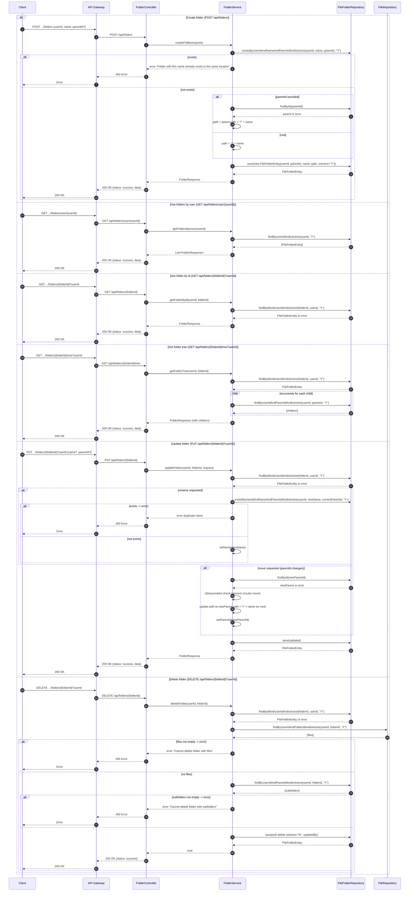

# Manage Folder — Single Sequence Diagram

This single diagram consolidates all Manage Folder flows in file-service based on:
- controller/FolderController.java
- service/FolderService.java

```mermaid
sequenceDiagram
    autonumber
    participant C as Client
    participant G as API Gateway
    participant FoCtrl as FolderController
    participant FoS as FolderService
    participant FoR as FileFolderRepository
    participant FR as FileRepository

    alt Create folder (POST /api/folders)
        C->>G: POST .../folders {userId, name, parentId?}
        G->>FoCtrl: POST /api/folders
        FoCtrl->>FoS: createFolder(request)
        FoS->>FoR: existsByUserIdAndNameAndParentIdAndIsActive(userId, name, parentId, "Y")
        alt exists
            FoS-->>FoCtrl: error "Folder with this name already exists in the same location"
            FoCtrl-->>G: 400 Error
            G-->>C: Error
        else not exists
            alt parentId provided
                FoS->>FoR: findById(parentId)
                FoR-->>FoS: parent or error
                FoS->>FoS: path = parent.path + "/" + name
            else root
                FoS->>FoS: path = "/" + name
            end
            FoS->>FoR: save(new FileFolderEntity{userId, parentId, name, path, isActive="Y"})
            FoR-->>FoS: FileFolderEntity
            FoS-->>FoCtrl: FolderResponse
            FoCtrl-->>G: 200 OK {status: success, data}
            G-->>C: 200 OK
        end
    else Get folders by user (GET /api/folders/user/{userId})
        C->>G: GET .../folders/user/{userId}
        G->>FoCtrl: GET /api/folders/user/{userId}
        FoCtrl->>FoS: getFoldersByUser(userId)
        FoS->>FoR: findByUserIdAndIsActive(userId, "Y")
        FoR-->>FoS: [FileFolderEntity]
        FoS-->>FoCtrl: List<FolderResponse>
        FoCtrl-->>G: 200 OK {status: success, data}
        G-->>C: 200 OK
    else Get folder by id (GET /api/folders/{folderId}?userId)
        C->>G: GET .../folders/{folderId}?userId
        G->>FoCtrl: GET /api/folders/{folderId}
        FoCtrl->>FoS: getFolderById(userId, folderId)
        FoS->>FoR: findByIdAndUserIdAndIsActive(folderId, userId, "Y")
        FoR-->>FoS: FileFolderEntity or error
        FoS-->>FoCtrl: FolderResponse
        FoCtrl-->>G: 200 OK {status: success, data}
        G-->>C: 200 OK
    else Get folder tree (GET /api/folders/{folderId}/tree?userId)
        C->>G: GET .../folders/{folderId}/tree?userId
        G->>FoCtrl: GET /api/folders/{folderId}/tree
        FoCtrl->>FoS: getFolderTree(userId, folderId)
        FoS->>FoR: findByIdAndUserIdAndIsActive(folderId, userId, "Y")
        FoR-->>FoS: FileFolderEntity
        loop recursively for each child
            FoS->>FoR: findByUserIdAndParentIdAndIsActive(userId, parentId, "Y")
            FoR-->>FoS: [children]
        end
        FoS-->>FoCtrl: FolderResponse (with children)
        FoCtrl-->>G: 200 OK {status: success, data}
        G-->>C: 200 OK
    else Update folder (PUT /api/folders/{folderId}?userId)
        C->>G: PUT .../folders/{folderId}?userId {name?, parentId?}
        G->>FoCtrl: PUT /api/folders/{folderId}
        FoCtrl->>FoS: updateFolder(userId, folderId, request)
        FoS->>FoR: findByIdAndUserIdAndIsActive(folderId, userId, "Y")
        FoR-->>FoS: FileFolderEntity or error
        alt rename requested
            FoS->>FoR: existsByUserIdAndNameAndParentIdAndIsActive(userId, newName, currentParentId, "Y")
            alt exists -> error
                FoS-->>FoCtrl: error duplicate name
                FoCtrl-->>G: 400 Error
                G-->>C: Error
            else not exists
                FoS->>FoS: setName(newName)
            end
        end
        alt move requested (parentId changes)
            FoS->>FoR: findById(newParentId)
            FoR-->>FoS: newParent or error
            FoS->>FoS: isDescendant check (prevent circular move)
            FoS->>FoS: update path to newParent.path + "/" + name (or root)
            FoS->>FoS: setParentId(newParentId)
        end
        FoS->>FoR: save(updated)
        FoR-->>FoS: FileFolderEntity
        FoS-->>FoCtrl: FolderResponse
        FoCtrl-->>G: 200 OK {status: success, data}
        G-->>C: 200 OK
    else Delete folder (DELETE /api/folders/{folderId}?userId)
        C->>G: DELETE .../folders/{folderId}?userId
        G->>FoCtrl: DELETE /api/folders/{folderId}
        FoCtrl->>FoS: deleteFolder(userId, folderId)
        FoS->>FoR: findByIdAndUserIdAndIsActive(folderId, userId, "Y")
        FoR-->>FoS: FileFolderEntity or error
        FoS->>FR: findByUserIdAndFolderIdAndIsActive(userId, folderId, "Y")
        FR-->>FoS: [files]
        alt files not empty -> error
            FoS-->>FoCtrl: error "Cannot delete folder with files"
            FoCtrl-->>G: 400 Error
            G-->>C: Error
        else no files
            FoS->>FoR: findByUserIdAndParentIdAndIsActive(userId, folderId, "Y")
            FoR-->>FoS: [subfolders]
            alt subfolders not empty -> error
                FoS-->>FoCtrl: error "Cannot delete folder with subfolders"
                FoCtrl-->>G: 400 Error
                G-->>C: Error
            else
                FoS->>FoR: save(soft delete isActive="N", updatedBy)
                FoR-->>FoS: FileFolderEntity
                FoS-->>FoCtrl: void
                FoCtrl-->>G: 200 OK {status: success}
                G-->>C: 200 OK
            end
        end
    end
```

