# Manage Learning Path — Single Sequence Diagram

This single diagram consolidates Manage Learning Path flows in learning-path-service based on:
- controller/LearningPathController.java
- service/LearningPathService.java and service/impl/LearningPathServiceImpl.java

```mermaid
sequenceDiagram
    autonumber
    participant C as Client
    participant G as API Gateway
    participant LPCtrl as LearningPathController
    participant LPSvc as LearningPathServiceImpl
    participant LPR as LearningPathRepository
    participant LPCR as LearningPathCourseRepository
    participant LPSR as LearningPathSkillRepository
    participant SR as SkillRepository
    participant LPM as LearningPathMapper

    alt Create learning path POST /api/v1/learning-paths
        C->>G: POST .../learning-paths with LearningPathRequestDTO
        G->>LPCtrl: POST /api/v1/learning-paths
        LPCtrl->>LPSvc: createLearningPath from request
        LPSvc->>LPM: toEntity from request
        LPM-->>LPSvc: LearningPath entity
        alt request has skills
            loop for each skill name
                LPSvc->>SR: findByName or save Skill
                SR-->>LPSvc: Skill
                LPSvc->>LPSvc: add LearningPathSkill to path
            end
        end
        LPSvc->>LPR: save learningPath
        LPR-->>LPSvc: LearningPath
        LPSvc->>LPM: toDTO from learningPath
        LPM-->>LPSvc: LearningPathResponseDTO
        LPSvc-->>LPCtrl: LearningPathResponseDTO
        LPCtrl-->>G: 201 Created GlobalResponse
        G-->>C: 201
    else Update learning path PUT /api/v1/learning-paths/{id}
        C->>G: PUT .../learning-paths/{id}
        G->>LPCtrl: PUT /api/v1/learning-paths/{id}
        LPCtrl->>LPSvc: updateLearningPath with id and request
        LPSvc->>LPR: findByIdAndIsActive with id and active
        LPR-->>LPSvc: LearningPath or error
        LPSvc->>LPM: updateEntity with learningPath and request
        alt request has skills
            loop for each skill name
                LPSvc->>SR: findByName or save Skill
                SR-->>LPSvc: Skill
                LPSvc->>LPSvc: sync LearningPathSkill list
            end
        end
        LPSvc->>LPR: save learningPath
        LPR-->>LPSvc: LearningPath
        LPSvc->>LPM: toDTO from learningPath
        LPM-->>LPSvc: LearningPathResponseDTO
        LPSvc-->>LPCtrl: LearningPathResponseDTO
        LPCtrl-->>G: 200 OK GlobalResponse
        G-->>C: 200
    else Get learning path by id GET /api/v1/learning-paths/{id}
        C->>G: GET .../learning-paths/{id}
        G->>LPCtrl: GET /api/v1/learning-paths/{id}
        LPCtrl->>LPSvc: getLearningPathById with id
        LPSvc->>LPR: findByIdAndIsActive with id and active
        LPR-->>LPSvc: LearningPath or error
        LPSvc->>LPM: toDTO from learningPath
        LPM-->>LPSvc: LearningPathResponseDTO
        LPSvc-->>LPCtrl: LearningPathResponseDTO
        LPCtrl-->>G: 200 OK GlobalResponse
        G-->>C: 200
    else Get all learning paths GET /api/v1/learning-paths
        C->>G: GET .../learning-paths
        G->>LPCtrl: GET /api/v1/learning-paths
        LPCtrl->>LPSvc: getAllLearningPaths with paging
        LPSvc->>LPR: findByIsActive active with paging
        LPR-->>LPSvc: Page of LearningPath
        LPSvc->>LPM: map each to DTO
        LPM-->>LPSvc: Page of LearningPathResponseDTO
        LPSvc-->>LPCtrl: PageGlobalResponse
        LPCtrl-->>G: 200 OK PageGlobalResponse
        G-->>C: 200
    else Search learning paths GET /api/v1/learning-paths/search
        C->>G: GET .../learning-paths/search with keyword and paging
        G->>LPCtrl: GET /api/v1/learning-paths/search
        LPCtrl->>LPSvc: searchLearningPaths with keyword and paging
        LPSvc->>LPR: searchLearningPaths with keyword and paging
        LPR-->>LPSvc: Page of LearningPath
        LPSvc->>LPM: map each to DTO
        LPM-->>LPSvc: Page of LearningPathResponseDTO
        LPSvc-->>LPCtrl: PageGlobalResponse
        LPCtrl-->>G: 200 OK PageGlobalResponse
        G-->>C: 200
    else Get learning paths by creator GET /api/v1/learning-paths/creator/{userId}
        C->>G: GET .../learning-paths/creator/{userId}
        G->>LPCtrl: GET /api/v1/learning-paths/creator/{userId}
        LPCtrl->>LPSvc: getLearningPathsByCreator with user and paging
        LPSvc->>LPR: findByCreatedBy with user and paging
        LPR-->>LPSvc: Page of LearningPath
        LPSvc->>LPM: map each to DTO
        LPM-->>LPSvc: Page of LearningPathResponseDTO
        LPSvc-->>LPCtrl: PageGlobalResponse
        LPCtrl-->>G: 200 OK PageGlobalResponse
        G-->>C: 200
    else Delete learning path DELETE /api/v1/learning-paths/{id}
        C->>G: DELETE .../learning-paths/{id}
        G->>LPCtrl: DELETE /api/v1/learning-paths/{id}
        LPCtrl->>LPSvc: deleteLearningPath with id
        LPSvc->>LPR: findByIdAndIsActive with id and active
        LPR-->>LPSvc: LearningPath or error
        LPSvc->>LPSvc: set isActive to false
        LPSvc->>LPR: save learningPath
        LPR-->>LPSvc: LearningPath
        LPSvc-->>LPCtrl: void
        LPCtrl-->>G: 200 OK GlobalResponse
        G-->>C: 200
    else Add courses to path POST /api/v1/learning-paths/{pathId}/courses
        C->>G: POST .../learning-paths/{pathId}/courses with courses list
        G->>LPCtrl: POST /api/v1/learning-paths/{pathId}/courses
        LPCtrl->>LPSvc: addCoursesToPath with path and request
        LPSvc->>LPR: findByIdAndIsActive with path and active
        LPR-->>LPSvc: LearningPath or error
        loop for each course in request
            LPSvc->>LPCR: existsByPathIdAndCourseId
            alt already exists
                LPSvc->>LPSvc: skip adding this course
            else not exists
                LPSvc->>LPCR: save new LearningPathCourse
                LPCR-->>LPSvc: LearningPathCourse
            end
        end
        LPSvc->>LPR: findById by path id
        LPR-->>LPSvc: LearningPath
        LPSvc->>LPM: toDTO from learningPath
        LPM-->>LPSvc: LearningPathResponseDTO
        LPSvc-->>LPCtrl: LearningPathResponseDTO
        LPCtrl-->>G: 200 OK GlobalResponse
        G-->>C: 200
    else Remove course from path DELETE /api/v1/learning-paths/{pathId}/courses/{courseId}
        C->>G: DELETE .../learning-paths/{pathId}/courses/{courseId}
        G->>LPCtrl: DELETE /api/v1/learning-paths/{pathId}/courses/{courseId}
        LPCtrl->>LPSvc: removeCourseFromPath with path and course
        LPSvc->>LPR: findByIdAndIsActive with path and active
        LPR-->>LPSvc: LearningPath or error
        LPSvc->>LPCR: deleteByPathIdAndCourseId
        LPSvc->>LPR: findById by path id
        LPR-->>LPSvc: LearningPath
        LPSvc->>LPM: toDTO from learningPath
        LPM-->>LPSvc: LearningPathResponseDTO
        LPSvc-->>LPCtrl: LearningPathResponseDTO
        LPCtrl-->>G: 200 OK GlobalResponse
        G-->>C: 200
    else Reorder courses PUT /api/v1/learning-paths/{pathId}/courses/reorder
        C->>G: PUT .../learning-paths/{pathId}/courses/reorder with ordered list
        G->>LPCtrl: PUT /api/v1/learning-paths/{pathId}/courses/reorder
        LPCtrl->>LPSvc: reorderCourses with path and courses
        LPSvc->>LPR: findByIdAndIsActive with path and active
        LPR-->>LPSvc: LearningPath or error
        LPSvc->>LPCR: deleteByPathId
        loop for each course in request
            LPSvc->>LPCR: save new LearningPathCourse with order and position
            LPCR-->>LPSvc: LearningPathCourse
        end
        LPSvc->>LPR: findById by path id
        LPR-->>LPSvc: LearningPath
        LPSvc->>LPM: toDTO from learningPath
        LPM-->>LPSvc: LearningPathResponseDTO
        LPSvc-->>LPCtrl: LearningPathResponseDTO
        LPCtrl-->>G: 200 OK GlobalResponse
        G-->>C: 200
    else Get learning paths by course GET /api/v1/learning-paths/by-course/{courseId}
        C->>G: GET .../learning-paths/by-course/{courseId}
        G->>LPCtrl: GET /api/v1/learning-paths/by-course/{courseId}
        LPCtrl->>LPSvc: getLearningPathsByCourse with course
        LPSvc->>LPCR: findByCourseId
        LPCR-->>LPSvc: list of LearningPathCourse
        LPSvc->>LPSvc: extract path id list
        LPSvc->>LPR: findAllById from path ids
        LPR-->>LPSvc: list of LearningPath
        LPSvc->>LPM: toDTOList
        LPM-->>LPSvc: list of LearningPathResponseDTO
        LPSvc-->>LPCtrl: list of LearningPathResponseDTO
        LPCtrl-->>G: 200 OK GlobalResponse
        G-->>C: 200
    end
```

