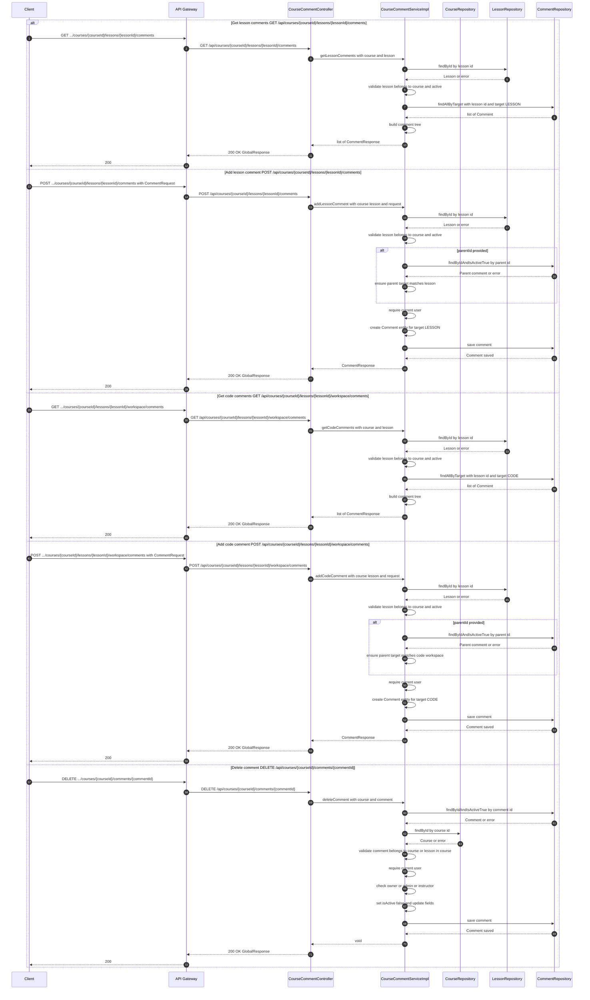

# Manage Lesson Comments — Single Sequence Diagram

This single diagram consolidates Comment For The Lesson flows in course-service based on:
- controller/CourseCommentController.java
- service/CourseCommentService.java and service/impl/CourseCommentServiceImpl.java

