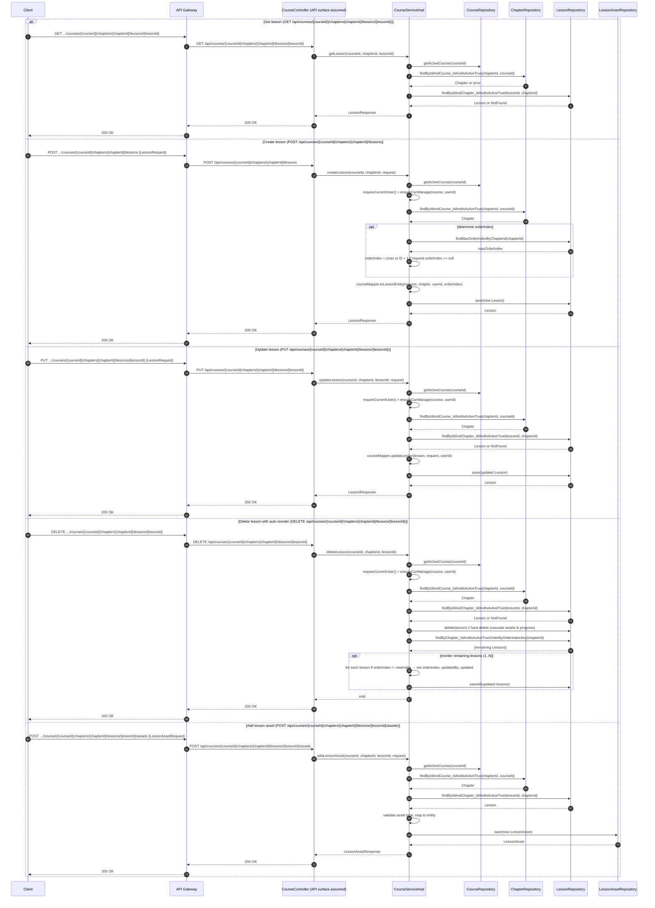

# Manage Lesson — Single Sequence Diagram

This single diagram consolidates Manage Lesson flows in course-service based on:
- service/impl/CourseServiceImpl.java (lesson operations inside course/chapter context)
- repository/LessonRepository.java
- DTOs: LessonRequest, LessonResponse, LessonAssetRequest/Response

