# Manage Permissions — Single Sequence Diagram

This single diagram consolidates all Manage Permissions flows in user-service based on:
- controller/PermissionController.java
- controller/AdminPermissionController.java
- service/PermissionService.java and service/impl/PermissionServiceImpl.java

```mermaid
sequenceDiagram
    autonumber
    participant C as Client
    participant A as Admin
    participant G as API Gateway
    participant PC as User Service - PermissionController
    participant AC as User Service - AdminPermissionController
    participant PS as PermissionServiceImpl
    participant UR as UserRepository
    participant RR as RoleRepository
    participant PR as PermissionRepository
    participant RPR as RolePermissionRepository
    participant UPR as UserPermissionRepository
    participant URR as UserRoleRepository

    alt Permission evaluation (POST /api/users/{userId}/permissions/check)
        C->>G: POST .../users/{userId}/permissions/check {url, method}
        G->>PC: POST /api/users/{userId}/permissions/check
        PC->>PS: hasPermission(userId, url, method)
        rect rgb(245,245,245)
            note over PS: buildEffectivePermissionState(userId)
            PS->>UR: findByIdAndIsActiveTrue(userId)
            UR-->>PS: User (+active UserRoles)
            loop for each active UserRole
                PS->>RPR: findPermissionIdsByRoleId(roleId)
                RPR-->>PS: [permissionIds]
            end
            PS->>UPR: findActiveByUserId(userId)
            UPR-->>PS: [UserPermission overrides]
            note over PS: allowed = rolePermissions +/- user overrides
        end
        PS->>PR: findByIdIn(allowedPermissionIds)
        PR-->>PS: [Permission]
        PS->>PS: Filter method && isActive && AntPathMatcher.match(url)
        PS-->>PC: boolean allowed
        PC-->>G: 200 OK GlobalResponse<Boolean>
        G-->>C: 200 OK
    else Get effective permissions (GET /api/users/{userId}/permissions/effective)
        C->>G: GET .../users/{userId}/permissions/effective
        G->>PC: GET /api/users/{userId}/permissions/effective
        PC->>PS: getEffectivePermissions(userId)
        rect rgb(245,245,245)
            note over PS: buildEffectivePermissionState(userId)
            PS->>UR: findByIdAndIsActiveTrue(userId)
            UR-->>PS: User (+active UserRoles)
            loop for each active UserRole
                PS->>RPR: findPermissionIdsByRoleId(roleId)
                RPR-->>PS: [permissionIds]
            end
            PS->>UPR: findActiveByUserId(userId)
            UPR-->>PS: [UserPermission overrides]
            note over PS: allowed = rolePermissions +/- user overrides
        end
        PS->>PR: findByIdIn(allowedPermissionIds)
        PR-->>PS: [Permission]
        PS-->>PC: List<PermissionResponse> (active only)
        PC-->>G: 200 OK GlobalResponse<List>
        G-->>C: 200 OK
    else Upsert user-level permission override (POST /api/users/{userId}/permissions)
        C->>G: POST .../users/{userId}/permissions {permissionId, allowed, active}
        G->>PC: POST /api/users/{userId}/permissions
        PC->>PS: upsertUserPermission(userId, permissionId, allowed, active, actorId)
        PS->>UR: findByIdAndIsActiveTrue(userId)
        UR-->>PS: User
        PS->>PR: findById(permissionId)
        PR-->>PS: Permission
        PS->>UPR: findByUserIdAndPermissionId(userId, permissionId)
        alt not found
            PS->>UPR: save(new UserPermission{allowed, active, assignedAt, createdBy/updatedBy})
        else found
            PS->>UPR: save(update {allowed, active, updatedBy})
        end
        PS-->>PC: PermissionResponse{source=USER_OVERRIDE, allowed}
        PC-->>G: 200 OK GlobalResponse
        G-->>C: 200 OK
    else Deactivate user-level override (DELETE /api/users/{userId}/permissions/{permissionId})
        C->>G: DELETE .../users/{userId}/permissions/{permissionId}
        G->>PC: DELETE /api/users/{userId}/permissions/{permissionId}
        PC->>PS: deactivateUserPermission(userId, permissionId, actorId)
        PS->>UPR: findByUserIdAndPermissionId(userId, permissionId)
        UPR-->>PS: UserPermission
        PS->>UPR: save(set isActive=false, updatedBy)
        PS-->>PC: void
        PC-->>G: 200 OK GlobalResponse
        G-->>C: 200 OK
    else Admin: Permission create (POST /api/admin/permissions)
        A->>G: POST .../admin/permissions {name, url, method, resource, active}
        G->>AC: POST /api/admin/permissions
        AC->>PS: createPermission(..., actorId)
        PS->>PR: save(new Permission)
        PS-->>AC: PermissionResponse
        AC-->>G: 200 OK
        G-->>A: 200 OK
    else Admin: Permission update (PUT /api/admin/permissions/{permissionId})
        A->>G: PUT .../admin/permissions/{permissionId}
        G->>AC: PUT /api/admin/permissions/{permissionId}
        AC->>PS: updatePermission(..., actorId)
        PS->>PR: findById(permissionId) + save(updated)
        PS-->>AC: PermissionResponse
    else Admin: Permission delete (DELETE /api/admin/permissions/{permissionId})
        A->>G: DELETE .../admin/permissions/{permissionId}
        G->>AC: DELETE /api/admin/permissions/{permissionId}
        AC->>PS: deletePermission(permissionId, actorId)
        PS->>PR: findById(permissionId)
        PS->>PR: save(set isActive=false, updatedBy)
        PS->>RPR: findByPermissionId(permissionId)
        RPR-->>PS: [RolePermission]
        PS->>RPR: deactivate each (isActive=false, updatedBy)
        PS->>UPR: findByPermissionId(permissionId)
        UPR-->>PS: [UserPermission]
        PS->>UPR: deactivate each (isActive=false, updatedBy)
        PS-->>AC: void
    else Admin: Role create (POST /api/admin/roles)
        A->>G: POST .../admin/roles {name, description, active, permissionIds}
        G->>AC: POST /api/admin/roles
        AC->>PS: createRole(..., permissionIds, actorId)
        PS->>RR: save(new Role)
        alt permissionIds provided
            PS->>RPR: findByRoleIdAndIsActive(roleId,true)
            RPR-->>PS: [existing]
            loop permissionIds
                PS->>RPR: save(new RolePermission{grantedAt, isActive=true, createdBy/updatedBy})
            end
        end
        PS-->>AC: RoleResponse
    else Admin: Role update (PUT /api/admin/roles/{roleId})
        A->>G: PUT .../admin/roles/{roleId} {name, description, active, permissionIds}
        G->>AC: PUT /api/admin/roles/{roleId}
        AC->>PS: updateRole(..., permissionIds, actorId)
        PS->>RR: findById(roleId) + save(updated)
        alt permissionIds != null
            PS->>RPR: findByRoleIdAndIsActive(roleId,true)
            RPR-->>PS: [existing]
            PS->>RPR: deactivate all existing
            alt permissionIds not empty
                loop permissionIds
                    PS->>RPR: save(new RolePermission)
                end
            end
        end
        PS-->>AC: RoleResponse
    else Admin: Role delete (DELETE /api/admin/roles/{roleId})
        A->>G: DELETE .../admin/roles/{roleId}
        G->>AC: DELETE /api/admin/roles/{roleId}
        AC->>PS: deleteRole(roleId, actorId)
        PS->>RR: findById(roleId) + save(set isActive=false)
        PS->>RPR: findByRoleIdAndIsActive(roleId,true)
        RPR-->>PS: [RolePermission]
        PS->>RPR: deactivate each
        PS->>URR: findByRoleId(roleId)
        URR-->>PS: [UserRole]
        PS->>URR: deactivate each
        PS-->>AC: void
    else Admin: Assign roles to user (POST /api/admin/users/{userId}/roles)
        A->>G: POST .../admin/users/{userId}/roles {roleIds, active}
        G->>AC: POST /api/admin/users/{userId}/roles
        AC->>PS: assignRolesToUser(userId, roleIds, active, actorId)
        PS->>UR: findByIdAndIsActiveTrue(userId)
        loop for each roleId
            PS->>RR: findById(roleId)
            PS->>URR: findByUserIdAndRoleId(userId, roleId)
            alt not found
                PS->>URR: save(new UserRole{isActive=active, assignedAt, createdBy/updatedBy})
            else found
                PS->>URR: save(update {isActive=active, updatedBy})
            end
        end
        PS-->>AC: void
    else Admin: Remove role from user (DELETE /api/admin/users/{userId}/roles/{roleId})
        A->>G: DELETE .../admin/users/{userId}/roles/{roleId}
        G->>AC: DELETE /api/admin/users/{userId}/roles/{roleId}
        AC->>PS: removeRoleFromUser(userId, roleId, actorId)
        PS->>URR: findByUserIdAndRoleId(userId, roleId)
        URR-->>PS: UserRole
        PS->>URR: save(set isActive=false, updatedBy)
        PS-->>AC: void
    end
```

