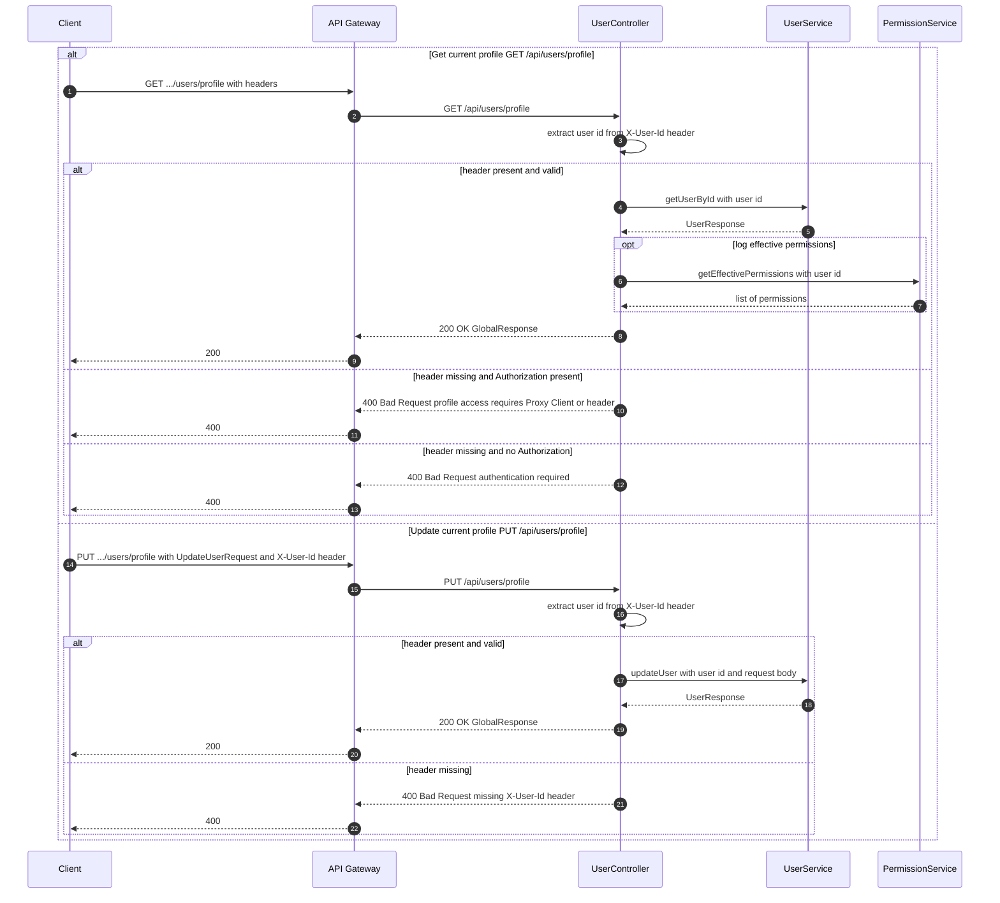

# Manage Profile — Single Sequence Diagram

This single diagram consolidates Manage Profile flows in user-service based on:
- controller/UserController.java (profile endpoints)

```mermaid
sequenceDiagram
    autonumber
    participant C as Client
    participant G as API Gateway
    participant UCtrl as UserController
    participant USvc as UserService
    participant PermSvc as PermissionService

    alt Get current profile GET /api/users/profile
        C->>G: GET .../users/profile with headers
        G->>UCtrl: GET /api/users/profile
        UCtrl->>UCtrl: extract user id from X-User-Id header
        alt header present and valid
            UCtrl->>USvc: getUserById with user id
            USvc-->>UCtrl: UserResponse
            opt log effective permissions
                UCtrl->>PermSvc: getEffectivePermissions with user id
                PermSvc-->>UCtrl: list of permissions
            end
            UCtrl-->>G: 200 OK GlobalResponse
            G-->>C: 200
        else header missing and Authorization present
            UCtrl-->>G: 400 Bad Request profile access requires Proxy Client or header
            G-->>C: 400
        else header missing and no Authorization
            UCtrl-->>G: 400 Bad Request authentication required
            G-->>C: 400
        end
    else Update current profile PUT /api/users/profile
        C->>G: PUT .../users/profile with UpdateUserRequest and X-User-Id header
        G->>UCtrl: PUT /api/users/profile
        UCtrl->>UCtrl: extract user id from X-User-Id header
        alt header present and valid
            UCtrl->>USvc: updateUser with user id and request body
            USvc-->>UCtrl: UserResponse
            UCtrl-->>G: 200 OK GlobalResponse
            G-->>C: 200
        else header missing
            UCtrl-->>G: 400 Bad Request missing X-User-Id header
            G-->>C: 400
        end
    end
```

