# Manage Roles — Single Sequence Diagram

This single diagram consolidates all Manage Roles flows in user-service based on:
- controller/AdminPermissionController.java (role endpoints)
- service/PermissionService.java and service/impl/PermissionServiceImpl.java

```mermaid
sequenceDiagram
    autonumber
    participant A as Admin
    participant G as API Gateway
    participant AC as User Service - AdminPermissionController
    participant PS as PermissionServiceImpl
    participant RR as RoleRepository
    participant PR as PermissionRepository
    participant RPR as RolePermissionRepository
    participant UR as UserRepository
    participant URR as UserRoleRepository

    alt List roles (GET /api/admin/roles)
        A->>G: GET .../admin/roles
        G->>AC: GET /api/admin/roles
        AC->>PS: listRoles()
        PS->>RR: findAll()
        PS->>RPR: findPermissionIdsByRoleId(roleId) (per role via toRoleResponse)
        PS-->>AC: List<RoleResponse> (active only)
        AC-->>G: 200 OK GlobalResponse<List>
        G-->>A: 200 OK
    else Get role by id (GET /api/admin/roles/{roleId})
        A->>G: GET .../admin/roles/{roleId}
        G->>AC: GET /api/admin/roles/{roleId}
        AC->>PS: getRoleById(roleId)
        PS->>RR: findById(roleId)
        PS->>RPR: findPermissionIdsByRoleId(roleId)
        PS-->>AC: RoleResponse
        AC-->>G: 200 OK GlobalResponse
        G-->>A: 200 OK
    else Create role (POST /api/admin/roles)
        A->>G: POST .../admin/roles {name, description, active, permissionIds}
        G->>AC: POST /api/admin/roles
        AC->>PS: createRole(..., permissionIds, actorId)
        PS->>RR: save(new Role)
        alt permissionIds provided
            note over PS: assignPermissionsToRole
            PS->>RPR: findByRoleIdAndIsActive(roleId,true)
            RPR-->>PS: [existing]
            loop permissionIds
                PS->>RPR: save(new RolePermission{grantedAt, isActive=true, createdBy/updatedBy})
            end
        end
        PS-->>AC: RoleResponse
        AC-->>G: 200 OK GlobalResponse
        G-->>A: 200 OK
    else Update role (PUT /api/admin/roles/{roleId})
        A->>G: PUT .../admin/roles/{roleId} {name, description, active, permissionIds}
        G->>AC: PUT /api/admin/roles/{roleId}
        AC->>PS: updateRole(..., permissionIds, actorId)
        PS->>RR: findById(roleId) + save(updated)
        alt permissionIds != null
            PS->>RPR: findByRoleIdAndIsActive(roleId,true)
            RPR-->>PS: [existing]
            PS->>RPR: deactivate all existing
            alt permissionIds not empty
                loop permissionIds
                    PS->>RPR: save(new RolePermission)
                end
            end
        end
        PS-->>AC: RoleResponse
        AC-->>G: 200 OK GlobalResponse
        G-->>A: 200 OK
    else Delete role (DELETE /api/admin/roles/{roleId})
        A->>G: DELETE .../admin/roles/{roleId}
        G->>AC: DELETE /api/admin/roles/{roleId}
        AC->>PS: deleteRole(roleId, actorId)
        PS->>RR: findById(roleId)
        PS->>RR: save(set isActive=false, updatedBy)
        PS->>RPR: findByRoleIdAndIsActive(roleId,true)
        RPR-->>PS: [RolePermission]
        PS->>RPR: deactivate each (isActive=false, updatedBy)
        PS->>URR: findByRoleId(roleId)
        URR-->>PS: [UserRole]
        PS->>URR: deactivate each (isActive=false, updatedBy)
        PS-->>AC: void
        AC-->>G: 200 OK GlobalResponse
        G-->>A: 200 OK
    else Assign permissions to role (POST /api/admin/roles/{roleId}/permissions)
        A->>G: POST .../admin/roles/{roleId}/permissions {permissionIds}
        G->>AC: POST /api/admin/roles/{roleId}/permissions
        AC->>PS: assignPermissionsToRole(roleId, permissionIds, actorId)
        PS->>RR: findById(roleId)
        PS->>RPR: findByRoleIdAndIsActive(roleId,true)
        RPR-->>PS: [existing]
        loop permissionIds
            PS->>RPR: save(new RolePermission{grantedAt, isActive=true, createdBy/updatedBy})
        end
        PS-->>AC: void
        AC-->>G: 200 OK GlobalResponse
        G-->>A: 200 OK
    else Remove permission from role (DELETE /api/admin/roles/{roleId}/permissions/{permissionId})
        A->>G: DELETE .../admin/roles/{roleId}/permissions/{permissionId}
        G->>AC: DELETE /api/admin/roles/{roleId}/permissions/{permissionId}
        AC->>PS: removePermissionFromRole(roleId, permissionId, actorId)
        PS->>RPR: findByRoleIdAndPermissionIdAndIsActive(roleId, permissionId, true)
        RPR-->>PS: RolePermission
        PS->>RPR: save(set isActive=false, updatedBy)
        PS-->>AC: void
        AC-->>G: 200 OK GlobalResponse
        G-->>A: 200 OK
    else Get user roles (GET /api/admin/users/{userId}/roles)
        A->>G: GET .../admin/users/{userId}/roles
        G->>AC: GET /api/admin/users/{userId}/roles
        AC->>PS: getUserRoles(userId)
        PS->>UR: findByIdAndIsActiveTrue(userId)
        loop for each active UserRole
            PS->>RR: findById(roleId)
        end
        PS-->>AC: List<RoleResponse>
        AC-->>G: 200 OK GlobalResponse<List>
        G-->>A: 200 OK
    else Assign roles to user (POST /api/admin/users/{userId}/roles)
        A->>G: POST .../admin/users/{userId}/roles {roleIds, active}
        G->>AC: POST /api/admin/users/{userId}/roles
        AC->>PS: assignRolesToUser(userId, roleIds, active, actorId)
        PS->>UR: findByIdAndIsActiveTrue(userId)
        loop for each roleId
            PS->>RR: findById(roleId)
            PS->>URR: findByUserIdAndRoleId(userId, roleId)
            alt not found
                PS->>URR: save(new UserRole{isActive=active, assignedAt, createdBy/updatedBy})
            else found
                PS->>URR: save(update {isActive=active, updatedBy})
            end
        end
        PS-->>AC: void
        AC-->>G: 200 OK GlobalResponse
        G-->>A: 200 OK
    else Remove role from user (DELETE /api/admin/users/{userId}/roles/{roleId})
        A->>G: DELETE .../admin/users/{userId}/roles/{roleId}
        G->>AC: DELETE /api/admin/users/{userId}/roles/{roleId}
        AC->>PS: removeRoleFromUser(userId, roleId, actorId)
        PS->>URR: findByUserIdAndRoleId(userId, roleId)
        URR-->>PS: UserRole
        PS->>URR: save(set isActive=false, updatedBy)
        PS-->>AC: void
        AC-->>G: 200 OK GlobalResponse
        G-->>A: 200 OK
    end
```

