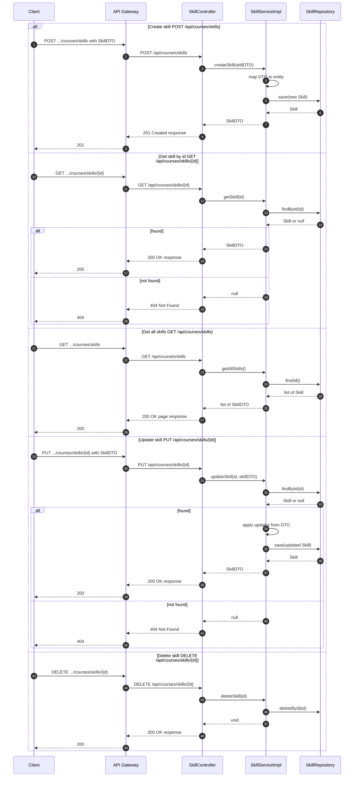

# Manage Skills — Single Sequence Diagram

This single diagram consolidates Manage Skills flows in course-service based on:
- controller/SkillController.java
- service/SkillService.java and service/impl/SkillServiceImpl.java

