# Manage Users — Single Sequence Diagram

This single diagram consolidates Manage Users flows in user-service based on:
- controller/UserController.java
- service/UserService.java (operations invoked by the controller)

```mermaid
sequenceDiagram
    autonumber
    participant C as Client
    participant G as API Gateway
    participant UCtrl as UserController
    participant USvc as UserService
    participant PermSvc as PermissionService

    alt Create user POST /api/users
        C->>G: POST .../api/users with CreateUserRequest
        G->>UCtrl: POST /api/users
        UCtrl->>USvc: createUser from request
        USvc-->>UCtrl: UserResponse
        UCtrl-->>G: 201 Created GlobalResponse
        G-->>C: 201
    else Get user by id GET /api/users/{userId}
        C->>G: GET .../api/users/{userId}
        G->>UCtrl: GET /api/users/{userId}
        UCtrl->>USvc: getUserById with user id
        USvc-->>UCtrl: UserResponse or error
        alt success
            UCtrl-->>G: 200 OK GlobalResponse
            G-->>C: 200
        else not found
            UCtrl-->>G: 404 Not Found GlobalResponse
            G-->>C: 404
        end
    else Get user by email GET /api/users/email/{email}
        C->>G: GET .../api/users/email/{email}
        G->>UCtrl: GET /api/users/email/{email}
        UCtrl->>USvc: getUserByEmail with email
        USvc-->>UCtrl: UserResponse or null
        alt found
            UCtrl-->>G: 200 OK GlobalResponse
            G-->>C: 200
        else not found
            UCtrl-->>G: 404 Not Found
            G-->>C: 404
        end
    else Get user by username GET /api/users/username/{username}
        C->>G: GET .../api/users/username/{username}
        G->>UCtrl: GET /api/users/username/{username}
        UCtrl->>USvc: getUserByUsername with username
        USvc-->>UCtrl: UserResponse or null
        alt found
            UCtrl-->>G: 200 OK GlobalResponse
            G-->>C: 200
        else not found
            UCtrl-->>G: 404 Not Found
            G-->>C: 404
        end
    else Update user PUT /api/users/{userId}
        C->>G: PUT .../api/users/{userId} with UpdateUserRequest
        G->>UCtrl: PUT /api/users/{userId}
        UCtrl->>USvc: updateUser with user id and request
        USvc-->>UCtrl: UserResponse or error
        alt success
            UCtrl-->>G: 200 OK GlobalResponse
            G-->>C: 200
        else error
            UCtrl-->>G: 400 Bad Request GlobalResponse
            G-->>C: 400
        end
    else Delete user DELETE /api/users/{userId}
        C->>G: DELETE .../api/users/{userId}
        G->>UCtrl: DELETE /api/users/{userId}
        UCtrl->>USvc: deleteUser with user id
        USvc-->>UCtrl: void or error
        alt success
            UCtrl-->>G: 200 OK GlobalResponse
            G-->>C: 200
        else error
            UCtrl-->>G: 400 Bad Request GlobalResponse
            G-->>C: 400
        end
    else Change password POST /api/users/{userId}/change-password
        C->>G: POST .../api/users/{userId}/change-password with ChangePasswordRequest
        G->>UCtrl: POST /api/users/{userId}/change-password
        UCtrl->>USvc: changePassword with user id and request
        USvc-->>UCtrl: void or error
        alt success
            UCtrl-->>G: 200 OK GlobalResponse
            G-->>C: 200
        else error
            UCtrl-->>G: 400 Bad Request GlobalResponse
            G-->>C: 400
        end
    else Forgot password POST /api/users/forgot-password
        C->>G: POST .../api/users/forgot-password with ForgotPasswordRequest
        G->>UCtrl: POST /api/users/forgot-password
        UCtrl->>USvc: forgotPassword with request
        USvc-->>UCtrl: void or error
        alt success
            UCtrl-->>G: 200 OK GlobalResponse
            G-->>C: 200
        else error
            UCtrl-->>G: 400 Bad Request GlobalResponse
            G-->>C: 400
        end
    else Resend reset code POST /api/users/resend-reset-code/{email}
        C->>G: POST .../api/users/resend-reset-code/{email}
        G->>UCtrl: POST /api/users/resend-reset-code/{email}
        UCtrl->>USvc: resendResetPasswordCode with email
        USvc-->>UCtrl: void or error
        alt success
            UCtrl-->>G: 200 OK GlobalResponse
            G-->>C: 200
        else error
            UCtrl-->>G: 400 Bad Request GlobalResponse
            G-->>C: 400
        end
    else Reset password POST /api/users/reset-password/{email}
        C->>G: POST .../api/users/reset-password/{email} with ResetPasswordRequest
        G->>UCtrl: POST /api/users/reset-password/{email}
        UCtrl->>USvc: resetPassword with email and request
        USvc-->>UCtrl: void or error
        alt success
            UCtrl-->>G: 200 OK GlobalResponse
            G-->>C: 200
        else error
            UCtrl-->>G: 400 Bad Request GlobalResponse
            G-->>C: 400
        end
    else Activate user POST /api/users/{userId}/activate
        C->>G: POST .../api/users/{userId}/activate
        G->>UCtrl: POST /api/users/{userId}/activate
        UCtrl->>USvc: activateUser with user id
        USvc-->>UCtrl: void or error
        alt success
            UCtrl-->>G: 200 OK GlobalResponse
            G-->>C: 200
        else error
            UCtrl-->>G: 400 Bad Request GlobalResponse
            G-->>C: 400
        end
    else Deactivate user POST /api/users/{userId}/deactivate
        C->>G: POST .../api/users/{userId}/deactivate
        G->>UCtrl: POST /api/users/{userId}/deactivate
        UCtrl->>USvc: deactivateUser with user id
        USvc-->>UCtrl: void or error
        alt success
            UCtrl-->>G: 200 OK GlobalResponse
            G-->>C: 200
        else error
            UCtrl-->>G: 400 Bad Request GlobalResponse
            G-->>C: 400
        end
    else Change user status PUT /api/users/{userId}/status/{status}
        C->>G: PUT .../api/users/{userId}/status/{status}
        G->>UCtrl: PUT /api/users/{userId}/status/{status}
        UCtrl->>USvc: changeUserStatus with user id and status
        USvc-->>UCtrl: void or error
        alt success
            UCtrl-->>G: 200 OK GlobalResponse
            G-->>C: 200
        else error
            UCtrl-->>G: 400 Bad Request GlobalResponse
            G-->>C: 400
        end
    else List or search users GET /api/users
        C->>G: GET .../api/users with page size search?
        G->>UCtrl: GET /api/users
        UCtrl->>UCtrl: build pageable from page and size
        alt search provided
            UCtrl->>USvc: searchUsers with keyword and paging
        else no search
            UCtrl->>USvc: getAllUsers with paging
        end
        USvc-->>UCtrl: Page of UserResponse
        UCtrl-->>G: 200 OK PageGlobalResponse
        G-->>C: 200
    else Public instructors GET /api/users/public/instructors
        C->>G: GET .../api/users/public/instructors page size
        G->>UCtrl: GET /api/users/public/instructors
        UCtrl->>USvc: getInstructorsByRole with INSTRUCTOR and paging
        USvc-->>UCtrl: Page of UserResponse
        UCtrl-->>G: 200 OK PageGlobalResponse
        G-->>C: 200
    else Get current profile GET /api/users/profile
        C->>G: GET .../api/users/profile with X-User-Id or Authorization
        G->>UCtrl: GET /api/users/profile
        UCtrl->>UCtrl: extract user id from X-User-Id or token
        alt valid user id obtained
            UCtrl->>USvc: getUserById with user id
            USvc-->>UCtrl: UserResponse
            opt log permissions
                UCtrl->>PermSvc: getEffectivePermissions with user id
                PermSvc-->>UCtrl: list of PermissionResponse
            end
            UCtrl-->>G: 200 OK GlobalResponse
            G-->>C: 200
        else missing or invalid
            UCtrl-->>G: 400 Bad Request GlobalResponse
            G-->>C: 400
        end
    else Update current profile PUT /api/users/profile
        C->>G: PUT .../api/users/profile with UpdateUserRequest and X-User-Id
        G->>UCtrl: PUT /api/users/profile
        UCtrl->>UCtrl: extract user id from X-User-Id
        alt valid user id obtained
            UCtrl->>USvc: updateUser with user id and request
            USvc-->>UCtrl: UserResponse
            UCtrl-->>G: 200 OK GlobalResponse
            G-->>C: 200
        else missing or invalid
            UCtrl-->>G: 400 Bad Request GlobalResponse
            G-->>C: 400
        end
    end
```

