# TechHub - Sequence Diagrams

## 1. Luồng Register (Đăng ký tài khoản)

### Mô tả luồng

#### Bước 1: User gửi request đăng ký

- **Endpoint**: `POST /api/auth/register`
- **Request Body**: `CreateUserRequest` (email, username, password)

#### Bước 2: AuthController xử lý

- Nhận request và gọi `userService.registerUser(request)`

#### Bước 3: UserServiceImpl.registerUser()

1. **Chuẩn bị dữ liệu user**: Normalize email (lowercase), kiểm tra username available
2. **Kiểm tra email tồn tại**:
   - Nếu email đã tồn tại và active → throw `ConflictException`
   - Nếu email tồn tại nhưng inactive → reactivate user
   - Nếu email mới → tạo user mới với status `INACTIVE`
3. **Lưu user vào database** via `UserRepository`
4. **Gán role mặc định** "LEARNER" via `UserRoleRepository`
5. **Tạo OTP 6 số** via `OTPService.generateOTP()`
6. **Lưu OTP** vào database với expiry 10 phút
7. **Gửi email OTP** via Kafka message → Notification Service

#### Bước 4: User xác thực email

- **Endpoint**: `POST /api/auth/verify-email`
- **Request Body**: `VerifyEmailRequest` (email, code)

#### Bước 5: UserServiceImpl.verifyUserRegistration()

1. **Tìm user** theo email
2. **Validate trạng thái** (không bị deactivated, banned, hoặc đã verified)
3. **Validate OTP** via `OTPService.validateOTP()`
4. **Cập nhật status** thành `ACTIVE`
5. **Xóa OTP** đã sử dụng
6. **Gửi email thông báo** activation và welcome

### Sequence Diagram

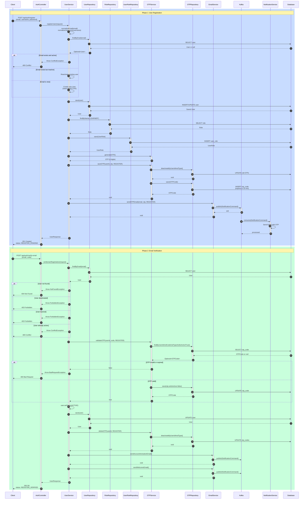
```mermaid
sequenceDiagram
    autonumber
    participant Client
    participant AuthController
    participant UserService
    participant UserRepository
    participant RoleRepository
    participant UserRoleRepository
    participant OTPService
    participant OTPRepository
    participant EmailService
    participant Kafka
    participant NotificationService
    participant Database

    %% Phase 1: Registration
    rect rgb(200, 220, 255)
        Note over Client,Database: Phase 1: User Registration
        Client->>+AuthController: POST /api/auth/register<br/>(email, username, password)
        AuthController->>+UserService: registerUser(request)

        UserService->>UserService: normalizeEmail(email)<br/>normalizeUsername(username)
        UserService->>+UserRepository: findByEmail(email)
        UserRepository->>Database: SELECT user
        Database-->>UserRepository: User or null
        UserRepository-->>-UserService: Optional<User>

        alt Email exists and active
            UserService-->>AuthController: throw ConflictException
            AuthController-->>Client: 409 Conflict
        else Email exists but inactive
            UserService->>UserService: Reactivate existing user
        else Email is new
            UserService->>UserService: Create new User<br/>(status=INACTIVE)
        end

        UserService->>+UserRepository: save(user)
        UserRepository->>Database: INSERT/UPDATE user
        Database-->>UserRepository: Saved User
        UserRepository-->>-UserService: User

        %% Assign Default Role
        UserService->>+RoleRepository: findByName("LEARNER")
        RoleRepository->>Database: SELECT role
        Database-->>RoleRepository: Role
        RoleRepository-->>-UserService: Role

        UserService->>+UserRoleRepository: save(UserRole)
        UserRoleRepository->>Database: INSERT user_role
        Database-->>UserRoleRepository: UserRole
        UserRoleRepository-->>-UserService: UserRole

        %% Generate and Save OTP
        UserService->>+OTPService: generateOTP()
        OTPService-->>-UserService: OTP (6 digits)

        UserService->>+OTPService: saveOTP(userId, otp, REGISTER)
        OTPService->>+OTPRepository: deactivateByUserIdAndType()
        OTPRepository->>Database: UPDATE old OTPs
        OTPRepository-->>-OTPService: void
        OTPService->>+OTPRepository: save(OTPCode)
        OTPRepository->>Database: INSERT otp_code<br/>(expires in 10 min)
        OTPRepository-->>-OTPService: OTPCode
        OTPService-->>-UserService: void

        %% Send Email via Kafka
        UserService->>+EmailService: sendOTPEmail(email, otp, REGISTER)
        EmailService->>+Kafka: publish(NotificationCommand)
        Kafka-->>-EmailService: ack
        EmailService-->>-UserService: void

        Kafka->>+NotificationService: consume(NotificationCommand)
        NotificationService->>NotificationService: Send Email with OTP
        NotificationService-->>-Kafka: processed

        UserService-->>-AuthController: UserResponse
        AuthController-->>-Client: 201 Created<br/>status: REGISTER_PENDING
    end

    %% Phase 2: Email Verification
    rect rgb(200, 255, 220)
        Note over Client,Database: Phase 2: Email Verification
        Client->>+AuthController: POST /api/auth/verify-email<br/>(email, code)
        AuthController->>+UserService: verifyUserRegistration(request)

        UserService->>+UserRepository: findByEmail(email)
        UserRepository->>Database: SELECT user
        Database-->>UserRepository: User
        UserRepository-->>-UserService: User

        alt User not found
            UserService-->>AuthController: throw NotFoundException
            AuthController-->>Client: 404 Not Found
        else User deactivated
            UserService-->>AuthController: throw ForbiddenException
            AuthController-->>Client: 403 Forbidden
        else User banned
            UserService-->>AuthController: throw ForbiddenException
            AuthController-->>Client: 403 Forbidden
        else User already active
            UserService-->>AuthController: throw ConflictException
            AuthController-->>Client: 409 Conflict
        end

        UserService->>+OTPService: validateOTP(userId, code, REGISTER)
        OTPService->>+OTPRepository: findByUserIdAndCodeAndTypeAndIsActiveTrue()
        OTPRepository->>Database: SELECT otp_code
        Database-->>OTPRepository: OTPCode or null
        OTPRepository-->>-OTPService: Optional<OTPCode>

        alt OTP invalid or expired
            OTPService-->>UserService: false
            UserService-->>AuthController: throw BadRequestException
            AuthController-->>Client: 400 Bad Request
        else OTP valid
            OTPService->>+OTPRepository: save(otp.setIsActive=false)
            OTPRepository->>Database: UPDATE otp_code
            OTPRepository-->>-OTPService: OTPCode
            OTPService-->>-UserService: true
        end

        UserService->>UserService: user.setStatus(ACTIVE)
        UserService->>+UserRepository: save(user)
        UserRepository->>Database: UPDATE user
        Database-->>UserRepository: User
        UserRepository-->>-UserService: User

        UserService->>+OTPService: deleteOTP(userId, REGISTER)
        OTPService->>+OTPRepository: deactivateByUserIdAndType()
        OTPRepository->>Database: UPDATE otp_codes
        OTPRepository-->>-OTPService: void
        OTPService-->>-UserService: void

        %% Send Activation & Welcome Emails
        UserService->>+EmailService: sendAccountActivationEmail()
        EmailService->>Kafka: publish(NotificationCommand)
        EmailService-->>-UserService: void

        UserService->>+EmailService: sendWelcomeEmail()
        EmailService->>Kafka: publish(NotificationCommand)
        EmailService-->>-UserService: void

        UserService-->>-AuthController: UserResponse
        AuthController-->>-Client: 200 OK<br/>status: REGISTER_VERIFIED
    end
```

---

## 2. Luồng Login (Đăng nhập)

### Mô tả luồng

#### Bước 1: User gửi request đăng nhập

- **Endpoint**: `POST /api/auth/login`
- **Request Body**: `LoginRequest` (email, password)

#### Bước 2: AuthController xử lý

- Nhận request và gọi `authService.authenticate(request)`

#### Bước 3: AuthServiceImpl.authenticate()

1. **Normalize email** (lowercase, trim)
2. **Tìm user** theo email trong database
3. **Validate trạng thái account**:
   - Kiểm tra user có active không
   - Kiểm tra status có phải `ACTIVE` không
4. **Validate password** bằng `PasswordEncoder.matches()`
5. **Load roles** từ UserRoles
6. **Tạo Access Token** (JWT, 24h expiry) chứa userId, email, roles
7. **Tạo Refresh Token** (JWT, 7 days expiry)
8. **Log authentication** vào database
9. **Trả về AuthResponse** với tokens và user info

### Sequence Diagram

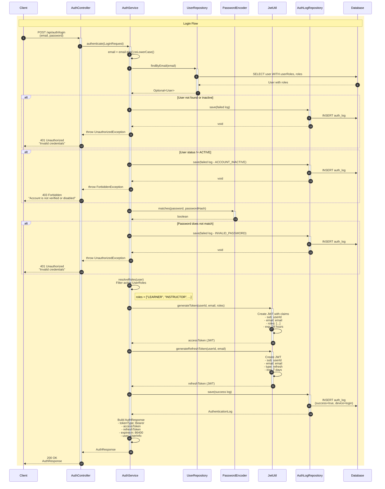
```mermaid
sequenceDiagram
    autonumber
    participant Client
    participant AuthController
    participant AuthService
    participant UserRepository
    participant PasswordEncoder
    participant JwtUtil
    participant AuthLogRepository
    participant Database

    rect rgb(255, 245, 200)
        Note over Client,Database: Login Flow

        Client->>+AuthController: POST /api/auth/login<br/>(email, password)
        AuthController->>+AuthService: authenticate(LoginRequest)

        %% Step 1: Normalize and find user
        AuthService->>AuthService: email = email.trim().toLowerCase()

        AuthService->>+UserRepository: findByEmail(email)
        UserRepository->>Database: SELECT user WITH userRoles, roles
        Database-->>UserRepository: User with roles
        UserRepository-->>-AuthService: Optional<User>

        %% Step 2: Validate user exists and is active
        alt User not found or inactive
            AuthService->>+AuthLogRepository: save(failed log)
            AuthLogRepository->>Database: INSERT auth_log
            AuthLogRepository-->>-AuthService: void
            AuthService-->>AuthController: throw UnauthorizedException
            AuthController-->>Client: 401 Unauthorized<br/>"Invalid credentials"
        end

        %% Step 3: Validate account status
        alt User status != ACTIVE
            AuthService->>+AuthLogRepository: save(failed log - ACCOUNT_INACTIVE)
            AuthLogRepository->>Database: INSERT auth_log
            AuthLogRepository-->>-AuthService: void
            AuthService-->>AuthController: throw ForbiddenException
            AuthController-->>Client: 403 Forbidden<br/>"Account is not verified or disabled"
        end

        %% Step 4: Validate password
        AuthService->>+PasswordEncoder: matches(password, passwordHash)
        PasswordEncoder-->>-AuthService: boolean

        alt Password does not match
            AuthService->>+AuthLogRepository: save(failed log - INVALID_PASSWORD)
            AuthLogRepository->>Database: INSERT auth_log
            AuthLogRepository-->>-AuthService: void
            AuthService-->>AuthController: throw UnauthorizedException
            AuthController-->>Client: 401 Unauthorized<br/>"Invalid credentials"
        end

        %% Step 5: Resolve roles
        AuthService->>AuthService: resolveRoles(user)<br/>Filter active UserRoles
        Note right of AuthService: roles = ["LEARNER", "INSTRUCTOR", ...]

        %% Step 6: Generate tokens
        AuthService->>+JwtUtil: generateToken(userId, email, roles)
        JwtUtil->>JwtUtil: Create JWT with claims<br/>- sub: userId<br/>- email: email<br/>- roles: [...]<br/>- exp: 24 hours
        JwtUtil-->>-AuthService: accessToken (JWT)

        AuthService->>+JwtUtil: generateRefreshToken(userId, email)
        JwtUtil->>JwtUtil: Create JWT<br/>- sub: userId<br/>- email: email<br/>- type: refresh<br/>- exp: 7 days
        JwtUtil-->>-AuthService: refreshToken (JWT)

        %% Step 7: Log successful authentication
        AuthService->>+AuthLogRepository: save(success log)
        AuthLogRepository->>Database: INSERT auth_log<br/>(success=true, device=login)
        AuthLogRepository-->>-AuthService: AuthenticationLog

        %% Step 8: Build response
        AuthService->>AuthService: Build AuthResponse<br/>- tokenType: Bearer<br/>- accessToken<br/>- refreshToken<br/>- expiresIn: 86400<br/>- user: UserInfo

        AuthService-->>-AuthController: AuthResponse
        AuthController-->>-Client: 200 OK<br/>AuthResponse
    end
```

---

## 3. Luồng Logout (Đăng xuất)

### Mô tả luồng

#### Bước 1: User gửi request logout

- **Endpoint**: `POST /api/auth/logout`
- **Header**: `Authorization: Bearer <token>`

#### Bước 2: AuthController xử lý

- Extract token từ header
- Gọi `authService.logout(token)`

#### Bước 3: AuthServiceImpl.logout()

1. **Validate token** không rỗng
2. **Validate token hợp lệ** bằng JwtUtil
3. **Extract userId** từ token
4. **Tìm user** theo userId
5. **Log logout** vào database

### Sequence Diagram

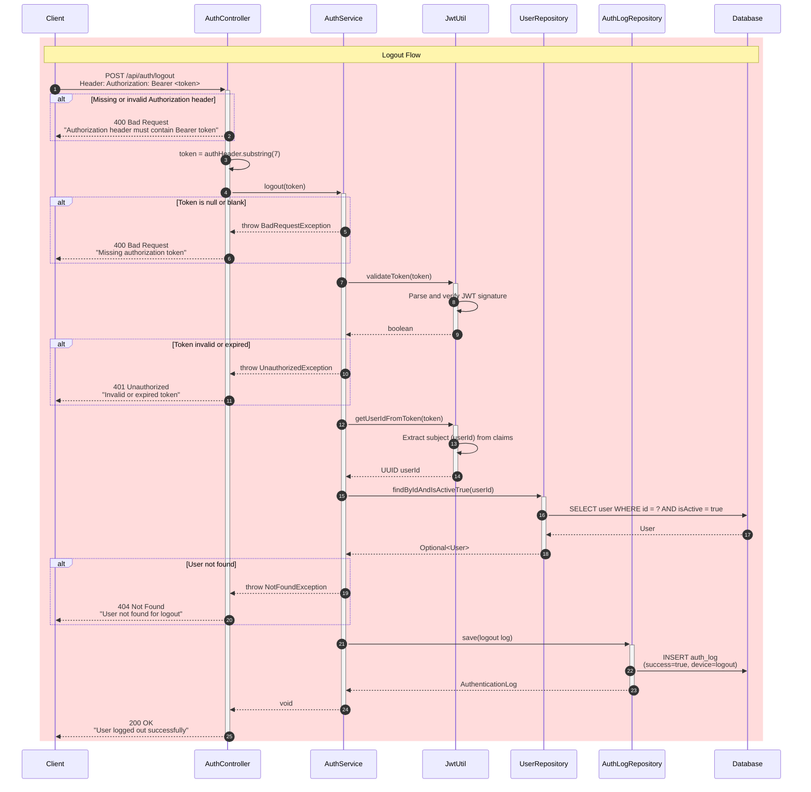
```mermaid
sequenceDiagram
    autonumber
    participant Client
    participant AuthController
    participant AuthService
    participant JwtUtil
    participant UserRepository
    participant AuthLogRepository
    participant Database

    rect rgb(255, 220, 220)
        Note over Client,Database: Logout Flow

        Client->>+AuthController: POST /api/auth/logout<br/>Header: Authorization: Bearer <token>

        %% Extract token from header
        alt Missing or invalid Authorization header
            AuthController-->>Client: 400 Bad Request<br/>"Authorization header must contain Bearer token"
        end

        AuthController->>AuthController: token = authHeader.substring(7)
        AuthController->>+AuthService: logout(token)

        %% Validate token
        alt Token is null or blank
            AuthService-->>AuthController: throw BadRequestException
            AuthController-->>Client: 400 Bad Request<br/>"Missing authorization token"
        end

        AuthService->>+JwtUtil: validateToken(token)
        JwtUtil->>JwtUtil: Parse and verify JWT signature
        JwtUtil-->>-AuthService: boolean

        alt Token invalid or expired
            AuthService-->>AuthController: throw UnauthorizedException
            AuthController-->>Client: 401 Unauthorized<br/>"Invalid or expired token"
        end

        %% Get user from token
        AuthService->>+JwtUtil: getUserIdFromToken(token)
        JwtUtil->>JwtUtil: Extract subject (userId) from claims
        JwtUtil-->>-AuthService: UUID userId

        AuthService->>+UserRepository: findByIdAndIsActiveTrue(userId)
        UserRepository->>Database: SELECT user WHERE id = ? AND isActive = true
        Database-->>UserRepository: User
        UserRepository-->>-AuthService: Optional<User>

        alt User not found
            AuthService-->>AuthController: throw NotFoundException
            AuthController-->>Client: 404 Not Found<br/>"User not found for logout"
        end

        %% Log logout
        AuthService->>+AuthLogRepository: save(logout log)
        AuthLogRepository->>Database: INSERT auth_log<br/>(success=true, device=logout)
        AuthLogRepository-->>-AuthService: AuthenticationLog

        AuthService-->>-AuthController: void
        AuthController-->>-Client: 200 OK<br/>"User logged out successfully"
    end
```

---

## 4. Luồng Forgot Password (Quên mật khẩu)

### Mô tả luồng

Luồng Forgot Password bao gồm 2 phase:

- **Phase 1**: User yêu cầu reset password → hệ thống gửi OTP qua email
- **Phase 2**: User xác thực OTP và đặt mật khẩu mới

#### Phase 1: Request Password Reset

##### Bước 1: User gửi request quên mật khẩu

- **Endpoint**: `POST /api/users/forgot-password`
- **Request Body**: `ForgotPasswordRequest` (email)

##### Bước 2: UserController xử lý

- Nhận request và gọi `userService.forgotPassword(request)`

##### Bước 3: UserServiceImpl.forgotPassword()

1. **Tìm user** theo email (chỉ active users)
2. **Tạo OTP 6 số** via `OTPService.generateOTP()`
3. **Lưu OTP** vào database với type `RESET` và expiry 10 phút
4. **Gửi email** chứa OTP via Kafka → Notification Service

#### Phase 2: Reset Password

##### Bước 1: User gửi request reset password

- **Endpoint**: `POST /api/users/reset-password/{email}`
- **Request Body**: `ResetPasswordRequest` (otp, newPassword, confirmPassword)

##### Bước 2: UserController xử lý

- Nhận request và gọi `userService.resetPassword(email, request)`

##### Bước 3: UserServiceImpl.resetPassword()

1. **Tìm user** theo email
2. **Validate OTP** via `OTPService.validateOTP()`
3. **Validate password confirmation** (newPassword == confirmPassword)
4. **Hash và lưu mật khẩu mới**
5. **Xóa OTP** đã sử dụng

### Sequence Diagram

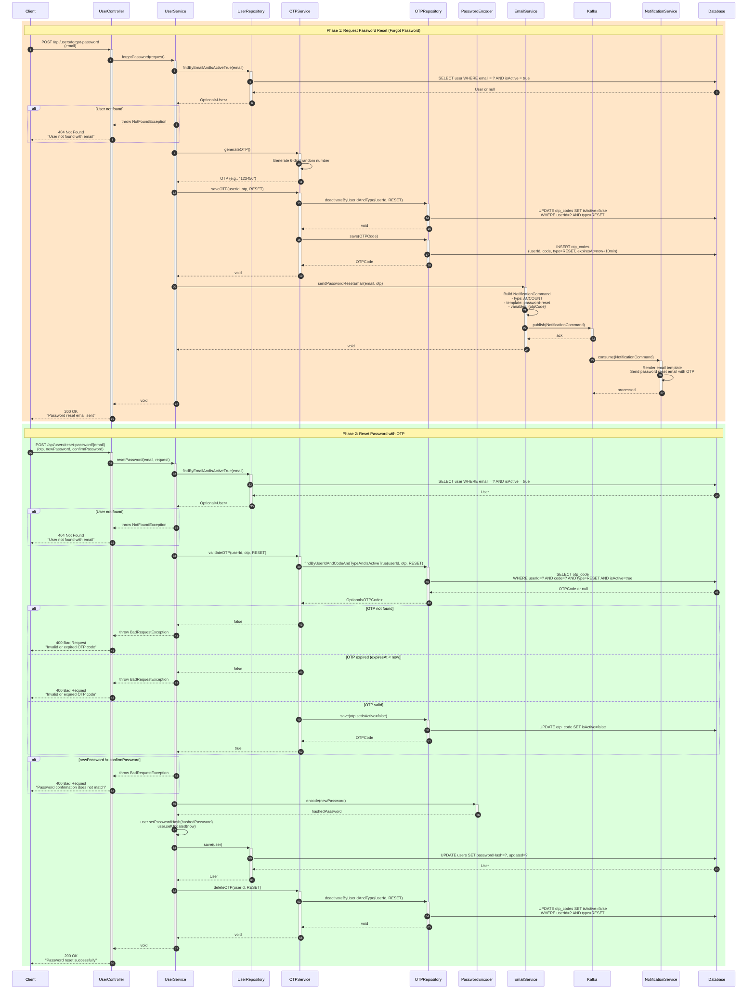
```mermaid
sequenceDiagram
    autonumber
    participant Client
    participant UserController
    participant UserService
    participant UserRepository
    participant OTPService
    participant OTPRepository
    participant PasswordEncoder
    participant EmailService
    participant Kafka
    participant NotificationService
    participant Database

    %% Phase 1: Request Password Reset
    rect rgb(255, 230, 200)
        Note over Client,Database: Phase 1: Request Password Reset (Forgot Password)

        Client->>+UserController: POST /api/users/forgot-password<br/>(email)
        UserController->>+UserService: forgotPassword(request)

        %% Find user by email
        UserService->>+UserRepository: findByEmailAndIsActiveTrue(email)
        UserRepository->>Database: SELECT user WHERE email = ? AND isActive = true
        Database-->>UserRepository: User or null
        UserRepository-->>-UserService: Optional<User>

        alt User not found
            UserService-->>UserController: throw NotFoundException
            UserController-->>Client: 404 Not Found<br/>"User not found with email"
        end

        %% Generate OTP
        UserService->>+OTPService: generateOTP()
        OTPService->>OTPService: Generate 6-digit random number
        OTPService-->>-UserService: OTP (e.g., "123456")

        %% Save OTP
        UserService->>+OTPService: saveOTP(userId, otp, RESET)
        OTPService->>+OTPRepository: deactivateByUserIdAndType(userId, RESET)
        OTPRepository->>Database: UPDATE otp_codes SET isActive=false<br/>WHERE userId=? AND type=RESET
        OTPRepository-->>-OTPService: void

        OTPService->>+OTPRepository: save(OTPCode)
        OTPRepository->>Database: INSERT otp_codes<br/>(userId, code, type=RESET, expiresAt=now+10min)
        OTPRepository-->>-OTPService: OTPCode
        OTPService-->>-UserService: void

        %% Send Password Reset Email via Kafka
        UserService->>+EmailService: sendPasswordResetEmail(email, otp)
        EmailService->>EmailService: Build NotificationCommand<br/>- type: ACCOUNT<br/>- template: password-reset<br/>- variables: {otpCode}
        EmailService->>+Kafka: publish(NotificationCommand)
        Kafka-->>-EmailService: ack
        EmailService-->>-UserService: void

        %% Async: Notification Service processes email
        Kafka->>+NotificationService: consume(NotificationCommand)
        NotificationService->>NotificationService: Render email template<br/>Send password reset email with OTP
        NotificationService-->>-Kafka: processed

        UserService-->>-UserController: void
        UserController-->>-Client: 200 OK<br/>"Password reset email sent"
    end

    %% Phase 2: Reset Password with OTP
    rect rgb(220, 255, 220)
        Note over Client,Database: Phase 2: Reset Password with OTP

        Client->>+UserController: POST /api/users/reset-password/{email}<br/>(otp, newPassword, confirmPassword)
        UserController->>+UserService: resetPassword(email, request)

        %% Find user by email
        UserService->>+UserRepository: findByEmailAndIsActiveTrue(email)
        UserRepository->>Database: SELECT user WHERE email = ? AND isActive = true
        Database-->>UserRepository: User
        UserRepository-->>-UserService: Optional<User>

        alt User not found
            UserService-->>UserController: throw NotFoundException
            UserController-->>Client: 404 Not Found<br/>"User not found with email"
        end

        %% Validate OTP
        UserService->>+OTPService: validateOTP(userId, otp, RESET)
        OTPService->>+OTPRepository: findByUserIdAndCodeAndTypeAndIsActiveTrue(userId, otp, RESET)
        OTPRepository->>Database: SELECT otp_code<br/>WHERE userId=? AND code=? AND type=RESET AND isActive=true
        Database-->>OTPRepository: OTPCode or null
        OTPRepository-->>-OTPService: Optional<OTPCode>

        alt OTP not found
            OTPService-->>UserService: false
            UserService-->>UserController: throw BadRequestException
            UserController-->>Client: 400 Bad Request<br/>"Invalid or expired OTP code"
        else OTP expired (expiresAt < now)
            OTPService-->>UserService: false
            UserService-->>UserController: throw BadRequestException
            UserController-->>Client: 400 Bad Request<br/>"Invalid or expired OTP code"
        else OTP valid
            OTPService->>+OTPRepository: save(otp.setIsActive=false)
            OTPRepository->>Database: UPDATE otp_code SET isActive=false
            OTPRepository-->>-OTPService: OTPCode
            OTPService-->>-UserService: true
        end

        %% Validate password confirmation
        alt newPassword != confirmPassword
            UserService-->>UserController: throw BadRequestException
            UserController-->>Client: 400 Bad Request<br/>"Password confirmation does not match"
        end

        %% Hash and save new password
        UserService->>+PasswordEncoder: encode(newPassword)
        PasswordEncoder-->>-UserService: hashedPassword

        UserService->>UserService: user.setPasswordHash(hashedPassword)<br/>user.setUpdated(now)

        UserService->>+UserRepository: save(user)
        UserRepository->>Database: UPDATE users SET passwordHash=?, updated=?
        Database-->>UserRepository: User
        UserRepository-->>-UserService: User

        %% Delete used OTP
        UserService->>+OTPService: deleteOTP(userId, RESET)
        OTPService->>+OTPRepository: deactivateByUserIdAndType(userId, RESET)
        OTPRepository->>Database: UPDATE otp_codes SET isActive=false<br/>WHERE userId=? AND type=RESET
        OTPRepository-->>-OTPService: void
        OTPService-->>-UserService: void

        UserService-->>-UserController: void
        UserController-->>-Client: 200 OK<br/>"Password reset successfully"
    end
```

---

## 5. Luồng View Blogs (Xem Blog, Comment, Tương tác)

### Mô tả luồng

Luồng View Blogs bao gồm nhiều chức năng:

- **5.1**: Xem danh sách blogs (có filter, search, pagination)
- **5.2**: Xem chi tiết blog
- **5.3**: Tạo blog mới
- **5.4**: Cập nhật blog
- **5.5**: Xóa blog
- **5.6**: Xem comments của blog
- **5.7**: Thêm comment (bao gồm reply)
- **5.8**: Xóa comment

### 5.1 Xem danh sách Blogs

#### Endpoint

- **GET** `/api/blogs`
- **Query Params**:
  - `page` (default: 0)
  - `size` (default: 10)
  - `keyword` (optional) - tìm kiếm theo title/content
  - `tags` (optional) - filter theo tags
  - `includeDrafts` (default: false) - bao gồm drafts (chỉ ADMIN/INSTRUCTOR)

#### Luồng xử lý

1. **Normalize filters**: keyword trim, tags lowercase
2. **Check quyền**: Nếu `includeDrafts=true`, kiểm tra user có role ADMIN/INSTRUCTOR
3. **Query database**:
   - Nếu có filters → search với keyword và tags
   - Nếu không có filters → lấy tất cả blogs published
4. **Return paginated response**

### 5.2 Xem chi tiết Blog

#### Endpoint

- **GET** `/api/blogs/{blogId}`

#### Luồng xử lý

1. **Tìm blog** theo blogId (chỉ active)
2. **Check quyền xem**:
   - Blog `PUBLISHED` → ai cũng xem được
   - Blog `DRAFT` → chỉ author xem được
3. **Return BlogResponse**

### 5.3 Tạo Blog mới

#### Endpoint

- **POST** `/api/blogs`
- **Request Body**: `BlogRequest` (title, content, tags, thumbnail, attachments, status)

#### Luồng xử lý

1. **Yêu cầu authentication**
2. **Map request → Blog entity**
3. **Set authorId, createdBy, updatedBy** = currentUserId
4. **Lưu blog** vào database
5. **Nếu status = PUBLISHED** → gửi notification qua Kafka

### 5.4 Cập nhật Blog

#### Endpoint

- **PUT** `/api/blogs/{blogId}`
- **Request Body**: `BlogRequest`

#### Luồng xử lý

1. **Tìm blog** theo blogId
2. **Check quyền sửa** (author hoặc ADMIN/INSTRUCTOR)
3. **Lưu previousStatus** để check notification
4. **Apply changes** từ request
5. **Lưu blog** vào database
6. **Nếu status chuyển sang PUBLISHED** → gửi notification

### 5.5 Xóa Blog

#### Endpoint

- **DELETE** `/api/blogs/{blogId}`

#### Luồng xử lý

1. **Tìm blog** theo blogId
2. **Check quyền xóa** (author hoặc ADMIN/INSTRUCTOR)
3. **Soft delete**: set `isActive = false`

### 5.6 Xem Comments

#### Endpoint

- **GET** `/api/blogs/{blogId}/comments`

#### Luồng xử lý

1. **Validate blog** tồn tại và có quyền xem
2. **Query comments** theo blogId, targetType = BLOG
3. **Build comment tree** (nested replies)
4. **Return list of CommentResponse**

### 5.7 Thêm Comment

#### Endpoint

- **POST** `/api/blogs/{blogId}/comments`
- **Request Body**: `CommentRequest` (content, parentId)

#### Luồng xử lý

1. **Yêu cầu authentication**
2. **Validate blog** tồn tại và có quyền comment
3. **Nếu có parentId** → validate parent comment tồn tại
4. **Tạo comment** với targetId = blogId, targetType = BLOG
5. **Lưu comment** vào database

### 5.8 Xóa Comment

#### Endpoint

- **DELETE** `/api/blogs/{blogId}/comments/{commentId}`

#### Luồng xử lý

1. **Yêu cầu authentication**
2. **Validate blog và comment** tồn tại
3. **Check quyền xóa**:
   - Comment owner
   - Blog author
   - ADMIN/INSTRUCTOR
4. **Soft delete**: set `isActive = false`

### Sequence Diagram - Xem và Tương tác Blog


```mermaid
sequenceDiagram
    autonumber
    participant Client
    participant APIGateway
    participant BlogController
    participant BlogService
    participant BlogCommentController
    participant BlogCommentService
    participant BlogRepository
    participant CommentRepository
    participant UserContext
    participant Kafka
    participant NotificationService
    participant Database

    %% 5.1: Get Blogs List
    rect rgb(230, 240, 255)
        Note over Client,Database: 5.1: Get Blogs List (with Search & Filter)

        Client->>+APIGateway: GET /api/blogs?page=0&size=10&keyword=java&tags=tutorial
        APIGateway->>+BlogController: getBlogs(page, size, keyword, tags, includeDrafts)
        BlogController->>+BlogService: getBlogs(keyword, tags, includeDrafts, pageable)

        BlogService->>BlogService: normalize(keyword) → "java"<br/>normalizeTags(tags) → ["tutorial"]

        BlogService->>+UserContext: hasAnyRole(ADMIN, INSTRUCTOR)
        UserContext-->>-BlogService: boolean (privileged)

        alt Has search filters
            alt includeDrafts && privileged
                BlogService->>+BlogRepository: searchAll(keyword, tags, pageable)
            else Public search
                BlogService->>+BlogRepository: searchPublished(PUBLISHED, keyword, tags, pageable)
            end
        else No filters
            alt includeDrafts && privileged
                BlogService->>+BlogRepository: findByIsActiveTrueOrderByCreatedDesc(pageable)
            else Public list
                BlogService->>+BlogRepository: findByStatusAndIsActiveTrueOrderByCreatedDesc(PUBLISHED, pageable)
            end
        end

        BlogRepository->>Database: SELECT blogs WHERE status=PUBLISHED<br/>AND (title LIKE %keyword% OR content LIKE %keyword%)<br/>AND tags @> ARRAY[tags]
        Database-->>BlogRepository: Page<Blog>
        BlogRepository-->>-BlogService: Page<Blog>

        BlogService->>BlogService: blogs.map(blogMapper::toResponse)
        BlogService-->>-BlogController: Page<BlogResponse>

        BlogController->>BlogController: Build PageGlobalResponse<br/>with PaginationInfo
        BlogController-->>-APIGateway: PageGlobalResponse<BlogResponse>
        APIGateway-->>-Client: 200 OK<br/>{ data: [...], pagination: {...} }
    end

    %% 5.2: Get Blog Detail
    rect rgb(255, 245, 230)
        Note over Client,Database: 5.2: Get Blog Detail

        Client->>+APIGateway: GET /api/blogs/{blogId}
        APIGateway->>+BlogController: getBlog(blogId)
        BlogController->>+BlogService: getBlog(blogId)

        BlogService->>+BlogRepository: findByIdAndIsActiveTrue(blogId)
        BlogRepository->>Database: SELECT blog WHERE id=? AND isActive=true
        Database-->>BlogRepository: Blog or null
        BlogRepository-->>-BlogService: Optional<Blog>

        alt Blog not found
            BlogService-->>BlogController: throw NotFoundException
            BlogController-->>APIGateway: 404 Not Found
            APIGateway-->>Client: 404 Not Found<br/>"Blog not found"
        end

        alt Blog status != PUBLISHED
            BlogService->>+UserContext: getCurrentUserId()
            UserContext-->>-BlogService: UUID or null

            alt currentUserId != authorId
                BlogService-->>BlogController: throw NotFoundException
                BlogController-->>APIGateway: 404 Not Found
                APIGateway-->>Client: 404 Not Found<br/>"Blog not found"
            end
        end

        BlogService->>BlogService: blogMapper.toResponse(blog)
        BlogService-->>-BlogController: BlogResponse
        BlogController-->>-APIGateway: GlobalResponse<BlogResponse>
        APIGateway-->>-Client: 200 OK<br/>BlogResponse
    end

    %% 5.3: Create Blog
    rect rgb(220, 255, 220)
        Note over Client,Database: 5.3: Create New Blog

        Client->>+APIGateway: POST /api/blogs<br/>{ title, content, tags, status }
        APIGateway->>APIGateway: Validate JWT Token
        APIGateway->>+BlogController: createBlog(BlogRequest)
        BlogController->>+BlogService: createBlog(request)

        BlogService->>+UserContext: getCurrentUserId()
        UserContext-->>-BlogService: UUID currentUserId

        alt Not authenticated
            BlogService-->>BlogController: throw UnauthorizedException
            BlogController-->>APIGateway: 401 Unauthorized
            APIGateway-->>Client: 401 Unauthorized
        end

        BlogService->>BlogService: blogMapper.toEntity(request)
        BlogService->>BlogService: blog.setAuthorId(currentUserId)<br/>blog.setCreatedBy(currentUserId)

        BlogService->>+BlogRepository: save(blog)
        BlogRepository->>Database: INSERT INTO blogs (...)
        Database-->>BlogRepository: Saved Blog
        BlogRepository-->>-BlogService: Blog

        alt status == PUBLISHED
            BlogService->>BlogService: Build NotificationCommand
            BlogService->>+Kafka: publish(NotificationCommand)
            Kafka-->>-BlogService: ack

            Kafka->>+NotificationService: consume(NotificationCommand)
            NotificationService->>NotificationService: Send IN_APP notification<br/>"Your blog is now published"
            NotificationService-->>-Kafka: processed
        end

        BlogService-->>-BlogController: BlogResponse
        BlogController-->>-APIGateway: 201 Created<br/>GlobalResponse<BlogResponse>
        APIGateway-->>-Client: 201 Created<br/>status: BLOG_CREATED
    end

    %% 5.4: Update Blog
    rect rgb(255, 255, 200)
        Note over Client,Database: 5.4: Update Blog

        Client->>+APIGateway: PUT /api/blogs/{blogId}<br/>{ title, content, status }
        APIGateway->>+BlogController: updateBlog(blogId, BlogRequest)
        BlogController->>+BlogService: updateBlog(blogId, request)

        BlogService->>+BlogRepository: findByIdAndIsActiveTrue(blogId)
        BlogRepository->>Database: SELECT blog
        Database-->>BlogRepository: Blog
        BlogRepository-->>-BlogService: Blog

        BlogService->>BlogService: ensureCanModify(blog)<br/>Check authentication
        BlogService->>BlogService: previousStatus = blog.getStatus()
        BlogService->>BlogService: blogMapper.applyRequest(blog, request)

        BlogService->>+BlogRepository: save(blog)
        BlogRepository->>Database: UPDATE blogs SET ...
        Database-->>BlogRepository: Blog
        BlogRepository-->>-BlogService: Blog

        alt previousStatus != PUBLISHED && newStatus == PUBLISHED
            BlogService->>+Kafka: publish(NotificationCommand)
            Kafka-->>-BlogService: ack
        end

        BlogService-->>-BlogController: BlogResponse
        BlogController-->>-APIGateway: GlobalResponse<BlogResponse>
        APIGateway-->>-Client: 200 OK<br/>status: BLOG_UPDATED
    end

    %% 5.5: Delete Blog
    rect rgb(255, 220, 220)
        Note over Client,Database: 5.5: Delete Blog (Soft Delete)

        Client->>+APIGateway: DELETE /api/blogs/{blogId}
        APIGateway->>+BlogController: deleteBlog(blogId)
        BlogController->>+BlogService: deleteBlog(blogId)

        BlogService->>+BlogRepository: findByIdAndIsActiveTrue(blogId)
        BlogRepository-->>-BlogService: Blog

        BlogService->>BlogService: ensureCanModify(blog)
        BlogService->>BlogService: blog.setIsActive(false)

        BlogService->>+BlogRepository: save(blog)
        BlogRepository->>Database: UPDATE blogs SET isActive='N'
        BlogRepository-->>-BlogService: Blog

        BlogService-->>-BlogController: void
        BlogController-->>-APIGateway: GlobalResponse<Void>
        APIGateway-->>-Client: 200 OK<br/>status: BLOG_DELETED
    end
```

### Sequence Diagram - Comments


```mermaid
sequenceDiagram
    autonumber
    participant Client
    participant APIGateway
    participant BlogCommentController
    participant BlogCommentService
    participant BlogRepository
    participant CommentRepository
    participant UserContext
    participant Database

    %% 5.6: Get Comments
    rect rgb(240, 248, 255)
        Note over Client,Database: 5.6: Get Comments for Blog

        Client->>+APIGateway: GET /api/blogs/{blogId}/comments
        APIGateway->>+BlogCommentController: getComments(blogId)
        BlogCommentController->>+BlogCommentService: getComments(blogId)

        %% Resolve readable blog
        BlogCommentService->>+BlogRepository: findByIdAndIsActiveTrue(blogId)
        BlogRepository->>Database: SELECT blog
        Database-->>BlogRepository: Blog
        BlogRepository-->>-BlogCommentService: Blog

        alt Blog not found
            BlogCommentService-->>BlogCommentController: throw NotFoundException
            BlogCommentController-->>Client: 404 Not Found
        end

        alt Blog not published && not author/privileged
            BlogCommentService-->>BlogCommentController: throw ForbiddenException
            BlogCommentController-->>Client: 403 Forbidden
        end

        %% Get comments
        BlogCommentService->>+CommentRepository: findByTargetIdAndTargetTypeAndIsActiveTrueOrderByCreatedAsc(blogId, BLOG)
        CommentRepository->>Database: SELECT comments<br/>WHERE targetId=? AND targetType='BLOG' AND isActive=true<br/>ORDER BY created ASC
        Database-->>CommentRepository: List<BlogComment>
        CommentRepository-->>-BlogCommentService: List<BlogComment>

        %% Build comment tree
        BlogCommentService->>BlogCommentService: buildCommentTree(comments)<br/>1. Create responseMap<br/>2. Link children to parents<br/>3. Sort replies recursively

        Note right of BlogCommentService: Comment Tree Structure:<br/>- Root comments (parentId=null)<br/>  - Reply 1 (parentId=root)<br/>    - Reply 1.1 (parentId=Reply1)<br/>  - Reply 2

        BlogCommentService-->>-BlogCommentController: List<CommentResponse>
        BlogCommentController-->>-APIGateway: GlobalResponse<List<CommentResponse>>
        APIGateway-->>-Client: 200 OK<br/>Nested comments with replies
    end

    %% 5.7: Add Comment
    rect rgb(220, 255, 240)
        Note over Client,Database: 5.7: Add Comment (including Reply)

        Client->>+APIGateway: POST /api/blogs/{blogId}/comments<br/>{ content, parentId? }
        APIGateway->>APIGateway: Validate JWT Token
        APIGateway->>+BlogCommentController: addComment(blogId, CommentRequest)
        BlogCommentController->>+BlogCommentService: addComment(blogId, request)

        %% Require authentication
        BlogCommentService->>+UserContext: getCurrentUserId()
        UserContext-->>-BlogCommentService: UUID currentUserId

        alt Not authenticated
            BlogCommentService-->>BlogCommentController: throw UnauthorizedException
            BlogCommentController-->>Client: 401 Unauthorized
        end

        %% Resolve readable blog
        BlogCommentService->>+BlogRepository: findByIdAndIsActiveTrue(blogId)
        BlogRepository-->>-BlogCommentService: Blog

        %% Resolve parent comment if reply
        alt parentId != null
            BlogCommentService->>+CommentRepository: findByIdAndTargetIdAndIsActiveTrue(parentId, blogId)
            CommentRepository->>Database: SELECT comment WHERE id=? AND targetId=?
            Database-->>CommentRepository: Comment or null
            CommentRepository-->>-BlogCommentService: Optional<BlogComment>

            alt Parent not found
                BlogCommentService-->>BlogCommentController: throw NotFoundException
                BlogCommentController-->>Client: 404 Not Found<br/>"Parent comment not found"
            end
        end

        %% Create comment
        BlogCommentService->>BlogCommentService: Create BlogComment<br/>- content: request.content.trim()<br/>- userId: currentUserId<br/>- targetId: blogId<br/>- targetType: BLOG<br/>- parentId: resolvedParentId

        BlogCommentService->>+CommentRepository: save(comment)
        CommentRepository->>Database: INSERT INTO comments (...)
        Database-->>CommentRepository: Saved Comment
        CommentRepository-->>-BlogCommentService: BlogComment

        BlogCommentService->>BlogCommentService: toResponse(comment, [])
        BlogCommentService-->>-BlogCommentController: CommentResponse
        BlogCommentController-->>-APIGateway: 201 Created<br/>GlobalResponse<CommentResponse>
        APIGateway-->>-Client: 201 Created<br/>status: COMMENT_CREATED
    end

    %% 5.8: Delete Comment
    rect rgb(255, 230, 230)
        Note over Client,Database: 5.8: Delete Comment

        Client->>+APIGateway: DELETE /api/blogs/{blogId}/comments/{commentId}
        APIGateway->>+BlogCommentController: deleteComment(blogId, commentId)
        BlogCommentController->>+BlogCommentService: deleteComment(blogId, commentId)

        %% Require authentication
        BlogCommentService->>+UserContext: getCurrentUserId()
        UserContext-->>-BlogCommentService: UUID currentUserId

        %% Resolve blog
        BlogCommentService->>+BlogRepository: findByIdAndIsActiveTrue(blogId)
        BlogRepository-->>-BlogCommentService: Blog

        %% Find comment
        BlogCommentService->>+CommentRepository: findByIdAndTargetIdAndIsActiveTrue(commentId, blogId)
        CommentRepository->>Database: SELECT comment WHERE id=? AND targetId=?
        Database-->>CommentRepository: Comment
        CommentRepository-->>-BlogCommentService: Optional<BlogComment>

        alt Comment not found
            BlogCommentService-->>BlogCommentController: throw NotFoundException
            BlogCommentController-->>Client: 404 Not Found
        end

        %% Check delete permission
        BlogCommentService->>BlogCommentService: canDeleteComment(comment, blog, currentUserId)
        Note right of BlogCommentService: Can delete if:<br/>1. Comment owner<br/>2. Blog author<br/>3. ADMIN/INSTRUCTOR role

        alt Cannot delete
            BlogCommentService-->>BlogCommentController: throw ForbiddenException
            BlogCommentController-->>Client: 403 Forbidden<br/>"Not allowed to delete"
        end

        %% Soft delete
        BlogCommentService->>BlogCommentService: comment.setIsActive(false)
        BlogCommentService->>+CommentRepository: save(comment)
        CommentRepository->>Database: UPDATE comments SET isActive='N'
        CommentRepository-->>-BlogCommentService: BlogComment

        BlogCommentService-->>-BlogCommentController: void
        BlogCommentController-->>-APIGateway: GlobalResponse<Void>
        APIGateway-->>-Client: 200 OK<br/>status: COMMENT_DELETED
    end
```

### Sequence Diagram - Get Blog Tags

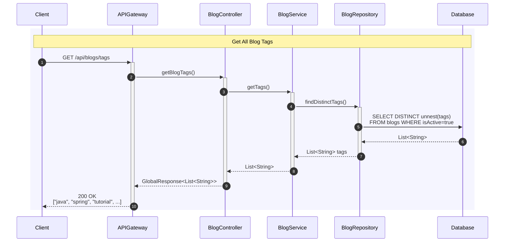
```mermaid
sequenceDiagram
    autonumber
    participant Client
    participant APIGateway
    participant BlogController
    participant BlogService
    participant BlogRepository
    participant Database

    rect rgb(245, 245, 255)
        Note over Client,Database: Get All Blog Tags

        Client->>+APIGateway: GET /api/blogs/tags
        APIGateway->>+BlogController: getBlogTags()
        BlogController->>+BlogService: getTags()

        BlogService->>+BlogRepository: findDistinctTags()
        BlogRepository->>Database: SELECT DISTINCT unnest(tags)<br/>FROM blogs WHERE isActive=true
        Database-->>BlogRepository: List<String>
        BlogRepository-->>-BlogService: List<String> tags

        BlogService-->>-BlogController: List<String>
        BlogController-->>-APIGateway: GlobalResponse<List<String>>
        APIGateway-->>-Client: 200 OK<br/>["java", "spring", "tutorial", ...]
    end
```

---

## 6. Luồng Generate AI Learning Path

### Mô tả luồng

Luồng Generate AI Learning Path cho phép user tạo lộ trình học tập cá nhân hóa dựa trên AI. Hệ thống sử dụng:

- **Vector Search (Qdrant)**: Tìm kiếm các khóa học phù hợp dựa trên mục tiêu học tập
- **OpenAI GPT**: Tạo lộ trình học tập có cấu trúc từ các khóa học tìm được
- **Draft System**: Lưu kết quả dưới dạng draft để user review trước khi áp dụng

### Các thành phần chính

| Component                    | Vai trò                                          |
| ---------------------------- | ------------------------------------------------ |
| `LearningPathAiController`   | Endpoint API nhận request generate learning path |
| `LearningPathAiService`      | Business logic điều phối quá trình generate      |
| `VectorService`              | Tìm kiếm khóa học semantic qua Qdrant            |
| `EmbeddingService`           | Tạo vector embeddings cho text                   |
| `QdrantClient`               | Client gọi API Qdrant vector database            |
| `OpenAiGateway`              | Client gọi OpenAI GPT API                        |
| `AiGenerationTaskRepository` | Lưu trữ task generation và kết quả               |

### Request/Response Structure

#### LearningPathGenerateRequest

```json
{
  "goal": "Trở thành Java Backend Developer",
  "userId": "uuid",
  "duration": "3 months",
  "level": "INTERMEDIATE",
  "timeframe": "10 hours/week",
  "currentLevel": "BEGINNER",
  "targetLevel": "INTERMEDIATE",
  "language": "vi",
  "preferredCourseIds": ["uuid1", "uuid2"]
}
```

#### LearningPathDraftResponse

```json
{
  "taskId": "uuid",
  "status": "DRAFT",
  "title": "Lộ trình Java Backend Developer",
  "nodes": [...],
  "edges": [...],
  "courseIds": ["uuid1", "uuid2", "uuid3"]
}
```

### Chi tiết luồng xử lý

#### Bước 1: Client gửi request

- **Endpoint**: `POST /api/ai/learning-paths/generate`
- **Authentication**: Required (JWT Token)

#### Bước 2: Vector Search - Tìm khóa học phù hợp

1. **EmbeddingService** tạo vector embedding từ `goal`
2. **QdrantClient** search trong collection `courses` với limit = 10
3. Trả về danh sách courses với relevance score

#### Bước 3: Tạo AI Generation Task

1. Tạo record `AiGenerationTask` với status = `DRAFT`
2. Lưu `inputPayload` chứa request + relevant courses
3. Task ID dùng để track progress

#### Bước 4: Build Prompt cho OpenAI

1. Format courses thành context text
2. Combine với user requirements (goal, level, duration)
3. Add system instructions cho structured JSON output

#### Bước 5: Gọi OpenAI GPT

1. **OpenAiGateway** call `/chat/completions` API
2. Model: configurable (default: gpt-4)
3. Response format: JSON object
4. Max tokens: configurable

#### Bước 6: Process và lưu kết quả

1. Parse OpenAI response → Learning Path structure
2. Update task với `resultPayload`
3. Keep status = `DRAFT` để user review

#### Bước 7: Return Draft Response

1. Map result → `LearningPathDraftResponse`
2. Include taskId để user có thể confirm/edit later

### Sequence Diagram


```mermaid
sequenceDiagram
    autonumber
    participant Client
    participant APIGateway
    participant LearningPathAiController
    participant LearningPathAiService
    participant VectorService
    participant EmbeddingService
    participant QdrantClient
    participant OpenAiGateway
    participant OpenAI API
    participant AiTaskRepository
    participant Qdrant
    participant Database

    rect rgb(230, 245, 255)
        Note over Client,Database: Generate AI Learning Path Flow

        %% Step 1: Client Request
        Client->>+APIGateway: POST /api/ai/learning-paths/generate<br/>{ goal, userId, duration, level, ... }
        APIGateway->>APIGateway: Validate JWT Token
        APIGateway->>+LearningPathAiController: generateLearningPath(request)
        LearningPathAiController->>+LearningPathAiService: generatePath(request)

        %% Step 2: Vector Search for Relevant Courses
        rect rgb(255, 248, 220)
            Note over LearningPathAiService,Qdrant: Phase 1: Semantic Course Search

            LearningPathAiService->>+VectorService: searchCourses(goal, 10)
            VectorService->>+EmbeddingService: generateEmbedding(goal)

            EmbeddingService->>EmbeddingService: Build text from goal
            EmbeddingService->>EmbeddingService: Call OpenAI Embeddings API<br/>or use cached embedding
            EmbeddingService-->>-VectorService: List<Double> embedding (1536 dims)

            alt Empty embedding
                VectorService-->>LearningPathAiService: empty list
            else Valid embedding
                VectorService->>+QdrantClient: searchSimilar(collection, embedding, limit=10)
                QdrantClient->>+Qdrant: POST /collections/courses/points/search<br/>{ vector, limit, with_payload: true }
                Qdrant-->>-QdrantClient: SearchResult with scores
                QdrantClient-->>-VectorService: List<Map> course payloads
            end

            VectorService-->>-LearningPathAiService: List<Map> relevantCourses<br/>(id, title, description, objectives)
        end

        %% Step 3: Create AI Generation Task
        rect rgb(220, 255, 220)
            Note over LearningPathAiService,Database: Phase 2: Create Task Record

            LearningPathAiService->>LearningPathAiService: Build inputPayload<br/>{ request, relevantCourses }

            LearningPathAiService->>+AiTaskRepository: save(AiGenerationTask)
            Note right of LearningPathAiService: AiGenerationTask:<br/>- id: UUID<br/>- userId: request.userId<br/>- type: LEARNING_PATH<br/>- status: DRAFT<br/>- inputPayload: JSON<br/>- resultPayload: null
            AiTaskRepository->>Database: INSERT INTO ai_generation_tasks<br/>(id, user_id, type, status, input_payload, created)
            Database-->>AiTaskRepository: Saved Task
            AiTaskRepository-->>-LearningPathAiService: AiGenerationTask (with taskId)
        end

        %% Step 4: Build Prompt
        rect rgb(255, 240, 245)
            Note over LearningPathAiService,LearningPathAiService: Phase 3: Build AI Prompt

            LearningPathAiService->>LearningPathAiService: buildPrompt(request, relevantCourses)
            Note right of LearningPathAiService: Prompt contains:<br/>1. User goal & requirements<br/>2. Current & target level<br/>3. Available time/duration<br/>4. Relevant courses list<br/>5. Instructions for JSON output
        end

        %% Step 5: Call OpenAI
        rect rgb(240, 230, 255)
            Note over LearningPathAiService,OpenAI API: Phase 4: OpenAI Generation

            LearningPathAiService->>+OpenAiGateway: generateStructuredJson(prompt, contextPayload)

            alt Mock Mode Enabled
                OpenAiGateway->>OpenAiGateway: Return stubbed response<br/>{ provider: "stub", prompt_echo, ... }
                OpenAiGateway-->>LearningPathAiService: Map stubbedResponse
            else Production Mode
                OpenAiGateway->>OpenAiGateway: Build request body<br/>- model: gpt-4<br/>- messages: [system, user]<br/>- temperature: 0.3<br/>- response_format: json_object

                OpenAiGateway->>+OpenAI API: POST /chat/completions
                Note right of OpenAiGateway: Headers:<br/>Authorization: Bearer {API_KEY}<br/>Content-Type: application/json

                OpenAI API->>OpenAI API: Generate learning path<br/>with nodes & edges
                OpenAI API-->>-OpenAiGateway: ChatCompletion response

                alt API Error
                    OpenAiGateway-->>LearningPathAiService: { error, provider: "openai", fallback: true }
                else Success
                    OpenAiGateway-->>-LearningPathAiService: Map response with choices
                end
            end
        end

        %% Step 6: Process and Save Result
        rect rgb(220, 255, 240)
            Note over LearningPathAiService,Database: Phase 5: Save Result

            LearningPathAiService->>LearningPathAiService: Parse OpenAI response<br/>Extract learning path JSON

            alt Generation Failed
                LearningPathAiService->>LearningPathAiService: task.setStatus(FAILED)
                LearningPathAiService->>+AiTaskRepository: save(task)
                AiTaskRepository->>Database: UPDATE ai_generation_tasks<br/>SET status='FAILED'
                AiTaskRepository-->>-LearningPathAiService: Task
                LearningPathAiService-->>LearningPathAiController: throw GenerationException
                LearningPathAiController-->>APIGateway: 500 Internal Server Error
                APIGateway-->>Client: 500 Error<br/>"AI generation failed"
            else Generation Success
                LearningPathAiService->>LearningPathAiService: task.setResultPayload(result)<br/>task.setStatus(DRAFT)

                LearningPathAiService->>+AiTaskRepository: save(task)
                AiTaskRepository->>Database: UPDATE ai_generation_tasks<br/>SET result_payload=?, status='DRAFT'
                Database-->>AiTaskRepository: Updated Task
                AiTaskRepository-->>-LearningPathAiService: AiGenerationTask
            end
        end

        %% Step 7: Return Draft Response
        rect rgb(245, 255, 245)
            Note over LearningPathAiService,Client: Phase 6: Return Draft

            LearningPathAiService->>LearningPathAiService: Build LearningPathDraftResponse<br/>- taskId: task.id<br/>- status: DRAFT<br/>- title: parsed from result<br/>- nodes: learning steps<br/>- edges: step connections<br/>- courseIds: matched course IDs

            LearningPathAiService-->>-LearningPathAiController: LearningPathDraftResponse

            LearningPathAiController->>LearningPathAiController: Wrap in GlobalResponse<br/>status: AI_LEARNING_PATH_DRAFT
            LearningPathAiController-->>-APIGateway: GlobalResponse<LearningPathDraftResponse>
            APIGateway-->>-Client: 200 OK<br/>{ status: "AI_LEARNING_PATH_DRAFT",<br/>  data: { taskId, nodes, edges, ... } }
        end
    end

    %% Additional flow: Confirm Draft (optional)
    rect rgb(255, 250, 240)
        Note over Client,Database: [Optional] Confirm Draft Flow

        Client->>+APIGateway: POST /api/ai/learning-paths/{taskId}/confirm
        Note right of Client: User reviews draft and confirms<br/>to create actual Learning Path

        APIGateway->>+LearningPathAiController: confirmLearningPath(taskId)
        LearningPathAiController->>+LearningPathAiService: confirmDraft(taskId)

        LearningPathAiService->>+AiTaskRepository: findById(taskId)
        AiTaskRepository-->>-LearningPathAiService: AiGenerationTask

        alt Task not found or not DRAFT
            LearningPathAiService-->>LearningPathAiController: throw NotFoundException
            LearningPathAiController-->>Client: 404 Not Found
        else Valid Draft
            LearningPathAiService->>LearningPathAiService: Create actual LearningPath<br/>from draft result
            LearningPathAiService->>LearningPathAiService: task.setStatus(CONFIRMED)
            LearningPathAiService->>+AiTaskRepository: save(task)
            AiTaskRepository->>Database: UPDATE SET status='CONFIRMED'
            AiTaskRepository-->>-LearningPathAiService: Task
            LearningPathAiService-->>-LearningPathAiController: LearningPathResponse
            LearningPathAiController-->>-APIGateway: GlobalResponse
            APIGateway-->>-Client: 200 OK<br/>status: AI_LEARNING_PATH_CONFIRMED
        end
    end
```

### Error Handling

| Error Case                 | HTTP Status | Message                       |
| -------------------------- | ----------- | ----------------------------- |
| User not authenticated     | 401         | Unauthorized                  |
| No relevant courses found  | 200         | Returns empty learning path   |
| OpenAI API error           | 500         | AI generation failed          |
| Qdrant connection error    | 500         | Vector search unavailable     |
| Invalid request parameters | 400         | Validation error details      |
| Task not found (confirm)   | 404         | Learning path draft not found |

### Configuration Properties

```yaml
# OpenAI Configuration
openai:
  api-key: ${OPENAI_API_KEY}
  base-url: https://api.openai.com/v1
  chat:
    model: gpt-4
    max-output-tokens: 4096

# Qdrant Configuration
qdrant:
  host: localhost
  port: 6333
  recommendation-collection: courses
  lesson-collection: lessons
  profile-collection: user_profiles

# Chatbot Configuration
chatbot:
  mock-embeddings: false # Set true for testing
  system-prompt: "You are an AI learning path generator..."
```

---

## 7. Luồng AI Learning Assistant (AI Chatbot)

### Mô tả luồng

AI Learning Assistant là một chatbot thông minh hỗ trợ người dùng trong việc học tập. Hệ thống hỗ trợ 2 chế độ:

- **General Mode**: Trả lời các câu hỏi lập trình chung, kiến thức công nghệ
- **Advisor Mode**: Tư vấn học tập cá nhân hóa, gợi ý khóa học dựa trên tiến độ học

Tính năng chính:

- **Session Management**: Quản lý nhiều phiên chat, lưu trữ lịch sử hội thoại
- **Context-Aware**: Sử dụng Vector Search (Qdrant) để tìm khóa học liên quan
- **Personalized**: Kết hợp với tiến độ học tập của user trong Advisor Mode

### Các thành phần chính

| Component                  | Vai trò                               |
| -------------------------- | ------------------------------------- |
| `ChatController`           | Endpoint API cho chat operations      |
| `ChatOrchestrationService` | Business logic điều phối chat flow    |
| `VectorService`            | Tìm kiếm khóa học semantic qua Qdrant |
| `OpenAiGateway`            | Client gọi OpenAI GPT API             |
| `ChatSessionRepository`    | CRUD ChatSession entity               |
| `ChatMessageRepository`    | CRUD ChatMessage entity               |

### Data Structures

#### ChatMode (Enum)

```java
public enum ChatMode {
    GENERAL,   // Trả lời câu hỏi lập trình chung
    ADVISOR    // Tư vấn học tập cá nhân hóa
}
```

#### ChatSender (Enum)

```java
public enum ChatSender {
    USER,  // Tin nhắn từ người dùng
    BOT    // Tin nhắn từ AI
}
```

#### ChatMessageRequest

```json
{
  "sessionId": "uuid (optional - null for new session)",
  "userId": "uuid (required)",
  "mode": "GENERAL | ADVISOR",
  "message": "Câu hỏi của user",
  "context": { "includeProgress": true }
}
```

#### ChatMessageResponse

```json
{
  "sessionId": "uuid",
  "messageId": "uuid",
  "mode": "GENERAL | ADVISOR",
  "message": "Câu trả lời từ AI",
  "answer": "Câu trả lời (backward compatibility)",
  "context": null
}
```

### API Endpoints

| Method | Endpoint                              | Mô tả                            |
| ------ | ------------------------------------- | -------------------------------- |
| POST   | `/api/ai/chat/messages`               | Gửi tin nhắn và nhận phản hồi AI |
| POST   | `/api/ai/chat/sessions`               | Tạo session mới                  |
| GET    | `/api/ai/chat/sessions`               | Lấy danh sách sessions của user  |
| GET    | `/api/ai/chat/sessions/{id}/messages` | Lấy tin nhắn của session         |
| DELETE | `/api/ai/chat/sessions/{id}`          | Xóa session                      |

### Chi tiết luồng xử lý

#### 7.1 Send Message Flow

##### Bước 1: Client gửi message

- **Endpoint**: `POST /api/ai/chat/messages`
- **Authentication**: Required (JWT Token)

##### Bước 2: Load hoặc Create Session

1. Nếu `sessionId` có giá trị → tìm session theo userId
2. Nếu không có → tạo session mới

##### Bước 3: Lưu User Message

1. Tạo `ChatMessage` với sender = `USER`
2. Lưu vào database

##### Bước 4: Build Prompt theo Mode

- **General Mode**: Prompt cho kiến thức lập trình chung
- **Advisor Mode**:
  1. Search Qdrant để tìm khóa học liên quan
  2. Include thông tin khóa học vào prompt

##### Bước 5: Gọi OpenAI

1. Call `OpenAiGateway.generateStructuredJson(prompt, context)`
2. Extract text từ response

##### Bước 6: Lưu Bot Message

1. Tạo `ChatMessage` với sender = `BOT`
2. Lưu vào database

##### Bước 7: Return Response

- Trả về `ChatMessageResponse` với sessionId, messageId, message

#### 7.2 Create Session Flow

##### Bước 1: Client request

- **Endpoint**: `POST /api/ai/chat/sessions?userId={uuid}&mode={GENERAL|ADVISOR}`

##### Bước 2: Tạo Session

1. Tạo `ChatSession` với userId và mode
2. Set `startedAt` = now
3. Lưu vào database

##### Bước 3: Return Session Info

- Trả về `ChatSessionResponse`

#### 7.3 Get User Sessions

##### Endpoint

- **GET** `/api/ai/chat/sessions?userId={uuid}`

##### Luồng xử lý

1. Query sessions by userId, order by startedAt DESC
2. Map to response list
3. Return paginated sessions

#### 7.4 Get Session Messages

##### Endpoint

- **GET** `/api/ai/chat/sessions/{sessionId}/messages`

##### Luồng xử lý

1. Find session by ID
2. Query messages order by timestamp ASC
3. Return message list

#### 7.5 Delete Session

##### Endpoint

- **DELETE** `/api/ai/chat/sessions/{sessionId}?userId={uuid}`

##### Luồng xử lý

1. Find session by ID and userId
2. Delete session (cascade delete messages)
3. Return success

### Sequence Diagram - Send Message

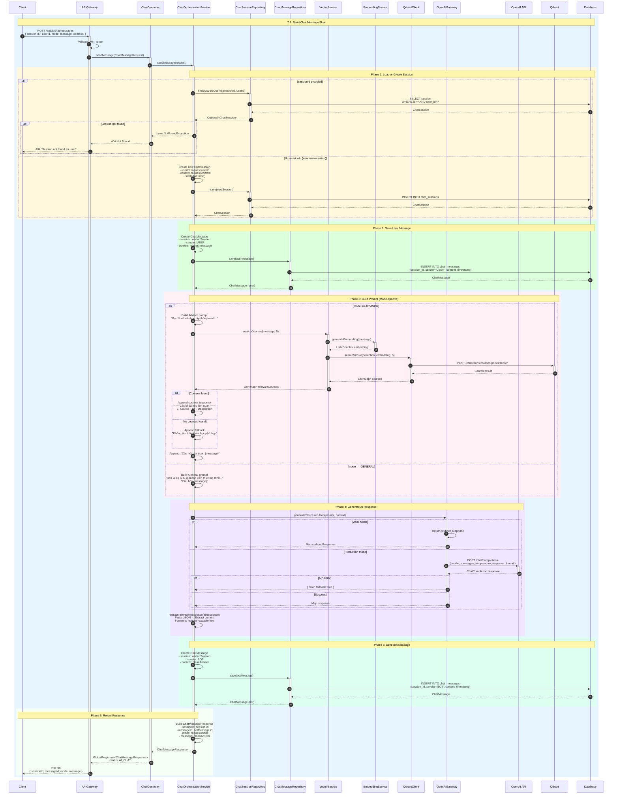
```mermaid
sequenceDiagram
    autonumber
    participant Client
    participant APIGateway
    participant ChatController
    participant ChatOrchestrationService
    participant ChatSessionRepository
    participant ChatMessageRepository
    participant VectorService
    participant EmbeddingService
    participant QdrantClient
    participant OpenAiGateway
    participant OpenAI API
    participant Qdrant
    participant Database

    rect rgb(230, 245, 255)
        Note over Client,Database: 7.1: Send Chat Message Flow

        Client->>+APIGateway: POST /api/ai/chat/messages<br/>{ sessionId?, userId, mode, message, context? }
        APIGateway->>APIGateway: Validate JWT Token
        APIGateway->>+ChatController: sendMessage(ChatMessageRequest)
        ChatController->>+ChatOrchestrationService: sendMessage(request)

        %% Step 2: Load or Create Session
        rect rgb(255, 248, 220)
            Note over ChatOrchestrationService,Database: Phase 1: Load or Create Session

            alt sessionId provided
                ChatOrchestrationService->>+ChatSessionRepository: findByIdAndUserId(sessionId, userId)
                ChatSessionRepository->>Database: SELECT session<br/>WHERE id=? AND user_id=?
                Database-->>ChatSessionRepository: ChatSession
                ChatSessionRepository-->>-ChatOrchestrationService: Optional<ChatSession>

                alt Session not found
                    ChatOrchestrationService-->>ChatController: throw NotFoundException
                    ChatController-->>APIGateway: 404 Not Found
                    APIGateway-->>Client: 404 "Session not found for user"
                end
            else No sessionId (new conversation)
                ChatOrchestrationService->>ChatOrchestrationService: Create new ChatSession<br/>- userId: request.userId<br/>- context: request.context<br/>- startedAt: now()

                ChatOrchestrationService->>+ChatSessionRepository: save(newSession)
                ChatSessionRepository->>Database: INSERT INTO chat_sessions
                Database-->>ChatSessionRepository: ChatSession
                ChatSessionRepository-->>-ChatOrchestrationService: ChatSession
            end
        end

        %% Step 3: Save User Message
        rect rgb(220, 255, 220)
            Note over ChatOrchestrationService,Database: Phase 2: Save User Message

            ChatOrchestrationService->>ChatOrchestrationService: Create ChatMessage<br/>- session: loadedSession<br/>- sender: USER<br/>- content: request.message

            ChatOrchestrationService->>+ChatMessageRepository: save(userMessage)
            ChatMessageRepository->>Database: INSERT INTO chat_messages<br/>(session_id, sender='USER', content, timestamp)
            Database-->>ChatMessageRepository: ChatMessage
            ChatMessageRepository-->>-ChatOrchestrationService: ChatMessage (user)
        end

        %% Step 4: Build Prompt based on Mode
        rect rgb(255, 240, 245)
            Note over ChatOrchestrationService,Qdrant: Phase 3: Build Prompt (Mode-specific)

            alt mode == ADVISOR
                ChatOrchestrationService->>ChatOrchestrationService: Build Advisor prompt<br/>"Bạn là cố vấn học tập thông minh..."

                ChatOrchestrationService->>+VectorService: searchCourses(message, 5)
                VectorService->>+EmbeddingService: generateEmbedding(message)
                EmbeddingService-->>-VectorService: List<Double> embedding

                VectorService->>+QdrantClient: searchSimilar(collection, embedding, 5)
                QdrantClient->>+Qdrant: POST /collections/courses/points/search
                Qdrant-->>-QdrantClient: SearchResult
                QdrantClient-->>-VectorService: List<Map> courses
                VectorService-->>-ChatOrchestrationService: List<Map> relevantCourses

                alt Courses found
                    ChatOrchestrationService->>ChatOrchestrationService: Append courses to prompt<br/>"=== Các khóa học liên quan ==="<br/>1. Course Title - Description
                else No courses found
                    ChatOrchestrationService->>ChatOrchestrationService: Append fallback<br/>"Không tìm thấy khóa học phù hợp"
                end

                ChatOrchestrationService->>ChatOrchestrationService: Append: "Câu hỏi của user: {message}"

            else mode == GENERAL
                ChatOrchestrationService->>ChatOrchestrationService: Build General prompt<br/>"Bạn là trợ lý AI giải đáp kiến thức lập trình..."<br/>"Câu hỏi: {message}"
            end
        end

        %% Step 5: Call OpenAI
        rect rgb(240, 230, 255)
            Note over ChatOrchestrationService,OpenAI API: Phase 4: Generate AI Response

            ChatOrchestrationService->>+OpenAiGateway: generateStructuredJson(prompt, context)

            alt Mock Mode
                OpenAiGateway->>OpenAiGateway: Return stubbed response
                OpenAiGateway-->>ChatOrchestrationService: Map stubbedResponse
            else Production Mode
                OpenAiGateway->>+OpenAI API: POST /chat/completions<br/>{ model, messages, temperature, response_format }
                OpenAI API-->>-OpenAiGateway: ChatCompletion response

                alt API Error
                    OpenAiGateway-->>ChatOrchestrationService: { error, fallback: true }
                else Success
                    OpenAiGateway-->>-ChatOrchestrationService: Map response
                end
            end

            ChatOrchestrationService->>ChatOrchestrationService: extractTextFromResponse(aiResponse)<br/>Parse JSON → Extract content<br/>Format to human-readable text
        end

        %% Step 6: Save Bot Message
        rect rgb(220, 255, 240)
            Note over ChatOrchestrationService,Database: Phase 5: Save Bot Message

            ChatOrchestrationService->>ChatOrchestrationService: Create ChatMessage<br/>- session: loadedSession<br/>- sender: BOT<br/>- content: cleanAnswer

            ChatOrchestrationService->>+ChatMessageRepository: save(botMessage)
            ChatMessageRepository->>Database: INSERT INTO chat_messages<br/>(session_id, sender='BOT', content, timestamp)
            Database-->>ChatMessageRepository: ChatMessage
            ChatMessageRepository-->>-ChatOrchestrationService: ChatMessage (bot)
        end

        %% Step 7: Return Response
        rect rgb(245, 255, 245)
            Note over ChatOrchestrationService,Client: Phase 6: Return Response

            ChatOrchestrationService->>ChatOrchestrationService: Build ChatMessageResponse<br/>- sessionId: session.id<br/>- messageId: botMessage.id<br/>- mode: request.mode<br/>- message: cleanAnswer

            ChatOrchestrationService-->>-ChatController: ChatMessageResponse
            ChatController-->>-APIGateway: GlobalResponse<ChatMessageResponse><br/>status: AI_CHAT
            APIGateway-->>-Client: 200 OK<br/>{ sessionId, messageId, mode, message }
        end
    end
```

### Sequence Diagram - Session Management

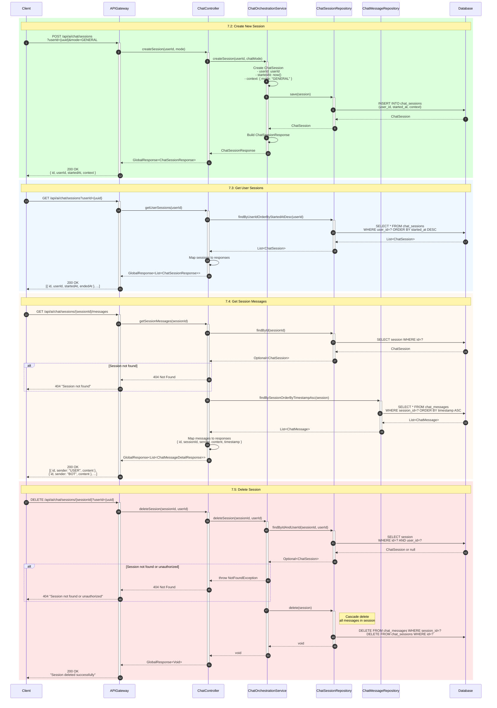
```mermaid
sequenceDiagram
    autonumber
    participant Client
    participant APIGateway
    participant ChatController
    participant ChatOrchestrationService
    participant ChatSessionRepository
    participant ChatMessageRepository
    participant Database

    %% 7.2: Create Session
    rect rgb(220, 255, 220)
        Note over Client,Database: 7.2: Create New Session

        Client->>+APIGateway: POST /api/ai/chat/sessions<br/>?userId={uuid}&mode=GENERAL
        APIGateway->>+ChatController: createSession(userId, mode)
        ChatController->>+ChatOrchestrationService: createSession(userId, chatMode)

        ChatOrchestrationService->>ChatOrchestrationService: Create ChatSession<br/>- userId: userId<br/>- startedAt: now()<br/>- context: { mode: "GENERAL" }

        ChatOrchestrationService->>+ChatSessionRepository: save(session)
        ChatSessionRepository->>Database: INSERT INTO chat_sessions<br/>(user_id, started_at, context)
        Database-->>ChatSessionRepository: ChatSession
        ChatSessionRepository-->>-ChatOrchestrationService: ChatSession

        ChatOrchestrationService->>ChatOrchestrationService: Build ChatSessionResponse
        ChatOrchestrationService-->>-ChatController: ChatSessionResponse
        ChatController-->>-APIGateway: GlobalResponse<ChatSessionResponse>
        APIGateway-->>-Client: 200 OK<br/>{ id, userId, startedAt, context }
    end

    %% 7.3: Get User Sessions
    rect rgb(240, 248, 255)
        Note over Client,Database: 7.3: Get User Sessions

        Client->>+APIGateway: GET /api/ai/chat/sessions?userId={uuid}
        APIGateway->>+ChatController: getUserSessions(userId)

        ChatController->>+ChatSessionRepository: findByUserIdOrderByStartedAtDesc(userId)
        ChatSessionRepository->>Database: SELECT * FROM chat_sessions<br/>WHERE user_id=? ORDER BY started_at DESC
        Database-->>ChatSessionRepository: List<ChatSession>
        ChatSessionRepository-->>-ChatController: List<ChatSession>

        ChatController->>ChatController: Map sessions to responses
        ChatController-->>-APIGateway: GlobalResponse<List<ChatSessionResponse>>
        APIGateway-->>-Client: 200 OK<br/>[{ id, userId, startedAt, endedAt }, ...]
    end

    %% 7.4: Get Session Messages
    rect rgb(255, 248, 240)
        Note over Client,Database: 7.4: Get Session Messages

        Client->>+APIGateway: GET /api/ai/chat/sessions/{sessionId}/messages
        APIGateway->>+ChatController: getSessionMessages(sessionId)

        ChatController->>+ChatSessionRepository: findById(sessionId)
        ChatSessionRepository->>Database: SELECT session WHERE id=?
        Database-->>ChatSessionRepository: ChatSession
        ChatSessionRepository-->>-ChatController: Optional<ChatSession>

        alt Session not found
            ChatController-->>APIGateway: 404 Not Found
            APIGateway-->>Client: 404 "Session not found"
        end

        ChatController->>+ChatMessageRepository: findBySessionOrderByTimestampAsc(session)
        ChatMessageRepository->>Database: SELECT * FROM chat_messages<br/>WHERE session_id=? ORDER BY timestamp ASC
        Database-->>ChatMessageRepository: List<ChatMessage>
        ChatMessageRepository-->>-ChatController: List<ChatMessage>

        ChatController->>ChatController: Map messages to responses<br/>{ id, sessionId, sender, content, timestamp }
        ChatController-->>-APIGateway: GlobalResponse<List<ChatMessageDetailResponse>>
        APIGateway-->>-Client: 200 OK<br/>[{ id, sender: "USER", content },<br/>{ id, sender: "BOT", content }, ...]
    end

    %% 7.5: Delete Session
    rect rgb(255, 230, 230)
        Note over Client,Database: 7.5: Delete Session

        Client->>+APIGateway: DELETE /api/ai/chat/sessions/{sessionId}?userId={uuid}
        APIGateway->>+ChatController: deleteSession(sessionId, userId)
        ChatController->>+ChatOrchestrationService: deleteSession(sessionId, userId)

        ChatOrchestrationService->>+ChatSessionRepository: findByIdAndUserId(sessionId, userId)
        ChatSessionRepository->>Database: SELECT session<br/>WHERE id=? AND user_id=?
        Database-->>ChatSessionRepository: ChatSession or null
        ChatSessionRepository-->>-ChatOrchestrationService: Optional<ChatSession>

        alt Session not found or unauthorized
            ChatOrchestrationService-->>ChatController: throw NotFoundException
            ChatController-->>APIGateway: 404 Not Found
            APIGateway-->>Client: 404 "Session not found or unauthorized"
        end

        ChatOrchestrationService->>+ChatSessionRepository: delete(session)
        Note right of ChatSessionRepository: Cascade delete<br/>all messages in session
        ChatSessionRepository->>Database: DELETE FROM chat_messages WHERE session_id=?<br/>DELETE FROM chat_sessions WHERE id=?
        ChatSessionRepository-->>-ChatOrchestrationService: void

        ChatOrchestrationService-->>-ChatController: void
        ChatController-->>-APIGateway: GlobalResponse<Void>
        APIGateway-->>-Client: 200 OK<br/>"Session deleted successfully"
    end
```

### Response Formatting Flow

Khi nhận response từ OpenAI, hệ thống thực hiện các bước format:

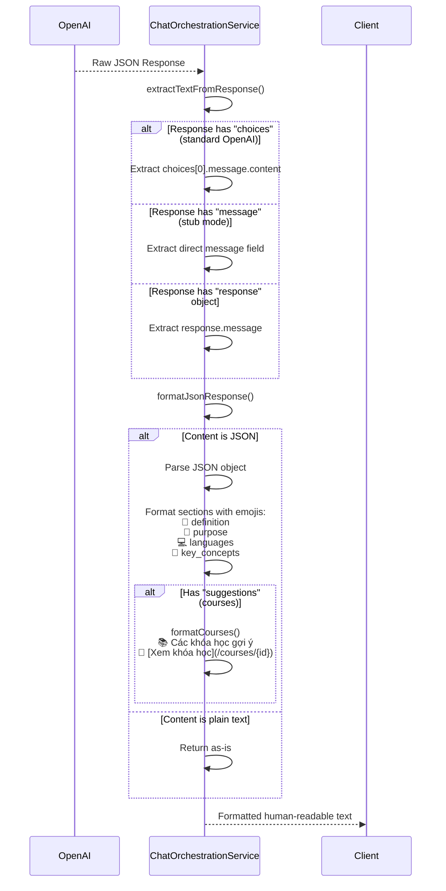
```mermaid
sequenceDiagram
    participant OpenAI
    participant ChatOrchestrationService
    participant Client

    OpenAI-->>ChatOrchestrationService: Raw JSON Response

    ChatOrchestrationService->>ChatOrchestrationService: extractTextFromResponse()

    alt Response has "choices" (standard OpenAI)
        ChatOrchestrationService->>ChatOrchestrationService: Extract choices[0].message.content
    else Response has "message" (stub mode)
        ChatOrchestrationService->>ChatOrchestrationService: Extract direct message field
    else Response has "response" object
        ChatOrchestrationService->>ChatOrchestrationService: Extract response.message
    end

    ChatOrchestrationService->>ChatOrchestrationService: formatJsonResponse()

    alt Content is JSON
        ChatOrchestrationService->>ChatOrchestrationService: Parse JSON object
        ChatOrchestrationService->>ChatOrchestrationService: Format sections with emojis:<br/>📖 definition<br/>🎯 purpose<br/>💻 languages<br/>🔑 key_concepts

        alt Has "suggestions" (courses)
            ChatOrchestrationService->>ChatOrchestrationService: formatCourses()<br/>📚 Các khóa học gợi ý<br/>🔗 [Xem khóa học](/courses/{id})
        end
    else Content is plain text
        ChatOrchestrationService->>ChatOrchestrationService: Return as-is
    end

    ChatOrchestrationService-->>Client: Formatted human-readable text
```

### Error Handling

| Error Case               | HTTP Status | Message                              |
| ------------------------ | ----------- | ------------------------------------ |
| User not authenticated   | 401         | Unauthorized                         |
| Message empty/whitespace | 400         | Message cannot be empty              |
| Session not found        | 404         | Session not found for user           |
| Session unauthorized     | 404         | Session not found or unauthorized    |
| OpenAI API error         | 200         | Returns fallback message in response |
| Qdrant connection error  | 200         | Continues without course suggestions |
| Invalid mode             | 200         | Defaults to GENERAL mode             |

### Scheduled Cleanup

Hệ thống tự động cleanup các session cũ:

```java
@Scheduled(cron = "0 0 2 * * ?") // Run at 2 AM daily
public void cleanupOldSessions() {
    chatOrchestrationService.cleanupOldSessions(30); // Keep 30 days
}
```

### Business Rules

1. **Session Management**:

   - Mỗi user có thể có nhiều sessions
   - Session được tự động tạo khi gửi message đầu tiên (nếu không có sessionId)
   - Sessions được sắp xếp theo thời gian mới nhất
   - Xóa session sẽ cascade xóa tất cả messages

2. **Chat Modes**:

   - **GENERAL**: Không search Qdrant, trả lời kiến thức chung
   - **ADVISOR**: Search Qdrant tìm khóa học, gợi ý personalized

3. **Response Format**:

   - AI trả về JSON structured response
   - Hệ thống parse và format thành human-readable text
   - Hỗ trợ markdown links cho khóa học

4. **Security**:
   - User chỉ có thể access sessions của mình
   - Validation userId trên mọi request
   - Session ownership check trước khi delete

---

## 8. Luồng View Course Details (Xem chi tiết khóa học chưa đăng ký)

### Mô tả luồng

Luồng View Course Details cho phép người dùng xem thông tin chi tiết của một khóa học, bao gồm:

- **Course Summary**: Thông tin cơ bản (title, description, price, level, instructor, rating...)
- **Chapters & Lessons**: Danh sách chương và bài học (có thể bị khóa tùy trạng thái đăng ký)
- **Progress Tracking**: Nếu đã enrolled, hiển thị tiến độ học tập
- **Access Control**: Phân quyền xem dựa trên role và trạng thái course

### Các thành phần chính

| Component              | Vai trò                             |
| ---------------------- | ----------------------------------- |
| `CourseController`     | Endpoint API cho course operations  |
| `CourseService`        | Business logic xử lý course details |
| `CourseRepository`     | CRUD Course entity                  |
| `ChapterRepository`    | CRUD Chapter entity                 |
| `LessonRepository`     | CRUD Lesson entity                  |
| `EnrollmentRepository` | Quản lý enrollment của user         |
| `ProgressRepository`   | Theo dõi tiến độ học tập            |
| `RatingRepository`     | Đánh giá và rating khóa học         |
| `UserContext`          | Lấy thông tin user hiện tại từ JWT  |

### API Endpoints

| Method | Endpoint                           | Mô tả                              |
| ------ | ---------------------------------- | ---------------------------------- |
| GET    | `/api/courses`                     | Lấy danh sách khóa học (paginated) |
| GET    | `/api/courses/{courseId}`          | Lấy chi tiết khóa học              |
| GET    | `/api/courses/{courseId}/chapters` | Lấy danh sách chapters             |
| POST   | `/api/courses/{courseId}/enroll`   | Đăng ký khóa học                   |

### Data Structures

#### CourseDetailResponse

```json
{
  "summary": {
    "id": "uuid",
    "title": "Java Backend Development",
    "description": "Learn Java Spring Boot...",
    "price": 499000,
    "discountPrice": 299000,
    "promoEndDate": "2024-12-31T23:59:59Z",
    "status": "PUBLISHED",
    "level": "INTERMEDIATE",
    "language": "VI",
    "skills": [{ "id": "uuid", "name": "Java" }],
    "tags": [{ "id": "uuid", "name": "backend" }],
    "objectives": ["Understand Spring Boot", "Build REST APIs"],
    "requirements": ["Basic Java knowledge"],
    "instructorId": "uuid",
    "thumbnail": { "url": "https://..." },
    "introVideo": { "url": "https://..." },
    "totalEnrollments": 1500,
    "averageRating": 4.5,
    "ratingCount": 120
  },
  "chapters": [...],
  "enrollmentStatus": "NOT_ENROLLED | ENROLLED | COMPLETED | DROPPED",
  "enrolled": false,
  "totalChapters": 10,
  "totalLessons": 45,
  "totalEstimatedDurationMinutes": 720,
  "overallProgress": 0.0,
  "currentChapterId": null,
  "unlockedChapterIds": [],
  "lockedChapterIds": ["uuid1", "uuid2"],
  "completedLessons": 0
}
```

#### ChapterResponse

```json
{
  "id": "uuid",
  "title": "Chapter 1: Introduction",
  "orderIndex": 1,
  "minCompletionThreshold": 0.7,
  "autoUnlock": true,
  "locked": false,
  "unlocked": true,
  "completionRatio": 0.0,
  "currentChapter": true,
  "lessons": [...]
}
```

#### LessonResponse

```json
{
  "id": "uuid",
  "title": "Lesson 1: Getting Started",
  "description": "Introduction to Spring Boot",
  "orderIndex": 1,
  "contentType": "VIDEO",
  "isFree": true,
  "mandatory": true,
  "estimatedDuration": 15,
  "videoUrl": "https://...",
  "assets": [...],
  "completion": 0.0,
  "completed": false
}
```

### Chi tiết luồng xử lý

#### 8.1 Get Course Detail Flow

##### Bước 1: Client gửi request

- **Endpoint**: `GET /api/courses/{courseId}`
- **Authentication**: Optional (guest có thể xem PUBLISHED courses)

##### Bước 2: Validate Course Access

1. Tìm course theo ID (chỉ active)
2. Kiểm tra quyền xem:
   - **PUBLISHED**: Ai cũng xem được
   - **DRAFT/PENDING**: Chỉ instructor hoặc ADMIN

##### Bước 3: Load User Progress (nếu authenticated)

1. Lấy userId từ JWT context
2. Query progress records cho user trong course

##### Bước 4: Build Chapter Snapshot

1. Load tất cả chapters (ordered by orderIndex)
2. Với mỗi chapter:
   - Load lessons
   - Tính completion ratio từ progress
   - Xác định locked/unlocked status

##### Bước 5: Check Enrollment Status

1. Query enrollment theo userId và courseId
2. Return status (NOT_ENROLLED, ENROLLED, COMPLETED, DROPPED)

##### Bước 6: Build Response

1. Map course → CourseSummaryResponse
2. Include chapters với lessons
3. Calculate overall progress
4. Return CourseDetailResponse

### Sequence Diagram - View Course Details


```mermaid
sequenceDiagram
    autonumber
    participant Client
    participant APIGateway
    participant CourseController
    participant CourseService
    participant CourseRepository
    participant ChapterRepository
    participant LessonRepository
    participant EnrollmentRepository
    participant ProgressRepository
    participant RatingRepository
    participant UserContext
    participant Database

    rect rgb(230, 245, 255)
        Note over Client,Database: 8.1: Get Course Detail (View Unregistered Course)

        Client->>+APIGateway: GET /api/courses/{courseId}
        APIGateway->>APIGateway: Extract JWT (optional)
        APIGateway->>+CourseController: getCourse(courseId)
        CourseController->>+CourseService: getCourse(courseId)

        %% Step 2: Load and Validate Course
        rect rgb(255, 248, 220)
            Note over CourseService,Database: Phase 1: Load & Validate Course

            CourseService->>+CourseRepository: findByIdAndIsActiveTrue(courseId)
            CourseRepository->>Database: SELECT * FROM courses<br/>WHERE id=? AND is_active='Y'
            Database-->>CourseRepository: Course or null
            CourseRepository-->>-CourseService: Optional<Course>

            alt Course not found
                CourseService-->>CourseController: throw NotFoundException
                CourseController-->>APIGateway: 404 Not Found
                APIGateway-->>Client: 404 "Course not found"
            end

            CourseService->>+UserContext: getCurrentUserId()
            UserContext-->>-CourseService: UUID or null (guest)

            CourseService->>CourseService: canManageCourse(course, userId)<br/>Check: isInstructor || isAdmin

            alt Course not PUBLISHED && not manager
                CourseService-->>CourseController: throw NotFoundException
                CourseController-->>APIGateway: 404 Not Found
                APIGateway-->>Client: 404 "Course not found"
            end
        end

        %% Step 3: Load User Progress (if authenticated)
        rect rgb(220, 255, 220)
            Note over CourseService,Database: Phase 2: Load User Progress

            alt User is authenticated
                CourseService->>+ProgressRepository: findByUserAndCourse(userId, courseId)
                ProgressRepository->>Database: SELECT * FROM progress<br/>WHERE user_id=? AND lesson.chapter.course_id=?
                Database-->>ProgressRepository: List<Progress>
                ProgressRepository-->>-CourseService: List<Progress>
            else Guest user
                CourseService->>CourseService: userProgress = emptyList()
            end
        end

        %% Step 4: Build Chapter Snapshot
        rect rgb(255, 240, 245)
            Note over CourseService,Database: Phase 3: Build Chapter Snapshot

            CourseService->>+ChapterRepository: findByCourse_IdAndIsActiveTrueOrderByOrderIndexAsc(courseId)
            ChapterRepository->>Database: SELECT * FROM chapters<br/>WHERE course_id=? AND is_active='Y'<br/>ORDER BY order_index ASC
            Database-->>ChapterRepository: List<Chapter>
            ChapterRepository-->>-CourseService: List<Chapter>

            loop For each Chapter
                CourseService->>+LessonRepository: findByChapter_IdAndIsActiveTrueOrderByOrderIndexAsc(chapterId)
                LessonRepository->>Database: SELECT * FROM lessons<br/>WHERE chapter_id=? AND is_active='Y'<br/>ORDER BY order_index ASC
                Database-->>LessonRepository: List<Lesson>
                LessonRepository-->>-CourseService: List<Lesson>

                CourseService->>CourseService: Calculate chapter completion<br/>from progress records

                CourseService->>CourseService: Determine locked/unlocked<br/>- First chapter: always unlocked<br/>- Others: check autoUnlock && previousCompletion >= threshold

                alt Chapter is locked (not enrolled)
                    CourseService->>CourseService: Hide lesson assets<br/>Hide video URLs<br/>Keep basic info visible
                end

                CourseService->>CourseService: Build ChapterResponse<br/>with LessonResponses
            end
        end

        %% Step 5: Check Enrollment Status
        rect rgb(240, 248, 255)
            Note over CourseService,Database: Phase 4: Check Enrollment

            alt User is authenticated
                CourseService->>+EnrollmentRepository: findByUserIdAndCourse_Id(userId, courseId)
                EnrollmentRepository->>Database: SELECT * FROM enrollments<br/>WHERE user_id=? AND course_id=?
                Database-->>EnrollmentRepository: Enrollment or null
                EnrollmentRepository-->>-CourseService: Optional<Enrollment>

                alt Enrollment exists
                    CourseService->>CourseService: enrollmentStatus = enrollment.status<br/>enrolled = enrollment.isActive
                else No enrollment
                    CourseService->>CourseService: enrollmentStatus = null<br/>enrolled = false
                end
            else Guest user
                CourseService->>CourseService: enrollmentStatus = null<br/>enrolled = false
            end
        end

        %% Step 6: Build Summary with Stats
        rect rgb(245, 255, 245)
            Note over CourseService,Database: Phase 5: Build Course Summary

            CourseService->>+EnrollmentRepository: countByCourseAndIsActiveTrue(course)
            EnrollmentRepository->>Database: SELECT COUNT(*) FROM enrollments<br/>WHERE course_id=? AND is_active='Y'
            Database-->>EnrollmentRepository: totalEnrollments
            EnrollmentRepository-->>-CourseService: long totalEnrollments

            CourseService->>+RatingRepository: getAverageScore(courseId, COURSE)
            RatingRepository->>Database: SELECT AVG(score) FROM ratings<br/>WHERE target_id=? AND target_type='COURSE'
            Database-->>RatingRepository: averageRating
            RatingRepository-->>-CourseService: Double averageRating

            CourseService->>+RatingRepository: countByTargetIdAndTargetType(courseId, COURSE)
            RatingRepository->>Database: SELECT COUNT(*) FROM ratings<br/>WHERE target_id=? AND target_type='COURSE'
            Database-->>RatingRepository: ratingCount
            RatingRepository-->>-CourseService: long ratingCount

            CourseService->>CourseService: Build CourseSummaryResponse<br/>- id, title, description, price<br/>- level, language, skills, tags<br/>- objectives, requirements<br/>- thumbnail, introVideo<br/>- totalEnrollments, averageRating
        end

        %% Final Response
        rect rgb(255, 250, 240)
            Note over CourseService,Client: Phase 6: Return Response

            CourseService->>CourseService: Build CourseDetailResponse<br/>- summary: CourseSummaryResponse<br/>- chapters: List<ChapterResponse><br/>- enrollmentStatus, enrolled<br/>- totalChapters, totalLessons<br/>- totalEstimatedDurationMinutes<br/>- overallProgress<br/>- currentChapterId<br/>- unlockedChapterIds, lockedChapterIds<br/>- completedLessons

            CourseService-->>-CourseController: CourseDetailResponse
            CourseController-->>-APIGateway: GlobalResponse<CourseDetailResponse>
            APIGateway-->>-Client: 200 OK<br/>CourseDetailResponse
        end
    end
```

### Sequence Diagram - Get Courses List

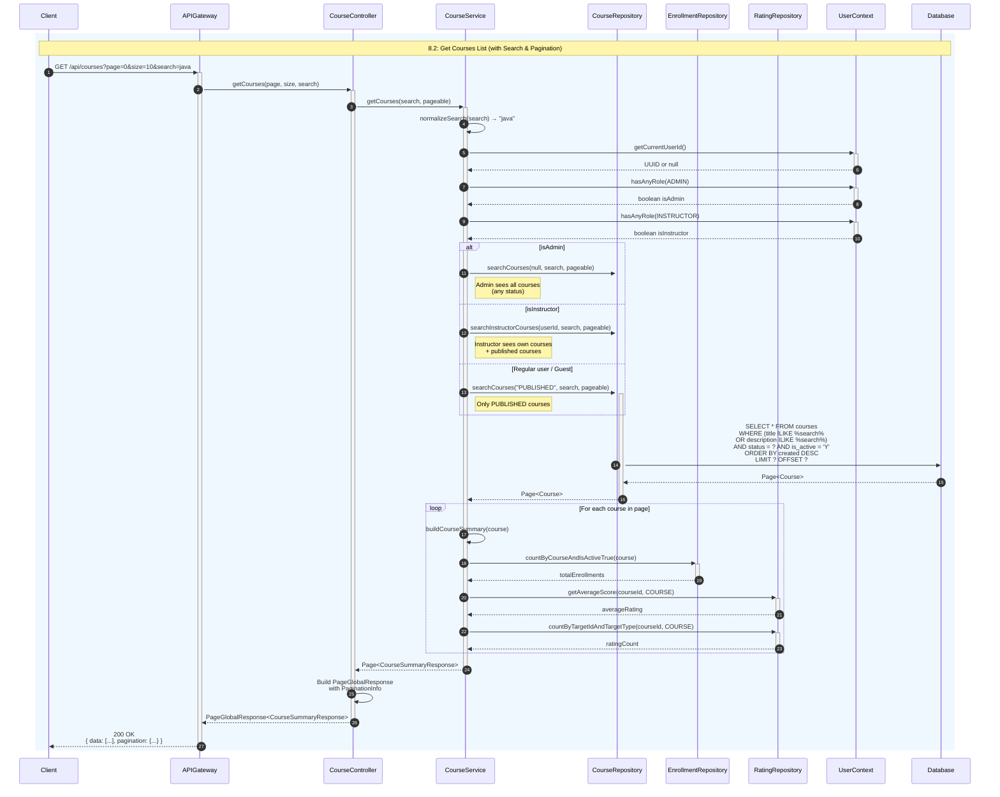
```mermaid
sequenceDiagram
    autonumber
    participant Client
    participant APIGateway
    participant CourseController
    participant CourseService
    participant CourseRepository
    participant EnrollmentRepository
    participant RatingRepository
    participant UserContext
    participant Database

    rect rgb(240, 248, 255)
        Note over Client,Database: 8.2: Get Courses List (with Search & Pagination)

        Client->>+APIGateway: GET /api/courses?page=0&size=10&search=java
        APIGateway->>+CourseController: getCourses(page, size, search)
        CourseController->>+CourseService: getCourses(search, pageable)

        CourseService->>CourseService: normalizeSearch(search) → "java"

        CourseService->>+UserContext: getCurrentUserId()
        UserContext-->>-CourseService: UUID or null

        CourseService->>+UserContext: hasAnyRole(ADMIN)
        UserContext-->>-CourseService: boolean isAdmin

        CourseService->>+UserContext: hasAnyRole(INSTRUCTOR)
        UserContext-->>-CourseService: boolean isInstructor

        alt isAdmin
            CourseService->>+CourseRepository: searchCourses(null, search, pageable)
            Note right of CourseService: Admin sees all courses<br/>(any status)
        else isInstructor
            CourseService->>+CourseRepository: searchInstructorCourses(userId, search, pageable)
            Note right of CourseService: Instructor sees own courses<br/>+ published courses
        else Regular user / Guest
            CourseService->>+CourseRepository: searchCourses("PUBLISHED", search, pageable)
            Note right of CourseService: Only PUBLISHED courses
        end

        CourseRepository->>Database: SELECT * FROM courses<br/>WHERE (title ILIKE %search%<br/>OR description ILIKE %search%)<br/>AND status = ? AND is_active = 'Y'<br/>ORDER BY created DESC<br/>LIMIT ? OFFSET ?
        Database-->>CourseRepository: Page<Course>
        CourseRepository-->>-CourseService: Page<Course>

        loop For each course in page
            CourseService->>CourseService: buildCourseSummary(course)

            CourseService->>+EnrollmentRepository: countByCourseAndIsActiveTrue(course)
            EnrollmentRepository-->>-CourseService: totalEnrollments

            CourseService->>+RatingRepository: getAverageScore(courseId, COURSE)
            RatingRepository-->>-CourseService: averageRating

            CourseService->>+RatingRepository: countByTargetIdAndTargetType(courseId, COURSE)
            RatingRepository-->>-CourseService: ratingCount
        end

        CourseService-->>-CourseController: Page<CourseSummaryResponse>

        CourseController->>CourseController: Build PageGlobalResponse<br/>with PaginationInfo
        CourseController-->>-APIGateway: PageGlobalResponse<CourseSummaryResponse>
        APIGateway-->>-Client: 200 OK<br/>{ data: [...], pagination: {...} }
    end
```

### Access Control Matrix

| User Type  | PUBLISHED | DRAFT  | PENDING | Enrolled Content |
| ---------- | --------- | ------ | ------- | ---------------- |
| Guest      | ✅ View   | ❌     | ❌      | ❌               |
| Learner    | ✅ View   | ❌     | ❌      | ✅ If enrolled   |
| Instructor | ✅ View   | ✅ Own | ✅ Own  | ✅ Own courses   |
| Admin      | ✅ View   | ✅ All | ✅ All  | ✅ All           |

### Chapter Unlock Logic

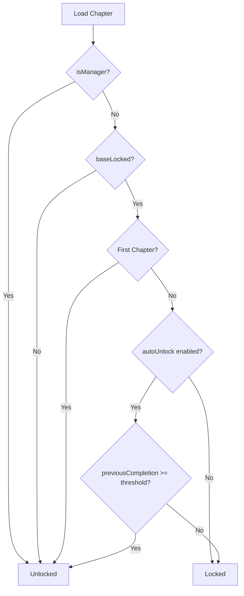
```mermaid
flowchart TD
    A[Load Chapter] --> B{isManager?}
    B -->|Yes| C[Unlocked]
    B -->|No| D{baseLocked?}
    D -->|No| C
    D -->|Yes| E{First Chapter?}
    E -->|Yes| C
    E -->|No| F{autoUnlock enabled?}
    F -->|No| G[Locked]
    F -->|Yes| H{previousCompletion >= threshold?}
    H -->|Yes| C
    H -->|No| G
```

### Content Visibility Rules

Khi chapter bị khóa (user chưa enrolled hoặc chưa hoàn thành chapter trước):

| Field              | Visibility                              |
| ------------------ | --------------------------------------- |
| Lesson title       | ✅ Visible                              |
| Lesson description | ✅ Visible                              |
| Estimated duration | ✅ Visible                              |
| Video URL          | ❌ Hidden (set null)                    |
| Document URLs      | ❌ Hidden (empty list)                  |
| Lesson assets      | ❌ Hidden (empty list)                  |
| isFree flag        | ✅ Visible (nếu free thì unlock anyway) |

### Error Handling

| Error Case                   | HTTP Status | Message                   |
| ---------------------------- | ----------- | ------------------------- |
| Course not found             | 404         | Course not found          |
| Course not published (guest) | 404         | Course not found          |
| Invalid page/size            | 400         | Invalid pagination params |
| Database error               | 500         | Internal server error     |

### Business Rules

1. **Course Visibility**:

   - Chỉ PUBLISHED courses hiển thị cho public
   - DRAFT/PENDING chỉ visible cho owner instructor hoặc admin
   - Deleted courses (isActive=false) không hiển thị

2. **Content Access**:

   - Guest/Unenrolled users chỉ thấy course info + chapter/lesson titles
   - Enrolled users unlock content theo progress
   - Free lessons (isFree=true) accessible cho tất cả

3. **Chapter Progression**:

   - Chapter 1 luôn unlocked
   - Các chapter sau unlock khi previous chapter đạt minCompletionThreshold (default 70%)
   - autoUnlock phải enabled để auto-progression hoạt động

4. **Statistics**:
   - totalEnrollments: Số learners đang enrolled (active)
   - averageRating: Trung bình rating (1-5 stars)
   - ratingCount: Số lượt rating

---

## 9. Luồng Register For The Course (Đăng ký khóa học)

### Mô tả luồng

Luồng đăng ký khóa học cho phép Learner mua và đăng ký vào một khóa học thông qua cổng thanh toán VNPay. Luồng bao gồm:

- **Payment Initiation**: Tạo giao dịch thanh toán với VNPay
- **Payment Processing**: User thanh toán trên cổng VNPay
- **Payment Callback**: VNPay gọi callback để xác nhận kết quả
- **Enrollment Creation**: Tạo enrollment cho user khi thanh toán thành công
- **My Enrollments**: Xem danh sách khóa học đã đăng ký

### Các thành phần chính

| Component                     | Vai trò                                         |
| ----------------------------- | ----------------------------------------------- |
| `VNPayPaymentController`      | Endpoint API cho VNPay payment                  |
| `VNPayPaymentService`         | Business logic xử lý VNPay payment              |
| `EnrollmentController`        | Endpoint API cho enrollment operations          |
| `EnrollmentService` (payment) | Gọi Course Service API để tạo enrollment        |
| `EnrollmentService` (course)  | Business logic tạo và quản lý enrollment        |
| `TransactionRepository`       | CRUD Transaction entity                         |
| `TransactionItemRepository`   | CRUD TransactionItem (course trong transaction) |
| `PaymentRepository`           | CRUD Payment entity                             |
| `EnrollmentRepository`        | CRUD Enrollment entity                          |
| `CourseRepository`            | CRUD Course entity                              |
| `VNPAYConfig`                 | Configuration cho VNPay gateway                 |
| `RestTemplate`                | HTTP client cho inter-service communication     |

### API Endpoints

| Method | Endpoint                          | Mô tả                             |
| ------ | --------------------------------- | --------------------------------- |
| GET    | `/api/v1/payment/vn-pay`          | Tạo payment URL và redirect VNPay |
| GET    | `/api/v1/payment/vn-pay-callback` | Callback từ VNPay sau thanh toán  |
| POST   | `/api/enrollments`                | Tạo enrollment cho user           |
| GET    | `/api/enrollments/my-enrollments` | Lấy danh sách courses đã enroll   |
| GET    | `/api/enrollments/{id}`           | Lấy chi tiết enrollment           |

### Data Structures

#### CreateEnrollmentRequest

```json
{
  "userId": "uuid",
  "courseId": "uuid",
  "status": "ENROLLED" // Optional, default: ENROLLED
}
```

#### EnrollmentResponse

```json
{
  "id": "uuid",
  "userId": "uuid",
  "courseId": "uuid",
  "courseName": "Java Backend Development",
  "thumbnail": "https://...",
  "status": "ENROLLED | IN_PROGRESS | COMPLETED | DROPPED",
  "enrolledAt": "2024-01-15T10:30:00Z",
  "completedAt": null,
  "isActive": true
}
```

#### Transaction Entity

```json
{
  "id": "uuid",
  "userId": "uuid",
  "amount": 499000,
  "status": "PENDING | COMPLETED | FAILED | CANCELLED",
  "transactionItems": [
    {
      "courseId": "uuid",
      "priceAtPurchase": 499000,
      "quantity": 1
    }
  ]
}
```

#### Payment Entity

```json
{
  "id": "uuid",
  "transactionId": "uuid",
  "method": "VNPAY | PAYPAL | MOMO",
  "status": "PENDING | SUCCESS | FAILED",
  "gatewayResponse": {
    "vnp_Amount": "49900000",
    "vnp_BankCode": "NCB",
    "vnp_ResponseCode": "00",
    "vnp_TransactionStatus": "00"
  }
}
```

### Chi tiết luồng xử lý

#### 9.1 Create VNPay Payment Flow

##### Bước 1: Client gửi request tạo payment

- **Endpoint**: `GET /api/v1/payment/vn-pay?amount={price}&userId={uuid}&courseId={uuid}`
- **Authentication**: Required (JWT Token)

##### Bước 2: Validate request

1. Validate userId và courseId format (UUID)
2. Kiểm tra amount > 0

##### Bước 3: Tạo Transaction

1. Tạo `Transaction` với status = PENDING
2. Tạo `TransactionItem` với courseId và priceAtPurchase
3. Lưu vào database

##### Bước 4: Build VNPay Payment URL

1. Tạo VNPay params (amount, txnRef, returnUrl...)
2. Tính toán secure hash với HMAC-SHA512
3. Build payment URL

##### Bước 5: Return Payment URL

- Client redirect đến VNPay payment page

#### 9.2 VNPay Payment Callback Flow

##### Bước 1: VNPay gọi callback

- **Endpoint**: `GET /api/v1/payment/vn-pay-callback?vnp_TxnRef=...&vnp_TransactionStatus=...`

##### Bước 2: Verify Signature

1. Lấy vnp_SecureHash từ params
2. Tính toán hash từ các params còn lại
3. So sánh 2 hash để verify

##### Bước 3: Update Transaction Status

1. Tìm transaction theo vnp_TxnRef
2. Nếu success → set status = COMPLETED
3. Nếu failed → keep status = PENDING

##### Bước 4: Create Payment Record

1. Tạo `Payment` với method = VNPAY
2. Lưu gateway response
3. Set status theo kết quả thanh toán

##### Bước 5: Create Enrollment (nếu success)

1. Gọi `EnrollmentService.createEnrollmentForTransaction()`
2. Call Course Service API để tạo enrollment
3. Retry logic (max 3 attempts với exponential backoff)

##### Bước 6: Redirect to Frontend

- Redirect đến frontend result page với status

#### 9.3 Create Enrollment Flow (Course Service)

##### Bước 1: Validate Request

1. Kiểm tra courseId tồn tại
2. Kiểm tra user chưa enrolled course này

##### Bước 2: Create Enrollment

1. Tạo `Enrollment` entity
2. Set status = ENROLLED
3. Set enrolledAt = now

##### Bước 3: Return Response

- Trả về `EnrollmentResponse`

### Sequence Diagram - Complete Payment & Enrollment Flow


```mermaid
sequenceDiagram
    autonumber
    participant Client
    participant APIGateway
    participant PaymentController as VNPayPaymentController
    participant PaymentService as VNPayPaymentService
    participant TransactionRepo as TransactionRepository
    participant TransactionItemRepo as TransactionItemRepository
    participant PaymentRepo as PaymentRepository
    participant VNPay as VNPay Gateway
    participant EnrollmentSvc_Payment as EnrollmentService<br/>(Payment)
    participant CourseService as Course Service
    participant EnrollmentController
    participant EnrollmentSvc_Course as EnrollmentService<br/>(Course)
    participant EnrollmentRepo as EnrollmentRepository
    participant CourseRepo as CourseRepository
    participant Database

    rect rgb(240, 248, 255)
        Note over Client,Database: 9.1: Create VNPay Payment

        Client->>+APIGateway: GET /api/v1/payment/vn-pay<br/>?amount=499000&userId={uuid}&courseId={uuid}
        APIGateway->>+PaymentController: pay(request, userId, courseId)

        %% Validation
        PaymentController->>PaymentController: Validate userId format (UUID)
        PaymentController->>PaymentController: Validate courseId format (UUID)

        alt Invalid userId or courseId
            PaymentController-->>APIGateway: 400 Bad Request
            APIGateway-->>Client: "Invalid userId/courseId format"
        end

        PaymentController->>+PaymentService: createVnPayPayment(request)

        %% Create Transaction
        rect rgb(255, 248, 220)
            Note over PaymentService,Database: Phase 1: Create Transaction

            PaymentService->>PaymentService: Parse amount, userId, courseId

            PaymentService->>+TransactionRepo: saveAndFlush(transaction)
            TransactionRepo->>Database: INSERT INTO transactions<br/>(user_id, amount, status='PENDING')
            Database-->>TransactionRepo: Transaction saved
            TransactionRepo-->>-PaymentService: Transaction with ID

            PaymentService->>+TransactionItemRepo: saveAndFlush(transactionItem)
            TransactionItemRepo->>Database: INSERT INTO transaction_items<br/>(transaction_id, course_id, price)
            Database-->>TransactionItemRepo: TransactionItem saved
            TransactionItemRepo-->>-PaymentService: TransactionItem
        end

        %% Build VNPay URL
        rect rgb(220, 255, 220)
            Note over PaymentService: Phase 2: Build Payment URL

            PaymentService->>PaymentService: Build VNPay params<br/>- vnp_Amount (x100)<br/>- vnp_TxnRef = transactionId<br/>- vnp_ReturnUrl<br/>- vnp_IpAddr

            PaymentService->>PaymentService: Calculate HMAC-SHA512<br/>secure hash

            PaymentService->>PaymentService: Build payment URL<br/>vnpay.vn/paymentv2/vpcpay.html?...
        end

        PaymentService-->>-PaymentController: VNPayResponse<br/>{ paymentUrl }
        PaymentController-->>-APIGateway: RestResponseObject<br/>{ code: "ok", paymentUrl }
        APIGateway-->>-Client: 200 OK<br/>{ paymentUrl: "https://vnpay.vn/..." }

        Note over Client: Client redirects to VNPay
        Client->>+VNPay: Redirect to payment page
    end

    rect rgb(255, 245, 238)
        Note over Client,VNPay: 9.2: User Payment on VNPay

        VNPay->>VNPay: Display payment form<br/>(Bank selection, OTP...)
        Note over VNPay: User completes payment
        VNPay-->>-Client: Redirect to callback URL
    end

    rect rgb(255, 240, 245)
        Note over Client,Database: 9.3: Payment Callback Processing

        Client->>+APIGateway: GET /api/v1/payment/vn-pay-callback<br/>?vnp_TxnRef={transactionId}<br/>&vnp_TransactionStatus=00<br/>&vnp_SecureHash=...
        APIGateway->>+PaymentController: payCallbackHandler(request, response)

        %% Verify Signature
        PaymentController->>PaymentController: verifySecureHash(params)<br/>- Sort params by key<br/>- Calculate HMAC-SHA512<br/>- Compare with vnp_SecureHash

        PaymentController->>+PaymentService: handlePaymentCallback(params, isValid, status)

        %% Find Transaction
        rect rgb(245, 245, 255)
            Note over PaymentService,Database: Phase 3: Update Transaction

            PaymentService->>PaymentService: Parse vnp_TxnRef as transactionId

            PaymentService->>+TransactionRepo: findByIdWithItems(transactionId)
            TransactionRepo->>Database: SELECT t.*, ti.* FROM transactions t<br/>LEFT JOIN transaction_items ti<br/>WHERE t.id = ?
            Database-->>TransactionRepo: Transaction with items
            TransactionRepo-->>-PaymentService: Transaction

            alt Payment Success (status = "00")
                PaymentService->>PaymentService: paymentStatus = SUCCESS<br/>transactionStatus = COMPLETED
            else Payment Failed
                PaymentService->>PaymentService: paymentStatus = FAILED<br/>transactionStatus = PENDING
            end

            PaymentService->>+TransactionRepo: saveAndFlush(transaction)
            TransactionRepo->>Database: UPDATE transactions<br/>SET status = 'COMPLETED'
            TransactionRepo-->>-PaymentService: Updated transaction
        end

        %% Create Payment Record
        rect rgb(255, 250, 240)
            Note over PaymentService,Database: Phase 4: Save Payment Record

            PaymentService->>PaymentService: Build gatewayResponse map<br/>{ vnp_Amount, vnp_BankCode,<br/>vnp_ResponseCode, ... }

            PaymentService->>+PaymentRepo: saveAndFlush(payment)
            PaymentRepo->>Database: INSERT INTO payments<br/>(transaction_id, method='VNPAY',<br/>status, gateway_response)
            Database-->>PaymentRepo: Payment saved
            PaymentRepo-->>-PaymentService: Payment
        end

        %% Create Enrollment (if success)
        alt Payment Success
            rect rgb(220, 255, 220)
                Note over PaymentService,Database: Phase 5: Create Enrollment

                PaymentService->>+EnrollmentSvc_Payment: createEnrollmentForTransaction(transaction)

                loop For each TransactionItem
                    EnrollmentSvc_Payment->>EnrollmentSvc_Payment: Build enrollment request<br/>{ userId, courseId, status: "ENROLLED" }

                    Note over EnrollmentSvc_Payment,CourseService: Inter-service call via Eureka

                    loop Retry (max 3 attempts)
                        EnrollmentSvc_Payment->>+CourseService: POST /api/enrollments<br/>Headers: X-User-Id, X-Request-Source

                        CourseService->>+EnrollmentController: createEnrollment(request)
                        EnrollmentController->>+EnrollmentSvc_Course: createEnrollment(request)

                        EnrollmentSvc_Course->>+EnrollmentRepo: findByUserIdAndCourse_IdAndIsActive(userId, courseId, true)
                        EnrollmentRepo->>Database: SELECT * FROM enrollments<br/>WHERE user_id=? AND course_id=?<br/>AND is_active='Y'
                        Database-->>EnrollmentRepo: Enrollment or null
                        EnrollmentRepo-->>-EnrollmentSvc_Course: Optional<Enrollment>

                        alt Already enrolled
                            EnrollmentSvc_Course-->>EnrollmentController: Existing EnrollmentResponse
                            EnrollmentController-->>CourseService: 409 Conflict or 200 OK
                            CourseService-->>EnrollmentSvc_Payment: Response (treat as success)
                        else Not enrolled
                            EnrollmentSvc_Course->>+CourseRepo: findById(courseId)
                            CourseRepo->>Database: SELECT * FROM courses WHERE id=?
                            Database-->>CourseRepo: Course
                            CourseRepo-->>-EnrollmentSvc_Course: Course

                            EnrollmentSvc_Course->>EnrollmentSvc_Course: Create Enrollment entity<br/>- userId, course, status=ENROLLED<br/>- enrolledAt = now()

                            EnrollmentSvc_Course->>+EnrollmentRepo: save(enrollment)
                            EnrollmentRepo->>Database: INSERT INTO enrollments<br/>(user_id, course_id, status,<br/>enrolled_at, is_active='Y')
                            Database-->>EnrollmentRepo: Enrollment saved
                            EnrollmentRepo-->>-EnrollmentSvc_Course: Enrollment

                            EnrollmentSvc_Course-->>-EnrollmentController: EnrollmentResponse
                            EnrollmentController-->>-CourseService: 201 Created<br/>{ status: "success", data: {...} }
                            CourseService-->>-EnrollmentSvc_Payment: Success response
                        end
                    end
                end

                EnrollmentSvc_Payment-->>-PaymentService: Enrollments created
            end
        end

        PaymentService-->>-PaymentController: Callback processed

        %% Redirect to Frontend
        PaymentController->>PaymentController: Build redirect URL<br/>frontendUrl?status=success&txnRef=...
        PaymentController-->>-APIGateway: sendRedirect(redirectUrl)
        APIGateway-->>-Client: 302 Redirect to Frontend
    end
```

### Sequence Diagram - Get My Enrollments

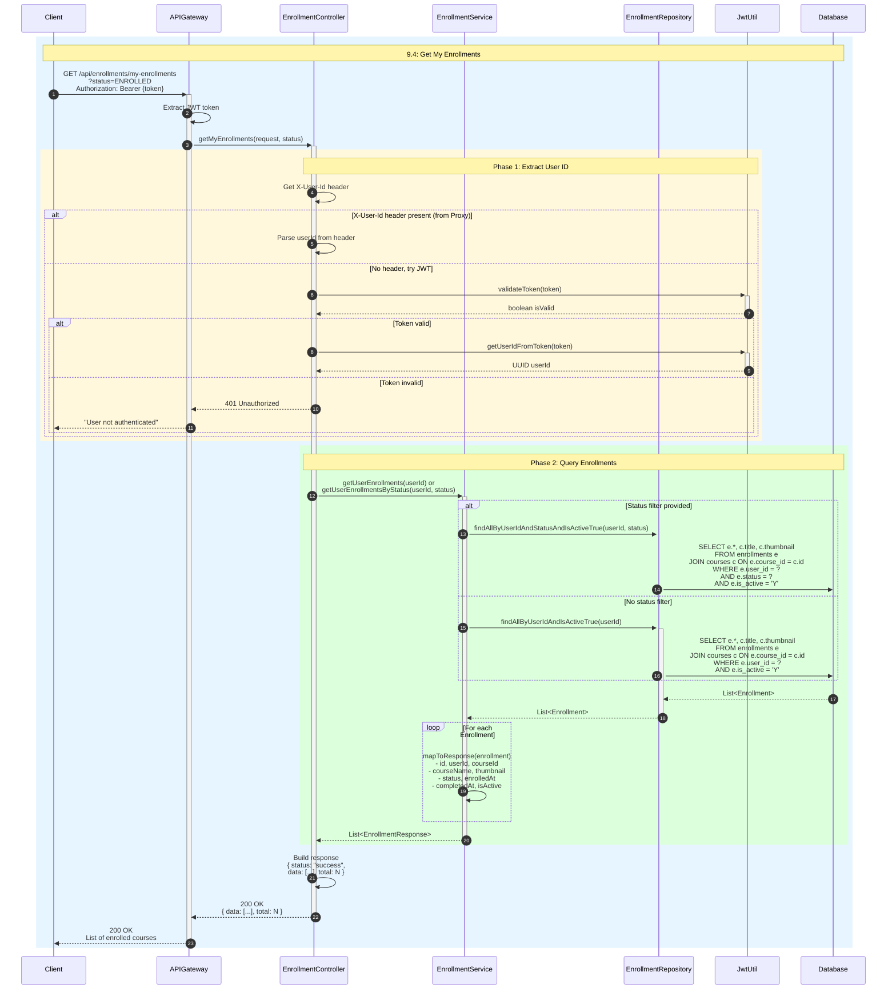
```mermaid
sequenceDiagram
    autonumber
    participant Client
    participant APIGateway
    participant EnrollmentController
    participant EnrollmentService
    participant EnrollmentRepository
    participant JwtUtil
    participant Database

    rect rgb(230, 245, 255)
        Note over Client,Database: 9.4: Get My Enrollments

        Client->>+APIGateway: GET /api/enrollments/my-enrollments<br/>?status=ENROLLED<br/>Authorization: Bearer {token}
        APIGateway->>APIGateway: Extract JWT token
        APIGateway->>+EnrollmentController: getMyEnrollments(request, status)

        %% Get User ID
        rect rgb(255, 248, 220)
            Note over EnrollmentController,JwtUtil: Phase 1: Extract User ID

            EnrollmentController->>EnrollmentController: Get X-User-Id header

            alt X-User-Id header present (from Proxy)
                EnrollmentController->>EnrollmentController: Parse userId from header
            else No header, try JWT
                EnrollmentController->>+JwtUtil: validateToken(token)
                JwtUtil-->>-EnrollmentController: boolean isValid

                alt Token valid
                    EnrollmentController->>+JwtUtil: getUserIdFromToken(token)
                    JwtUtil-->>-EnrollmentController: UUID userId
                else Token invalid
                    EnrollmentController-->>APIGateway: 401 Unauthorized
                    APIGateway-->>Client: "User not authenticated"
                end
            end
        end

        %% Query Enrollments
        rect rgb(220, 255, 220)
            Note over EnrollmentController,Database: Phase 2: Query Enrollments

            EnrollmentController->>+EnrollmentService: getUserEnrollments(userId) or<br/>getUserEnrollmentsByStatus(userId, status)

            alt Status filter provided
                EnrollmentService->>+EnrollmentRepository: findAllByUserIdAndStatusAndIsActiveTrue(userId, status)
                EnrollmentRepository->>Database: SELECT e.*, c.title, c.thumbnail<br/>FROM enrollments e<br/>JOIN courses c ON e.course_id = c.id<br/>WHERE e.user_id = ?<br/>AND e.status = ?<br/>AND e.is_active = 'Y'
            else No status filter
                EnrollmentService->>+EnrollmentRepository: findAllByUserIdAndIsActiveTrue(userId)
                EnrollmentRepository->>Database: SELECT e.*, c.title, c.thumbnail<br/>FROM enrollments e<br/>JOIN courses c ON e.course_id = c.id<br/>WHERE e.user_id = ?<br/>AND e.is_active = 'Y'
            end

            Database-->>EnrollmentRepository: List<Enrollment>
            EnrollmentRepository-->>-EnrollmentService: List<Enrollment>

            loop For each Enrollment
                EnrollmentService->>EnrollmentService: mapToResponse(enrollment)<br/>- id, userId, courseId<br/>- courseName, thumbnail<br/>- status, enrolledAt<br/>- completedAt, isActive
            end

            EnrollmentService-->>-EnrollmentController: List<EnrollmentResponse>
        end

        EnrollmentController->>EnrollmentController: Build response<br/>{ status: "success",<br/>data: [...], total: N }
        EnrollmentController-->>-APIGateway: 200 OK<br/>{ data: [...], total: N }
        APIGateway-->>-Client: 200 OK<br/>List of enrolled courses
    end
```

### Payment Status Flow

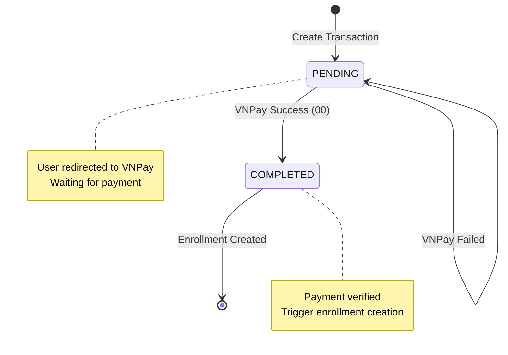
```mermaid
stateDiagram-v2
    [*] --> PENDING: Create Transaction

    PENDING --> COMPLETED: VNPay Success (00)
    PENDING --> PENDING: VNPay Failed

    COMPLETED --> [*]: Enrollment Created

    note right of PENDING
        User redirected to VNPay
        Waiting for payment
    end note

    note right of COMPLETED
        Payment verified
        Trigger enrollment creation
    end note
```

### Enrollment Status Flow

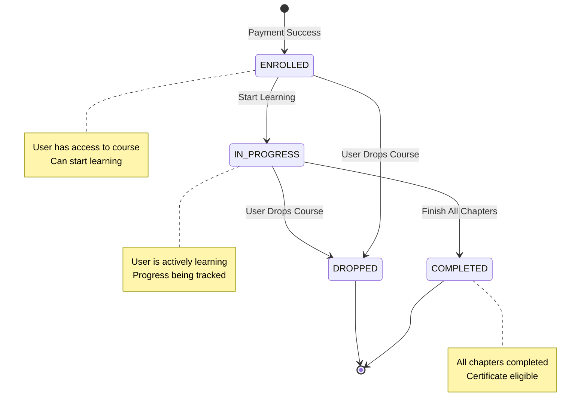
```mermaid
stateDiagram-v2
    [*] --> ENROLLED: Payment Success

    ENROLLED --> IN_PROGRESS: Start Learning
    IN_PROGRESS --> COMPLETED: Finish All Chapters
    ENROLLED --> DROPPED: User Drops Course
    IN_PROGRESS --> DROPPED: User Drops Course

    COMPLETED --> [*]
    DROPPED --> [*]

    note right of ENROLLED
        User has access to course
        Can start learning
    end note

    note right of IN_PROGRESS
        User is actively learning
        Progress being tracked
    end note

    note right of COMPLETED
        All chapters completed
        Certificate eligible
    end note
```

### Error Handling

| Error Case                   | HTTP Status | Message                                 |
| ---------------------------- | ----------- | --------------------------------------- |
| Invalid userId format        | 400         | Invalid userId format                   |
| Invalid courseId format      | 400         | Invalid courseId format                 |
| User not authenticated       | 401         | User not authenticated                  |
| Course not found             | 404         | Course not found                        |
| Already enrolled (duplicate) | 409/200     | User already enrolled (return existing) |
| VNPay signature invalid      | -           | Redirect with status=failed             |
| Payment failed               | -           | Redirect with status=failed             |
| Course Service unavailable   | 500         | Failed to create enrollment             |

### VNPay Response Codes

| Code | Description          | Action            |
| ---- | -------------------- | ----------------- |
| 00   | Thành công           | Create enrollment |
| 01   | Giao dịch đang chờ   | Keep PENDING      |
| 02   | Giao dịch bị từ chối | Mark as FAILED    |
| 04   | Giao dịch đảo        | Mark as FAILED    |
| 05   | Không đủ số dư       | Mark as FAILED    |
| 06   | Sai mật khẩu         | Mark as FAILED    |
| 07   | Tài khoản bị khóa    | Mark as FAILED    |
| 99   | Lỗi không xác định   | Mark as FAILED    |

### Inter-Service Communication

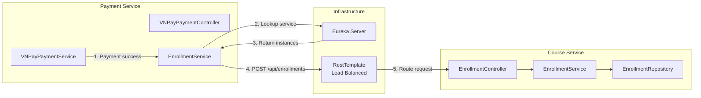
```mermaid
flowchart LR
    subgraph PaymentService["Payment Service"]
        PC[VNPayPaymentController]
        PS[VNPayPaymentService]
        ES1[EnrollmentService]
    end

    subgraph CourseService["Course Service"]
        EC[EnrollmentController]
        ES2[EnrollmentService]
        ER[EnrollmentRepository]
    end

    subgraph Infrastructure["Infrastructure"]
        EU[Eureka Server]
        RT[RestTemplate<br/>Load Balanced]
    end

    PS -->|1. Payment success| ES1
    ES1 -->|2. Lookup service| EU
    EU -->|3. Return instances| ES1
    ES1 -->|4. POST /api/enrollments| RT
    RT -->|5. Route request| EC
    EC --> ES2
    ES2 --> ER
```

### Retry Logic

Khi Payment Service gọi Course Service để tạo enrollment:

```
Attempt 1: Call Course Service
  ↓ Failed (5xx or network error)
Wait 2 seconds
  ↓
Attempt 2: Call Course Service
  ↓ Failed
Wait 4 seconds
  ↓
Attempt 3: Call Course Service
  ↓ Failed
Log error, continue (enrollment can be created later)
```

### Business Rules

1. **Payment Flow**:

   - Amount được nhân 100 khi gửi VNPay (VND không có decimal)
   - Transaction ID được dùng làm vnp_TxnRef để tracking
   - Callback URL phải match với config trong VNPay merchant

2. **Enrollment Rules**:

   - Mỗi user chỉ enroll 1 lần cho mỗi course
   - Nếu đã enroll, return existing enrollment (không throw error)
   - Enrollment được tạo ngay khi payment success

3. **Security**:

   - VNPay callback verify bằng HMAC-SHA512
   - Inter-service call dùng X-User-Id header
   - Guest users không thể enroll (cần login)

4. **Retry & Resilience**:
   - Max 3 attempts với exponential backoff
   - 409 Conflict (already enrolled) được coi là success
   - Enrollment failure không block payment flow

---

## 10. Luồng Access Learning Content (Truy cập nội dung học tập)

### Mô tả luồng

Luồng Access Learning Content cho phép Learner đã enrolled truy cập và học nội dung khóa học:

- **Get Lesson Content**: Lấy chi tiết bài học (video, tài liệu, bài tập)
- **Update Progress**: Cập nhật tiến độ học tập
- **Mark Complete**: Đánh dấu hoàn thành bài học
- **Get Course Progress**: Xem tổng quan tiến độ khóa học
- **Chapter Unlock**: Tự động mở khóa chapter tiếp theo

### Các thành phần chính

| Component                  | Vai trò                              |
| -------------------------- | ------------------------------------ |
| `CourseController`         | Endpoint API cho lesson content      |
| `CourseProgressController` | Endpoint API cho progress operations |
| `CourseService`            | Business logic lấy lesson content    |
| `CourseProgressService`    | Business logic cập nhật tiến độ      |
| `LessonRepository`         | CRUD Lesson entity                   |
| `ProgressRepository`       | CRUD Progress entity                 |
| `EnrollmentRepository`     | Kiểm tra trạng thái enrollment       |
| `ChapterRepository`        | CRUD Chapter entity                  |
| `UserContext`              | Lấy thông tin user hiện tại từ JWT   |

### API Endpoints

| Method | Endpoint                                                                 | Mô tả                            |
| ------ | ------------------------------------------------------------------------ | -------------------------------- |
| GET    | `/api/courses/{courseId}`                                                | Lấy chi tiết course với progress |
| GET    | `/api/courses/{courseId}/chapters/{chapterId}/lessons/{lessonId}/detail` | Lấy chi tiết lesson              |
| GET    | `/api/courses/{courseId}/progress`                                       | Lấy tiến độ tổng quan            |
| PUT    | `/api/courses/{courseId}/lessons/{lessonId}/progress`                    | Cập nhật tiến độ lesson          |
| POST   | `/api/courses/{courseId}/lessons/{lessonId}/progress/complete`           | Đánh dấu hoàn thành              |

### Data Structures

#### LessonResponse (Full Content)

```json
{
  "id": "uuid",
  "title": "Bài 1: Giới thiệu Spring Boot",
  "description": "Tìm hiểu cơ bản về Spring Boot...",
  "orderIndex": 1,
  "contentType": "VIDEO | DOCUMENT | QUIZ | EXERCISE",
  "content": "Rich text content hoặc markdown...",
  "mandatory": true,
  "isFree": false,
  "completionWeight": 1.0,
  "estimatedDuration": 30,
  "workspaceEnabled": true,
  "workspaceLanguages": ["java", "python"],
  "workspaceTemplate": { "files": [...] },
  "videoUrl": "https://cloudinary.com/video/abc123.mp4",
  "documentUrls": ["https://s3.../doc1.pdf", "https://s3.../doc2.pdf"],
  "assets": [
    {
      "id": "uuid",
      "assetType": "VIDEO | DOCUMENT | IMAGE | CODE",
      "title": "Video bài giảng",
      "file": { "fileId": "uuid", "url": "https://..." },
      "metadata": { "duration": 1800 }
    }
  ],
  "completion": 0.65,
  "completed": false,
  "completedAt": null,
  "progressUpdatedAt": "2024-01-15T10:30:00Z"
}
```

#### LessonProgressRequest

```json
{
  "completion": 0.75, // 0.0 - 1.0 (75% hoàn thành)
  "markComplete": false // true để đánh dấu 100%
}
```

#### Progress Entity

```json
{
  "id": "uuid",
  "userId": "uuid",
  "lessonId": "uuid",
  "completion": 0.75, // 0.0 - 1.0
  "completedAt": null, // Set khi completion = 1.0
  "created": "2024-01-15T10:00:00Z",
  "updated": "2024-01-15T10:30:00Z"
}
```

### Chi tiết luồng xử lý

#### 10.1 Get Lesson Content Flow

##### Bước 1: Client request lesson detail

- **Endpoint**: `GET /api/courses/{courseId}/chapters/{chapterId}/lessons/{lessonId}/detail`
- **Authentication**: Required (JWT Token)

##### Bước 2: Validate Access

1. Tìm course và kiểm tra active
2. Validate chapterId thuộc courseId
3. Validate lessonId thuộc chapterId
4. Kiểm tra enrollment hoặc quyền (Admin/Instructor)

##### Bước 3: Load Progress (nếu có)

1. Query progress theo userId và lessonId
2. Lấy completion value và completedAt

##### Bước 4: Build Response

1. Map lesson entity → LessonResponse
2. Include video URL, document URLs
3. Include assets với file resources
4. Include progress info

#### 10.2 Update Lesson Progress Flow

##### Bước 1: Client update progress

- **Endpoint**: `PUT /api/courses/{courseId}/lessons/{lessonId}/progress`
- **Body**: `{ "completion": 0.75, "markComplete": false }`

##### Bước 2: Validate & Resolve

1. Validate user authenticated
2. Resolve lesson từ lessonId
3. Ensure user enrolled trong course

##### Bước 3: Update Progress

1. Find or create Progress entity
2. Update completion value (clamp 0.0 - 1.0)
3. Nếu completion >= 1.0 hoặc markComplete → set completedAt
4. Save progress

##### Bước 4: Return Updated Course Detail

- Trả về CourseDetailResponse với progress mới

#### 10.3 Mark Lesson Complete Flow

##### Endpoint

- `POST /api/courses/{courseId}/lessons/{lessonId}/progress/complete`

##### Logic

1. Gọi updateLessonProgress với completion=1.0, markComplete=true
2. Set completedAt = now()
3. Trigger chapter unlock check

### Sequence Diagram - Access Lesson Content

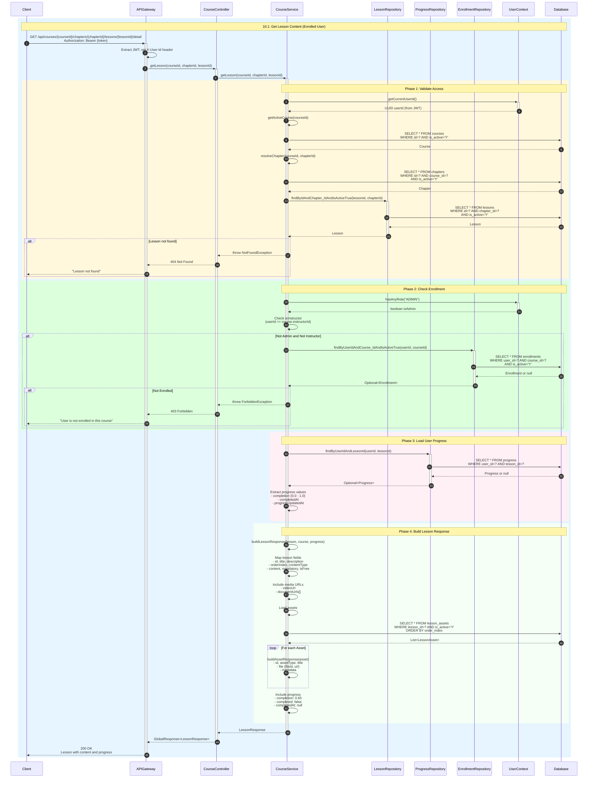
```mermaid
sequenceDiagram
    autonumber
    participant Client
    participant APIGateway
    participant CourseController
    participant CourseService
    participant LessonRepository
    participant ProgressRepository
    participant EnrollmentRepository
    participant UserContext
    participant Database

    rect rgb(230, 245, 255)
        Note over Client,Database: 10.1: Get Lesson Content (Enrolled User)

        Client->>+APIGateway: GET /api/courses/{courseId}/chapters/{chapterId}/lessons/{lessonId}/detail<br/>Authorization: Bearer {token}
        APIGateway->>APIGateway: Extract JWT, set X-User-Id header
        APIGateway->>+CourseController: getLesson(courseId, chapterId, lessonId)
        CourseController->>+CourseService: getLesson(courseId, chapterId, lessonId)

        %% Validate Course
        rect rgb(255, 248, 220)
            Note over CourseService,Database: Phase 1: Validate Access

            CourseService->>+UserContext: getCurrentUserId()
            UserContext-->>-CourseService: UUID userId (from JWT)

            CourseService->>CourseService: getActiveCourse(courseId)
            CourseService->>Database: SELECT * FROM courses<br/>WHERE id=? AND is_active='Y'
            Database-->>CourseService: Course

            CourseService->>CourseService: resolveChapter(courseId, chapterId)
            CourseService->>Database: SELECT * FROM chapters<br/>WHERE id=? AND course_id=?<br/>AND is_active='Y'
            Database-->>CourseService: Chapter

            CourseService->>+LessonRepository: findByIdAndChapter_IdAndIsActiveTrue(lessonId, chapterId)
            LessonRepository->>Database: SELECT * FROM lessons<br/>WHERE id=? AND chapter_id=?<br/>AND is_active='Y'
            Database-->>LessonRepository: Lesson
            LessonRepository-->>-CourseService: Lesson

            alt Lesson not found
                CourseService-->>CourseController: throw NotFoundException
                CourseController-->>APIGateway: 404 Not Found
                APIGateway-->>Client: "Lesson not found"
            end
        end

        %% Check Enrollment/Permission
        rect rgb(220, 255, 220)
            Note over CourseService,Database: Phase 2: Check Enrollment

            CourseService->>+UserContext: hasAnyRole("ADMIN")
            UserContext-->>-CourseService: boolean isAdmin

            CourseService->>CourseService: Check isInstructor<br/>(userId == course.instructorId)

            alt Not Admin and Not Instructor
                CourseService->>+EnrollmentRepository: findByUserIdAndCourse_IdAndIsActiveTrue(userId, courseId)
                EnrollmentRepository->>Database: SELECT * FROM enrollments<br/>WHERE user_id=? AND course_id=?<br/>AND is_active='Y'
                Database-->>EnrollmentRepository: Enrollment or null
                EnrollmentRepository-->>-CourseService: Optional<Enrollment>

                alt Not Enrolled
                    CourseService-->>CourseController: throw ForbiddenException
                    CourseController-->>APIGateway: 403 Forbidden
                    APIGateway-->>Client: "User is not enrolled in this course"
                end
            end
        end

        %% Load Progress
        rect rgb(255, 240, 245)
            Note over CourseService,Database: Phase 3: Load User Progress

            CourseService->>+ProgressRepository: findByUserIdAndLessonId(userId, lessonId)
            ProgressRepository->>Database: SELECT * FROM progress<br/>WHERE user_id=? AND lesson_id=?
            Database-->>ProgressRepository: Progress or null
            ProgressRepository-->>-CourseService: Optional<Progress>

            CourseService->>CourseService: Extract progress values<br/>- completion (0.0 - 1.0)<br/>- completedAt<br/>- progressUpdatedAt
        end

        %% Build Response
        rect rgb(245, 255, 245)
            Note over CourseService,Database: Phase 4: Build Lesson Response

            CourseService->>CourseService: buildLessonResponse(lesson, course, progress)

            CourseService->>CourseService: Map lesson fields<br/>- id, title, description<br/>- orderIndex, contentType<br/>- content, mandatory, isFree

            CourseService->>CourseService: Include media URLs<br/>- videoUrl<br/>- documentUrls[]

            CourseService->>CourseService: Load assets
            CourseService->>Database: SELECT * FROM lesson_assets<br/>WHERE lesson_id=? AND is_active='Y'<br/>ORDER BY order_index
            Database-->>CourseService: List<LessonAsset>

            loop For each Asset
                CourseService->>CourseService: buildAssetResponse(asset)<br/>- id, assetType, title<br/>- file (fileId, url)<br/>- metadata
            end

            CourseService->>CourseService: Include progress<br/>- completion: 0.65<br/>- completed: false<br/>- completedAt: null
        end

        CourseService-->>-CourseController: LessonResponse
        CourseController-->>-APIGateway: GlobalResponse<LessonResponse>
        APIGateway-->>-Client: 200 OK<br/>Lesson with content and progress
    end
```

### Sequence Diagram - Update Progress

```mermaid
sequenceDiagram
    autonumber
    participant Client
    participant APIGateway
    participant ProgressController as CourseProgressController
    participant ProgressService as CourseProgressService
    participant CourseService
    participant LessonRepository
    participant ProgressRepository
    participant EnrollmentRepository
    participant UserContext
    participant Database

    rect rgb(255, 248, 240)
        Note over Client,Database: 10.2: Update Lesson Progress

        Client->>+APIGateway: PUT /api/courses/{courseId}/lessons/{lessonId}/progress<br/>Authorization: Bearer {token}<br/>{ "completion": 0.75, "markComplete": false }
        APIGateway->>+ProgressController: updateLessonProgress(courseId, lessonId, request)
        ProgressController->>+ProgressService: updateLessonProgress(courseId, lessonId, request)

        %% Validate User
        rect rgb(255, 248, 220)
            Note over ProgressService,UserContext: Phase 1: Authenticate User

            ProgressService->>+UserContext: getCurrentUserId()
            UserContext-->>-ProgressService: UUID userId

            alt userId is null
                ProgressService-->>ProgressController: throw UnauthorizedException
                ProgressController-->>APIGateway: 401 Unauthorized
                APIGateway-->>Client: "Authentication required"
            end
        end

        %% Resolve Lesson
        rect rgb(220, 255, 220)
            Note over ProgressService,Database: Phase 2: Resolve Lesson

            ProgressService->>+LessonRepository: findById(lessonId)
            LessonRepository->>Database: SELECT * FROM lessons WHERE id=?
            Database-->>LessonRepository: Lesson
            LessonRepository-->>-ProgressService: Lesson

            ProgressService->>ProgressService: Validate lesson.chapter.course.id == courseId

            alt Lesson not in course
                ProgressService-->>ProgressController: throw ForbiddenException
                ProgressController-->>APIGateway: 403 Forbidden
                APIGateway-->>Client: "Lesson does not belong to the specified course"
            end
        end

        %% Ensure Enrollment
        rect rgb(255, 240, 245)
            Note over ProgressService,Database: Phase 3: Ensure Enrollment

            ProgressService->>+UserContext: hasAnyRole("ADMIN")
            UserContext-->>-ProgressService: boolean isAdmin

            ProgressService->>ProgressService: Check isInstructor

            alt Not Admin/Instructor
                ProgressService->>+EnrollmentRepository: findByUserIdAndCourse_IdAndIsActiveTrue(userId, courseId)
                EnrollmentRepository->>Database: SELECT * FROM enrollments<br/>WHERE user_id=? AND course_id=?
                Database-->>EnrollmentRepository: Enrollment or null
                EnrollmentRepository-->>-ProgressService: Optional<Enrollment>

                alt Not Enrolled
                    ProgressService-->>ProgressController: throw ForbiddenException
                    ProgressController-->>APIGateway: 403 Forbidden
                    APIGateway-->>Client: "User is not enrolled in this course"
                end
            end
        end

        %% Update Progress
        rect rgb(245, 255, 245)
            Note over ProgressService,Database: Phase 4: Update Progress

            ProgressService->>+ProgressRepository: findByUserIdAndLessonId(userId, lessonId)
            ProgressRepository->>Database: SELECT * FROM progress<br/>WHERE user_id=? AND lesson_id=?
            Database-->>ProgressRepository: Progress or null
            ProgressRepository-->>-ProgressService: Optional<Progress>

            alt Progress exists
                ProgressService->>ProgressService: Update existing progress
            else Progress not found
                ProgressService->>ProgressService: Create new Progress entity<br/>- userId, lessonId<br/>- createdBy = userId
            end

            ProgressService->>ProgressService: Clamp completion [0.0, 1.0]<br/>completion = Math.max(0, Math.min(1, value))

            alt completion >= 1.0 OR markComplete == true
                ProgressService->>ProgressService: Set completion = 1.0
                ProgressService->>ProgressService: Set completedAt = now()<br/>(if not already set)
            end

            ProgressService->>ProgressService: Set updatedBy = userId

            ProgressService->>+ProgressRepository: save(progress)
            ProgressRepository->>Database: INSERT/UPDATE progress<br/>SET completion=?, completed_at=?<br/>WHERE user_id=? AND lesson_id=?
            Database-->>ProgressRepository: Progress saved
            ProgressRepository-->>-ProgressService: Progress
        end

        %% Return Updated Course
        rect rgb(240, 248, 255)
            Note over ProgressService,Database: Phase 5: Return Updated Course Detail

            ProgressService->>+CourseService: getCourse(courseId)
            Note right of CourseService: Full course detail with<br/>updated progress
            CourseService-->>-ProgressService: CourseDetailResponse
        end

        ProgressService-->>-ProgressController: CourseDetailResponse
        ProgressController-->>-APIGateway: GlobalResponse<CourseDetailResponse><br/>status: "LESSON_PROGRESS_UPDATED"
        APIGateway-->>-Client: 200 OK<br/>Updated course with new progress
    end
```

### Sequence Diagram - Mark Lesson Complete

```mermaid
sequenceDiagram
    autonumber
    participant Client
    participant APIGateway
    participant ProgressController as CourseProgressController
    participant ProgressService as CourseProgressService
    participant CourseService
    participant ProgressRepository
    participant Database

    rect rgb(220, 255, 220)
        Note over Client,Database: 10.3: Mark Lesson Complete

        Client->>+APIGateway: POST /api/courses/{courseId}/lessons/{lessonId}/progress/complete<br/>Authorization: Bearer {token}
        APIGateway->>+ProgressController: markLessonComplete(courseId, lessonId)
        ProgressController->>+ProgressService: markLessonComplete(courseId, lessonId)

        ProgressService->>ProgressService: Create LessonProgressRequest<br/>- completion = 1.0<br/>- markComplete = true

        ProgressService->>ProgressService: Call updateLessonProgress()<br/>(Same flow as 10.2)

        Note over ProgressService,Database: ... Validation & Enrollment Check ...

        ProgressService->>+ProgressRepository: findByUserIdAndLessonId(userId, lessonId)
        ProgressRepository-->>-ProgressService: Progress

        ProgressService->>ProgressService: Set completion = 1.0
        ProgressService->>ProgressService: Set completedAt = OffsetDateTime.now()

        ProgressService->>+ProgressRepository: save(progress)
        ProgressRepository->>Database: UPDATE progress<br/>SET completion=1.0,<br/>completed_at=NOW()
        Database-->>ProgressRepository: Progress updated
        ProgressRepository-->>-ProgressService: Progress

        ProgressService->>+CourseService: getCourse(courseId)
        CourseService-->>-ProgressService: CourseDetailResponse

        ProgressService-->>-ProgressController: CourseDetailResponse
        ProgressController-->>-APIGateway: GlobalResponse<CourseDetailResponse><br/>status: "LESSON_COMPLETED"
        APIGateway-->>-Client: 200 OK<br/>Course with lesson marked complete
    end
```

### Progress Calculation Flow

```mermaid
flowchart TD
    subgraph Input["Progress Update Input"]
        A[completion: 0.75]
        B[markComplete: false]
    end

    A --> C{completion != null?}
    C -->|Yes| D[Clamp to 0.0 - 1.0]
    C -->|No| E[Keep existing completion]

    D --> F{completion >= 1.0?}
    F -->|Yes| G[markComplete = true]
    F -->|No| H{markComplete == true?}

    G --> I[completion = 1.0]
    H -->|Yes| I
    H -->|No| J[Keep completion value]

    I --> K{completedAt == null?}
    K -->|Yes| L[completedAt = now()]
    K -->|No| M[Keep existing completedAt]

    E --> N[Save Progress]
    J --> N
    L --> N
    M --> N

    N --> O[Return CourseDetailResponse]
```

### Chapter Unlock Logic After Progress Update

```mermaid
flowchart TD
    A[Lesson Completed] --> B[Calculate Chapter Completion]
    B --> C{All mandatory lessons<br/>completed?}

    C -->|Yes| D[chapterCompletion >= threshold?]
    C -->|No| E[Chapter still in progress]

    D -->|Yes| F{autoUnlock enabled<br/>for next chapter?}
    D -->|No| E

    F -->|Yes| G[Unlock next chapter]
    F -->|No| H[Next chapter locked]

    G --> I[User can access<br/>next chapter lessons]
    H --> J[User must wait for<br/>manual unlock]
    E --> K[Continue current chapter]
```

### Access Control Rules

| User Role  | View Content   | Update Progress | Access Locked Chapters |
| ---------- | -------------- | --------------- | ---------------------- |
| Guest      | ❌ (Free only) | ❌              | ❌                     |
| Learner    | ✅ If enrolled | ✅ Own          | ❌ (must unlock)       |
| Instructor | ✅ Own courses | ✅ Demo         | ✅ Own courses         |
| Admin      | ✅ All         | ✅ All          | ✅ All                 |

### Content Types

| ContentType | Description               | Resources                                               |
| ----------- | ------------------------- | ------------------------------------------------------- |
| VIDEO       | Video lecture             | videoUrl, assets (VIDEO)                                |
| DOCUMENT    | Reading material          | content (markdown), documentUrls, assets (DOCUMENT)     |
| QUIZ        | Multiple choice questions | content (JSON quiz data)                                |
| EXERCISE    | Coding exercise           | workspaceEnabled, workspaceTemplate, workspaceLanguages |

### Error Handling

| Error Case               | HTTP Status | Message                                        |
| ------------------------ | ----------- | ---------------------------------------------- |
| User not authenticated   | 401         | Authentication required                        |
| Course not found         | 404         | Course not found                               |
| Chapter not found        | 404         | Chapter not found                              |
| Lesson not found         | 404         | Lesson not found                               |
| Lesson not in course     | 403         | Lesson does not belong to the specified course |
| User not enrolled        | 403         | User is not enrolled in this course            |
| Lesson inactive          | 404         | Lesson is not active                           |
| Invalid completion value | 400         | Completion must be between 0.0 and 1.0         |

### Business Rules

1. **Content Access**:

   - Enrolled users có full access đến lesson content
   - Free lessons (isFree=true) accessible cho tất cả
   - Video URLs và documents chỉ visible khi có quyền

2. **Progress Tracking**:

   - Progress được track per user per lesson
   - Completion value từ 0.0 (chưa xem) đến 1.0 (hoàn thành)
   - completedAt được set khi completion = 1.0 lần đầu
   - Progress không thể giảm (chỉ tăng hoặc giữ nguyên)

3. **Chapter Progression**:

   - Chapter completion = average của lesson completions
   - Khi chapter đạt threshold → unlock chapter tiếp theo
   - Instructor/Admin bypass mọi lock

4. **Workspace**:
   - workspaceEnabled = true cho phép coding trực tiếp
   - workspaceLanguages chỉ định ngôn ngữ hỗ trợ
   - workspaceTemplate cung cấp starter code

---

## 11. Luồng Comments For The Course (Bình luận khóa học)

### Mô tả luồng

Luồng Comments cho phép Learner, Instructor và Admin bình luận và trao đổi trong khóa học:

- **Course Comments**: Bình luận chung cho toàn bộ khóa học (hỏi đáp, thảo luận)
- **Lesson Comments**: Bình luận cho từng bài học cụ thể
- **Code Comments**: Bình luận trong workspace code của bài học (code review, hỏi lỗi)
- **Nested Replies**: Hỗ trợ reply dạng cây (parent-child)
- **Delete Comments**: Xóa comment (owner, instructor, admin)

### Các thành phần chính

| Component                 | Vai trò                             |
| ------------------------- | ----------------------------------- |
| `CourseCommentController` | Endpoint API cho comment operations |
| `CourseCommentService`    | Business logic xử lý comments       |
| `CommentRepository`       | CRUD Comment entity                 |
| `LessonRepository`        | Validate lesson thuộc course        |
| `CourseRepository`        | Validate course tồn tại             |
| `UserContext`             | Lấy thông tin user hiện tại từ JWT  |

### API Endpoints

| Method | Endpoint                                                        | Mô tả                   |
| ------ | --------------------------------------------------------------- | ----------------------- |
| GET    | `/api/courses/{courseId}/comments`                              | Lấy comments của course |
| POST   | `/api/courses/{courseId}/comments`                              | Thêm comment cho course |
| GET    | `/api/courses/{courseId}/lessons/{lessonId}/comments`           | Lấy comments của lesson |
| POST   | `/api/courses/{courseId}/lessons/{lessonId}/comments`           | Thêm comment cho lesson |
| GET    | `/api/courses/{courseId}/lessons/{lessonId}/workspace/comments` | Lấy code comments       |
| POST   | `/api/courses/{courseId}/lessons/{lessonId}/workspace/comments` | Thêm code comment       |
| DELETE | `/api/courses/{courseId}/comments/{commentId}`                  | Xóa comment             |

### Data Structures

#### CommentRequest

```json
{
  "content": "Tôi có câu hỏi về phần này...",
  "parentId": "uuid" // Optional - nếu là reply
}
```

#### CommentResponse

```json
{
  "id": "uuid",
  "parentId": "uuid",
  "userId": "uuid",
  "content": "Tôi có câu hỏi về phần này...",
  "created": "2024-01-15T10:30:00Z",
  "updated": "2024-01-15T10:30:00Z",
  "replies": [
    {
      "id": "uuid",
      "parentId": "parent-uuid",
      "userId": "uuid",
      "content": "Đây là câu trả lời...",
      "created": "2024-01-15T11:00:00Z",
      "updated": "2024-01-15T11:00:00Z",
      "replies": []
    }
  ]
}
```

#### Comment Entity

```json
{
  "id": "uuid",
  "userId": "uuid",
  "targetId": "uuid", // courseId hoặc lessonId
  "targetType": "COURSE | LESSON | CODE",
  "parent": "uuid", // null nếu là root comment
  "content": "Nội dung comment...",
  "isActive": true,
  "created": "2024-01-15T10:30:00Z",
  "updated": "2024-01-15T10:30:00Z"
}
```

### CommentTarget Enum

| Value  | Description                              | targetId points to |
| ------ | ---------------------------------------- | ------------------ |
| COURSE | Comment chung cho khóa học               | courseId           |
| LESSON | Comment cho bài học cụ thể               | lessonId           |
| CODE   | Comment trong workspace code của bài học | lessonId           |

### Chi tiết luồng xử lý

#### 11.1 Get Course Comments Flow

##### Bước 1: Client request

- **Endpoint**: `GET /api/courses/{courseId}/comments`
- **Authentication**: Optional (có thể public view)

##### Bước 2: Query Comments

1. Query comments với targetId=courseId, targetType=COURSE
2. Chỉ lấy active comments (isActive=true)

##### Bước 3: Build Comment Tree

1. Tách root comments (parent=null) và child comments
2. Map children vào parent theo parentId
3. Build nested structure (replies)

##### Bước 4: Return Response

- Trả về List<CommentResponse> với nested replies

#### 11.2 Get Lesson Comments Flow

##### Bước 1: Client request

- **Endpoint**: `GET /api/courses/{courseId}/lessons/{lessonId}/comments`

##### Bước 2: Resolve Lesson

1. Tìm lesson theo lessonId
2. Validate lesson thuộc course (lesson.chapter.course.id == courseId)

##### Bước 3: Query & Build Tree

1. Query comments với targetId=lessonId, targetType=LESSON
2. Build comment tree giống 11.1

#### 11.3 Get Code Comments Flow

##### Endpoint

- `GET /api/courses/{courseId}/lessons/{lessonId}/workspace/comments`

##### Logic

- Giống 11.2 nhưng targetType=CODE
- Dùng cho comments trong IDE/workspace của lesson

#### 11.4 Add Course Comment Flow

##### Bước 1: Client request

- **Endpoint**: `POST /api/courses/{courseId}/comments`
- **Body**: `{ "content": "...", "parentId": null }`
- **Authentication**: Required

##### Bước 2: Validate Parent (nếu có)

1. Nếu parentId != null → tìm parent comment
2. Validate parent.targetId == courseId && parent.targetType == COURSE

##### Bước 3: Create Comment

1. Tạo Comment entity
2. Set targetId=courseId, targetType=COURSE
3. Set userId từ JWT context
4. Lưu vào database

##### Bước 4: Return Response

- Trả về CommentResponse (không include replies)

#### 11.5 Add Lesson Comment Flow

##### Endpoint

- `POST /api/courses/{courseId}/lessons/{lessonId}/comments`

##### Logic

1. Resolve lesson (validate thuộc course)
2. Validate parent (nếu có) với targetType=LESSON
3. Create comment với targetId=lessonId, targetType=LESSON

#### 11.6 Add Code Comment Flow

##### Endpoint

- `POST /api/courses/{courseId}/lessons/{lessonId}/workspace/comments`

##### Logic

- Giống 11.5 nhưng targetType=CODE

#### 11.7 Delete Comment Flow

##### Bước 1: Client request

- **Endpoint**: `DELETE /api/courses/{courseId}/comments/{commentId}`
- **Authentication**: Required

##### Bước 2: Find Comment

1. Tìm comment theo commentId và isActive=true
2. Nếu không tìm thấy → 404 Not Found

##### Bước 3: Check Permission

1. Lấy userId từ JWT context
2. Kiểm tra quyền xóa:
   - **Owner**: comment.userId == currentUserId
   - **Admin**: hasRole("ADMIN")
   - **Instructor**: hasRole("INSTRUCTOR") && course.instructorId == currentUserId

##### Bước 4: Soft Delete

1. Set comment.isActive = false
2. Save to database (không xóa physical)

### Sequence Diagram - Get Comments

```mermaid
sequenceDiagram
    autonumber
    participant Client
    participant APIGateway
    participant CommentController as CourseCommentController
    participant CommentService as CourseCommentService
    participant CommentRepository
    participant LessonRepository
    participant UserContext
    participant Database

    rect rgb(230, 245, 255)
        Note over Client,Database: 11.1: Get Course Comments

        Client->>+APIGateway: GET /api/courses/{courseId}/comments
        APIGateway->>+CommentController: getCourseComments(courseId)
        CommentController->>+CommentService: getCourseComments(courseId)

        %% Query Comments
        rect rgb(255, 248, 220)
            Note over CommentService,Database: Phase 1: Query Comments

            CommentService->>+CommentRepository: findAllByTarget(courseId, COURSE)
            CommentRepository->>Database: SELECT * FROM comments<br/>WHERE target_id = ?<br/>AND target_type = 'COURSE'<br/>AND is_active = 'Y'<br/>ORDER BY created ASC
            Database-->>CommentRepository: List<Comment>
            CommentRepository-->>-CommentService: List<Comment>
        end

        %% Build Comment Tree
        rect rgb(220, 255, 220)
            Note over CommentService: Phase 2: Build Comment Tree

            CommentService->>CommentService: buildCommentTree(comments)

            CommentService->>CommentService: Separate roots and children<br/>roots = comments.filter(c -> c.parent == null)<br/>children = comments.filter(c -> c.parent != null)

            CommentService->>CommentService: Create childMap<br/>Map<UUID, List<CommentResponse>>

            loop For each child comment
                CommentService->>CommentService: mapToResponse(child)<br/>Add to childMap[child.parentId]
            end

            loop For each root comment
                CommentService->>CommentService: mapToResponse(root)
                CommentService->>CommentService: attachReplies(root, childMap)
                Note right of CommentService: Recursively attach nested replies
            end
        end

        CommentService-->>-CommentController: List<CommentResponse><br/>with nested replies
        CommentController-->>-APIGateway: GlobalResponse<List<CommentResponse>>
        APIGateway-->>-Client: 200 OK<br/>[{ id, content, replies: [...] }, ...]
    end

    rect rgb(240, 248, 255)
        Note over Client,Database: 11.2: Get Lesson Comments

        Client->>+APIGateway: GET /api/courses/{courseId}/lessons/{lessonId}/comments
        APIGateway->>+CommentController: getLessonComments(courseId, lessonId)
        CommentController->>+CommentService: getLessonComments(courseId, lessonId)

        %% Resolve Lesson
        CommentService->>+CommentService: resolveLesson(courseId, lessonId)
        CommentService->>+LessonRepository: findById(lessonId)
        LessonRepository->>Database: SELECT * FROM lessons WHERE id=?
        Database-->>LessonRepository: Lesson
        LessonRepository-->>-CommentService: Lesson

        CommentService->>CommentService: Validate lesson.chapter.course.id == courseId

        alt Lesson not in course
            CommentService-->>CommentController: throw NotFoundException
            CommentController-->>APIGateway: 404 Not Found
            APIGateway-->>Client: "Lesson not found in course"
        end

        %% Query with LESSON type
        CommentService->>+CommentRepository: findAllByTarget(lessonId, LESSON)
        CommentRepository->>Database: SELECT * FROM comments<br/>WHERE target_id = ?<br/>AND target_type = 'LESSON'
        Database-->>CommentRepository: List<Comment>
        CommentRepository-->>-CommentService: List<Comment>

        CommentService->>CommentService: buildCommentTree(comments)

        CommentService-->>-CommentController: List<CommentResponse>
        CommentController-->>-APIGateway: GlobalResponse<List<CommentResponse>>
        APIGateway-->>-Client: 200 OK
    end

    rect rgb(255, 248, 240)
        Note over Client,Database: 11.3: Get Code Comments (Workspace)

        Client->>+APIGateway: GET /api/courses/{courseId}/lessons/{lessonId}/workspace/comments
        APIGateway->>+CommentController: getCodeComments(courseId, lessonId)
        CommentController->>+CommentService: getCodeComments(courseId, lessonId)

        CommentService->>CommentService: resolveLesson(courseId, lessonId)

        %% Query with CODE type
        CommentService->>+CommentRepository: findAllByTarget(lessonId, CODE)
        CommentRepository->>Database: SELECT * FROM comments<br/>WHERE target_id = ?<br/>AND target_type = 'CODE'
        Database-->>CommentRepository: List<Comment>
        CommentRepository-->>-CommentService: List<Comment>

        CommentService->>CommentService: buildCommentTree(comments)

        CommentService-->>-CommentController: List<CommentResponse>
        CommentController-->>-APIGateway: GlobalResponse<List<CommentResponse>>
        APIGateway-->>-Client: 200 OK
    end
```

### Sequence Diagram - Add Comments

```mermaid
sequenceDiagram
    autonumber
    participant Client
    participant APIGateway
    participant CommentController as CourseCommentController
    participant CommentService as CourseCommentService
    participant CommentRepository
    participant LessonRepository
    participant UserContext
    participant Database

    rect rgb(220, 255, 220)
        Note over Client,Database: 11.4: Add Course Comment

        Client->>+APIGateway: POST /api/courses/{courseId}/comments<br/>Authorization: Bearer {token}<br/>{ "content": "Câu hỏi...", "parentId": null }
        APIGateway->>APIGateway: Validate JWT Token
        APIGateway->>+CommentController: addCourseComment(courseId, request)
        CommentController->>+CommentService: addCourseComment(courseId, request)

        %% Get Current User
        rect rgb(255, 248, 220)
            Note over CommentService,UserContext: Phase 1: Get Current User

            CommentService->>+CommentService: requireCurrentUser()
            CommentService->>+UserContext: getCurrentUserId()
            UserContext-->>-CommentService: UUID userId

            alt userId is null
                CommentService-->>CommentController: throw UnauthorizedException
                CommentController-->>APIGateway: 401 Unauthorized
                APIGateway-->>Client: "Authentication required"
            end
        end

        %% Validate Parent (if provided)
        rect rgb(255, 240, 245)
            Note over CommentService,Database: Phase 2: Validate Parent Comment

            alt parentId != null
                CommentService->>+CommentRepository: findById(parentId)
                CommentRepository->>Database: SELECT * FROM comments WHERE id=?
                Database-->>CommentRepository: Comment or null
                CommentRepository-->>-CommentService: Optional<Comment>

                alt Parent not found
                    CommentService-->>CommentController: throw NotFoundException
                    CommentController-->>APIGateway: 404 Not Found
                    APIGateway-->>Client: "Parent comment not found"
                end

                CommentService->>CommentService: Validate parent.targetId == courseId<br/>AND parent.targetType == COURSE

                alt Parent not in same course
                    CommentService-->>CommentController: throw BadRequestException
                    CommentController-->>APIGateway: 400 Bad Request
                    APIGateway-->>Client: "Parent comment not in this course"
                end
            end
        end

        %% Create Comment
        rect rgb(245, 255, 245)
            Note over CommentService,Database: Phase 3: Create Comment

            CommentService->>CommentService: Create Comment entity<br/>- userId: currentUserId<br/>- targetId: courseId<br/>- targetType: COURSE<br/>- parent: parentComment (or null)<br/>- content: request.content<br/>- isActive: true

            CommentService->>+CommentRepository: save(comment)
            CommentRepository->>Database: INSERT INTO comments<br/>(user_id, target_id, target_type,<br/>parent_id, content, is_active)
            Database-->>CommentRepository: Comment saved
            CommentRepository-->>-CommentService: Comment

            CommentService->>CommentService: mapToResponse(comment)
        end

        CommentService-->>-CommentController: CommentResponse
        CommentController-->>-APIGateway: GlobalResponse<CommentResponse>
        APIGateway-->>-Client: 201 Created<br/>{ id, userId, content, replies: [] }
    end

    rect rgb(255, 248, 240)
        Note over Client,Database: 11.5: Add Lesson Comment

        Client->>+APIGateway: POST /api/courses/{courseId}/lessons/{lessonId}/comments<br/>{ "content": "Bài học này hay quá!", "parentId": null }
        APIGateway->>+CommentController: addLessonComment(courseId, lessonId, request)
        CommentController->>+CommentService: addLessonComment(courseId, lessonId, request)

        CommentService->>CommentService: requireCurrentUser() → userId

        %% Resolve Lesson
        CommentService->>+CommentService: resolveLesson(courseId, lessonId)
        CommentService->>+LessonRepository: findById(lessonId)
        LessonRepository-->>-CommentService: Lesson
        CommentService->>CommentService: Validate lesson in course

        %% Validate Parent with LESSON type
        alt parentId != null
            CommentService->>+CommentRepository: findById(parentId)
            CommentRepository-->>-CommentService: Comment parent
            CommentService->>CommentService: Validate parent.targetType == LESSON<br/>AND parent.targetId == lessonId
        end

        %% Create with LESSON type
        CommentService->>CommentService: Create Comment<br/>- targetId: lessonId<br/>- targetType: LESSON

        CommentService->>+CommentRepository: save(comment)
        CommentRepository->>Database: INSERT INTO comments
        Database-->>CommentRepository: Comment
        CommentRepository-->>-CommentService: Comment

        CommentService-->>-CommentController: CommentResponse
        CommentController-->>-APIGateway: GlobalResponse<CommentResponse>
        APIGateway-->>-Client: 201 Created
    end

    rect rgb(240, 248, 255)
        Note over Client,Database: 11.6: Add Code Comment (Workspace)

        Client->>+APIGateway: POST /api/courses/{courseId}/lessons/{lessonId}/workspace/comments<br/>{ "content": "Dòng 15 có lỗi...", "parentId": null }
        APIGateway->>+CommentController: addCodeComment(courseId, lessonId, request)
        CommentController->>+CommentService: addCodeComment(courseId, lessonId, request)

        CommentService->>CommentService: requireCurrentUser() → userId
        CommentService->>CommentService: resolveLesson(courseId, lessonId)

        %% Validate Parent with CODE type
        alt parentId != null
            CommentService->>CommentService: Validate parent.targetType == CODE
        end

        %% Create with CODE type
        CommentService->>CommentService: Create Comment<br/>- targetId: lessonId<br/>- targetType: CODE

        CommentService->>+CommentRepository: save(comment)
        CommentRepository-->>-CommentService: Comment

        CommentService-->>-CommentController: CommentResponse
        CommentController-->>-APIGateway: GlobalResponse<CommentResponse>
        APIGateway-->>-Client: 201 Created
    end
```

### Sequence Diagram - Delete Comment

```mermaid
sequenceDiagram
    autonumber
    participant Client
    participant APIGateway
    participant CommentController as CourseCommentController
    participant CommentService as CourseCommentService
    participant CommentRepository
    participant CourseRepository
    participant UserContext
    participant Database

    rect rgb(255, 230, 230)
        Note over Client,Database: 11.7: Delete Comment

        Client->>+APIGateway: DELETE /api/courses/{courseId}/comments/{commentId}<br/>Authorization: Bearer {token}
        APIGateway->>APIGateway: Validate JWT Token
        APIGateway->>+CommentController: deleteComment(courseId, commentId)
        CommentController->>+CommentService: deleteComment(courseId, commentId)

        %% Get Current User
        rect rgb(255, 248, 220)
            Note over CommentService,UserContext: Phase 1: Get Current User

            CommentService->>+UserContext: getCurrentUserId()
            UserContext-->>-CommentService: UUID userId

            alt userId is null
                CommentService-->>CommentController: throw UnauthorizedException
                CommentController-->>APIGateway: 401 Unauthorized
                APIGateway-->>Client: "Authentication required"
            end
        end

        %% Find Comment
        rect rgb(255, 240, 245)
            Note over CommentService,Database: Phase 2: Find Comment

            CommentService->>+CommentRepository: findByIdAndIsActiveTrue(commentId)
            CommentRepository->>Database: SELECT * FROM comments<br/>WHERE id = ? AND is_active = 'Y'
            Database-->>CommentRepository: Comment or null
            CommentRepository-->>-CommentService: Optional<Comment>

            alt Comment not found
                CommentService-->>CommentController: throw NotFoundException
                CommentController-->>APIGateway: 404 Not Found
                APIGateway-->>Client: "Comment not found"
            end
        end

        %% Check Permission
        rect rgb(245, 245, 255)
            Note over CommentService,Database: Phase 3: Check Delete Permission

            CommentService->>CommentService: isOwner = (comment.userId == currentUserId)

            CommentService->>+UserContext: hasAnyRole("ADMIN")
            UserContext-->>-CommentService: boolean isAdmin

            alt isOwner OR isAdmin
                Note over CommentService: Permission granted
            else Check Instructor
                CommentService->>+UserContext: hasAnyRole("INSTRUCTOR")
                UserContext-->>-CommentService: boolean isInstructor

                alt isInstructor
                    %% Get course to check ownership
                    alt targetType == COURSE
                        CommentService->>+CourseRepository: findById(comment.targetId)
                    else targetType == LESSON or CODE
                        CommentService->>CommentService: Get courseId from lesson.chapter.course
                        CommentService->>+CourseRepository: findById(courseId)
                    end
                    CourseRepository->>Database: SELECT * FROM courses WHERE id=?
                    Database-->>CourseRepository: Course
                    CourseRepository-->>-CommentService: Course

                    CommentService->>CommentService: isCourseOwner = (course.instructorId == currentUserId)

                    alt NOT isCourseOwner
                        CommentService-->>CommentController: throw ForbiddenException
                        CommentController-->>APIGateway: 403 Forbidden
                        APIGateway-->>Client: "Permission denied"
                    end
                else Not Instructor either
                    CommentService-->>CommentController: throw ForbiddenException
                    CommentController-->>APIGateway: 403 Forbidden
                    APIGateway-->>Client: "Permission denied"
                end
            end
        end

        %% Soft Delete
        rect rgb(220, 255, 220)
            Note over CommentService,Database: Phase 4: Soft Delete

            CommentService->>CommentService: comment.setIsActive(false)

            CommentService->>+CommentRepository: save(comment)
            CommentRepository->>Database: UPDATE comments<br/>SET is_active = 'N'<br/>WHERE id = ?
            Database-->>CommentRepository: Comment updated
            CommentRepository-->>-CommentService: Comment

            Note over CommentService: Child comments remain<br/>(orphaned but hidden via parent)
        end

        CommentService-->>-CommentController: void
        CommentController-->>-APIGateway: GlobalResponse<Void><br/>status: "COMMENT_DELETED"
        APIGateway-->>-Client: 200 OK<br/>"Comment deleted successfully"
    end
```

### Comment Tree Building Algorithm

```mermaid
flowchart TD
    A[Input: List&lt;Comment&gt;] --> B[Separate by parent]
    B --> C[roots: parent == null]
    B --> D[children: parent != null]

    D --> E[Create childMap<br/>Map&lt;parentId, List&lt;Comment&gt;&gt;]

    E --> F[For each child]
    F --> G[Add to childMap&lsqb;parentId&rsqb;]
    G --> F

    C --> H[For each root]
    H --> I[mapToResponse&lpar;root&rpar;]
    I --> J[attachReplies&lpar;root, childMap&rpar;]

    J --> K{childMap has root.id?}
    K -->|Yes| L[Get children list]
    L --> M[For each child]
    M --> N[mapToResponse&lpar;child&rpar;]
    N --> O[attachReplies&lpar;child, childMap&rpar;]
    O --> M
    M --> P[Add to root.replies]

    K -->|No| Q[root.replies = empty]

    P --> R[Return List&lt;CommentResponse&gt;]
    Q --> R
```

### Permission Matrix

| User Type               | Create Comment | Delete Own | Delete Others |
| ----------------------- | -------------- | ---------- | ------------- |
| Guest                   | ❌             | ❌         | ❌            |
| Learner (Enrolled)      | ✅             | ✅         | ❌            |
| Learner (Not Enrolled)  | ❌             | ❌         | ❌            |
| Instructor (Own Course) | ✅             | ✅         | ✅            |
| Instructor (Other)      | ✅             | ✅         | ❌            |
| Admin                   | ✅             | ✅         | ✅            |

### Error Handling

| Error Case                | HTTP Status | Message                                  |
| ------------------------- | ----------- | ---------------------------------------- |
| User not authenticated    | 401         | Authentication required                  |
| Course not found          | 404         | Course not found                         |
| Lesson not found          | 404         | Lesson not found                         |
| Lesson not in course      | 404         | Lesson not found in course               |
| Comment not found         | 404         | Comment not found                        |
| Parent comment not found  | 404         | Parent comment not found                 |
| Parent not in same target | 400         | Parent comment not in this course/lesson |
| Permission denied         | 403         | Permission denied                        |
| Content empty             | 400         | Content cannot be empty                  |
| Content too long          | 400         | Content exceeds maximum length (2000)    |

### Business Rules

1. **Comment Types**:

   - **COURSE**: Thảo luận chung về khóa học, hỏi đáp tổng quan
   - **LESSON**: Thảo luận về nội dung bài học cụ thể
   - **CODE**: Review code trong workspace, hỏi lỗi, gợi ý cải tiến

2. **Nested Replies**:

   - Reply tham chiếu đến parent comment qua parentId
   - Không giới hạn độ sâu (deep nesting)
   - Reply phải cùng targetType và targetId với parent

3. **Soft Delete**:

   - Comment bị xóa chỉ đánh dấu isActive=false
   - Replies của comment bị xóa vẫn giữ nguyên trong database
   - UI có thể hiển thị "[deleted]" cho parent đã xóa

4. **Delete Permission**:

   - Owner xóa được comment của mình
   - Instructor xóa được mọi comment trong course của mình
   - Admin xóa được mọi comment

5. **Validation**:
   - Content không được rỗng và tối đa 2000 ký tự
   - Parent comment phải tồn tại và active
   - Parent phải thuộc cùng target (course/lesson)

---

## Tóm tắt các thành phần

| Component                    | Vai trò                                                       |
| ---------------------------- | ------------------------------------------------------------- |
| `AuthController`             | Nhận HTTP request cho auth (login, register, logout)          |
| `UserController`             | Nhận HTTP request cho user management (forgot/reset password) |
| `BlogController`             | Nhận HTTP request cho blog CRUD operations                    |
| `BlogCommentController`      | Nhận HTTP request cho blog comment operations                 |
| `LearningPathAiController`   | Nhận HTTP request cho AI learning path generation             |
| `ChatController`             | Nhận HTTP request cho AI chat operations                      |
| `CourseController`           | Nhận HTTP request cho course CRUD và listing                  |
| `CourseProgressController`   | Nhận HTTP request cho progress operations                     |
| `CourseCommentController`    | Nhận HTTP request cho course/lesson/code comments             |
| `VNPayPaymentController`     | Nhận HTTP request cho VNPay payment operations                |
| `EnrollmentController`       | Nhận HTTP request cho enrollment operations                   |
| `AuthService`                | Business logic authentication                                 |
| `UserService`                | Business logic đăng ký, quản lý user, forgot/reset password   |
| `BlogService`                | Business logic cho blog (CRUD, search, filter)                |
| `BlogCommentService`         | Business logic cho blog comments (CRUD, nested replies)       |
| `LearningPathAiService`      | Business logic cho AI learning path generation                |
| `ChatOrchestrationService`   | Business logic cho AI chat orchestration                      |
| `CourseService`              | Business logic cho course (CRUD, search, chapter/lesson)      |
| `CourseProgressService`      | Business logic cập nhật và tracking tiến độ học tập           |
| `CourseCommentService`       | Business logic cho course/lesson/code comments                |
| `VNPayPaymentService`        | Business logic cho VNPay payment processing                   |
| `EnrollmentService`          | Business logic tạo và quản lý enrollment                      |
| `VectorService`              | Semantic search với Qdrant vector database                    |
| `EmbeddingService`           | Tạo vector embeddings cho text                                |
| `OpenAiGateway`              | Client gọi OpenAI GPT API                                     |
| `QdrantClient`               | Client gọi Qdrant vector database API                         |
| `UserRepository`             | CRUD User entity                                              |
| `RoleRepository`             | Query Role entity                                             |
| `UserRoleRepository`         | Gán role cho user                                             |
| `BlogRepository`             | CRUD Blog entity, search queries                              |
| `CommentRepository`          | CRUD BlogComment entity                                       |
| `AiGenerationTaskRepository` | CRUD AI generation tasks và kết quả                           |
| `ChatSessionRepository`      | CRUD ChatSession entity cho AI chat                           |
| `ChatMessageRepository`      | CRUD ChatMessage entity cho AI chat                           |
| `CourseRepository`           | CRUD Course entity, search queries                            |
| `ChapterRepository`          | CRUD Chapter entity                                           |
| `LessonRepository`           | CRUD Lesson entity                                            |
| `EnrollmentRepository`       | CRUD Enrollment entity, tracking learner enrollment           |
| `ProgressRepository`         | Theo dõi tiến độ học tập của learner                          |
| `RatingRepository`           | CRUD Rating entity cho course và lesson                       |
| `TransactionRepository`      | CRUD Transaction entity cho payment                           |
| `TransactionItemRepository`  | CRUD TransactionItem (courses trong transaction)              |
| `PaymentRepository`          | CRUD Payment entity với gateway response                      |
| `OTPService`                 | Tạo, lưu, validate OTP                                        |
| `EmailService`               | Publish notification command                                  |
| `JwtUtil`                    | Tạo và validate JWT tokens                                    |
| `PasswordEncoder`            | Hash và verify password                                       |
| `AuthLogRepository`          | Log authentication events                                     |
| `UserContext`                | Lấy thông tin user hiện tại từ JWT context                    |
| `Kafka`                      | Message broker                                                |
| `NotificationService`        | Gửi email và in-app notifications                             |
| `Qdrant`                     | Vector database cho semantic search                           |
| `OpenAI API`                 | External AI service cho text generation                       |
| `VNPay Gateway`              | External payment gateway cho thanh toán                       |
| `RestTemplate`               | HTTP client cho inter-service communication                   |
| `Eureka Server`              | Service discovery cho microservices                           |

---

## JWT Token Structure

### Access Token Claims

```json
{
  "sub": "user-uuid",
  "email": "user@example.com",
  "roles": ["LEARNER", "INSTRUCTOR"],
  "type": "access",
  "iat": 1234567890,
  "exp": 1234654290
}
```

### Refresh Token Claims

```json
{
  "sub": "user-uuid",
  "email": "user@example.com",
  "type": "refresh",
  "iat": 1234567890,
  "exp": 1235172690
}
```

### Token Expiration

- **Access Token**: 24 hours (86400000 ms)
- **Refresh Token**: 7 days (604800000 ms)
