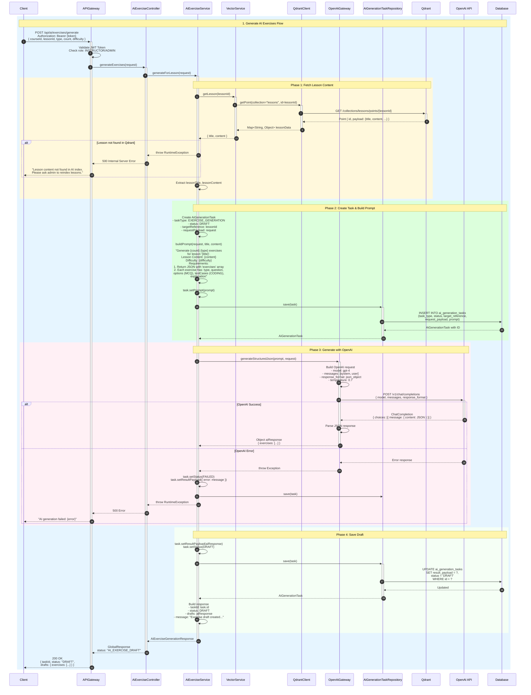
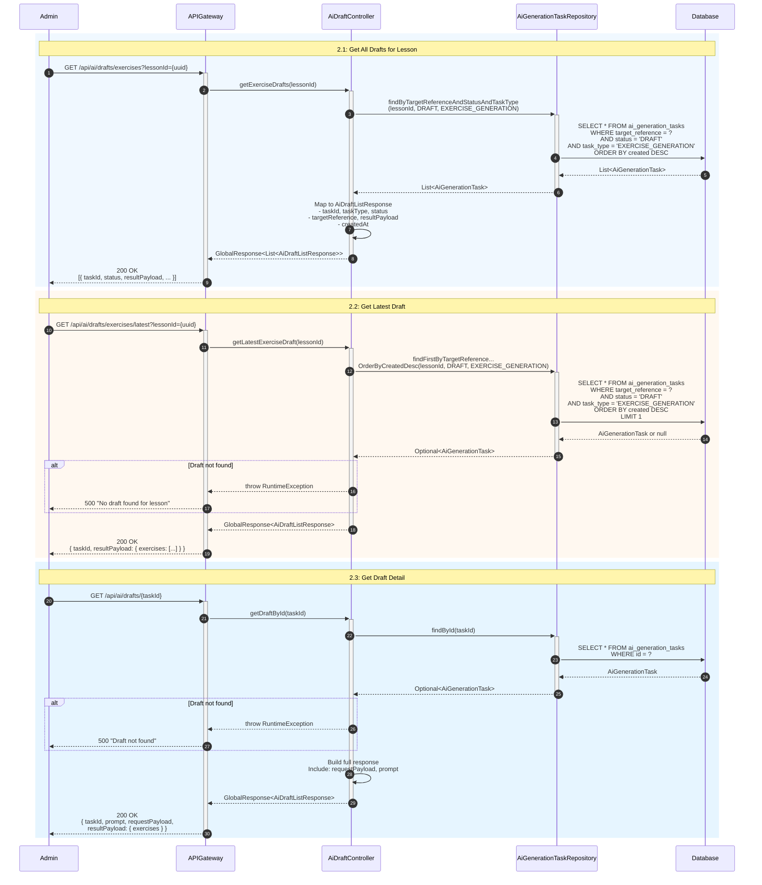
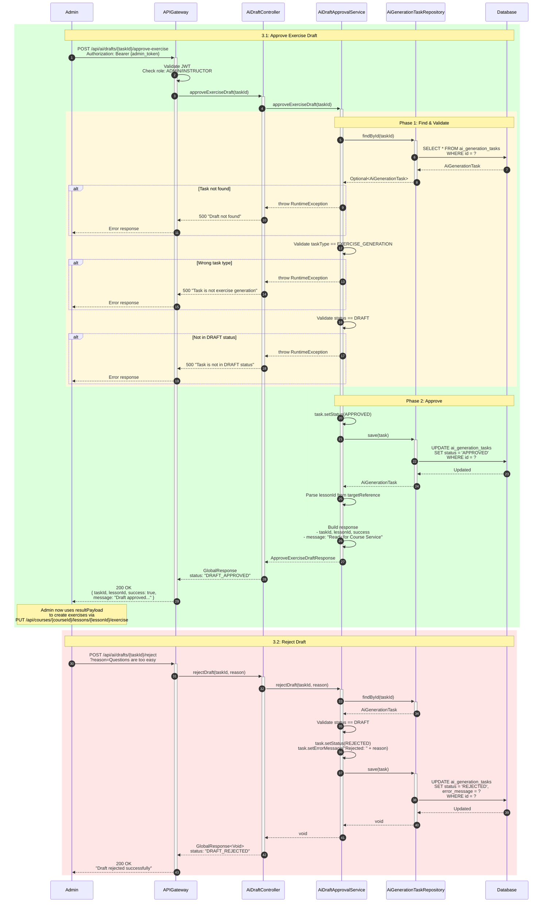
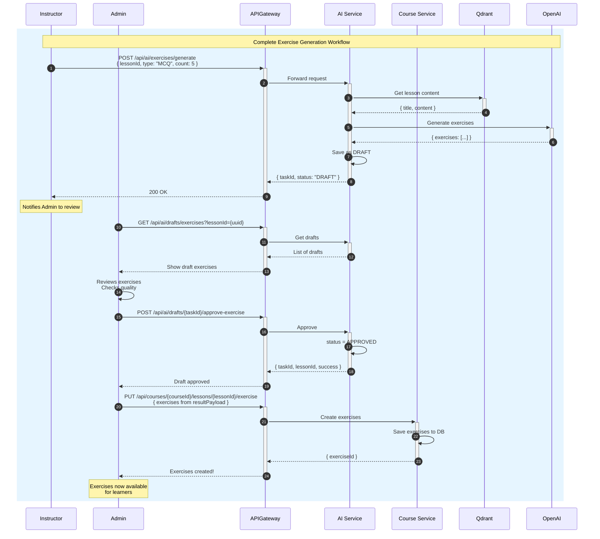
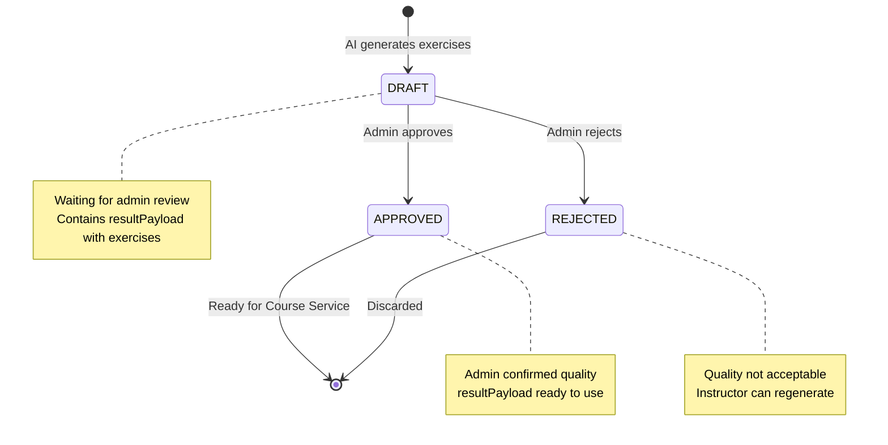
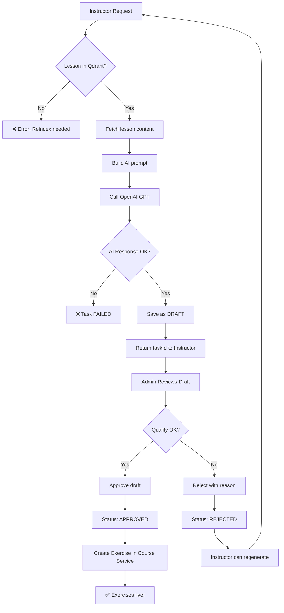

# TechHub - Sequence Diagram: Generate AI Exercises

## Mục lục

1. [Tổng quan](#1-tổng-quan)
2. [Các thành phần chính](#2-các-thành-phần-chính)
3. [API Endpoints](#3-api-endpoints)
4. [Data Structures](#4-data-structures)
5. [Chi tiết luồng xử lý](#5-chi-tiết-luồng-xử-lý)
6. [Sequence Diagrams](#6-sequence-diagrams)
7. [State Diagrams](#7-state-diagrams)
8. [Error Handling](#8-error-handling)
9. [Business Rules](#9-business-rules)

---

## 1. Tổng quan

Luồng **Generate AI Exercises** cho phép Instructor/Admin tự động tạo bài tập cho lesson bằng AI (OpenAI GPT). Hệ thống hỗ trợ:

- **Multiple Exercise Types**: MCQ (Multiple Choice), CODING, ESSAY
- **Difficulty Levels**: BEGINNER, INTERMEDIATE, ADVANCED
- **Draft System**: AI tạo draft → Admin review → Approve/Reject
- **Content-Aware**: Sử dụng Vector Search (Qdrant) để lấy nội dung lesson

### Workflow tổng quan

```
Instructor Request → AI Generate Draft → Admin Review → Approve/Reject → Save to Course Service
```

---

## 2. Các thành phần chính

| Component                    | Service        | Vai trò                                             |
| ---------------------------- | -------------- | --------------------------------------------------- |
| `AiExerciseController`       | ai-service     | Endpoint API nhận request generate exercises        |
| `AiDraftController`          | ai-service     | Endpoint API quản lý drafts (list, approve, reject) |
| `AiExerciseService`          | ai-service     | Business logic generate exercises từ AI             |
| `AiDraftApprovalService`     | ai-service     | Business logic approve/reject drafts                |
| `VectorService`              | ai-service     | Lấy nội dung lesson từ Qdrant vector database       |
| `OpenAiGateway`              | ai-service     | Client gọi OpenAI GPT API                           |
| `AiGenerationTaskRepository` | ai-service     | CRUD AiGenerationTask entity (lưu drafts)           |
| `AiProxyController`          | proxy-client   | Proxy endpoint cho Frontend gọi AI Service          |
| `ExerciseController`         | course-service | Endpoint CRUD exercises (sau khi approve)           |
| `ExerciseService`            | course-service | Business logic quản lý exercises                    |

---

## 3. API Endpoints

### AI Service Endpoints

| Method | Endpoint                                          | Mô tả                             |
| ------ | ------------------------------------------------- | --------------------------------- |
| POST   | `/api/ai/exercises/generate`                      | Tạo AI exercise drafts cho lesson |
| GET    | `/api/ai/drafts/exercises?lessonId={uuid}`        | Lấy danh sách drafts của lesson   |
| GET    | `/api/ai/drafts/exercises/latest?lessonId={uuid}` | Lấy draft mới nhất                |
| GET    | `/api/ai/drafts/{taskId}`                         | Lấy chi tiết một draft            |
| POST   | `/api/ai/drafts/{taskId}/approve-exercise`        | Approve exercise draft            |
| POST   | `/api/ai/drafts/{taskId}/reject`                  | Reject draft với lý do            |

### Proxy Client Endpoints (qua API Gateway)

| Method | Endpoint                                         | Mô tả                    |
| ------ | ------------------------------------------------ | ------------------------ |
| POST   | `/api/proxy/ai/exercises/generate`               | Proxy generate exercises |
| POST   | `/api/proxy/ai/drafts/{taskId}/approve-exercise` | Proxy approve draft      |

---

## 4. Data Structures

### 4.1 Enums

#### ExerciseFormat

```java
public enum ExerciseFormat {
    MCQ,      // Multiple Choice Question
    ESSAY,    // Essay/Long answer
    CODING    // Coding exercise with test cases
}
```

#### DifficultyLevel

```java
public enum DifficultyLevel {
    BEGINNER,
    INTERMEDIATE,
    ADVANCED
}
```

#### AiTaskStatus

```java
public enum AiTaskStatus {
    DRAFT,      // AI đã tạo xong, chờ admin review
    APPROVED,   // Admin đã approve
    REJECTED,   // Admin từ chối
    PENDING,    // Đang chờ xử lý
    RUNNING,    // Đang chạy
    COMPLETED,  // Hoàn thành
    FAILED      // Thất bại
}
```

#### AiTaskType

```java
public enum AiTaskType {
    EXERCISE_GENERATION,
    LEARNING_PATH_GENERATION,
    CHAT_GENERAL,
    CHAT_ADVISOR,
    // ...
}
```

### 4.2 Request DTOs

#### AiExerciseGenerateRequest

```json
{
  "courseId": "uuid",
  "lessonId": "uuid",
  "language": "vi",
  "difficulties": ["BEGINNER", "INTERMEDIATE"],
  "formats": ["MCQ", "CODING"],
  "variants": 1,
  "includeExplanations": true,
  "includeTestCases": true,
  "customInstruction": "Focus on practical examples",
  "count": 5,
  "type": "MCQ",
  "difficulty": "BEGINNER"
}
```

### 4.3 Response DTOs

#### AiExerciseGenerationResponse

```json
{
  "taskId": "uuid",
  "status": "DRAFT",
  "drafts": {
    "exercises": [
      {
        "type": "MCQ",
        "question": "Đâu là từ khóa khai báo biến trong JavaScript?",
        "options": ["var", "int", "string", "float"],
        "correctAnswer": 0,
        "explanation": "var là từ khóa khai báo biến trong JavaScript..."
      },
      {
        "type": "CODING",
        "question": "Viết hàm tính tổng 2 số",
        "testCases": [
          { "input": "1, 2", "expectedOutput": "3", "hidden": false },
          { "input": "-1, 5", "expectedOutput": "4", "hidden": true }
        ],
        "explanation": "Sử dụng toán tử + để cộng 2 số..."
      }
    ]
  },
  "message": "Exercise draft created successfully. Admin can review and approve."
}
```

#### ExerciseDraft

```json
{
  "type": "MCQ | CODING | ESSAY",
  "question": "Câu hỏi...",
  "options": ["A", "B", "C", "D"],
  "testCases": [
    {
      "input": "input data",
      "expectedOutput": "expected result",
      "hidden": false
    }
  ],
  "explanation": "Giải thích đáp án..."
}
```

#### AiDraftListResponse

```json
{
  "taskId": "uuid",
  "taskType": "EXERCISE_GENERATION",
  "status": "DRAFT",
  "targetReference": "lesson-uuid",
  "resultPayload": { "exercises": [...] },
  "requestPayload": { "courseId": "...", "lessonId": "..." },
  "prompt": "Generate 5 MCQ exercises...",
  "createdAt": "2024-01-15T10:30:00Z"
}
```

#### ApproveExerciseDraftResponse

```json
{
  "taskId": "uuid",
  "exerciseId": "uuid",
  "lessonId": "uuid",
  "message": "Draft approved. Result payload is ready for Course Service API.",
  "success": true
}
```

---

## 5. Chi tiết luồng xử lý

### 5.1 Generate AI Exercises Flow

#### Bước 1: Instructor gửi request

- **Endpoint**: `POST /api/ai/exercises/generate`
- **Authentication**: Required (JWT Token, role INSTRUCTOR/ADMIN)

#### Bước 2: Fetch Lesson Content từ Qdrant

1. Call `VectorService.getLesson(lessonId)`
2. Qdrant trả về lesson title + content đã được index
3. Nếu không tìm thấy → throw error

#### Bước 3: Tạo AI Generation Task

1. Tạo `AiGenerationTask` với:
   - `taskType` = EXERCISE_GENERATION
   - `status` = DRAFT
   - `targetReference` = lessonId (để query sau)
   - `requestPayload` = original request
2. Build prompt từ lesson content + requirements
3. Lưu vào database

#### Bước 4: Gọi OpenAI GPT

1. Call `OpenAiGateway.generateStructuredJson(prompt, request)`
2. OpenAI trả về JSON với array exercises

#### Bước 5: Lưu Draft

1. Update task với `resultPayload` = AI response
2. Keep `status` = DRAFT
3. Return response với taskId

### 5.2 Get Exercise Drafts Flow

#### 5.2.1 Get All Drafts for Lesson

- **Endpoint**: `GET /api/ai/drafts/exercises?lessonId={uuid}`
- Query by `targetReference` + `status=DRAFT` + `taskType=EXERCISE_GENERATION`
- Order by `created DESC`

#### 5.2.2 Get Latest Draft

- **Endpoint**: `GET /api/ai/drafts/exercises/latest?lessonId={uuid}`
- Return first draft matching criteria

#### 5.2.3 Get Draft Detail

- **Endpoint**: `GET /api/ai/drafts/{taskId}`
- Return full draft info including prompt

### 5.3 Approve Exercise Draft Flow

#### Bước 1: Admin request approve

- **Endpoint**: `POST /api/ai/drafts/{taskId}/approve-exercise`
- **Authentication**: Required (role ADMIN/INSTRUCTOR)

#### Bước 2: Validate Task

1. Find task by taskId
2. Validate `taskType` == EXERCISE_GENERATION
3. Validate `status` == DRAFT

#### Bước 3: Update Status

1. Set `status` = APPROVED
2. Save to database

#### Bước 4: Return Response

- Return taskId, lessonId, success message
- Admin sau đó dùng `resultPayload` để tạo exercise trong Course Service

### 5.4 Reject Draft Flow

#### Endpoint

- `POST /api/ai/drafts/{taskId}/reject?reason={string}`

#### Logic

1. Find and validate task
2. Set `status` = REJECTED
3. Set `errorMessage` = reason
4. Save to database

---

## 6. Sequence Diagrams

### 6.1 Generate AI Exercises



### 6.2 Get & Review Drafts



### 6.3 Approve & Reject Drafts



### 6.4 Complete Flow: Generate → Review → Approve → Create Exercise



---

## 7. State Diagrams

### 7.1 AI Task Status Flow



### 7.2 Exercise Generation Flow



---

## 8. Error Handling

| Error Case                   | HTTP Status | Message                                        |
| ---------------------------- | ----------- | ---------------------------------------------- |
| User not authenticated       | 401         | Unauthorized                                   |
| User not INSTRUCTOR/ADMIN    | 403         | Forbidden - Insufficient role                  |
| Lesson not found in Qdrant   | 500         | Lesson content not found in AI index           |
| OpenAI API error             | 500         | AI generation failed: {error}                  |
| Draft not found              | 500         | Draft not found: {taskId}                      |
| Task not EXERCISE_GENERATION | 500         | Task is not an exercise generation task        |
| Task not in DRAFT status     | 500         | Task is not in DRAFT status, current: {status} |
| Invalid request (validation) | 400         | Validation error details                       |
| Database error               | 500         | Internal server error                          |

---

## 9. Business Rules

### 9.1 Exercise Types

| Type   | Description                     | Required Fields                  |
| ------ | ------------------------------- | -------------------------------- |
| MCQ    | Multiple Choice Question        | question, options, correctAnswer |
| CODING | Coding exercise with test cases | question, testCases, explanation |
| ESSAY  | Open-ended essay question       | question, explanation (sample)   |

### 9.2 Difficulty Levels

| Level        | Description                            |
| ------------ | -------------------------------------- |
| BEGINNER     | Basic concepts, simple questions       |
| INTERMEDIATE | Applied knowledge, moderate complexity |
| ADVANCED     | Complex scenarios, edge cases          |

### 9.3 Draft Management

1. **One Lesson, Many Drafts**:

   - Mỗi lesson có thể có nhiều drafts
   - Instructor có thể generate nhiều lần với different settings
   - Admin chọn draft tốt nhất để approve

2. **Draft Lifecycle**:

   - Draft tạo xong luôn có status = DRAFT
   - Chỉ Admin có thể approve/reject
   - Approved draft → dùng resultPayload tạo exercise
   - Rejected draft → instructor có thể regenerate

3. **Target Reference**:
   - `targetReference` = lessonId (UUID string)
   - Dùng để query tất cả drafts của lesson

### 9.4 AI Prompt Structure

```
Generate {count} {type} exercises for the lesson '{title}'.

Lesson Content:
{content}

Difficulty: {difficulty}

Requirements:
1. Return a JSON object with key 'exercises' containing an array.
2. Each exercise must have: type (MCQ/CODING/ESSAY), question, options (for MCQ), testCases (for CODING), explanation.
3. For MCQ: options is array of strings.
4. For CODING: testCases is array of {input, expectedOutput}.
5. All questions must relate directly to the lesson content.
```

### 9.5 Security

1. **Role-Based Access**:

   - Generate: INSTRUCTOR, ADMIN
   - Review/Approve/Reject: ADMIN (hoặc course owner INSTRUCTOR)

2. **Lesson Verification**:
   - Lesson phải tồn tại trong Qdrant (đã indexed)
   - CourseId phải match với lesson

### 9.6 Integration with Course Service

Sau khi draft được approve:

1. Admin lấy `resultPayload` (exercises array)
2. Call Course Service API: `PUT /api/courses/{courseId}/lessons/{lessonId}/exercise`
3. Course Service tạo Exercise entities từ payload

---

## Tóm tắt các thành phần

| Component                    | Service        | Vai trò                               |
| ---------------------------- | -------------- | ------------------------------------- |
| `AiExerciseController`       | ai-service     | Endpoint generate exercises           |
| `AiDraftController`          | ai-service     | Endpoint quản lý drafts               |
| `AiExerciseService`          | ai-service     | Business logic generate               |
| `AiDraftApprovalService`     | ai-service     | Business logic approve/reject         |
| `VectorService`              | ai-service     | Fetch lesson từ Qdrant                |
| `OpenAiGateway`              | ai-service     | Call OpenAI API                       |
| `AiGenerationTaskRepository` | ai-service     | CRUD AI tasks                         |
| `QdrantClient`               | ai-service     | Vector database client                |
| `ExerciseController`         | course-service | CRUD exercises                        |
| `ExerciseService`            | course-service | Business logic exercises              |
| `OpenAI API`                 | External       | AI text generation                    |
| `Qdrant`                     | External       | Vector database lưu lesson embeddings |

---

## Configuration

```yaml
# OpenAI Configuration
openai:
  api-key: ${OPENAI_API_KEY}
  model: gpt-4
  max-tokens: 4000
  temperature: 0.7

# Qdrant Configuration
qdrant:
  host: localhost
  port: 6333
  api-key: ${QDRANT_API_KEY}
  lesson-collection: lessons
```
