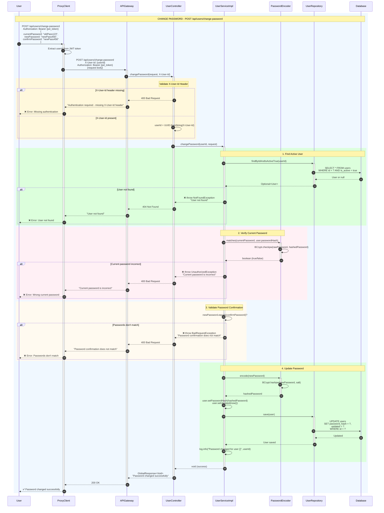
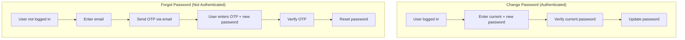
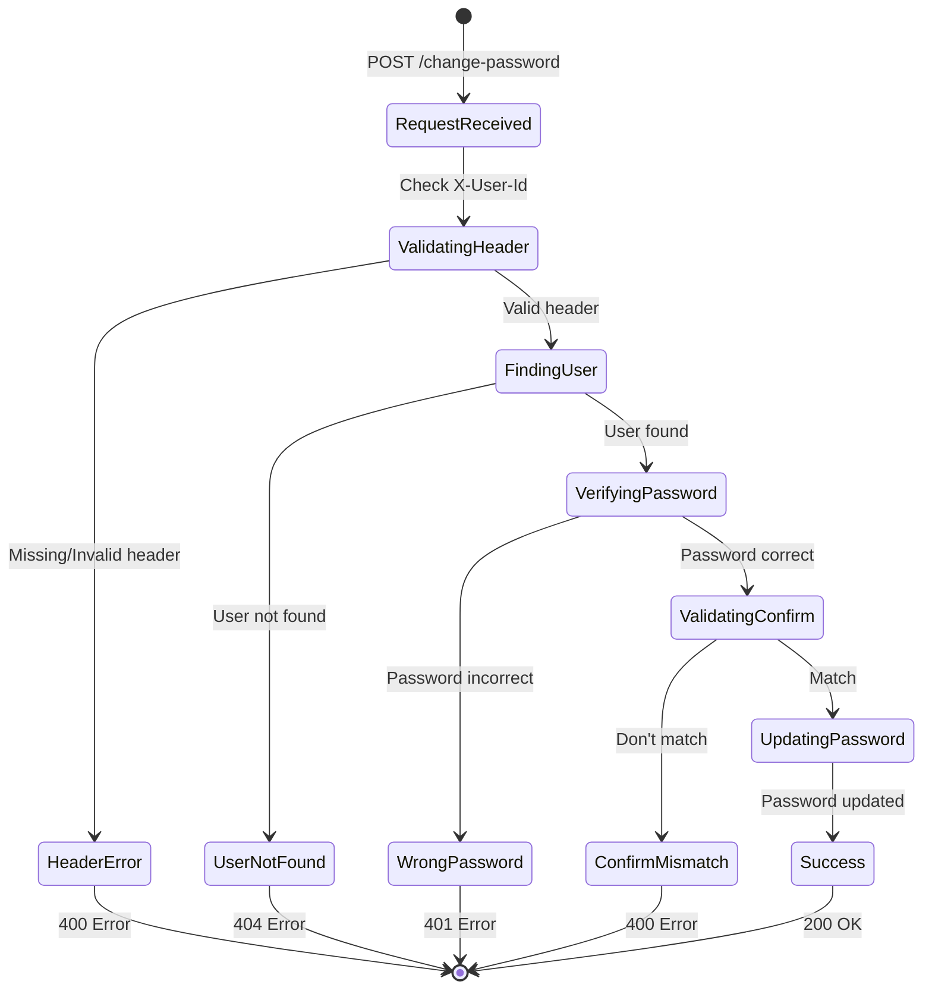

# TechHub - Sequence Diagram: Change Password

## Mục lục

1. [Tổng quan](#1-tổng-quan)
2. [Các thành phần chính](#2-các-thành-phần-chính)
3. [API Endpoints](#3-api-endpoints)
4. [Data Structures](#4-data-structures)
5. [Chi tiết luồng xử lý](#5-chi-tiết-luồng-xử-lý)
6. [Sequence Diagram](#6-sequence-diagram)
7. [Error Handling](#7-error-handling)
8. [Business Rules](#8-business-rules)

---

## 1. Tổng quan

Luồng **Change Password** cho phép user đã đăng nhập thay đổi mật khẩu của họ. Yêu cầu:

- User phải đăng nhập (có JWT token)
- Phải nhập đúng mật khẩu hiện tại
- Mật khẩu mới phải có ít nhất 6 ký tự
- Xác nhận mật khẩu phải khớp với mật khẩu mới

### Phân biệt với các luồng khác

| Luồng           | Mô tả                                    | Yêu cầu Auth |
| --------------- | ---------------------------------------- | ------------ |
| Change Password | User đổi mật khẩu khi đã đăng nhập       | ✅ Required  |
| Forgot Password | User quên mật khẩu, gửi OTP qua email    | ❌ No        |
| Reset Password  | User đặt lại mật khẩu sau khi verify OTP | ❌ No        |

---

## 2. Các thành phần chính

| Component         | Service      | Vai trò                             |
| ----------------- | ------------ | ----------------------------------- |
| `UserController`  | user-service | REST API endpoint                   |
| `UserService`     | user-service | Interface định nghĩa business logic |
| `UserServiceImpl` | user-service | Implementation của UserService      |
| `UserRepository`  | user-service | CRUD User entity                    |
| `PasswordEncoder` | user-service | Mã hóa và verify password (BCrypt)  |
| `User`            | user-service | Entity đại diện cho user            |

---

## 3. API Endpoints

| Method | Endpoint                     | Mô tả             | Auth Required |
| ------ | ---------------------------- | ----------------- | ------------- |
| POST   | `/api/users/change-password` | Đổi mật khẩu user | Yes (JWT)     |

### Request Headers

| Header        | Mô tả                           | Required |
| ------------- | ------------------------------- | -------- |
| Authorization | Bearer {jwt_token}              | Yes      |
| X-User-Id     | UUID của user (từ Proxy-Client) | Yes      |

---

## 4. Data Structures

### 4.1 Request DTO

#### ChangePasswordRequest

```java
public class ChangePasswordRequest {

    @NotBlank(message = "Current password is required")
    private String currentPassword;

    @NotBlank(message = "New password is required")
    @Size(min = 6, message = "Password must be at least 6 characters")
    private String newPassword;

    @NotBlank(message = "Confirm password is required")
    private String confirmPassword;
}
```

### 4.2 User Entity (relevant fields)

```java
@Entity
@Table(name = "users")
public class User {
    @Id
    private UUID id;

    private String email;
    private String username;
    private String passwordHash;  // BCrypt encoded

    private LocalDateTime created;
    private LocalDateTime updated;

    private Boolean isActive;
}
```

### 4.3 API Response

#### Success Response

```json
{
  "status": "success",
  "message": "Password changed successfully",
  "data": null,
  "path": "/api/users/change-password"
}
```

#### Error Response

```json
{
  "status": "error",
  "message": "Current password is incorrect",
  "code": 400,
  "path": "/api/users/change-password"
}
```

---

## 5. Chi tiết luồng xử lý

### 5.1 Change Password Flow

1. **User gửi request** với current password, new password, confirm password
2. **Validate request** - kiểm tra các trường required, min length
3. **Extract User ID** từ X-User-Id header
4. **Tìm User** trong database theo ID
5. **Verify current password** - so sánh với passwordHash bằng BCrypt
6. **Validate confirm password** - phải khớp với new password
7. **Encode new password** bằng BCrypt
8. **Update user** với password mới
9. **Return success response**

---

## 6. Sequence Diagram

### Change Password - Complete Flow



---

## 7. Error Handling

| Error Case                 | HTTP Status | Message                                            |
| -------------------------- | ----------- | -------------------------------------------------- |
| Missing X-User-Id header   | 400         | Authentication required - missing X-User-Id header |
| Invalid UUID format        | 400         | Invalid user ID format                             |
| User not found             | 404         | User not found                                     |
| User inactive              | 404         | User not found                                     |
| Current password incorrect | 401/400     | Current password is incorrect                      |
| Passwords don't match      | 400         | Password confirmation does not match               |
| New password too short     | 400         | Password must be at least 6 characters             |
| Current password empty     | 400         | Current password is required                       |
| New password empty         | 400         | New password is required                           |
| Confirm password empty     | 400         | Confirm password is required                       |

---

## 8. Business Rules

### 8.1 Validation Rules

| Field           | Rule                                |
| --------------- | ----------------------------------- |
| currentPassword | Required, không được empty          |
| newPassword     | Required, minimum 6 characters      |
| confirmPassword | Required, phải khớp với newPassword |

### 8.2 Security

1. **Password Hashing**: Sử dụng BCrypt với salt
2. **Verify before change**: Phải verify đúng current password trước khi đổi
3. **JWT Required**: User phải đăng nhập với JWT token hợp lệ
4. **X-User-Id Header**: Proxy-Client extract userId từ JWT và truyền qua header

### 8.3 Password Flow Comparison



### 8.4 State Diagram



---

## 9. Database Schema

### users Table (relevant columns)

```sql
CREATE TABLE users (
    id UUID PRIMARY KEY DEFAULT gen_random_uuid(),
    email VARCHAR(255) NOT NULL UNIQUE,
    username VARCHAR(100) NOT NULL UNIQUE,
    password_hash VARCHAR(255) NOT NULL,  -- BCrypt hash

    created TIMESTAMP NOT NULL,
    updated TIMESTAMP NOT NULL,

    is_active BOOLEAN NOT NULL DEFAULT TRUE
);

CREATE INDEX idx_users_email ON users(email);
CREATE INDEX idx_users_is_active ON users(is_active);
```

---

## Tóm tắt các thành phần

| Component         | Service      | Vai trò                        |
| ----------------- | ------------ | ------------------------------ |
| `UserController`  | user-service | REST API endpoint              |
| `UserServiceImpl` | user-service | Business logic implementation  |
| `UserRepository`  | user-service | Data access layer              |
| `PasswordEncoder` | user-service | BCrypt password hashing        |
| `User`            | user-service | User entity                    |
| `ProxyClient`     | proxy-client | JWT validation, extract userId |
