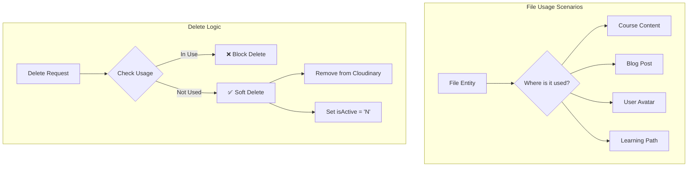

# TechHub - Sequence Diagram: Manage Document (File & Folder Management)

## Mục lục

1. [Tổng quan](#1-tổng-quan)
2. [Các thành phần chính](#2-các-thành-phần-chính)
3. [API Endpoints](#3-api-endpoints)
4. [Data Structures](#4-data-structures)
5. [Chi tiết luồng xử lý](#5-chi-tiết-luồng-xử-lý)
6. [Sequence Diagram](#6-sequence-diagram)
7. [Error Handling](#7-error-handling)
8. [Business Rules](#8-business-rules)

---

## 1. Tổng quan

Luồng **Manage Document** quản lý việc upload, lưu trữ và tổ chức files trong hệ thống TechHub. Bao gồm:

### File Management

- **Upload File**: Upload file lên Cloudinary và lưu metadata
- **Upload Multiple Files**: Upload nhiều files cùng lúc
- **Get File**: Lấy thông tin file
- **Get Files by Folder**: Lấy danh sách files trong folder
- **List Files**: Phân trang danh sách files của user
- **Delete File**: Xóa file (soft delete)
- **Get Statistics**: Thống kê files theo loại

### Folder Management

- **Create Folder**: Tạo folder mới (hỗ trợ nested folders)
- **Get Folder**: Lấy thông tin folder
- **Get Folders by User**: Lấy tất cả folders của user
- **Get Folder Tree**: Lấy cây thư mục
- **Update Folder**: Đổi tên hoặc di chuyển folder
- **Delete Folder**: Xóa folder (nếu trống)

### Mối quan hệ

```
User
  │
  ├── FileFolder (nhiều folders)
  │      │
  │      ├── FileFolder (nested subfolders)
  │      └── FileEntity (nhiều files)
  │
  └── FileEntity (files không có folder)
```

---

## 2. Các thành phần chính

| Component               | Service      | Vai trò                                   |
| ----------------------- | ------------ | ----------------------------------------- |
| `FileController`        | file-service | REST API cho file operations              |
| `FolderController`      | file-service | REST API cho folder operations            |
| `FileManagementService` | file-service | Business logic quản lý files              |
| `FolderService`         | file-service | Business logic quản lý folders            |
| `FileRepository`        | file-service | CRUD FileEntity                           |
| `FileFolderRepository`  | file-service | CRUD FileFolderEntity                     |
| `FileUsageRepository`   | file-service | Theo dõi việc sử dụng file                |
| `Cloudinary`            | External     | Cloud storage cho files (images, videos…) |
| `FileEntity`            | file-service | Entity lưu metadata của file              |
| `FileFolderEntity`      | file-service | Entity lưu thông tin folder               |

---

## 3. API Endpoints

### 3.1 File Endpoints

| Method | Endpoint                       | Mô tả                       | Auth Required |
| ------ | ------------------------------ | --------------------------- | ------------- |
| POST   | `/api/files/upload`            | Upload single file          | Yes           |
| POST   | `/api/files/upload/multiple`   | Upload multiple files       | Yes           |
| GET    | `/api/files/{fileId}`          | Lấy file theo ID            | Yes           |
| GET    | `/api/files/folder/{folderId}` | Lấy files trong folder      | Yes           |
| GET    | `/api/files`                   | Danh sách files (paginated) | Yes           |
| GET    | `/api/files/statistics`        | Thống kê files              | Yes           |
| DELETE | `/api/files/{fileId}`          | Xóa file                    | Yes           |

### 3.2 Folder Endpoints

| Method | Endpoint                       | Mô tả                | Auth Required |
| ------ | ------------------------------ | -------------------- | ------------- |
| POST   | `/api/folders`                 | Tạo folder mới       | Yes           |
| GET    | `/api/folders/user/{userId}`   | Lấy folders của user | Yes           |
| GET    | `/api/folders/{folderId}`      | Lấy folder theo ID   | Yes           |
| GET    | `/api/folders/{folderId}/tree` | Lấy folder tree      | Yes           |
| PUT    | `/api/folders/{folderId}`      | Cập nhật folder      | Yes           |
| DELETE | `/api/folders/{folderId}`      | Xóa folder           | Yes           |

---

## 4. Data Structures

### 4.1 Entities

#### FileEntity

```java
@Entity
@Table(name = "files")
public class FileEntity {
    @Id
    private UUID id;

    private UUID userId;
    private UUID folderId;

    private String name;
    private String originalName;

    @Enumerated(EnumType.STRING)
    private FileTypeEnum fileType;  // IMAGE, VIDEO, AUDIO, DOCUMENT, OTHER

    private String mimeType;
    private Long fileSize;

    // Cloudinary fields
    private String cloudinaryPublicId;
    private String cloudinaryUrl;
    private String cloudinarySecureUrl;

    // Media dimensions
    private Integer width;
    private Integer height;
    private Integer duration;  // for video/audio

    // Metadata
    private String[] tags;
    private String altText;
    private String caption;
    private String description;

    // Reference (for course content, blog, etc.)
    private String uploadSource;  // DIRECT, COURSE, BLOG
    private UUID referenceId;
    private String referenceType;

    private LocalDateTime created;
    private LocalDateTime updated;
    private UUID createdBy;
    private UUID updatedBy;
    private String isActive;  // Y/N
}
```

#### FileFolderEntity

```java
@Entity
@Table(name = "file_folders")
public class FileFolderEntity {
    @Id
    private UUID id;

    private UUID userId;
    private UUID parentId;  // null = root folder

    private String name;
    private String path;    // e.g., "/Documents/Course Materials"

    private LocalDateTime created;
    private LocalDateTime updated;
    private UUID createdBy;
    private UUID updatedBy;
    private String isActive;  // Y/N
}
```

#### FileTypeEnum

```java
public enum FileTypeEnum {
    IMAGE,
    VIDEO,
    AUDIO,
    DOCUMENT,
    OTHER
}
```

### 4.2 DTOs

#### CreateFolderRequest

```json
{
  "userId": "uuid",
  "parentId": "uuid (optional)",
  "name": "Course Materials",
  "description": "optional description"
}
```

#### UpdateFolderRequest

```json
{
  "name": "New Folder Name",
  "parentId": "uuid (to move folder)"
}
```

#### FileResponse

```json
{
  "id": "uuid",
  "userId": "uuid",
  "folderId": "uuid",
  "folderName": "Course Materials",
  "name": "lecture_01.mp4",
  "originalName": "lecture_01.mp4",
  "fileType": "VIDEO",
  "mimeType": "video/mp4",
  "fileSize": 52428800,
  "cloudinaryPublicId": "techhub/videos/abc123",
  "cloudinaryUrl": "http://res.cloudinary.com/...",
  "cloudinarySecureUrl": "https://res.cloudinary.com/...",
  "width": 1920,
  "height": 1080,
  "duration": 3600,
  "tags": ["java", "spring"],
  "description": "Introduction to Spring Boot",
  "uploadSource": "COURSE",
  "created": "2024-01-15T10:30:00",
  "updated": "2024-01-15T10:30:00"
}
```

#### FolderResponse

```json
{
  "id": "uuid",
  "userId": "uuid",
  "parentId": "uuid",
  "name": "Course Materials",
  "path": "/Documents/Course Materials",
  "fileCount": 15,
  "totalSize": 524288000,
  "children": [
    { "id": "uuid", "name": "Videos", ... },
    { "id": "uuid", "name": "PDFs", ... }
  ],
  "created": "2024-01-15T10:30:00",
  "updated": "2024-01-15T10:30:00"
}
```

#### FileStatisticsResponse

```json
{
  "totalFiles": 150,
  "totalSize": 5368709120,
  "byType": {
    "IMAGE": { "count": 80, "totalSize": 1073741824 },
    "VIDEO": { "count": 30, "totalSize": 3221225472 },
    "DOCUMENT": { "count": 35, "totalSize": 536870912 },
    "AUDIO": { "count": 5, "totalSize": 536870912 }
  }
}
```

---

## 5. Chi tiết luồng xử lý

### 5.1 Upload File Flow

1. **User gửi request** với file multipart
2. **Validate folder** (nếu có folderId)
3. **Xác định file type** từ MIME type
4. **Upload lên Cloudinary** với resource type phù hợp
5. **Tạo FileEntity** với metadata từ Cloudinary response
6. **Lưu vào database**
7. **Return FileResponse**

### 5.2 Delete File Flow

1. **Tìm file** theo ID và userId
2. **Kiểm tra file usage** - không xóa nếu đang được sử dụng
3. **Xóa trên Cloudinary** (destroy)
4. **Soft delete** trong database (isActive = 'N')

### 5.3 Create Folder Flow

1. **Kiểm tra duplicate** trong cùng parent
2. **Tính toán path** từ parent folder
3. **Tạo FileFolderEntity**
4. **Lưu vào database**

### 5.4 Delete Folder Flow

1. **Kiểm tra folder tồn tại**
2. **Kiểm tra folder có files** → block nếu có
3. **Kiểm tra folder có subfolders** → block nếu có
4. **Soft delete** (isActive = 'N')

### 5.5 Move Folder Flow

1. **Validate new parent** tồn tại
2. **Kiểm tra circular reference** (không move vào descendant)
3. **Cập nhật parentId và path**

---

## 6. Sequence Diagram

### File & Folder Management - Complete CRUD Flow

```mermaid
sequenceDiagram
    autonumber
    participant User
    participant APIGateway
    participant FileController
    participant FolderController
    participant FileService as FileManagementService
    participant FolderService
    participant Cloudinary
    participant FileRepo as FileRepository
    participant FolderRepo as FileFolderRepository
    participant UsageRepo as FileUsageRepository
    participant Database

    %% ==================== CREATE FOLDER ====================
    rect rgb(220, 255, 220)
        Note over User,Database: 1. CREATE FOLDER - POST /api/folders

        User->>+APIGateway: POST /api/folders<br/>{ userId, parentId?, name }
        APIGateway->>+FolderController: createFolder(request)
        FolderController->>+FolderService: createFolder(request)

        FolderService->>+FolderRepo: existsByUserIdAndNameAndParentIdAndIsActive()
        FolderRepo->>Database: SELECT EXISTS FROM file_folders<br/>WHERE user_id=? AND name=? AND parent_id=?
        Database-->>FolderRepo: false
        FolderRepo-->>-FolderService: false (no duplicate)

        alt Has parentId
            FolderService->>+FolderRepo: findById(parentId)
            FolderRepo->>Database: SELECT * FROM file_folders WHERE id=?
            Database-->>FolderRepo: Parent folder
            FolderRepo-->>-FolderService: parent
            FolderService->>FolderService: path = parent.path + "/" + name
        else Root folder
            FolderService->>FolderService: path = "/" + name
        end

        FolderService->>FolderService: Create FileFolderEntity<br/>- userId, parentId, name, path<br/>- isActive: "Y"

        FolderService->>+FolderRepo: save(folder)
        FolderRepo->>Database: INSERT INTO file_folders
        Database-->>FolderRepo: Saved folder
        FolderRepo-->>-FolderService: folder

        FolderService->>FolderService: mapToResponse(folder)
        FolderService-->>-FolderController: FolderResponse
        FolderController-->>-APIGateway: { status: "success", data: folder }
        APIGateway-->>-User: 200 OK
    end

    %% ==================== UPLOAD FILE ====================
    rect rgb(240, 248, 255)
        Note over User,Database: 2. UPLOAD FILE - POST /api/files/upload

        User->>+APIGateway: POST /api/files/upload<br/>multipart/form-data<br/>{ file, userId, folderId?, tags?, description? }
        APIGateway->>+FileController: uploadFile(file, userId, folderId, tags, description)
        FileController->>+FileService: uploadFile(file, userId, folderId, tags, description)

        alt Has folderId
            FileService->>+FolderRepo: findByIdAndUserIdAndIsActive(folderId, userId, "Y")
            FolderRepo->>Database: SELECT * FROM file_folders WHERE id=? AND user_id=?
            Database-->>FolderRepo: Folder
            FolderRepo-->>-FileService: folder exists ✓
        end

        FileService->>FileService: determineFileType(mimeType)<br/>→ IMAGE/VIDEO/AUDIO/DOCUMENT/OTHER

        FileService->>FileService: Determine resourceType<br/>VIDEO→"video", IMAGE→"image"<br/>AUDIO→"video", OTHER→"raw"

        rect rgb(255, 248, 220)
            Note over FileService,Cloudinary: Upload to Cloudinary

            FileService->>+Cloudinary: uploader().upload(file.bytes, { resource_type })
            Cloudinary-->>-FileService: { public_id, url, secure_url,<br/>width, height, duration }
        end

        FileService->>FileService: Create FileEntity<br/>- userId, folderId, name, originalName<br/>- fileType, mimeType, fileSize<br/>- cloudinaryPublicId, cloudinaryUrl<br/>- width, height, duration<br/>- tags, description<br/>- isActive: "Y"

        FileService->>+FileRepo: save(fileEntity)
        FileRepo->>Database: INSERT INTO files
        Database-->>FileRepo: Saved file
        FileRepo-->>-FileService: file

        FileService->>FileService: mapToResponse(file)
        FileService-->>-FileController: FileResponse
        FileController-->>-APIGateway: { status: "success", data: file }
        APIGateway-->>-User: 200 OK
    end

    %% ==================== GET FILE ====================
    rect rgb(255, 248, 240)
        Note over User,Database: 3. GET FILE - GET /api/files/{fileId}

        User->>+APIGateway: GET /api/files/{fileId}?userId={userId}
        APIGateway->>+FileController: getFile(fileId, userId)
        FileController->>+FileService: getFileById(userId, fileId)

        FileService->>+FileRepo: findByIdAndUserIdAndIsActive(fileId, userId, "Y")
        FileRepo->>Database: SELECT * FROM files<br/>WHERE id=? AND user_id=? AND is_active='Y'
        Database-->>FileRepo: FileEntity
        FileRepo-->>-FileService: file

        FileService->>FileService: mapToResponse(file)
        FileService-->>-FileController: FileResponse
        FileController-->>-APIGateway: { status: "success", data: file }
        APIGateway-->>-User: 200 OK
    end

    %% ==================== GET FILES BY FOLDER ====================
    rect rgb(245, 245, 255)
        Note over User,Database: 4. GET FILES BY FOLDER - GET /api/files/folder/{folderId}

        User->>+APIGateway: GET /api/files/folder/{folderId}?userId={userId}
        APIGateway->>+FileController: getFilesByFolder(folderId, userId)
        FileController->>+FileService: getFilesByFolder(userId, folderId)

        FileService->>+FileRepo: findByUserIdAndFolderIdAndIsActive(userId, folderId, "Y")
        FileRepo->>Database: SELECT * FROM files<br/>WHERE user_id=? AND folder_id=? AND is_active='Y'
        Database-->>FileRepo: List<FileEntity>
        FileRepo-->>-FileService: files

        FileService->>FileService: files.stream().map(mapToResponse)
        FileService-->>-FileController: List<FileResponse>
        FileController-->>-APIGateway: { status: "success", data: [...] }
        APIGateway-->>-User: 200 OK
    end

    %% ==================== LIST FILES (PAGINATED) ====================
    rect rgb(255, 245, 238)
        Note over User,Database: 5. LIST FILES - GET /api/files?userId&page&size

        User->>+APIGateway: GET /api/files?userId={userId}&page=0&size=20
        APIGateway->>+FileController: listFiles(userId, page, size)
        FileController->>+FileService: getFilesByUser(userId, PageRequest)

        FileService->>+FileRepo: findByUserIdAndIsActive(userId, "Y", pageable)
        FileRepo->>Database: SELECT * FROM files WHERE user_id=?<br/>ORDER BY created DESC<br/>LIMIT 20 OFFSET 0
        Database-->>FileRepo: Page<FileEntity>
        FileRepo-->>-FileService: Page<files>

        FileService->>FileService: page.map(mapToResponse)
        FileService-->>-FileController: Page<FileResponse>
        FileController-->>-APIGateway: { status: "success", data: Page }
        APIGateway-->>-User: 200 OK with pagination
    end

    %% ==================== GET FILE STATISTICS ====================
    rect rgb(248, 255, 248)
        Note over User,Database: 6. GET STATISTICS - GET /api/files/statistics

        User->>+APIGateway: GET /api/files/statistics?userId={userId}
        APIGateway->>+FileController: getStatistics(userId)
        FileController->>+FileService: getFileStatistics(userId)

        FileService->>+FileRepo: countByUserId(userId, "Y")
        FileRepo->>Database: SELECT COUNT(*) FROM files WHERE user_id=?
        Database-->>FileRepo: totalFiles
        FileRepo-->>-FileService: 150

        FileService->>+FileRepo: getTotalFileSizeByUserId(userId, "Y")
        FileRepo->>Database: SELECT SUM(file_size) FROM files WHERE user_id=?
        Database-->>FileRepo: totalSize
        FileRepo-->>-FileService: 5368709120

        FileService->>+FileRepo: getFileStatisticsByUserId(userId, "Y")
        FileRepo->>Database: SELECT file_type, COUNT(*), SUM(file_size)<br/>FROM files GROUP BY file_type
        Database-->>FileRepo: List<[type, count, size]>
        FileRepo-->>-FileService: typeStats

        FileService->>FileService: Build FileStatisticsResponse
        FileService-->>-FileController: FileStatisticsResponse
        FileController-->>-APIGateway: { status: "success", data: stats }
        APIGateway-->>-User: 200 OK
    end

    %% ==================== GET FOLDER TREE ====================
    rect rgb(255, 250, 240)
        Note over User,Database: 7. GET FOLDER TREE - GET /api/folders/{folderId}/tree

        User->>+APIGateway: GET /api/folders/{folderId}/tree?userId={userId}
        APIGateway->>+FolderController: getFolderTree(folderId, userId)
        FolderController->>+FolderService: getFolderTree(userId, folderId)

        FolderService->>+FolderRepo: findByIdAndUserIdAndIsActive(folderId, userId, "Y")
        FolderRepo->>Database: SELECT * FROM file_folders WHERE id=?
        Database-->>FolderRepo: Folder
        FolderRepo-->>-FolderService: folder

        FolderService->>FolderService: mapToResponse(folder)

        rect rgb(240, 248, 255)
            Note over FolderService,Database: Recursive: buildFolderTree(userId, folderId)

            FolderService->>+FolderRepo: findByUserIdAndParentIdAndIsActive(userId, folderId, "Y")
            FolderRepo->>Database: SELECT * FROM file_folders WHERE parent_id=?
            Database-->>FolderRepo: List<children>
            FolderRepo-->>-FolderService: children

            loop For each child folder
                FolderService->>FolderService: mapToResponse(child)
                FolderService->>FolderService: buildFolderTree(userId, child.id)
            end
        end

        FolderService-->>-FolderController: FolderResponse with children
        FolderController-->>-APIGateway: { status: "success", data: folderTree }
        APIGateway-->>-User: 200 OK
    end

    %% ==================== UPDATE FOLDER ====================
    rect rgb(255, 240, 245)
        Note over User,Database: 8. UPDATE FOLDER - PUT /api/folders/{folderId}

        User->>+APIGateway: PUT /api/folders/{folderId}?userId={userId}<br/>{ name?, parentId? }
        APIGateway->>+FolderController: updateFolder(folderId, userId, request)
        FolderController->>+FolderService: updateFolder(userId, folderId, request)

        FolderService->>+FolderRepo: findByIdAndUserIdAndIsActive(folderId, userId, "Y")
        FolderRepo->>Database: SELECT * FROM file_folders WHERE id=?
        Database-->>FolderRepo: Folder
        FolderRepo-->>-FolderService: folder

        alt Rename folder
            FolderService->>+FolderRepo: existsByUserIdAndNameAndParentIdAndIsActive()
            FolderRepo->>Database: Check duplicate name
            Database-->>FolderRepo: false
            FolderRepo-->>-FolderService: no duplicate ✓
            FolderService->>FolderService: folder.setName(newName)
        end

        alt Move folder (new parentId)
            FolderService->>+FolderRepo: findById(newParentId)
            FolderRepo->>Database: SELECT * FROM file_folders
            Database-->>FolderRepo: newParent
            FolderRepo-->>-FolderService: newParent

            FolderService->>FolderService: isDescendant(folderId, newParentId)?
            alt Circular reference detected
                FolderService-->>FolderController: ❌ throw "Cannot move to descendant"
            else Valid move
                FolderService->>FolderService: folder.setParentId(newParentId)<br/>folder.setPath(newParent.path + "/" + name)
            end
        end

        FolderService->>+FolderRepo: save(folder)
        FolderRepo->>Database: UPDATE file_folders SET name=?, parent_id=?, path=?
        Database-->>FolderRepo: Updated folder
        FolderRepo-->>-FolderService: folder

        FolderService-->>-FolderController: FolderResponse
        FolderController-->>-APIGateway: { status: "success", data: folder }
        APIGateway-->>-User: 200 OK
    end

    %% ==================== DELETE FILE ====================
    rect rgb(255, 230, 230)
        Note over User,Database: 9. DELETE FILE - DELETE /api/files/{fileId}

        User->>+APIGateway: DELETE /api/files/{fileId}?userId={userId}
        APIGateway->>+FileController: deleteFile(fileId, userId)
        FileController->>+FileService: deleteFile(userId, fileId)

        FileService->>+FileRepo: findByIdAndUserIdAndIsActive(fileId, userId, "Y")
        FileRepo->>Database: SELECT * FROM files WHERE id=?
        Database-->>FileRepo: FileEntity
        FileRepo-->>-FileService: file

        FileService->>+UsageRepo: countUsagesByFileId(fileId)
        UsageRepo->>Database: SELECT COUNT(*) FROM file_usages WHERE file_id=?
        Database-->>UsageRepo: usageCount
        UsageRepo-->>-FileService: usageCount

        alt File in use
            FileService-->>FileController: ❌ throw "Cannot delete file in use"
            FileController-->>APIGateway: 400 Bad Request
            APIGateway-->>User: "Cannot delete file that is currently in use"
        else File not in use
            rect rgb(255, 248, 220)
                Note over FileService,Cloudinary: Delete from Cloudinary

                FileService->>+Cloudinary: uploader().destroy(publicId)
                Cloudinary-->>-FileService: { result: "ok" }
            end

            FileService->>FileService: file.setIsActive("N") (soft delete)

            FileService->>+FileRepo: save(file)
            FileRepo->>Database: UPDATE files SET is_active='N' WHERE id=?
            Database-->>FileRepo: Updated
            FileRepo-->>-FileService: void

            FileService-->>-FileController: void
            FileController-->>-APIGateway: { status: "success", message: "File deleted" }
            APIGateway-->>-User: 200 OK
        end
    end

    %% ==================== DELETE FOLDER ====================
    rect rgb(255, 220, 220)
        Note over User,Database: 10. DELETE FOLDER - DELETE /api/folders/{folderId}

        User->>+APIGateway: DELETE /api/folders/{folderId}?userId={userId}
        APIGateway->>+FolderController: deleteFolder(folderId, userId)
        FolderController->>+FolderService: deleteFolder(userId, folderId)

        FolderService->>+FolderRepo: findByIdAndUserIdAndIsActive(folderId, userId, "Y")
        FolderRepo->>Database: SELECT * FROM file_folders WHERE id=?
        Database-->>FolderRepo: Folder
        FolderRepo-->>-FolderService: folder

        FolderService->>+FileRepo: findByUserIdAndFolderIdAndIsActive(userId, folderId, "Y")
        FileRepo->>Database: SELECT * FROM files WHERE folder_id=?
        Database-->>FileRepo: List<files>
        FileRepo-->>-FolderService: files

        alt Folder has files
            FolderService-->>FolderController: ❌ throw "Cannot delete folder with files"
            FolderController-->>APIGateway: 400 Bad Request
            APIGateway-->>User: "Please move or delete files first"
        else Check for subfolders
            FolderService->>+FolderRepo: findByUserIdAndParentIdAndIsActive(userId, folderId, "Y")
            FolderRepo->>Database: SELECT * FROM file_folders WHERE parent_id=?
            Database-->>FolderRepo: List<subfolders>
            FolderRepo-->>-FolderService: subfolders

            alt Folder has subfolders
                FolderService-->>FolderController: ❌ throw "Cannot delete folder with subfolders"
                FolderController-->>APIGateway: 400 Bad Request
                APIGateway-->>User: "Please delete subfolders first"
            else Folder is empty
                FolderService->>FolderService: folder.setIsActive("N") (soft delete)

                FolderService->>+FolderRepo: save(folder)
                FolderRepo->>Database: UPDATE file_folders SET is_active='N'
                Database-->>FolderRepo: Updated
                FolderRepo-->>-FolderService: void

                FolderService-->>-FolderController: void
                FolderController-->>-APIGateway: { status: "success", message: "Folder deleted" }
                APIGateway-->>-User: 200 OK
            end
        end
    end
```



---

## 7. Error Handling

| Error Case                        | HTTP Status | Message                                     |
| --------------------------------- | ----------- | ------------------------------------------- |
| User not authenticated            | 401         | Unauthorized                                |
| File not found                    | 404         | File not found                              |
| Folder not found                  | 404         | Folder not found                            |
| File in use (delete blocked)      | 400         | Cannot delete file that is currently in use |
| Folder has files (delete blocked) | 400         | Cannot delete folder with files             |
| Folder has subfolders             | 400         | Cannot delete folder with subfolders        |
| Duplicate folder name             | 400         | Folder with this name already exists        |
| Move to descendant (circular ref) | 400         | Cannot move folder to its own descendant    |
| Parent folder not found           | 400         | Parent folder not found                     |
| Cloudinary upload failed          | 500         | Failed to upload file                       |
| Cloudinary delete failed          | 500         | Failed to delete file                       |
| Invalid file type                 | 400         | Unsupported file type                       |

---

## 8. Business Rules

### 8.1 File Upload

1. **Supported types**: IMAGE, VIDEO, AUDIO, DOCUMENT, OTHER
2. **Cloudinary resource mapping**:
   - IMAGE → "image"
   - VIDEO → "video"
   - AUDIO → "video" (Cloudinary quirk)
   - DOCUMENT/OTHER → "raw"
3. **Metadata extraction**: width, height, duration (từ Cloudinary response)
4. **Soft delete**: Files được đánh dấu `isActive='N'` thay vì xóa vĩnh viễn

### 8.2 Folder Structure

1. **Nested folders**: Hỗ trợ folders trong folders
2. **Path calculation**: Tự động tính path dựa trên parent
3. **Unique name**: Tên folder phải unique trong cùng parent
4. **Circular reference prevention**: Không thể move folder vào descendant

### 8.3 Delete Rules

| Entity | Condition                   | Action                   |
| ------ | --------------------------- | ------------------------ |
| File   | Not in use                  | Soft delete + Cloudinary |
| File   | In use (course, blog, etc.) | Block deletion           |
| Folder | Empty (no files/subfolders) | Soft delete              |
| Folder | Has files                   | Block deletion           |
| Folder | Has subfolders              | Block deletion           |

### 8.4 File Usage Tracking



---

## 9. Database Schema

### files Table

```sql
CREATE TABLE files (
    id UUID PRIMARY KEY DEFAULT gen_random_uuid(),
    user_id UUID NOT NULL,
    folder_id UUID REFERENCES file_folders(id),
    name VARCHAR(500) NOT NULL,
    original_name VARCHAR(500) NOT NULL,
    file_type file_type_enum NOT NULL,
    mime_type VARCHAR(100),
    file_size BIGINT,
    cloudinary_public_id VARCHAR(500) NOT NULL,
    cloudinary_url TEXT NOT NULL,
    cloudinary_secure_url TEXT,
    width INTEGER,
    height INTEGER,
    duration INTEGER,
    tags TEXT[],
    alt_text VARCHAR(500),
    caption TEXT,
    description TEXT,
    upload_source VARCHAR(50) DEFAULT 'DIRECT',
    reference_id UUID,
    reference_type VARCHAR(50),
    created TIMESTAMP NOT NULL,
    updated TIMESTAMP NOT NULL,
    created_by UUID,
    updated_by UUID,
    is_active CHAR(1) NOT NULL DEFAULT 'Y'
);

CREATE INDEX idx_files_user_id ON files(user_id);
CREATE INDEX idx_files_folder_id ON files(folder_id);
CREATE INDEX idx_files_file_type ON files(file_type);
```

### file_folders Table

```sql
CREATE TABLE file_folders (
    id UUID PRIMARY KEY DEFAULT gen_random_uuid(),
    user_id UUID NOT NULL,
    parent_id UUID REFERENCES file_folders(id),
    name VARCHAR(255) NOT NULL,
    path TEXT NOT NULL,
    created TIMESTAMP NOT NULL,
    updated TIMESTAMP NOT NULL,
    created_by UUID,
    updated_by UUID,
    is_active CHAR(1) NOT NULL DEFAULT 'Y',
    UNIQUE(user_id, name, parent_id)
);

CREATE INDEX idx_file_folders_user_id ON file_folders(user_id);
CREATE INDEX idx_file_folders_parent_id ON file_folders(parent_id);
```

### file_type_enum

```sql
CREATE TYPE file_type_enum AS ENUM ('IMAGE', 'VIDEO', 'AUDIO', 'DOCUMENT', 'OTHER');
```

---

## Tóm tắt các thành phần

| Component               | Service      | Vai trò                           |
| ----------------------- | ------------ | --------------------------------- |
| `FileController`        | file-service | REST API cho files                |
| `FolderController`      | file-service | REST API cho folders              |
| `FileManagementService` | file-service | Business logic files + Cloudinary |
| `FolderService`         | file-service | Business logic folders            |
| `FileRepository`        | file-service | Data access cho files             |
| `FileFolderRepository`  | file-service | Data access cho folders           |
| `Cloudinary`            | External     | Cloud storage                     |
| `FileEntity`            | file-service | File metadata entity              |
| `FileFolderEntity`      | file-service | Folder entity                     |
