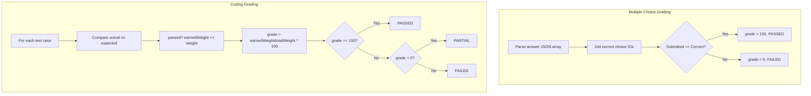

# TechHub - Sequence Diagram: Manage Exercise

## Mục lục

1. [Tổng quan](#1-tổng-quan)
2. [Các thành phần chính](#2-các-thành-phần-chính)
3. [API Endpoints](#3-api-endpoints)
4. [Data Structures](#4-data-structures)
5. [Chi tiết luồng xử lý](#5-chi-tiết-luồng-xử-lý)
6. [Sequence Diagram](#6-sequence-diagram)
7. [Error Handling](#7-error-handling)
8. [Business Rules](#8-business-rules)

---

## 1. Tổng quan

Luồng **Manage Exercise** cho phép Instructor/Admin quản lý các bài tập trong khóa học. Bao gồm:

### Exercise Management (Instructor/Admin)

- **Create Exercise**: Tạo bài tập mới cho lesson
- **Create Multiple Exercises**: Tạo nhiều bài tập cùng lúc
- **Get Exercise**: Lấy thông tin bài tập
- **Get Exercises**: Lấy danh sách bài tập của lesson
- **Update Exercise**: Cập nhật bài tập
- **Delete Exercise**: Xóa bài tập (soft delete)

### Exercise Submission (Learner)

- **Submit Exercise**: Nộp bài làm
- **Auto-grading**: Chấm điểm tự động cho Multiple Choice và Coding

### Exercise Types

| Type            | Mô tả                       | Auto-grading |
| --------------- | --------------------------- | ------------ |
| MULTIPLE_CHOICE | Câu hỏi trắc nghiệm         | ✅ Yes       |
| CODING          | Bài tập code với test cases | ✅ Yes       |
| OPEN_ENDED      | Câu hỏi tự luận             | ❌ No        |

### Mối quan hệ

```
Course
  │
  └── Chapter
        │
        └── Lesson
              │
              └── Exercise (1:N)
                    │
                    ├── ExerciseTestCase (1:N)
                    └── Submission (1:N per user)
```

---

## 2. Các thành phần chính

| Component                    | Service        | Vai trò                               |
| ---------------------------- | -------------- | ------------------------------------- |
| `ExerciseController`         | course-service | REST API endpoints                    |
| `ExerciseService`            | course-service | Interface business logic              |
| `ExerciseServiceImpl`        | course-service | Implementation                        |
| `ExerciseRepository`         | course-service | CRUD Exercise entity                  |
| `ExerciseTestCaseRepository` | course-service | CRUD test cases                       |
| `SubmissionRepository`       | course-service | CRUD submissions                      |
| `CourseProgressService`      | course-service | Cập nhật tiến độ học tập              |
| `Exercise`                   | course-service | Entity bài tập                        |
| `ExerciseTestCase`           | course-service | Entity test case cho coding exercises |
| `Submission`                 | course-service | Entity lưu bài nộp                    |

---

## 3. API Endpoints

| Method | Endpoint                                                          | Mô tả                   | Auth Required    |
| ------ | ----------------------------------------------------------------- | ----------------------- | ---------------- |
| GET    | `/api/courses/{courseId}/lessons/{lessonId}/exercise`             | Lấy exercise (legacy)   | Yes              |
| GET    | `/api/courses/{courseId}/lessons/{lessonId}/exercises`            | Lấy danh sách exercises | Yes              |
| PUT    | `/api/courses/{courseId}/lessons/{lessonId}/exercise`             | Upsert exercise         | INSTRUCTOR/ADMIN |
| POST   | `/api/courses/{courseId}/lessons/{lessonId}/exercises`            | Tạo nhiều exercises     | INSTRUCTOR/ADMIN |
| PUT    | `/api/courses/{courseId}/lessons/{lessonId}/exercises/{id}`       | Cập nhật exercise       | INSTRUCTOR/ADMIN |
| DELETE | `/api/courses/{courseId}/lessons/{lessonId}/exercises/{id}`       | Xóa exercise            | INSTRUCTOR/ADMIN |
| POST   | `/api/courses/{courseId}/lessons/{lessonId}/exercise/submissions` | Nộp bài                 | ENROLLED         |

---

## 4. Data Structures

### 4.1 Entities

#### Exercise Entity

```java
@Entity
@Table(name = "exercises")
public class Exercise {
    @Id
    private UUID id;

    @Enumerated(EnumType.STRING)
    private ExerciseType type;  // MULTIPLE_CHOICE, CODING, OPEN_ENDED

    @Column(columnDefinition = "TEXT")
    private String question;

    @Type(type = "json")
    private Object options;  // For MULTIPLE_CHOICE: { choices: [...] }

    @ManyToOne
    private Lesson lesson;

    private Integer orderIndex;

    private OffsetDateTime created;
    private OffsetDateTime updated;
    private UUID createdBy;
    private UUID updatedBy;
    private Boolean isActive;
}
```

#### ExerciseTestCase Entity

```java
@Entity
@Table(name = "exercise_test_cases")
public class ExerciseTestCase {
    @Id
    private UUID id;

    @ManyToOne
    private Exercise exercise;

    private Integer orderIndex;

    @Enumerated(EnumType.STRING)
    private TestCaseVisibility visibility;  // PUBLIC, HIDDEN

    @Column(columnDefinition = "TEXT")
    private String input;

    @Column(columnDefinition = "TEXT")
    private String expectedOutput;

    private Float weight;
    private Integer timeoutSeconds;
    private Boolean sample;

    private Boolean isActive;
}
```

#### Submission Entity

```java
@Entity
@Table(name = "submissions")
public class Submission {
    @Id
    private UUID id;

    @ManyToOne
    private Exercise exercise;

    private UUID userId;

    @Column(columnDefinition = "TEXT")
    private String answer;

    @Type(type = "json")
    private Object submissionData;  // For CODING: { code, language, outputs }

    @Enumerated(EnumType.STRING)
    private SubmissionStatus status;  // PENDING, PASSED, FAILED, PARTIAL

    private Float grade;
    private OffsetDateTime gradedAt;

    private Boolean isActive;
}
```

### 4.2 DTOs

#### ExerciseRequest

```json
{
  "type": "MULTIPLE_CHOICE",
  "question": "What is Java?",
  "options": {
    "choices": [
      { "id": "a", "text": "A programming language", "correct": true },
      { "id": "b", "text": "A coffee brand", "correct": false }
    ]
  },
  "orderIndex": 1,
  "testCases": [
    {
      "orderIndex": 1,
      "visibility": "PUBLIC",
      "input": "hello",
      "expectedOutput": "HELLO",
      "weight": 1.0,
      "sample": true
    }
  ]
}
```

#### ExerciseResponse

```json
{
  "id": "uuid",
  "type": "MULTIPLE_CHOICE",
  "question": "What is Java?",
  "options": { "choices": [...] },
  "testCases": [...],
  "lastSubmissionStatus": "PASSED",
  "bestScore": 100.0,
  "lastSubmittedAt": "2024-01-15T10:30:00Z"
}
```

#### ExerciseSubmissionRequest

```json
{
  "answer": "[\"a\"]",
  "submissionData": {
    "code": "public class Solution { ... }",
    "language": "java",
    "outputs": {
      "tc1": "HELLO",
      "tc2": "WORLD"
    }
  }
}
```

#### ExerciseSubmissionResponse

```json
{
  "submissionId": "uuid",
  "status": "PASSED",
  "grade": 100.0,
  "gradedAt": "2024-01-15T10:30:00Z",
  "passed": true,
  "testCaseResults": [
    {
      "testCaseId": "uuid",
      "passed": true,
      "input": "hello",
      "expectedOutput": "HELLO",
      "actualOutput": "HELLO",
      "visibility": "PUBLIC",
      "weight": 1.0
    }
  ]
}
```

---

## 5. Chi tiết luồng xử lý

### 5.1 Create/Update Exercise Flow

1. **Validate course và lesson** tồn tại
2. **Check permission** - chỉ INSTRUCTOR (owner) hoặc ADMIN
3. **Create/Update Exercise** entity
4. **Sync Test Cases** - tạo mới, update, hoặc soft delete

### 5.2 Submit Exercise Flow

1. **Validate enrollment** - user phải enrolled trong course
2. **Create Submission** với answer và submissionData
3. **Evaluate submission** dựa trên exercise type:
   - **MULTIPLE_CHOICE**: So sánh selected answers với correct choices
   - **CODING**: So sánh outputs với expected outputs của test cases
   - **OPEN_ENDED**: Set status = PENDING (cần manual grading)
4. **Update lesson progress** nếu passed

---

## 6. Sequence Diagram

### Exercise Management - Complete CRUD Flow

```mermaid
sequenceDiagram
    autonumber
    participant Instructor
    participant Learner
    participant APIGateway
    participant ExerciseController
    participant ExerciseService as ExerciseServiceImpl
    participant CourseProgressService
    participant ExerciseRepo as ExerciseRepository
    participant TestCaseRepo as ExerciseTestCaseRepository
    participant SubmissionRepo as SubmissionRepository
    participant LessonRepo as LessonRepository
    participant EnrollmentRepo as EnrollmentRepository
    participant Database

    %% ==================== CREATE EXERCISES ====================
    rect rgb(220, 255, 220)
        Note over Instructor,Database: 1. CREATE EXERCISES - POST /api/courses/{courseId}/lessons/{lessonId}/exercises

        Instructor->>+APIGateway: POST /api/courses/{courseId}/lessons/{lessonId}/exercises<br/>Authorization: Bearer {instructor_token}<br/>[{type, question, options, testCases}, ...]
        APIGateway->>+ExerciseController: createExercises(courseId, lessonId, requests)
        ExerciseController->>+ExerciseService: createExercises(courseId, lessonId, requests)

        rect rgb(255, 248, 220)
            Note over ExerciseService,Database: Resolve & Validate Lesson

            ExerciseService->>+LessonRepo: findById(lessonId)
            LessonRepo->>Database: SELECT * FROM lessons WHERE id = ?
            Database-->>LessonRepo: Lesson
            LessonRepo-->>-ExerciseService: lesson

            ExerciseService->>ExerciseService: Validate:<br/>- lesson.chapter.course.id == courseId<br/>- lesson.isActive == true
        end

        rect rgb(255, 240, 245)
            Note over ExerciseService: Check Permission

            ExerciseService->>ExerciseService: canManageCourse(course)?<br/>- ADMIN: ✓<br/>- INSTRUCTOR && course.instructorId == userId: ✓

            alt Not authorized
                ExerciseService-->>ExerciseController: ❌ throw ForbiddenException
                ExerciseController-->>APIGateway: 403 Forbidden
                APIGateway-->>Instructor: "Only instructors or admins can manage exercises"
            end
        end

        loop For each exercise request
            ExerciseService->>ExerciseService: Create Exercise entity<br/>- type, question, options<br/>- orderIndex, isActive: true

            ExerciseService->>+ExerciseRepo: save(exercise)
            ExerciseRepo->>Database: INSERT INTO exercises
            Database-->>ExerciseRepo: Saved exercise
            ExerciseRepo-->>-ExerciseService: exercise

            ExerciseService->>ExerciseService: syncTestCases(exercise, testCases)

            loop For each test case
                ExerciseService->>+TestCaseRepo: save(testCase)
                TestCaseRepo->>Database: INSERT INTO exercise_test_cases
                TestCaseRepo-->>-ExerciseService: testCase
            end
        end

        ExerciseService->>ExerciseService: Map all to ExerciseResponse
        ExerciseService-->>-ExerciseController: List<ExerciseResponse>
        ExerciseController-->>-APIGateway: GlobalResponse<List<ExerciseResponse>>
        APIGateway-->>-Instructor: 200 OK - Exercises created
    end

    %% ==================== GET EXERCISES ====================
    rect rgb(240, 248, 255)
        Note over Learner,Database: 2. GET EXERCISES - GET /api/courses/{courseId}/lessons/{lessonId}/exercises

        Learner->>+APIGateway: GET /api/courses/{courseId}/lessons/{lessonId}/exercises
        APIGateway->>+ExerciseController: getLessonExercises(courseId, lessonId)
        ExerciseController->>+ExerciseService: getLessonExercises(courseId, lessonId)

        ExerciseService->>+LessonRepo: findById(lessonId)
        LessonRepo->>Database: SELECT * FROM lessons
        LessonRepo-->>-ExerciseService: lesson

        ExerciseService->>+ExerciseRepo: findByLesson_IdAndIsActiveTrueOrderByOrderIndexAsc(lessonId)
        ExerciseRepo->>Database: SELECT * FROM exercises<br/>WHERE lesson_id = ? AND is_active = true<br/>ORDER BY order_index
        Database-->>ExerciseRepo: List<Exercise>
        ExerciseRepo-->>-ExerciseService: exercises

        loop For each exercise
            ExerciseService->>+TestCaseRepo: findByExercise_IdAndIsActiveTrueOrderByOrderIndexAsc(exerciseId)
            TestCaseRepo->>Database: SELECT * FROM exercise_test_cases<br/>WHERE exercise_id = ? AND is_active = true
            TestCaseRepo-->>-ExerciseService: testCases

            ExerciseService->>+SubmissionRepo: findTopByExercise_IdAndUserIdOrderByCreatedDesc
            SubmissionRepo->>Database: SELECT * FROM submissions<br/>WHERE exercise_id = ? AND user_id = ?<br/>ORDER BY created DESC LIMIT 1
            SubmissionRepo-->>-ExerciseService: lastSubmission (optional)

            ExerciseService->>ExerciseService: mapToResponse(exercise, testCases, includeAll)
        end

        ExerciseService-->>-ExerciseController: List<ExerciseResponse>
        ExerciseController-->>-APIGateway: GlobalResponse<List>
        APIGateway-->>-Learner: 200 OK with exercises
    end

    %% ==================== UPDATE EXERCISE ====================
    rect rgb(255, 248, 240)
        Note over Instructor,Database: 3. UPDATE EXERCISE - PUT /api/courses/{courseId}/lessons/{lessonId}/exercises/{exerciseId}

        Instructor->>+APIGateway: PUT /api/courses/{courseId}/lessons/{lessonId}/exercises/{exerciseId}<br/>{type, question, options, orderIndex, testCases}
        APIGateway->>+ExerciseController: updateExercise(courseId, lessonId, exerciseId, request)
        ExerciseController->>+ExerciseService: updateExercise(courseId, lessonId, exerciseId, request)

        ExerciseService->>+LessonRepo: findById(lessonId)
        LessonRepo-->>-ExerciseService: lesson
        ExerciseService->>ExerciseService: ensureManagePermission(course)

        ExerciseService->>+ExerciseRepo: findById(exerciseId)
        ExerciseRepo->>Database: SELECT * FROM exercises WHERE id = ?
        Database-->>ExerciseRepo: Exercise
        ExerciseRepo-->>-ExerciseService: exercise

        ExerciseService->>ExerciseService: Validate:<br/>- exercise.lesson.id == lessonId<br/>- exercise.isActive == true

        ExerciseService->>ExerciseService: Update fields:<br/>- type, question, options<br/>- orderIndex (if provided)

        ExerciseService->>+ExerciseRepo: save(exercise)
        ExerciseRepo->>Database: UPDATE exercises SET ...
        ExerciseRepo-->>-ExerciseService: updated

        rect rgb(255, 240, 245)
            Note over ExerciseService,Database: Sync Test Cases

            ExerciseService->>+TestCaseRepo: findByExercise_IdAndIsActiveTrueOrderByOrderIndexAsc
            TestCaseRepo-->>-ExerciseService: existingTestCases

            loop For each incoming testCase
                alt TestCase exists
                    ExerciseService->>ExerciseService: Update existing testCase
                else New testCase
                    ExerciseService->>ExerciseService: Create new testCase
                end
                ExerciseService->>+TestCaseRepo: save(testCase)
                TestCaseRepo-->>-ExerciseService: saved
            end

            loop For removed testCases
                ExerciseService->>ExerciseService: testCase.setIsActive(false)
                ExerciseService->>+TestCaseRepo: save(testCase)
                TestCaseRepo-->>-ExerciseService: soft deleted
            end
        end

        ExerciseService-->>-ExerciseController: ExerciseResponse
        ExerciseController-->>-APIGateway: GlobalResponse<ExerciseResponse>
        APIGateway-->>-Instructor: 200 OK - Exercise updated
    end

    %% ==================== DELETE EXERCISE ====================
    rect rgb(255, 230, 230)
        Note over Instructor,Database: 4. DELETE EXERCISE - DELETE /api/courses/{courseId}/lessons/{lessonId}/exercises/{exerciseId}

        Instructor->>+APIGateway: DELETE /api/courses/{courseId}/lessons/{lessonId}/exercises/{exerciseId}
        APIGateway->>+ExerciseController: deleteExercise(courseId, lessonId, exerciseId)
        ExerciseController->>+ExerciseService: deleteExercise(courseId, lessonId, exerciseId)

        ExerciseService->>+LessonRepo: findById(lessonId)
        LessonRepo-->>-ExerciseService: lesson
        ExerciseService->>ExerciseService: ensureManagePermission(course)

        ExerciseService->>+ExerciseRepo: findById(exerciseId)
        ExerciseRepo-->>-ExerciseService: exercise

        ExerciseService->>ExerciseService: Validate exercise.lesson.id == lessonId

        ExerciseService->>ExerciseService: exercise.setIsActive(false) (soft delete)

        ExerciseService->>+ExerciseRepo: save(exercise)
        ExerciseRepo->>Database: UPDATE exercises SET is_active = false
        ExerciseRepo-->>-ExerciseService: void

        ExerciseService->>+TestCaseRepo: findByExercise_IdAndIsActiveTrueOrderByOrderIndexAsc
        TestCaseRepo-->>-ExerciseService: testCases

        loop Soft delete all test cases
            ExerciseService->>ExerciseService: testCase.setIsActive(false)
            ExerciseService->>+TestCaseRepo: save(testCase)
            TestCaseRepo-->>-ExerciseService: void
        end

        ExerciseService-->>-ExerciseController: void
        ExerciseController-->>-APIGateway: GlobalResponse<Void>
        APIGateway-->>-Instructor: 200 OK - Exercise deleted
    end

    %% ==================== SUBMIT EXERCISE ====================
    rect rgb(245, 255, 250)
        Note over Learner,Database: 5. SUBMIT EXERCISE - POST /api/courses/{courseId}/lessons/{lessonId}/exercise/submissions

        Learner->>+APIGateway: POST /api/courses/{courseId}/lessons/{lessonId}/exercise/submissions<br/>{answer, submissionData}
        APIGateway->>+ExerciseController: submitExercise(courseId, lessonId, request)
        ExerciseController->>+ExerciseService: submitExercise(courseId, lessonId, request)

        ExerciseService->>ExerciseService: userId = requireCurrentUser()

        ExerciseService->>+LessonRepo: findById(lessonId)
        LessonRepo-->>-ExerciseService: lesson

        rect rgb(255, 248, 220)
            Note over ExerciseService,Database: Check Enrollment or Manager

            alt Is Manager (ADMIN/INSTRUCTOR owner)
                ExerciseService->>ExerciseService: canManageCourse() → allow
            else Check Enrollment
                ExerciseService->>+EnrollmentRepo: findByUserIdAndCourse_IdAndIsActiveTrue(userId, courseId)
                EnrollmentRepo->>Database: SELECT * FROM enrollments<br/>WHERE user_id = ? AND course_id = ?
                EnrollmentRepo-->>-ExerciseService: enrollment

                alt Not enrolled
                    ExerciseService-->>ExerciseController: ❌ throw ForbiddenException<br/>"Only enrolled learners can submit"
                end
            end
        end

        ExerciseService->>+ExerciseRepo: findByLesson_IdAndIsActiveTrue(lessonId)
        ExerciseRepo-->>-ExerciseService: exercise

        ExerciseService->>ExerciseService: Create Submission<br/>- exercise, userId<br/>- answer, submissionData

        ExerciseService->>+TestCaseRepo: findByExercise_IdAndIsActiveTrueOrderByOrderIndexAsc
        TestCaseRepo-->>-ExerciseService: testCases

        rect rgb(220, 255, 220)
            Note over ExerciseService: Evaluate Submission

            alt MULTIPLE_CHOICE
                ExerciseService->>ExerciseService: evaluateMultipleChoice()<br/>- Parse options.choices<br/>- Find correct choices<br/>- Compare with submitted answers<br/>- grade = 100 if all correct, else 0
            else CODING
                ExerciseService->>ExerciseService: evaluateCoding()<br/>- For each testCase:<br/>  - Compare expectedOutput vs actualOutput<br/>  - Calculate weighted score<br/>- grade = (passedWeight/totalWeight) * 100
            else OPEN_ENDED
                ExerciseService->>ExerciseService: status = PENDING<br/>grade = null (manual grading)
            end
        end

        ExerciseService->>ExerciseService: submission.setStatus()<br/>submission.setGrade()<br/>submission.setGradedAt()

        ExerciseService->>+SubmissionRepo: save(submission)
        SubmissionRepo->>Database: INSERT INTO submissions
        SubmissionRepo-->>-ExerciseService: submission

        alt grade >= 100%
            ExerciseService->>+CourseProgressService: updateLessonProgress(courseId, lessonId, {completion: 1.0, markComplete: true})
            CourseProgressService-->>-ExerciseService: progress updated
        end

        ExerciseService->>ExerciseService: Build ExerciseSubmissionResponse<br/>- submissionId, status, grade<br/>- passed, testCaseResults

        ExerciseService-->>-ExerciseController: ExerciseSubmissionResponse
        ExerciseController-->>-APIGateway: GlobalResponse<ExerciseSubmissionResponse>
        APIGateway-->>-Learner: 200 OK - Exercise submitted
    end
```



---

## 7. Error Handling

| Error Case                     | HTTP Status | Message                                          |
| ------------------------------ | ----------- | ------------------------------------------------ |
| User not authenticated         | 401         | Authentication required                          |
| Lesson not found               | 404         | Lesson not found                                 |
| Lesson not attached to course  | 404         | Lesson is not attached to a course               |
| Lesson not in specified course | 403         | Lesson does not belong to the specified course   |
| Lesson not active              | 404         | Lesson is not active                             |
| Exercise not found             | 404         | Exercise not found                               |
| Exercise not in lesson         | 403         | Exercise does not belong to the specified lesson |
| Exercise not active            | 404         | Exercise is not active                           |
| Not instructor/admin           | 403         | Only instructors or admins can manage exercises  |
| Not enrolled (submit)          | 403         | Only enrolled learners can submit exercises      |
| Invalid answer format          | 400         | Invalid answer format for multiple choice        |
| Invalid submission data        | 400         | Invalid submission data for coding exercise      |
| Unsupported exercise type      | 400         | Unsupported exercise type                        |

---

## 8. Business Rules

### 8.1 Exercise Types

| Type            | Options Format                     | Answer Format           | Auto-grading            |
| --------------- | ---------------------------------- | ----------------------- | ----------------------- |
| MULTIPLE_CHOICE | { choices: [{id, text, correct}] } | ["a", "b"] (JSON array) | ✅ Compare with correct |
| CODING          | null (uses testCases)              | code + outputs          | ✅ Compare outputs      |
| OPEN_ENDED      | null                               | text                    | ❌ Manual grading       |

### 8.2 Test Case Visibility

| Visibility | Hiển thị cho Learner          | Hiển thị cho Instructor |
| ---------- | ----------------------------- | ----------------------- |
| PUBLIC     | ✅ Input, ExpectedOutput      | ✅ All                  |
| HIDDEN     | ❌ Chỉ result (passed/failed) | ✅ All                  |

### 8.3 Submission Status

| Status  | Mô tả                               |
| ------- | ----------------------------------- |
| PENDING | Chờ chấm điểm (OPEN_ENDED)          |
| PASSED  | Đạt 100% (tất cả test cases passed) |
| FAILED  | 0% (tất cả sai)                     |
| PARTIAL | > 0% và < 100% (một phần đúng)      |

### 8.4 Grading Logic



### 8.5 Permission Matrix

| Action          | ADMIN | INSTRUCTOR (owner) | INSTRUCTOR (other) | LEARNER (enrolled) |
| --------------- | ----- | ------------------ | ------------------ | ------------------ |
| Create Exercise | ✅    | ✅                 | ❌                 | ❌                 |
| Update Exercise | ✅    | ✅                 | ❌                 | ❌                 |
| Delete Exercise | ✅    | ✅                 | ❌                 | ❌                 |
| View Exercise   | ✅    | ✅                 | ✅                 | ✅ (enrolled only) |
| Submit Exercise | ✅    | ✅                 | ❌                 | ✅                 |

---

## 9. Database Schema

### exercises Table

```sql
CREATE TYPE exercise_type AS ENUM ('MULTIPLE_CHOICE', 'CODING', 'OPEN_ENDED');

CREATE TABLE exercises (
    id UUID PRIMARY KEY DEFAULT gen_random_uuid(),
    lesson_id UUID NOT NULL REFERENCES lessons(id),
    type exercise_type NOT NULL,
    question TEXT NOT NULL,
    options JSONB,
    test_cases JSONB,
    order_index INTEGER NOT NULL DEFAULT 1,
    created TIMESTAMP WITH TIME ZONE NOT NULL,
    updated TIMESTAMP WITH TIME ZONE NOT NULL,
    created_by UUID,
    updated_by UUID,
    is_active CHAR(1) NOT NULL DEFAULT 'Y'
);

CREATE INDEX idx_exercises_lesson_id ON exercises(lesson_id);
CREATE INDEX idx_exercises_is_active ON exercises(is_active);
```

### exercise_test_cases Table

```sql
CREATE TYPE test_case_visibility AS ENUM ('PUBLIC', 'HIDDEN');

CREATE TABLE exercise_test_cases (
    id UUID PRIMARY KEY DEFAULT gen_random_uuid(),
    exercise_id UUID NOT NULL REFERENCES exercises(id),
    order_index INTEGER NOT NULL,
    visibility test_case_visibility NOT NULL DEFAULT 'PUBLIC',
    input TEXT,
    expected_output TEXT,
    weight FLOAT DEFAULT 1.0,
    timeout_seconds INTEGER,
    sample BOOLEAN DEFAULT FALSE,
    metadata JSONB,
    created TIMESTAMP WITH TIME ZONE NOT NULL,
    updated TIMESTAMP WITH TIME ZONE NOT NULL,
    created_by UUID,
    updated_by UUID,
    is_active CHAR(1) NOT NULL DEFAULT 'Y'
);

CREATE INDEX idx_test_cases_exercise_id ON exercise_test_cases(exercise_id);
```

### submissions Table

```sql
CREATE TYPE submission_status AS ENUM ('PENDING', 'PASSED', 'FAILED', 'PARTIAL');

CREATE TABLE submissions (
    id UUID PRIMARY KEY DEFAULT gen_random_uuid(),
    exercise_id UUID NOT NULL REFERENCES exercises(id),
    user_id UUID NOT NULL,
    answer TEXT,
    submission_data JSONB,
    status submission_status NOT NULL DEFAULT 'PENDING',
    grade FLOAT,
    graded_at TIMESTAMP WITH TIME ZONE,
    created TIMESTAMP WITH TIME ZONE NOT NULL,
    updated TIMESTAMP WITH TIME ZONE NOT NULL,
    created_by UUID,
    updated_by UUID,
    is_active CHAR(1) NOT NULL DEFAULT 'Y'
);

CREATE INDEX idx_submissions_exercise_id ON submissions(exercise_id);
CREATE INDEX idx_submissions_user_id ON submissions(user_id);
CREATE INDEX idx_submissions_exercise_user ON submissions(exercise_id, user_id);
```

---

## Tóm tắt các thành phần

| Component                    | Service        | Vai trò                   |
| ---------------------------- | -------------- | ------------------------- |
| `ExerciseController`         | course-service | REST API endpoints        |
| `ExerciseServiceImpl`        | course-service | Business logic            |
| `ExerciseRepository`         | course-service | Data access - exercises   |
| `ExerciseTestCaseRepository` | course-service | Data access - test cases  |
| `SubmissionRepository`       | course-service | Data access - submissions |
| `CourseProgressService`      | course-service | Update learning progress  |
| `Exercise`                   | course-service | Exercise entity           |
| `ExerciseTestCase`           | course-service | Test case entity          |
| `Submission`                 | course-service | Submission entity         |
