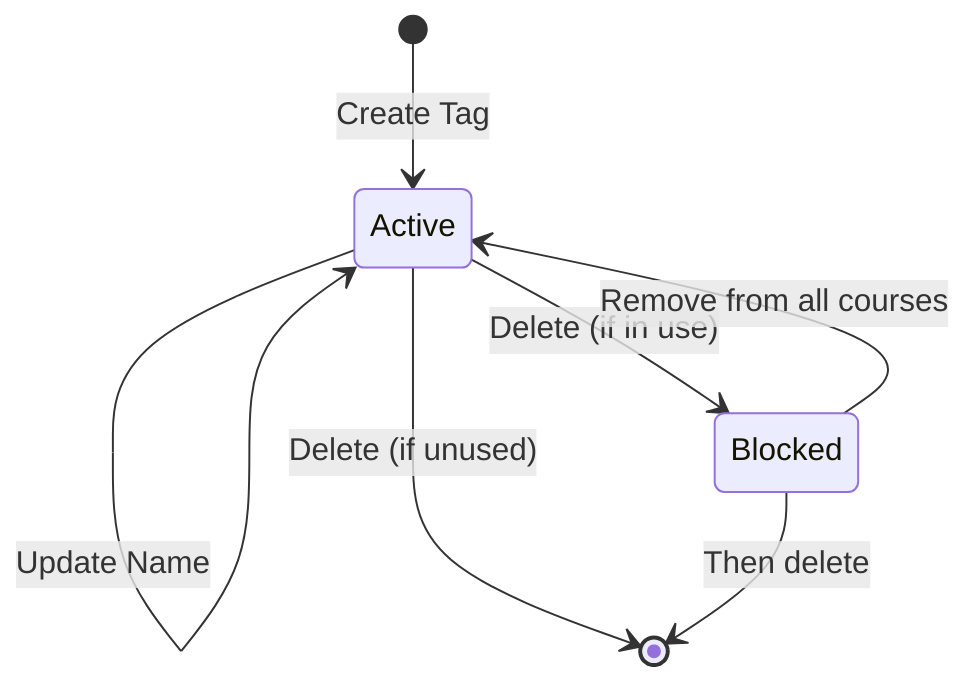
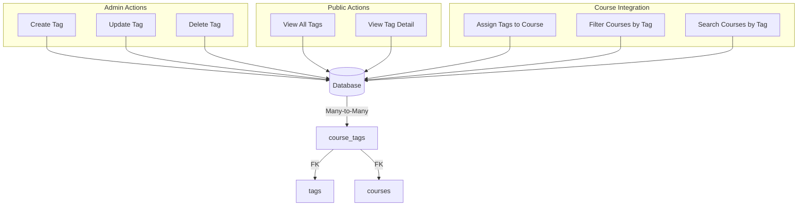

# TechHub - Sequence Diagram: Manage Tags

## Mục lục

1. [Tổng quan](#1-tổng-quan)
2. [Các thành phần chính](#2-các-thành-phần-chính)
3. [API Endpoints](#3-api-endpoints)
4. [Data Structures](#4-data-structures)
5. [Chi tiết luồng xử lý](#5-chi-tiết-luồng-xử-lý)
6. [Sequence Diagrams](#6-sequence-diagrams)
7. [Error Handling](#7-error-handling)
8. [Business Rules](#8-business-rules)

---

## 1. Tổng quan

Luồng **Manage Tags** cho phép Admin quản lý hệ thống tags dùng để phân loại và tìm kiếm khóa học. Các chức năng bao gồm:

- **Create Tag**: Tạo tag mới
- **Get Tag**: Lấy thông tin một tag
- **Get All Tags**: Lấy danh sách tất cả tags
- **Update Tag**: Cập nhật thông tin tag
- **Delete Tag**: Xóa tag

### Mối quan hệ với Course

```
Course ←──(M:N)──→ Tag
         ↓
      CourseTag (junction table)
```

- Mỗi Course có thể có nhiều Tags
- Mỗi Tag có thể được gán cho nhiều Courses
- Quan hệ Many-to-Many thông qua bảng `course_tags`

---

## 2. Các thành phần chính

| Component        | Service        | Vai trò                              |
| ---------------- | -------------- | ------------------------------------ |
| `TagController`  | course-service | Endpoint API cho tag operations      |
| `TagService`     | course-service | Interface định nghĩa business logic  |
| `TagServiceImpl` | course-service | Implementation của TagService        |
| `TagRepository`  | course-service | CRUD Tag entity                      |
| `Tag`            | course-service | Entity đại diện cho tag              |
| `CourseTag`      | course-service | Entity junction table (course ↔ tag) |
| `TagDTO`         | course-service | Data Transfer Object cho tag         |

---

## 3. API Endpoints

| Method | Endpoint                 | Mô tả           | Auth Required |
| ------ | ------------------------ | --------------- | ------------- |
| POST   | `/api/courses/tags`      | Tạo tag mới     | ADMIN         |
| GET    | `/api/courses/tags/{id}` | Lấy tag theo ID | Optional      |
| GET    | `/api/courses/tags`      | Lấy tất cả tags | Optional      |
| PUT    | `/api/courses/tags/{id}` | Cập nhật tag    | ADMIN         |
| DELETE | `/api/courses/tags/{id}` | Xóa tag         | ADMIN         |

---

## 4. Data Structures

### 4.1 Entities

#### Tag Entity

```java
@Entity
@Table(name = "tags")
public class Tag {
    @Id
    private UUID id;

    @Column(nullable = false, unique = true, length = 50)
    private String name;

    private OffsetDateTime created;
    private OffsetDateTime updated;
    private UUID createdBy;
    private UUID updatedBy;

    @Column(name = "is_active", nullable = false)
    private String isActive = "Y";
}
```

#### CourseTag Entity (Junction Table)

```java
@Entity
@Table(name = "course_tags")
public class CourseTag {
    @Id
    private UUID id;

    @ManyToOne(fetch = FetchType.LAZY)
    @JoinColumn(name = "course_id", nullable = false)
    private Course course;

    @ManyToOne(fetch = FetchType.LAZY)
    @JoinColumn(name = "tag_id", nullable = false)
    private Tag tag;

    private OffsetDateTime assignedAt;
}
```

### 4.2 DTO

#### TagDTO

```json
{
  "id": "uuid",
  "name": "Backend Development"
}
```

### 4.3 API Responses

#### Create/Update Tag Response

```json
{
  "status": "success",
  "message": "Tag created successfully",
  "data": {
    "id": "uuid",
    "name": "Backend Development"
  },
  "path": "/api/courses/tags"
}
```

#### Get All Tags Response

```json
{
  "status": "success",
  "message": "Tags retrieved successfully",
  "data": [
    { "id": "uuid1", "name": "Java" },
    { "id": "uuid2", "name": "Python" },
    { "id": "uuid3", "name": "DevOps" }
  ],
  "pagination": {
    "page": 0,
    "size": 3,
    "totalElements": 3,
    "totalPages": 1,
    "first": true,
    "last": true,
    "hasNext": false,
    "hasPrevious": false
  },
  "path": "/api/courses/tags"
}
```

#### Delete Tag Response

```json
{
  "status": "success",
  "message": "Tag deleted successfully",
  "data": "Tag with id {uuid} has been deleted",
  "path": "/api/courses/tags/{id}"
}
```

---

## 5. Chi tiết luồng xử lý

### 5.1 Create Tag Flow

#### Bước 1: Admin gửi request

- **Endpoint**: `POST /api/courses/tags`
- **Body**: `{ "name": "Backend Development" }`
- **Authentication**: Required (role ADMIN)

#### Bước 2: Tạo Tag Entity

1. Tạo Tag entity mới
2. Set name từ request
3. Set timestamps: created, updated = now()
4. isActive = "Y" (default)

#### Bước 3: Lưu vào Database

1. Save Tag entity
2. Return saved entity với ID

#### Bước 4: Return Response

- Map entity → TagDTO
- Return với status 201 Created

### 5.2 Get Tag Flow

#### Endpoint

- `GET /api/courses/tags/{id}`

#### Logic

1. Find tag by ID
2. Nếu tìm thấy → map to DTO → return 200
3. Nếu không tìm thấy → return 404

### 5.3 Get All Tags Flow

#### Endpoint

- `GET /api/courses/tags`

#### Logic

1. Query all tags từ database
2. Map to list of TagDTO
3. Build pagination info (fake pagination - all in one page)
4. Return PageGlobalResponse

### 5.4 Update Tag Flow

#### Bước 1: Admin request

- **Endpoint**: `PUT /api/courses/tags/{id}`
- **Body**: `{ "name": "New Tag Name" }`

#### Bước 2: Find and Update

1. Find tag by ID
2. Nếu không tìm thấy → return 404
3. Update name
4. Set updated = now()
5. Save to database

#### Bước 3: Return Response

- Return updated TagDTO

### 5.5 Delete Tag Flow

#### Endpoint

- `DELETE /api/courses/tags/{id}`

#### Logic

1. Delete tag by ID (hard delete)
2. Return success message
3. **Note**: Nếu có courses đang dùng tag → có thể fail do FK constraint

---

## 6. Sequence Diagram

### Tag Management - Complete CRUD Flow

```mermaid
sequenceDiagram
    autonumber
    participant Admin
    participant Client
    participant APIGateway
    participant TagController
    participant TagService as TagServiceImpl
    participant TagRepository
    participant Database

    %% ==================== CREATE TAG ====================
    rect rgb(220, 255, 220)
        Note over Admin,Database: 1. CREATE TAG - POST /api/courses/tags

        Admin->>+APIGateway: POST /api/courses/tags<br/>Authorization: Bearer {admin_token}<br/>{ "name": "Backend Development" }
        APIGateway->>APIGateway: Validate JWT Token<br/>Check role: ADMIN
        APIGateway->>+TagController: createTag(tagDTO)
        TagController->>+TagService: createTag(tagDTO)

        TagService->>TagService: Create new Tag entity<br/>- name: tagDTO.name<br/>- created: now()<br/>- updated: now()<br/>- isActive: "Y"

        TagService->>+TagRepository: save(tag)
        TagRepository->>Database: INSERT INTO tags<br/>(id, name, created, updated, is_active)<br/>VALUES (uuid, 'Backend Development', now, now, 'Y')
        Database-->>TagRepository: Tag with generated ID
        TagRepository-->>-TagService: Tag saved

        TagService->>TagService: toDTO(tag)
        TagService-->>-TagController: TagDTO
        TagController-->>-APIGateway: GlobalResponse<TagDTO><br/>status: 201 Created
        APIGateway-->>-Admin: 201 Created<br/>{ id, name: "Backend Development" }
    end

    %% ==================== GET TAG BY ID ====================
    rect rgb(240, 248, 255)
        Note over Client,Database: 2. GET TAG BY ID - GET /api/courses/tags/{id}

        Client->>+APIGateway: GET /api/courses/tags/{tagId}
        APIGateway->>+TagController: getTag(id)
        TagController->>+TagService: getTag(id)

        TagService->>+TagRepository: findById(id)
        TagRepository->>Database: SELECT * FROM tags WHERE id = ?
        Database-->>TagRepository: Tag or null
        TagRepository-->>-TagService: Optional<Tag>

        alt Tag found
            TagService->>TagService: toDTO(tag)
            TagService-->>TagController: TagDTO
            TagController-->>APIGateway: GlobalResponse<TagDTO>
            APIGateway-->>Client: 200 OK<br/>{ id, name }
        else Tag not found
            TagService-->>TagController: null
            TagController-->>APIGateway: 404 Not Found
            APIGateway-->>Client: 404 Not Found
        end

        deactivate TagService
        deactivate TagController
        deactivate APIGateway
    end

    %% ==================== GET ALL TAGS ====================
    rect rgb(255, 248, 240)
        Note over Client,Database: 3. GET ALL TAGS - GET /api/courses/tags

        Client->>+APIGateway: GET /api/courses/tags
        APIGateway->>+TagController: getAllTags()
        TagController->>+TagService: getAllTags()

        TagService->>+TagRepository: findAll()
        TagRepository->>Database: SELECT * FROM tags
        Database-->>TagRepository: List<Tag>
        TagRepository-->>-TagService: List<Tag>

        TagService->>TagService: Map all tags to DTOs<br/>stream().map(toDTO).collect()
        TagService-->>-TagController: List<TagDTO>

        TagController->>TagController: Build PaginationInfo<br/>- page: 0, size: list.size()<br/>- totalElements: list.size()<br/>- totalPages: 1

        TagController-->>-APIGateway: PageGlobalResponse<TagDTO>
        APIGateway-->>-Client: 200 OK<br/>{ data: [...], pagination: {...} }
    end

    %% ==================== UPDATE TAG ====================
    rect rgb(255, 240, 245)
        Note over Admin,Database: 4. UPDATE TAG - PUT /api/courses/tags/{id}

        Admin->>+APIGateway: PUT /api/courses/tags/{tagId}<br/>Authorization: Bearer {admin_token}<br/>{ "name": "Updated Tag Name" }
        APIGateway->>APIGateway: Validate JWT Token<br/>Check role: ADMIN
        APIGateway->>+TagController: updateTag(id, tagDTO)
        TagController->>+TagService: updateTag(id, tagDTO)

        TagService->>+TagRepository: findById(id)
        TagRepository->>Database: SELECT * FROM tags WHERE id = ?
        Database-->>TagRepository: Tag or null
        TagRepository-->>-TagService: Optional<Tag>

        alt Tag found
            TagService->>TagService: tag.setName(tagDTO.name)<br/>tag.setUpdated(now())

            TagService->>+TagRepository: save(tag)
            TagRepository->>Database: UPDATE tags<br/>SET name = ?, updated = ?<br/>WHERE id = ?
            Database-->>TagRepository: Updated Tag
            TagRepository-->>-TagService: Tag

            TagService->>TagService: toDTO(tag)
            TagService-->>TagController: TagDTO
            TagController-->>APIGateway: GlobalResponse<TagDTO>
            APIGateway-->>Admin: 200 OK<br/>{ id, name: "Updated Tag Name" }
        else Tag not found
            TagService-->>TagController: null
            TagController-->>APIGateway: 404 Not Found
            APIGateway-->>Admin: 404 Not Found
        end

        deactivate TagService
        deactivate TagController
        deactivate APIGateway
    end

    %% ==================== DELETE TAG ====================
    rect rgb(255, 230, 230)
        Note over Admin,Database: 5. DELETE TAG - DELETE /api/courses/tags/{id}

        Admin->>+APIGateway: DELETE /api/courses/tags/{tagId}<br/>Authorization: Bearer {admin_token}
        APIGateway->>APIGateway: Validate JWT Token<br/>Check role: ADMIN
        APIGateway->>+TagController: deleteTag(id)
        TagController->>+TagService: deleteTag(id)

        TagService->>+TagRepository: deleteById(id)

        alt Tag exists and no FK constraint
            TagRepository->>Database: DELETE FROM tags WHERE id = ?
            Database-->>TagRepository: Deleted
            TagRepository-->>-TagService: void

            TagService-->>-TagController: void
            TagController-->>-APIGateway: GlobalResponse<String><br/>"Tag deleted successfully"
            APIGateway-->>-Admin: 200 OK<br/>"Tag with id {uuid} has been deleted"

        else FK constraint violation (tag in use)
            TagRepository->>Database: DELETE FROM tags WHERE id = ?
            Database-->>TagRepository: ❌ FK constraint error
            TagRepository-->>TagService: throw DataIntegrityViolationException
            TagService-->>TagController: throw Exception
            TagController-->>APIGateway: 500 Error
            APIGateway-->>Admin: 500 Internal Server Error<br/>"Cannot delete tag: still in use by courses"
        end
    end
```



---

## 7. Error Handling

| Error Case              | HTTP Status | Message                                    |
| ----------------------- | ----------- | ------------------------------------------ |
| User not authenticated  | 401         | Unauthorized                               |
| User not ADMIN          | 403         | Forbidden - Insufficient role              |
| Tag not found (GET/PUT) | 404         | Not Found                                  |
| Duplicate tag name      | 409/500     | Tag name already exists                    |
| Tag in use (DELETE)     | 500         | Cannot delete: tag still in use by courses |
| Invalid request body    | 400         | Validation error details                   |
| Database error          | 500         | Internal server error                      |

---

## 8. Business Rules

### 8.1 Tag Naming

1. **Uniqueness**: Tag name phải unique trong hệ thống
2. **Length**: Maximum 50 characters
3. **Format**: Không có validation đặc biệt (có thể chứa spaces, special chars)

### 8.2 Tag Lifecycle



### 8.3 Relationship with Courses

1. **Many-to-Many**: Một course có thể có nhiều tags, một tag có thể thuộc nhiều courses
2. **Junction Table**: `course_tags` lưu quan hệ course ↔ tag
3. **Assignment**: Tags được gán cho course khi create/update course
4. **Cascade**: Xóa course → xóa course_tags records (không ảnh hưởng tag)

### 8.4 Delete Behavior

| Scenario                           | Behavior               |
| ---------------------------------- | ---------------------- |
| Tag không được dùng bởi course nào | Hard delete thành công |
| Tag đang được dùng bởi courses     | Fail do FK constraint  |

### 8.5 Soft Delete (Recommended Enhancement)

Hiện tại hệ thống sử dụng **hard delete**. Để an toàn hơn, có thể implement **soft delete**:

```java
// Instead of deleteById()
public void deleteTag(UUID id) {
    tagRepository.findById(id).ifPresent(tag -> {
        tag.setIsActive("N");
        tag.setUpdated(OffsetDateTime.now());
        tagRepository.save(tag);
    });
}

// Query only active tags
public List<TagDTO> getAllTags() {
    return tagRepository.findByIsActive("Y")
        .stream()
        .map(this::toDTO)
        .collect(Collectors.toList());
}
```

### 8.6 Security

| Operation  | Required Role     |
| ---------- | ----------------- |
| Create Tag | ADMIN             |
| Get Tag(s) | PUBLIC (optional) |
| Update Tag | ADMIN             |
| Delete Tag | ADMIN             |

---

## 9. Database Schema

### Tags Table

```sql
CREATE TABLE tags (
    id UUID PRIMARY KEY DEFAULT gen_random_uuid(),
    name VARCHAR(50) NOT NULL UNIQUE,
    created TIMESTAMP WITH TIME ZONE NOT NULL,
    updated TIMESTAMP WITH TIME ZONE NOT NULL,
    created_by UUID,
    updated_by UUID,
    is_active CHAR(1) NOT NULL DEFAULT 'Y'
);
```

### Course_Tags Table (Junction)

```sql
CREATE TABLE course_tags (
    id UUID PRIMARY KEY DEFAULT gen_random_uuid(),
    course_id UUID NOT NULL REFERENCES courses(id),
    tag_id UUID NOT NULL REFERENCES tags(id),
    assigned_at TIMESTAMP WITH TIME ZONE,
    UNIQUE(course_id, tag_id)
);
```

---

## Tóm tắt các thành phần

| Component        | Service        | Vai trò                       |
| ---------------- | -------------- | ----------------------------- |
| `TagController`  | course-service | REST API endpoints            |
| `TagService`     | course-service | Business logic interface      |
| `TagServiceImpl` | course-service | Business logic implementation |
| `TagRepository`  | course-service | Data access layer             |
| `Tag`            | course-service | Database entity               |
| `CourseTag`      | course-service | Junction table entity         |
| `TagDTO`         | course-service | Data transfer object          |

---

## Use Cases Diagram


