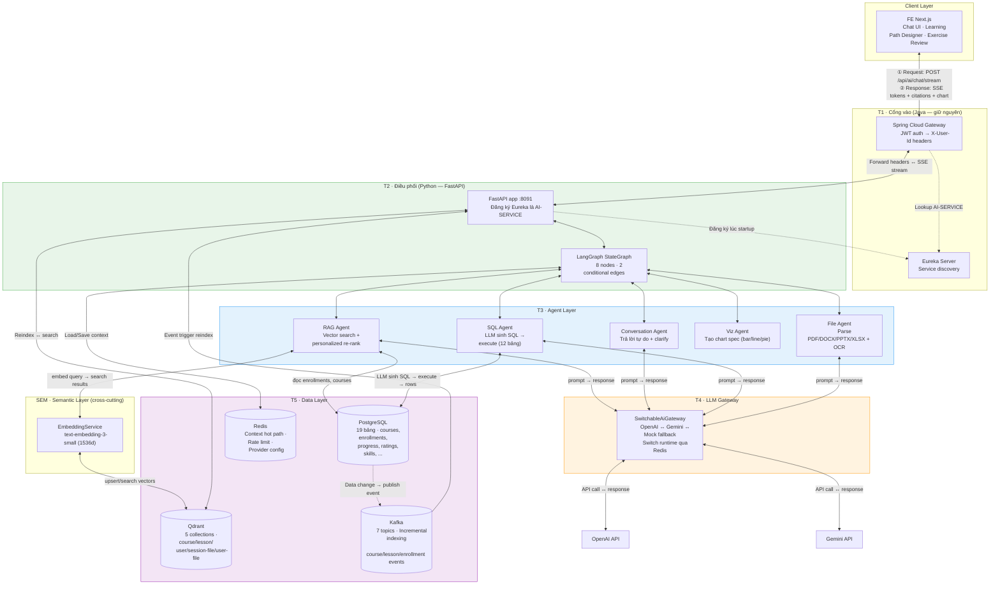
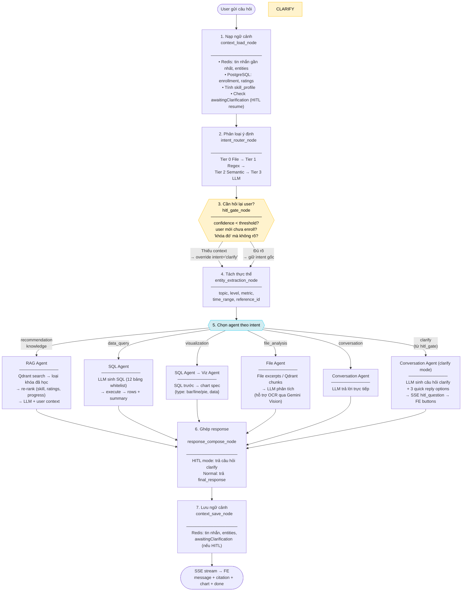
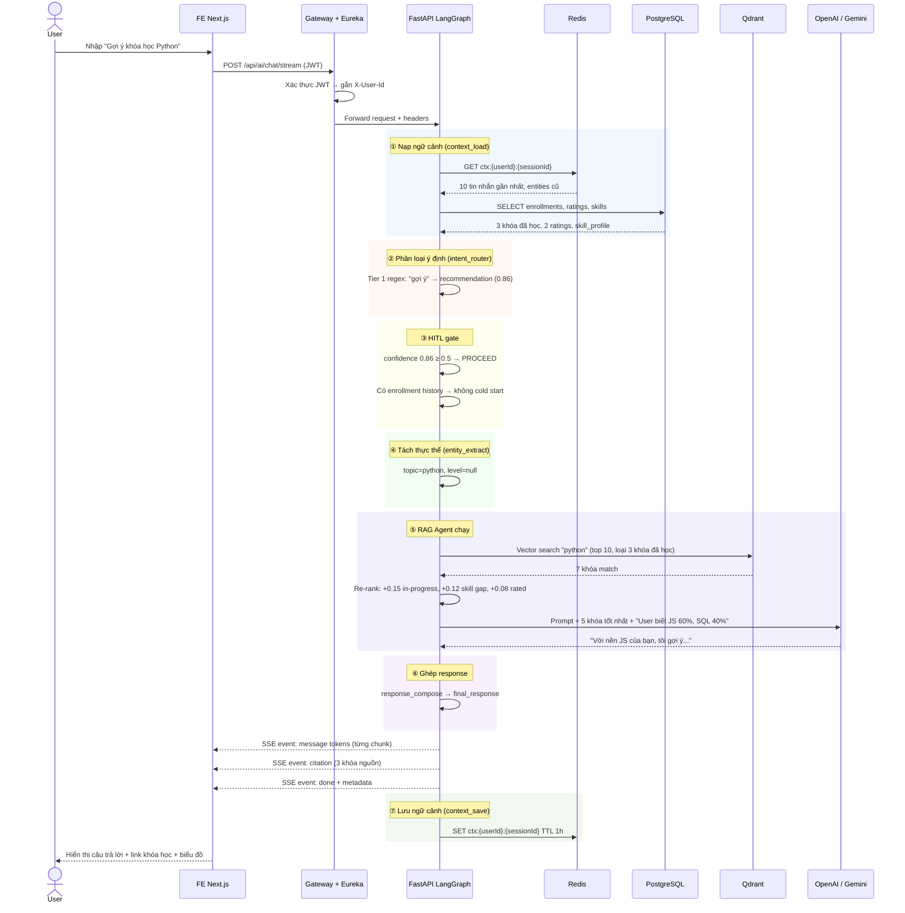
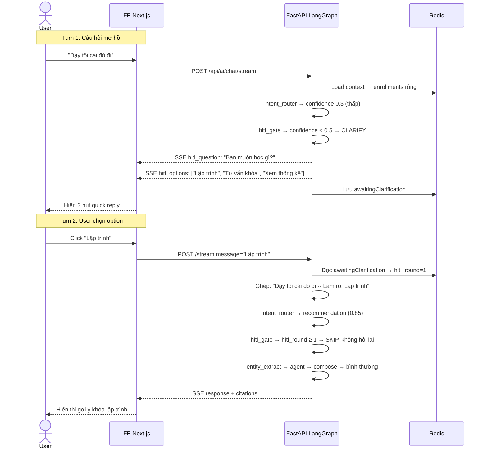
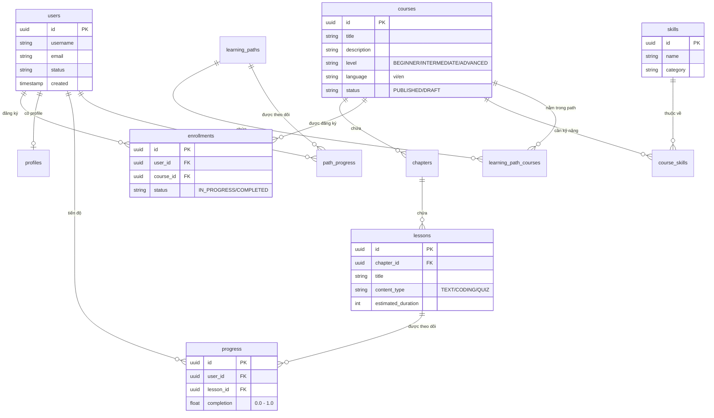
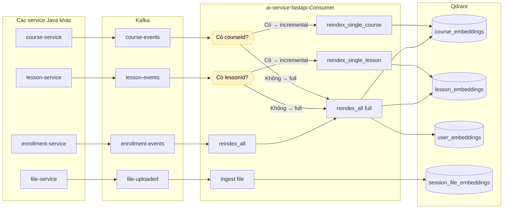
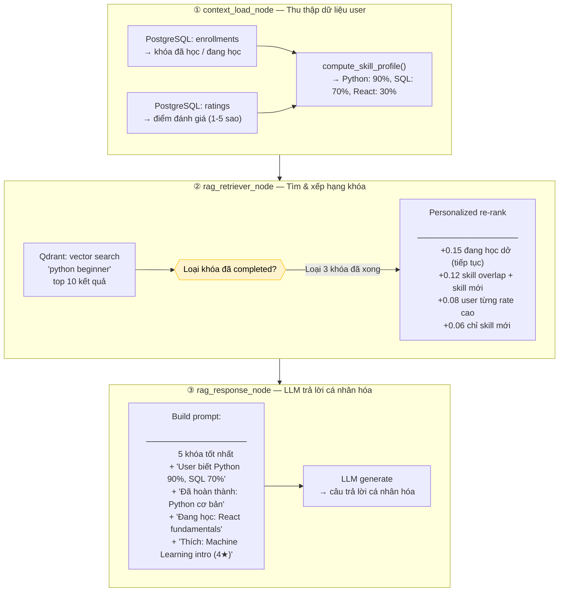
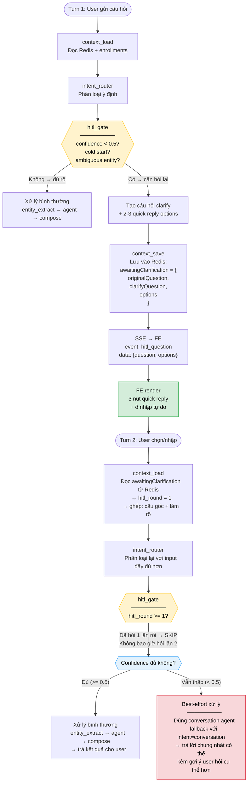
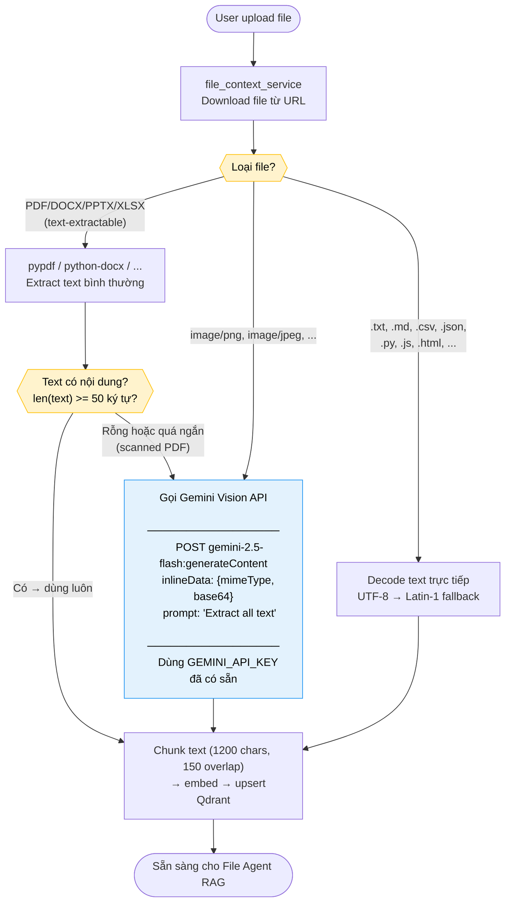

# TechHub AI Service — Implementation Status & Architecture Guide

> **Last updated:** 2026-04-16
> **Plan reference:** `TechHub_AI_Architecture_Theory_3.md`
> **Coverage:** ~95% — 13/14 DONE, 1 PARTIAL (file OCR code xong nhưng chưa test production)

---

## 1. Tổng quan trạng thái

| # | Capability | Status | Ghi chú |
|---|---|---|---|
| 1 | FastAPI service foundation | DONE | Eureka, Redis, Kafka hooks |
| 2 | LangGraph StateGraph orchestration | DONE | `langgraph` + `langchain-core`, conditional edges |
| 3 | Intent routing 4 tầng | DONE | File → Regex → Semantic → LLM fallback |
| 4 | HITL clarify flow | DONE | hitl_gate quyết định → override intent='clarify' → conversation_agent sinh question/options qua LLM. Config threshold đọc từ `AI_HITL_CONFIDENCE_THRESHOLD`. SSE + FE quick reply + Redis resume hoạt động |
| 6 | Recommendation / personalization | DONE | skill_profile, ratings, enrollment re-rank, prompt injection |
| 7 | Learning path generation | DONE | Real course data, structured prompt, draft/approve flow |
| 8 | Exercise generation | DONE | MCQ/Essay/Coding, structured prompt with examples |
| 9 | File analysis pipeline | **PARTIAL** | Text/PDF/DOCX/PPTX/XLSX parse hoạt động. OCR via Gemini Vision code có nhưng chưa test production (cần `AI_OCR_ENABLED=true`) |
| 10 | Kafka event-driven indexing | DONE | Incremental per entity ID, fallback full reindex |
| 11 | Runtime policy / governance | DONE | Provider config persist via Redis |
| 12 | Observability | DONE | Structured JSON logs + in-memory dashboard |
| 13 | Feature flag / rollback | DONE | V2 flag, legacy fallback, business safe mode |
| 14 | FE adoption | DONE | HITL buttons, Recharts charts, citation links, feedback |

---

## 2. Kiến trúc tổng thể

### 2.1 Sơ đồ tổng thể — Tất cả components và cách giao tiếp



### 2.2 Sơ đồ LangGraph flow hiện tại



**Cách đọc sơ đồ:**

- **Hình thoi vàng** = HITL gate: thiếu context → override intent='clarify', đủ rõ → giữ intent gốc
- **Hình thoi xanh** = Agent dispatch: chọn agent theo intent (bao gồm 'clarify' → conversation_agent)
- **Không có admin approval** — approval surface đã xóa hoàn toàn
- **HITL clarify chạy qua conversation_agent** (LLM sinh dynamic question), không hard-code templates
- **Graph tuyến tính 7 nodes** — không có conditional edge, hitl_gate chỉ override intent

### 2.3 Sequence diagram — 1 request chat recommendation đầy đủ



### 2.4 Sequence diagram — HITL clarify flow (user mới, câu mơ hồ)



---

## 3. Chi tiết từng tầng và thành phần

### 3.1 T2 — Orchestration nodes

| Node | File | Làm gì | Input chính | Output chính |
|---|---|---|---|---|
| `context_load` | `nodes/context_load_node.py` | Load Redis context + user profile + skill_profile + ratings + enrollment history | `user_id`, `session_id` | `conversation_context`, `skill_profile`, `user_course_history`, `user_ratings`, `hitl_round` |
| `intent_router` | `nodes/intent_node.py` | Classify intent qua 5 tier | `user_input`, `file_contexts`, `mode` | `intent`, `confidence`, `selected_model` |
| `hitl_gate` | `nodes/hitl_gate_node.py` | Quyết định hỏi lại user hay proceed | `intent_confidence`, `intent`, `user_id` | `hitl_clarify_active`, `hitl_question`, `hitl_options` |
| `entity_extract` | `nodes/entity_extraction_node.py` | Tách topic, level, metric, time_range | `user_input` | `entities` dict |
| `agent_dispatch` | Trong `chat_orchestrator_graph.py` | Route tới agent(s) theo intent | `intent` | Merged agent output |
| `response_compose` | `nodes/response_compose_node.py` | Chuẩn hóa response (hoặc trả clarify question) | `final_response`, `hitl_clarify_active` | `final_response` |
| `context_save` | `nodes/context_save_node.py` | Lưu context + HITL state vào Redis | Full state | Redis updated |

### 3.2 T3 — Agent Layer

| Agent | File | Intent(s) | Dùng data gì |
|---|---|---|---|
| RAG Retriever | `agents/rag_retriever_node.py` | recommendation, knowledge | Qdrant vector search, exclude completed, skill-based re-rank |
| RAG Response | `agents/rag_response_node.py` | recommendation, knowledge | LLM với user context (skills, history, ratings) |
| SQL Agent | `agents/sql_agent_node.py` | data_query, visualization | PostgreSQL qua analytics_service (12 bảng whitelist) |
| Viz Agent | `agents/viz_agent_node.py` | visualization | Chart spec từ SQL result |
| File Agent | `agents/file_agent_node.py` | file_analysis | File excerpts + Qdrant file chunks |
| Conversation | `agents/conversation_agent_node.py` | conversation, clarify | LLM direct |

### 3.3 Intent Router — 5 Tier

| Tier | Cơ chế | Confidence | Ví dụ |
|---|---|---|---|
| 0 | File context detect | 0.82–0.98 | Upload file → `file_analysis` |
| 1 | Regex pattern match | 0.86 | "gợi ý" → `recommendation` |
| 2 | Semantic embedding + cosine similarity | 0.58–0.89 | "khóa học phù hợp" → `recommendation` |
| 3 | LLM structured JSON | max 0.80 | Câu phức tạp → LLM phân loại |
| 4 | Mode bias / fallback | 0.45–0.58 | ADVISOR mode → `recommendation` |

### 3.4 T4 — LLM Gateway

**Class:** `SwitchableAiGateway` trong `services/llm_gateway.py`

| Provider | Chat Models | Embedding Model |
|---|---|---|
| OpenAI | `gpt-4o-mini`, `gpt-4.1-mini`, `gpt-4.1` | `text-embedding-3-small` (1536d) |
| Gemini | `gemini-2.5-flash`, `gemini-2.5-pro` | `gemini-embedding-001` |

**Fallback chain:** Primary provider → Alternate provider → Deterministic mock response

**Switch runtime:** `POST /api/ai/admin/provider-config` — persist qua Redis key `provider_config:active`

### 3.5 T5 — Data Layer

#### PostgreSQL — Bảng nào dùng để làm gì

| Bảng | Service truy cập | Mục đích |
|---|---|---|
| `courses` | catalog, analytics, vector, recommendation | Catalog chính |
| `chapters` | catalog, analytics | Nhóm lessons theo course |
| `lessons` | catalog, analytics, exercise | Nội dung bài học |
| `enrollments` | catalog, analytics, recommendation | User đăng ký khóa nào |
| `progress` | catalog, analytics | Tiến độ học |
| `ratings` | catalog, recommendation | Đánh giá khóa (score 1-5) |
| `skills` | catalog, analytics | Danh mục kỹ năng |
| `course_skills` | catalog, analytics, recommendation | Map khóa → kỹ năng |
| `tags` / `course_tags` | catalog | Tag phân loại khóa |
| `learning_paths` | catalog, analytics | Lộ trình học |
| `learning_path_courses` | catalog, analytics | Courses trong path |
| `path_progress` | catalog, analytics | Tiến độ path |
| `users` / `profiles` | catalog, analytics | User info + skill_profile |
| `course_prerequisites` | catalog | Khóa tiên quyết |
| `chat_sessions` | chat_service | Session hội thoại |
| `chat_messages` | chat_service | Lịch sử tin nhắn |
| `ai_generation_tasks` | exercise, learning_path, approval, draft | Tracking task AI |

#### SQL Agent — Analytics Service

**12 bảng whitelist** mà LLM được phép sinh SQL:



**Dùng diagram này để biết cần JOIN bảng nào:**

| Muốn biết | Query pattern | Bảng cần JOIN |
|---|---|---|
| Enrollment theo level | `COUNT(enrollments) GROUP BY courses.level` | enrollments → courses |
| Tiến độ theo khóa | `AVG(progress.completion) GROUP BY courses.title` | progress → lessons → chapters → courses |
| Khóa phổ biến nhất | `COUNT(enrollments) ORDER BY DESC` | enrollments → courses |
| Kỹ năng theo khóa | `skills.name, courses.title` | course_skills → skills, courses |
| Hoàn thành learning path | `AVG(path_progress.completion) GROUP BY learning_paths.title` | path_progress → learning_paths |
| Lesson mix (loại nội dung) | `COUNT(lessons) GROUP BY content_type` | lessons |
| User tiến bộ nhất | `AVG(progress.completion) GROUP BY users.username` | progress → users |

**Schema context mà LLM nhận được khi sinh SQL:**
```
courses(id, title, description, level, language, status, created, is_active)
chapters(id, course_id, "order")
lessons(id, chapter_id, title, content_type, estimated_duration, created, is_active)
enrollments(id, user_id, course_id, status, created, updated, is_active)
progress(id, user_id, lesson_id, completion, created, updated, is_active)
learning_paths(id, title, description, created, updated, is_active)
learning_path_courses(path_id, course_id, "order", position_x, position_y, is_optional)
path_progress(id, user_id, path_id, completion, updated, is_active)
profiles(id, user_id, preferred_language, full_name, bio, created, updated, is_active)
users(id, username, email, status, created, is_active)
course_skills(id, course_id, skill_id)
skills(id, name, category)
```

**Safety rules:**
- Chỉ `SELECT` / `WITH` (CTE) — block `UPDATE`, `DELETE`, `DROP`, `INSERT`, `ALTER`
- PII columns blocked khi `piiAccess=false`: `email`, `full_name`, `bio`, `username`, `location`
- Row limit: default 100, max 250
- Chỉ 12 bảng trên — bảng khác bị reject

#### Qdrant — 5 Collections

| Collection | Nội dung | Trigger cập nhật | Dùng bởi |
|---|---|---|---|
| `course_embeddings` | title + desc + objectives + skills | Kafka `course.updated` hoặc admin reindex | RAG Agent, Recommendation |
| `lesson_embeddings` | title + content + course context | Kafka `lesson.updated` hoặc admin reindex | Knowledge queries |
| `user_embeddings` | Summarized user profile + course history | Kafka enrollment/progress events | Profile matching |
| `session_file_embeddings` | File chunks per session (TTL 1h) | File upload in chat | File Agent |
| `user_file_embeddings` | File chunks per user (persistent) | File upload event | File Agent |

#### Redis — 3 loại data

| Key pattern | Nội dung | TTL |
|---|---|---|
| `ctx:{userId}:{sessionId}` | recentMessages, entities, lastIntent, activeFiles, awaitingClarification | 1h |
| `user-memory:{userId}` | User memory dict | 1h |
| `rate-limit:{userId}:{window}` | Sorted set timestamps | 60s / 3600s |
| `provider_config:active` | Provider + model config | Persistent |

#### Kafka — Event-driven indexing



**Topics hiện có (Java producers đang gửi):**

| Kafka Topic | Java Producer | Payload class | AI consumer handler |
|---|---|---|---|
| `course-events` | `CourseEventPublisher` | `CourseEventPayload` {eventType, courseId, title, level, ...} | `reindex_single_course(courseId)` incremental |
| `lesson-events` | `CourseEventPublisher` | `LessonEventPayload` {eventType, lessonId, courseId, ...} | `reindex_single_lesson(lessonId)` incremental |
| `enrollment-events` | `CourseEventPublisher` | `EnrollmentEventPayload` {eventType, userId, courseId, status, progress} | `reindex_all()` (cập nhật user profile) |
| `file-uploaded` | `FileEventPublisher` | `FileUploadedEvent` | `file_context_service.ingest_uploaded_event()` |

**Topics mới đã thêm producer:**

| Kafka Topic | Java Producer | Service | Trigger khi |
|---|---|---|---|
| `rating-events` | `CourseEventPublisher.publishRatingEvent()` | course-service `CourseRatingServiceImpl` | User rate khóa học |
| `learning-path-events` | `CourseEventPublisher.publishLearningPathEvent()` | learning-path-service `LearningPathServiceImpl` | Tạo/sửa learning path |

**Progress events:** đã wire `EnrollmentEventPayload(PROGRESS_UPDATED)` trong `CourseProgressServiceImpl.updateLessonProgress()` → gửi qua `enrollment-events` topic.

> Tất cả 6 topics giờ đều có producer thật từ Java + consumer handler trong FastAPI.

---

## 4. Personalization pipeline chi tiết



**Cách tính skill_profile:**

| Trạng thái khóa | Rating | Skill level |
|---|---|---|
| COMPLETED | >= 4 sao | **0.9** (thành thạo) |
| COMPLETED | < 4 hoặc chưa rate | **0.7** (nắm được) |
| IN_PROGRESS | — | **0.3 x progress%** |
| Chưa enroll | — | 0 (chưa biết) |

---

## 5. HITL Clarify Flow chi tiết

### Khi nào trigger

| Điều kiện | Ví dụ | Câu hỏi clarify |
|---|---|---|
| Confidence < 0.5 | "dạy tôi cái đó đi" | "Bạn có thể nói rõ hơn chủ đề?" + [Lập trình, Tư vấn khóa, Xem thống kê] |
| Cold start + recommendation | User mới, chưa enroll gì | "Cho tôi biết trình độ và mục tiêu?" + [Người mới, Có kinh nghiệm, Chuyển nghề] |
| Ambiguous entity | "khóa đó" mà Redis không có topic | "Bạn đang nói đến khóa nào?" + [Python, JavaScript, Data Science] |

### Sơ đồ HITL — bao gồm trường hợp turn 2 vẫn mơ hồ



### Giải thích từng trường hợp

| Trường hợp | Xảy ra khi | Hệ thống làm gì |
|---|---|---|
| **Happy path** | Turn 1 đủ rõ (confidence >= 0.5) | Bỏ qua HITL, xử lý bình thường |
| **Clarify → thành công** | Turn 1 mơ hồ, turn 2 user chọn option rõ ràng | Ghép câu gốc + clarification, xử lý bình thường |
| **Clarify → vẫn mơ hồ** | Turn 1 mơ hồ, turn 2 user vẫn nói không rõ | **Không hỏi lại lần 2.** Dùng conversation agent trả lời best-effort, gợi ý user hỏi cụ thể hơn |
| **Cold start → thành công** | User mới chọn "Người mới, muốn học lập trình" | Có đủ context → RAG agent gợi ý khóa beginner |
| **Cold start → vẫn chung chung** | User mới chọn nhưng vẫn chung chung | Best-effort: gợi ý top khóa phổ biến nhất |

**Hard rule:** Tối đa 1 vòng clarify. Không bao giờ hỏi lần 3. Turn 2 vẫn mơ hồ → proceed best-effort với conversation agent.

---

## 6. FE capabilities hiện tại

### Chat page (`ai-chat/page.tsx`)

| Feature | Status | Chi tiết |
|---|---|---|
| Streaming SSE | DONE | EventSourceParserStream, message/citation/artifact/done events |
| HITL quick reply | DONE | Render buttons từ `hitl_question` event, click gửi clarification |
| Chart rendering | DONE | Recharts BarChart/LineChart/PieChart từ `chartSpec` |
| Citation links | DONE | Clickable links sang `/courses/{courseId}` |
| Thumbs up/down | DONE | Visual feedback state, toast notification |
| Regenerate | DONE | Tìm user message trước, gửi lại qua streaming |
| File attach | DONE | Upload + hydrate + index + RAG |
| Metadata panel | DONE | Intent, model, tokens, trace, timings |

### Learning path designer

- Generate dialog: goal, timeframe, current/target level, language
- React Flow visual editor cho draft review
- Approve/Reject flow

### Exercise generation

- Chapter/Lesson selector, format auto-detect từ content_type
- Difficulty + format toggles (MCQ, Essay, Coding)
- Draft review với approve/reject

---

## 7. File Pipeline + OCR

### Các format hỗ trợ

| Loại | Formats | Cách xử lý |
|---|---|---|
| Text | `.txt`, `.md`, `.csv`, `.json`, `.xml`, `.yaml`, `.html`, `.py`, `.js`, `.ts`, `.sql` | Decode trực tiếp (UTF-8 → Latin-1 fallback) |
| Office | PDF, DOCX, PPTX, XLSX | pypdf / python-docx / python-pptx / openpyxl |
| Scanned PDF | PDF mà pypdf trả text < 50 ký tự | OCR qua Gemini Vision API |
| Image | PNG, JPEG, WebP, TIFF, BMP, GIF | OCR qua Gemini Vision API |

**Chưa hỗ trợ:** audio, video (ngoài scope)

### OCR — Gemini Vision API trực tiếp (không cần n8n)

> Gọi thẳng Gemini Vision API từ `file_context_service.py` dùng chung `GEMINI_API_KEY` đã có. Không cần service trung gian.

**Kiến trúc:**



**Triển khai cụ thể:**

#### Bước 1: Thêm OCR config vào `app/core/config.py`

```python
ocr_enabled: bool = field(default_factory=lambda: _bool_env("AI_OCR_ENABLED", False))
ocr_timeout_seconds: int = field(default_factory=lambda: _int_env("AI_OCR_TIMEOUT_SECONDS", 30))
```

#### Bước 2: Thêm OCR detection vào `file_context_service.py`

Trong method `_extract_content()`, sau khi pypdf extract text mà text rỗng hoặc quá ngắn:

```python
async def _extract_content(self, data: bytes, mime: str, name: str) -> str | None:
    # ... existing extraction logic cho PDF/DOCX/PPTX/XLSX ...
    
    # Nếu là PDF nhưng text rỗng (scanned)
    if mime == "application/pdf" and (not text or len(text.strip()) < 50):
        if self._settings.ocr_enabled and self._settings.gemini_api_key:
            text = await self._ocr_via_gemini(data, mime, name)
    
    # Nếu là image file
    if mime.startswith("image/") and self._settings.ocr_enabled and self._settings.gemini_api_key:
        text = await self._ocr_via_gemini(data, mime, name)
    
    return text
```

#### Bước 3: Thêm method gọi Gemini Vision trực tiếp

```python
async def _ocr_via_gemini(self, data: bytes, mime: str, name: str) -> str | None:
    """Gọi Gemini Vision API để extract text từ image/scanned PDF.
    Dùng chung GEMINI_API_KEY + GEMINI_BASE_URL đã có trong config."""
    try:
        import base64
        file_b64 = base64.b64encode(data).decode("utf-8")
        model = self._settings.gemini_chat_model  # gemini-2.5-flash
        url = (
            f"{self._settings.gemini_base_url}/models/{model}:generateContent"
            f"?key={self._settings.gemini_api_key}"
        )
        payload = {
            "contents": [{
                "parts": [
                    {"inlineData": {"mimeType": mime, "data": file_b64}},
                    {"text": (
                        "Extract ALL text content from this document/image. "
                        "Return plain text only, preserve paragraph structure. "
                        "If the document has tables, convert them to readable text format."
                    )},
                ]
            }]
        }
        async with httpx.AsyncClient(timeout=self._settings.ocr_timeout_seconds) as client:
            response = await client.post(url, json=payload)
            if response.status_code == 200:
                result = response.json()
                candidates = result.get("candidates", [])
                if candidates:
                    parts = candidates[0].get("content", {}).get("parts", [])
                    if parts:
                        return parts[0].get("text")
    except Exception as exc:
        logger.warning("OCR via Gemini Vision failed for %s: %s", name, exc)
    return None
```

#### Bước 4: MIME types hỗ trợ OCR

```python
OCR_SUPPORTED_MIMES = {
    "application/pdf",       # Scanned PDFs (khi pypdf extract text rỗng)
    "image/png",
    "image/jpeg",
    "image/jpg",
    "image/webp",
    "image/tiff",
    "image/bmp",
}
```

#### Bước 5: Env vars

```bash
AI_OCR_ENABLED=true          # Bật OCR
AI_OCR_TIMEOUT_SECONDS=30    # Timeout cho Gemini Vision call
GEMINI_API_KEY=...           # Đã có sẵn, dùng chung
# Không cần thêm URL hay service ngoài — dùng chung GEMINI_BASE_URL
```

#### Tại sao approach này tốt hơn n8n?

| | Gọi trực tiếp từ BE | Qua n8n |
|---|---|---|
| Thêm dependency | Không | Cần n8n server chạy |
| API key | Dùng chung `GEMINI_API_KEY` | Phải cấu hình lại key trong n8n |
| Latency | 1 hop (BE → Gemini) | 2 hops (BE → n8n → Gemini → n8n → BE) |
| Deploy | Không thay đổi infra | Cần deploy + maintain n8n |
| Error handling | Trong cùng codebase | Phải debug 2 nơi |

---

## 8. Langfuse Observability — Hướng dẫn setup

> AI service đã có structured JSON logging qua `ai.metrics` logger. Langfuse sẽ thu thập traces, token usage, latency cho mỗi LLM call.

### Bước 1: Thêm dependency

```
# Thêm vào requirements.txt
langfuse>=2.0.0
```

### Bước 2: Thêm env vars

```bash
# Thêm vào .env
LANGFUSE_PUBLIC_KEY=pk-lf-...          # Lấy từ Langfuse dashboard → Settings → API Keys
LANGFUSE_SECRET_KEY=sk-lf-...          # Lấy từ Langfuse dashboard → Settings → API Keys
LANGFUSE_BASE_URL=https://langfuse.your-domain.com   # URL Langfuse self-hosted
LANGFUSE_ENABLED=true
```

### Bước 3: Thêm config vào `app/core/config.py`

```python
langfuse_enabled: bool = field(default_factory=lambda: _bool_env("LANGFUSE_ENABLED", False))
langfuse_public_key: str = field(default_factory=lambda: os.getenv("LANGFUSE_PUBLIC_KEY", ""))
langfuse_secret_key: str = field(default_factory=lambda: os.getenv("LANGFUSE_SECRET_KEY", ""))
langfuse_host: str = field(default_factory=lambda: os.getenv("LANGFUSE_BASE_URL", "https://cloud.langfuse.com"))
```

### Bước 4: Khởi tạo Langfuse client trong `app/main.py`

```python
# Thêm sau load_dotenv() trong lifespan()
if settings.langfuse_enabled and settings.langfuse_public_key:
    from langfuse import Langfuse
    langfuse_client = Langfuse(
        public_key=settings.langfuse_public_key,
        secret_key=settings.langfuse_secret_key,
        host=settings.langfuse_host,
    )
    # Gắn vào app state để các service dùng
    app.state.langfuse = langfuse_client
    logger.info("Langfuse observability connected to %s", settings.langfuse_host)
```

### Bước 5: Wrap LLM calls trong `app/services/llm_gateway.py`

```python
# Trong generate_text(), bọc Gemini/OpenAI call bằng Langfuse trace:

async def generate_text(self, prompt, system_prompt=None, model=None):
    trace = None
    if hasattr(app, 'state') and hasattr(app.state, 'langfuse'):
        trace = app.state.langfuse.trace(
            name="chat_generation",
            metadata={"model": model, "provider": provider},
        )
        generation = trace.generation(
            name="llm_call",
            model=model,
            input=prompt,
            metadata={"system_prompt": system_prompt},
        )

    response = await self._call_provider(prompt, system_prompt, model)

    if generation:
        generation.end(output=response, usage={"input": prompt_tokens, "output": completion_tokens})
    if trace:
        trace.update(output=response[:200])

    return response
```

### Bước 6: Trace từng graph node (optional, advanced)

```python
# Trong chat_orchestrator_graph.py, wrap mỗi node:
async def _wrapper(state):
    span = langfuse.span(name=node_name, input=state.get("user_input"))
    updates = await fn(state)
    span.end(output=updates.get("final_response", "")[:200])
    return updates
```

### Kết quả trên Langfuse dashboard

Sau khi setup, mỗi chat request sẽ hiện trên Langfuse với:
- **Trace**: toàn bộ luồng từ context_load → intent → hitl_gate → agent → compose → save
- **Generation**: mỗi LLM call (Gemini/OpenAI) với prompt, response, token count
- **Latency**: thời gian mỗi node
- **Cost**: token usage × giá model
- **Feedback**: nếu wire thumbs up/down vào Langfuse score

---

## 9. API Endpoints tổng hợp

```
/api/ai/
├── GET  /health
├── GET  /actuator/health
│
├── /chat
│   ├── POST /messages           ← Blocking chat
│   ├── POST /stream             ← SSE streaming chat
│   ├── GET  /stream/simple      ← EventSource fallback
│   ├── POST /sessions           ← Tạo session
│   ├── GET  /sessions           ← List sessions by userId
│   ├── GET  /sessions/{id}/messages  ← Lịch sử tin nhắn
│   └── DELETE /sessions/{id}    ← Xóa session
│
├── /admin
│   ├── POST /reindex-courses    ← Manual reindex courses → Qdrant
│   ├── POST /reindex-lessons    ← Manual reindex lessons → Qdrant
│   ├── POST /reindex-all        ← Full reindex (courses + lessons + profiles)
│   ├── GET  /qdrant-stats       ← Vector DB collection stats
│   ├── GET  /runtime-stats      ← Observability snapshot
│   ├── GET  /provider-config    ← Current LLM provider info
│   └── POST /provider-config    ← Switch provider/model at runtime
│
├── /exercises
│   └── POST /generate           ← Sinh bài tập từ lesson
│
├── /learning-paths
│   └── POST /generate           ← Sinh learning path
│
├── /recommendations
│   ├── POST /realtime           ← Real-time recommendation
│   ├── POST /scheduled          ← Batch recommendation
│   └── GET  /history            ← Lịch sử recommendations
│
└── /drafts
    ├── GET  /exercises           ← Drafts theo lessonId
    ├── POST /exercises/batch     ← Batch draft query
    ├── GET  /exercises/latest    ← Draft mới nhất
    ├── GET  /learning-paths      ← Learning path drafts
    ├── GET  /{taskId}            ← Chi tiết draft
    ├── POST /{taskId}/approve-exercise
    ├── POST /{taskId}/approve-learning-path
    └── POST /{taskId}/reject
```

---

## 9. Environment Variables

| Variable | Default | Mô tả |
|---|---|---|
| `AI_SERVICE_PORT` | 8091 | Port service |
| `SPRING_DATASOURCE_URL` | jdbc:postgresql://localhost:5432/techhub_db | PostgreSQL |
| `REDIS_HOST` / `REDIS_PORT` | localhost / 6379 | Redis |
| `QDRANT_HOST` | http://localhost:6333 | Qdrant |
| `OPENAI_API_KEY` | (none) | OpenAI key |
| `GEMINI_API_KEY` | (none) | Gemini key |
| `AI_PROVIDER` | gemini | Provider mặc định |
| `AI_ORCHESTRATION_V2_ENABLED` | true | Bật LangGraph |
| `AI_LEGACY_FALLBACK_ENABLED` | true | Fallback khi graph lỗi |
| `AI_HITL_ENABLED` | true | Bật HITL gates |
| `AI_HITL_CONFIDENCE_THRESHOLD` | 0.55 | HITL clarify trigger: hỏi lại user khi confidence dưới ngưỡng này |
| `AI_KAFKA_ENABLED` | false | Bật Kafka consumer |
| `AI_OCR_ENABLED` | false | Bật OCR qua Gemini Vision (gọi trực tiếp, không qua n8n) |

---

## 10. Changelog — Những gì đã làm

### Đợt 1: LangGraph + HITL + Kafka + Provider Persistence

| Change | Files |
|---|---|
| Thêm `langgraph`, `langchain-core` | requirements.txt |
| OrchestratorState → TypedDict | orchestrator_state.py |
| LangGraph StateGraph với conditional edges | chat_orchestrator_graph.py |
| HITL gate node (3 triggers, max 1 round) | hitl_gate_node.py (new) |
| Context load/save hỗ trợ HITL resume | context_load_node.py, context_save_node.py |
| Redis ConversationContext + awaitingClarification | redis_memory_service.py |
| SSE hitl_question event | chat_service.py |
| Kafka incremental indexing | indexing_event_consumer.py, vector_service.py |
| Provider config persist via Redis | provider_config.py, main.py |
| FE: HITL quick reply buttons | ai-chat/page.tsx |
| FE: Handle hitl_question SSE | ai.schema.ts |
| Tất cả nodes/services → dict access (TypedDict compat) | 15+ files |

### Đợt 2: Personalization + Prompts + FE Upgrades

| Change | Files |
|---|---|
| fetch_user_ratings, compute_skill_profile, fetch_course_prerequisites | catalog_service.py |
| skill_profile, user_course_history, user_ratings vào state | orchestrator_state.py, context_load_node.py |
| RAG retriever: exclude completed, skill-based re-rank | rag_retriever_node.py |
| RAG response: inject user context vào prompt | rag_response_node.py |
| Exercise prompt: ROLE/RULES/CONTEXT/OUTPUT FORMAT + examples | exercise_service.py |
| Learning path prompt: structured + skill_profile context | learning_path_service.py |
| Structured JSON logging (ai.metrics logger) | observability_service.py |
| FE: Recharts chart rendering (Bar/Line/Pie) | ai-chat/page.tsx |
| FE: Clickable citation links → /courses/{id} | ai-chat/page.tsx |
| FE: Thumbs up/down feedback + visual state | ai-chat/page.tsx |
| FE: Regenerate button functional | ai-chat/page.tsx |

### Đợt 3: OCR via Gemini Vision

| Change | Files |
|---|---|
| Thêm `AI_OCR_ENABLED`, `AI_OCR_TIMEOUT_SECONDS` config | config.py |
| `_ocr_via_gemini()` — gọi Gemini Vision API trực tiếp, dùng chung GEMINI_API_KEY | file_context_service.py |
| `_extract_bytes_async()` — async version hỗ trợ OCR fallback cho scanned PDF | file_context_service.py |
| `_can_extract_content()` — thêm image MIME types khi OCR enabled | file_context_service.py |
| `_download_and_extract_content()` — chuyển sang dùng async extract | file_context_service.py |

### Đợt 4: Kafka fix + .env

| Change | Files |
|---|---|
| **BUG FIX:** Sửa topic names từ `course.updated` sang `course-events` khớp Java producers | config.py |
| Rewrite consumer theo topic-based routing, parse đúng Java payload format | indexing_event_consumer.py |
| Tạo `.env` đầy đủ từ .env gốc Java services | .env (new) |
| **BUG FIX:** Thêm `load_dotenv()` vào main.py — .env không được load trước đó | main.py |
| Java: Thêm `RatingEventPayload`, `LearningPathEventPayload` payload classes | common-service |
| Java: Thêm `rating-events`, `learning-path-events` topics vào `KafkaTopics.java` | common-service |
| Java: Thêm `publishRatingEvent()`, `publishLearningPathEvent()` vào `CourseEventPublisher` | common-service |
| Java: Wire rating event publish trong `CourseRatingServiceImpl.submitCourseRating()` | course-service |
| Java: Wire progress event publish trong `CourseProgressServiceImpl.updateLessonProgress()` | course-service |
| Java: Wire learning path events trong `LearningPathServiceImpl.create/update()` | learning-path-service |
| FastAPI: Thêm `rating-events`, `learning-path-events` handlers trong consumer | indexing_event_consumer.py |
