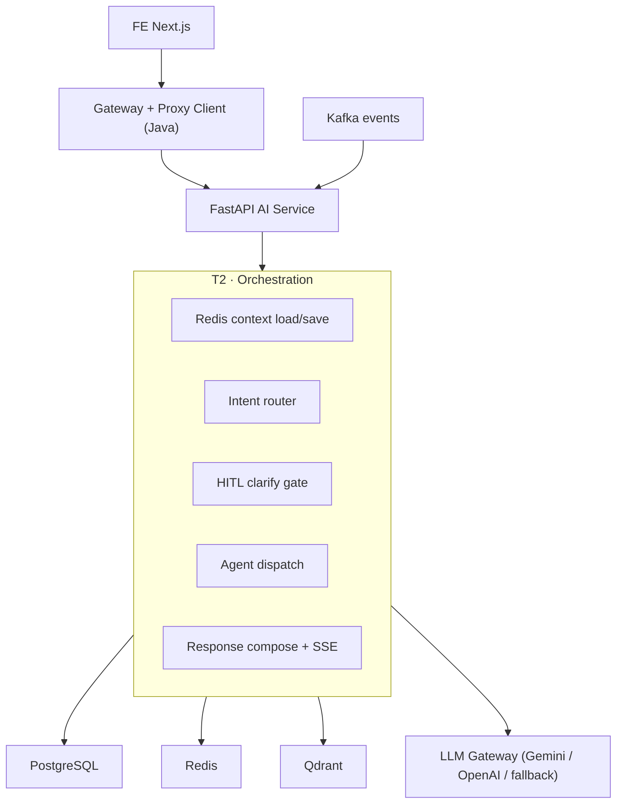
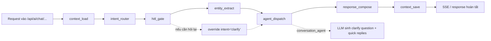

# TechHub AI Service — Implementation Status

> **Last audited:** 2026-04-20  
> **Plan reference:** `E:\University\HK1_FourYear\POSE\upgradeAIService\TechHub_AI_Architecture_Theory_3.md`  
> **Audit rule:** code hiện có là nguồn sự thật. Chỉ đánh dấu `DONE` khi tính năng đã có trong source và đã được wire vào flow chính.

## 1. Kết luận nhanh

- **Mức bám plan gốc ở cấp source:** cao, khoảng `~95%`.
- **Mức hoàn tất theo workstream:** phần lớn đã `DONE`; hiện còn `1` hạng mục `PARTIAL` là **OCR production verification**.
- **Build health hiện tại:**
  - `python -m compileall TechHub_BE/ai-service-fastapi/app` → `PASS`
  - `node TechHub_FE/node_modules/typescript/bin/tsc -p TechHub_FE/tsconfig.json --noEmit` → `PASS`

### Những gì đã khớp với plan gốc

- FastAPI đã thay vai trò `AI-SERVICE`, giữ contract REST/SSE để Java gateway/proxy và FE tiếp tục dùng.
- Orchestrator đã dùng `LangGraph StateGraph`, có Redis hot path, intent routing, HITL clarify, agent dispatch và context save.
- Semantic layer đã dùng PostgreSQL + Qdrant + Redis + Kafka incremental indexing.
- Chat, recommendation, learning path, exercise và draft flow đã được kéo sang source mới.
- FE đã tận dụng được chat SSE, citations, chart, file attach, learning path/exercise AI flow và admin observability.

### Những gì chưa thể coi là hoàn tất 100%

- OCR có code thật và đã wire vào file pipeline, nhưng **chưa có bằng chứng test production** trong môi trường thật với file scan/image + Gemini key hoạt động ổn định.

### Ghi chú quan trọng

- `HITL` trong hệ thống hiện tại là **clarify với end-user**, đúng với plan gốc.
- **Admin approval cho chat đã bị loại bỏ** để bám kiến trúc clarify-style HITL của plan.
- Approval hiện chỉ còn cho **draft exercise / learning path publishing flow**, không còn là gate cho câu trả lời chat.

---

## 2. Concept Tổng Quan

### 2.1 Kiến trúc hiện tại



### 2.2 Luồng runtime chat hiện tại



### 2.3 Cách đọc status trong file này

- `DONE`: đã có trong source, đã nối vào flow chính, và không còn là scaffold rời.
- `PARTIAL`: đã có code và wiring chính, nhưng còn thiếu xác nhận production hoặc còn phụ thuộc môi trường chưa kiểm chứng.
- `NOT DONE`: chưa có hoặc chưa thực sự nối vào flow chính.

---

## 3. Capability Matrix Theo Plan Gốc

| Workstream | Status | Ghi chú ngắn |
|---|---|---|
| Gateway + Eureka compatibility | DONE | Giữ service name, FastAPI đăng ký Eureka |
| FastAPI service foundation | DONE | Lifespan, router, schema/bootstrap, health |
| LangGraph orchestration | DONE | StateGraph + node flow chính |
| Intent routing + runtime policy | DONE | Regex + semantic + LLM fallback + policy gate |
| HITL clarify | DONE | Override intent `clarify` + LLM generate question + resume |
| Agent layer | DONE | Conversation / RAG / SQL / File / Viz |
| LLM gateway + provider switching | DONE | Gemini/OpenAI/fallback + config persist |
| Data layer (Redis / Qdrant / PostgreSQL) | DONE | Đã wire và dùng trong flow chính |
| Kafka incremental indexing | DONE | Consumer + per-entity reindex + fallback full reindex |
| Recommendation & personalization | DONE | Skill profile, history, ratings, rerank |
| Learning path generation | DONE | Structured generation + draft flow |
| Exercise generation | DONE | Structured generation + draft flow |
| FE adoption | DONE | Chat page, recommendation, learning path, exercise, admin |
| File pipeline + OCR | PARTIAL | Parse/index đã có; OCR chưa có bằng chứng production run |
| Observability + rollout flags | DONE | Langfuse, runtime stats, provider admin, fallback flags |

---

## 4. Breakdown Chi Tiết Theo Công Việc

## 4.1 Foundation & Compatibility

| ID | Công việc | Target theo plan | Status | Đã làm |
|---|---|---|---|---|
| A1 | Giữ contract `AI-SERVICE` cũ | Java gateway/proxy không cần đổi kiến trúc | DONE | FastAPI giữ các prefix `/api/ai/...`, router admin/chat/drafts/exercises/learning-paths/recommendations vẫn tồn tại |
| A2 | Đăng ký Eureka | FastAPI xuất hiện như microservice thật trong hệ thống | DONE | `main.py` khởi tạo `py_eureka_client` khi `AI_EUREKA_ENABLED=true` |
| A3 | App bootstrap + lifespan | Có init Redis, Langfuse, Kafka consumer khi startup | DONE | `main.py` đã init Redis client, provider config persistence, Langfuse, Kafka consumer |
| A4 | Feature flags / rollback cơ bản | Có thể tắt orchestration mới hoặc bật fallback an toàn | DONE | `AI_ORCHESTRATION_V2_ENABLED`, `AI_LEGACY_FALLBACK_ENABLED`, `AI_BUSINESS_SAFE_MODE_ENABLED` đã có trong config và chat flow |

### Giải thích

- Phần foundation hiện không còn ở mức demo. Nó đã đủ để thay vai trò Java `ai-service` trong compose/deploy của repo.
- Phần rollback hiện là **feature flag + fallback trong source**, không phải multi-service blue/green deployment automation.

## 4.2 Orchestration

| ID | Công việc | Target theo plan | Status | Đã làm |
|---|---|---|---|---|
| B1 | StateGraph orchestration | Dùng LangGraph thay cho flow imperative rời rạc | DONE | `chat_orchestrator_graph.py` dùng `StateGraph` và compile graph |
| B2 | Context load | Đọc Redis context + active files + user memory | DONE | `context_load_node.py` lấy `recentMessages`, `awaitingClarification`, `fileContexts`, personalization inputs |
| B3 | Intent router | Có nhiều tầng thay vì 1 if/else đơn giản | DONE | `intent_router.py` có regex, semantic, LLM fallback, mode bias |
| B4 | Runtime policy gate | Có thể downgrade/bẻ nhánh intent theo policy context | DONE | `runtime_policy_service.py` resolve policy và `intent_node.py` enforce access |
| B5 | HITL clarify gate | Phát hiện mơ hồ/cold start/ambiguous ref | DONE | `hitl_gate_node.py` đọc config threshold, kiểm tra cold start, ambiguous refs, override `intent='clarify'` |
| B6 | Agent dispatch | Điều hướng đến agent phù hợp | DONE | `registry.py` + `agent_dispatch` trong graph |
| B7 | Response compose | Chuẩn hóa output cuối và emit SSE-friendly payload | DONE | `response_compose_node.py` + `chat_service.py` |
| B8 | Context save | Lưu turn + clarify state vào Redis | DONE | `context_save_node.py` save `awaitingClarification`, `recentMessages`, `activeFiles` |

### Giải thích

- Điểm quan trọng nhất so với các lượt implement cũ là nhánh `clarify` hiện **đi đúng abstraction hơn**: gate chỉ quyết định cần clarify, còn `conversation_agent` sinh câu hỏi động qua LLM.
- `HITL` hiện bám đúng plan gốc hơn nhiều so với cách hard-code question/options trong gate trước đây.

## 4.3 Agent Layer

| ID | Công việc | Target theo plan | Status | Đã làm |
|---|---|---|---|---|
| C1 | Conversation Agent | Trả lời thường + clarify mode | DONE | `conversation_agent_node.py` hỗ trợ `conversation` và `clarify` |
| C2 | RAG Retriever/Response | Recommendation + knowledge theo vector retrieval | DONE | Có `rag_retriever_node.py` và `rag_response_node.py` |
| C3 | SQL Agent | Phân tích data query an toàn | DONE | `sql_agent_node.py` dùng analytics/planner và policy |
| C4 | Viz Agent | Sinh `chartSpec`/artifact cho FE | DONE | `viz_agent_node.py` trả chart payload cho chat UI |
| C5 | File Agent | File analysis trên context đã hydrate/index | DONE | `file_agent_node.py` kết nối file context retrieval |

### Giải thích

- Agent layer hiện đã không còn là placeholder thuần. Mỗi intent chính trong plan đã có node hoặc service tương ứng.
- `Conversation Agent` đóng đúng vai trò clarify agent thay vì gate tự nhúng business copy.

## 4.4 LLM Gateway, Provider Config, Runtime Policy

| ID | Công việc | Target theo plan | Status | Đã làm |
|---|---|---|---|---|
| D1 | Switchable provider | Gemini/OpenAI có thể đổi ở runtime | DONE | `provider_config.py` + `llm_gateway.py` resolve provider/model động |
| D2 | Persist provider config | Đổi model/provider không mất sau restart | DONE | Provider config persist qua Redis key riêng |
| D3 | Fallback khi thiếu API key | Một provider die thì service vẫn sống | DONE | Gateway có provider resolve + mock fallback |
| D4 | Structured generation | Recommendation / learning path / exercise / clarify dùng JSON structured output | DONE | `generate_structured_json()` được dùng ở nhiều service/node |
| D5 | Runtime policy | Context/tenant policy ảnh hưởng routing và model override | DONE | `runtime_policy_service.py` + `model_selector_service.py` |

### Giải thích

- Đây là một trong các phần đã trưởng thành rõ nhất so với các lượt đầu: provider config, runtime switching, model selection và fallback hiện đã nối mạch với nhau.

## 4.5 Data & Semantic Layer

| ID | Công việc | Target theo plan | Status | Đã làm |
|---|---|---|---|---|
| E1 | PostgreSQL catalog access | Dùng dữ liệu thật thay vì mock | DONE | `catalog_service.py`, `analytics_service.py`, service domain layer đều đọc schema thật |
| E2 | Redis hot path | Context hội thoại và rate limit không phụ thuộc in-memory local only | DONE | `redis_memory_service.py`, `rate_limit.py` |
| E3 | Qdrant collections | Course / lesson / profile / file collections có thật | DONE | `vector_service.py` quản lý nhiều collection |
| E4 | Embedding generation | Dùng embedding provider qua gateway | DONE | `llm_gateway.py` resolve embedding target và sinh embeddings |
| E5 | Vector search + rerank | Semantic retrieval + personalization rerank | DONE | `vector_service.py` + `recommendation_service.py` |

### Giải thích

- Phần SEM layer theo plan gốc hiện đã có shape khá sát: embeddings, Qdrant, search, rerank, file chunks, profile embeddings.

## 4.6 Kafka Incremental Indexing

| ID | Công việc | Target theo plan | Status | Đã làm |
|---|---|---|---|---|
| F1 | AI consumer đọc Kafka | FastAPI đọc event thay vì chỉ manual reindex | DONE | `indexing_event_consumer.py` dùng `aiokafka` |
| F2 | Incremental course/lesson reindex | Update theo entity ID thay vì full reindex luôn | DONE | `reindex_single_course`, `reindex_single_lesson` |
| F3 | Enrollment/rating/path/file events | Tự động refresh vector liên quan | DONE | Handler cho `enrollment-events`, `rating-events`, `learning-path-events`, `file-uploaded` |
| F4 | Topic naming khớp Java side | Producer/consumer khớp topic name thật trong repo | DONE | Proxy/common-service/course-service và FastAPI consumer đã cùng dùng topic hiện tại |

### Giải thích

- Incremental reindex bug về point id từng tồn tại ở lượt trước đã được sửa. Hiện code align lại point ID với full reindex.

## 4.7 Product Flows

| ID | Công việc | Target theo plan | Status | Đã làm |
|---|---|---|---|---|
| G1 | Chat sync + stream | `/messages` và `/stream` hoạt động với SSE | DONE | `chat_service.py` + FE chat stream parser |
| G2 | Recommendation | Personalized recommendation + history | DONE | `recommendation_service.py`, `recommendations.py`, FE recommendations page |
| G3 | Learning path generation | Sinh path từ dữ liệu người dùng thật + draft flow | DONE | `learning_path_service.py`, routes, FE generate/designer flow |
| G4 | Exercise generation | Sinh exercise có context thật + draft flow | DONE | `exercise_service.py`, routes, FE draft/review flow |
| G5 | Draft approval cho content | Approval ở mức learning path / exercise publishing | DONE | `drafts.py` + FE draft review pages |

### Giải thích

- Lưu ý: approval hiện còn là **content publishing approval**, không phải **chat response approval**. Điều này hiện đã nhất quán hơn với plan gốc.

## 4.8 FE Adoption & Admin

| ID | Công việc | Target theo plan | Status | Đã làm |
|---|---|---|---|---|
| H1 | Chat page tận dụng SSE mới | Message/citation/artifact/chart/hitl_question | DONE | `ai-chat/page.tsx`, `apiRequests/ai.ts` |
| H2 | Recommendation page dùng BE mới | Realtime/scheduled/history | DONE | `(learning)/recommendations/page.tsx` |
| H3 | Learning path FE flow | Generate AI path + draft designer | DONE | `generate-ai-learning-path.tsx` và draft designer flow |
| H4 | Exercise FE flow | Generate/review/approve draft | DONE | `generate-ai-exercise.tsx`, `ai-exercise-panel.tsx`, draft pages |
| H5 | Admin dashboard | Provider config, qdrant stats, runtime stats, Langfuse analytics, draft approvals | DONE | `manage/dashboard/page.tsx` đã cleanup approval dead path của chat |
| H6 | FE compile health | Source FE phải build được | DONE | `tsc --noEmit` pass tại thời điểm audit |

### Giải thích

- Đây là điểm từng lệch ở các lượt audit trước. Hiện dashboard đã bỏ approval hooks cũ cho chat nên FE build đã sạch lại.

## 4.9 File Pipeline + OCR

| ID | Công việc | Target theo plan | Status | Đã làm |
|---|---|---|---|---|
| I1 | File hydration | Nhận file context từ request/admin event rồi hydrate metadata | DONE | `file_context_service.py` |
| I2 | Parse text-like documents | PDF/DOCX/PPTX/XLSX/text parse và chunk/index | DONE | File pipeline parse + chunk + upsert vào Qdrant |
| I3 | Session/user file retrieval | Dùng được trong file agent / chat follow-up | DONE | Session file collection + user file collection |
| I4 | OCR path | Có fallback OCR khi file scan/image thiếu text | DONE ở mức code | OCR qua Gemini Vision đã wire |
| I5 | OCR production verification | Xác nhận chạy ổn trong môi trường thật với file scan/image | PARTIAL | Chưa có bằng chứng test production trong audit này |

### Còn lại để đóng `PARTIAL`

- Bật `AI_OCR_ENABLED=true` trên môi trường thật.
- Chạy test với:
  - image upload (`png/jpg/webp`)
  - scanned PDF có text extraction thấp
- Ghi nhận:
  - timeout thực tế
  - chất lượng text OCR
  - fallback behavior khi Gemini lỗi hoặc rate limit

## 4.10 Observability & Ops

| ID | Công việc | Target theo plan | Status | Đã làm |
|---|---|---|---|---|
| J1 | Runtime stats | Có thống kê chat/vector/runtime cho admin | DONE | `observability_service.py` + admin runtime-stats |
| J2 | Langfuse integration | Trace/chat observability có thật | DONE | `langfuse_service.py`, admin trace endpoints, FE admin traces |
| J3 | Provider admin panel | Xem/chuyển provider-model từ dashboard | DONE | BE admin provider config + FE dashboard |
| J4 | Business safe mode | Có fallback deterministic khi cần | DONE | recommendation/learning path/exercise/chat đều có safe/fallback path |

---

## 5. Validation Kết Quả Audit

### 5.1 Đã kiểm tra trong source

- FastAPI app bootstrap, router, service wiring
- LangGraph orchestration flow
- HITL clarify path và Redis resume
- Provider config / model switching / fallback
- Kafka incremental indexing
- Recommendation / learning path / exercise services
- FE chat, recommendation, learning path, exercise, admin dashboard
- `IMPLEMENTATION_STATUS` so với source hiện tại

### 5.2 Đã chạy local khi audit

```bash
python -m compileall TechHub_BE/ai-service-fastapi/app
node TechHub_FE/node_modules/typescript/bin/tsc -p TechHub_FE/tsconfig.json --noEmit
```

### 5.3 Chưa xác nhận trong audit này

- Không chạy end-to-end thật với Kafka broker, Qdrant server, Redis server, Gemini/OpenAI live key.
- Không chạy OCR production test với scanned document/image thật.
- Không đo SLA/latency production.

---

## 6. Kết luận Chốt

### Trạng thái hiện tại nên hiểu như sau

- Nếu đo theo **source implementation so với plan gốc**, hệ thống hiện đã đi rất xa và phần lớn hạng mục lớn đã xong.
- Nếu đo theo **production verification**, còn đúng `1` phần nên giữ `PARTIAL`: OCR.

### Tóm tắt cuối

- **DONE:** foundation, orchestration, HITL clarify, agent layer, provider switching, semantic/data layer, Kafka indexing, recommendation, learning path, exercise, FE adoption, observability.
- **PARTIAL:** OCR production verification.

### Hướng dùng file này

- Phần **Concept Tổng Quan** giúp nhìn kiến trúc hiện tại.
- Phần **Breakdown Chi Tiết** là danh sách công việc triển khai để theo dõi `đã làm gì`, `done hay chưa`, và `còn thiếu gì`.
- Nếu source thay đổi tiếp, chỉ cần cập nhật lại các dòng trong breakdown thay vì viết lại narrative dài.
