# TechHub AI Service - Bản Đồ Song Song Nghiệp Vụ Và Kỹ Thuật

> Ngày tạo: 2026-05-14  
> Phạm vi: `TechHub_BE/ai-service-fastapi`, `TechHub_BE/proxy-client`, `TechHub_BE/techhub.sql`  
> Mục tiêu: giúp đọc cùng lúc hai lớp của AI Service: người dùng đang cần giải quyết việc gì và trong code việc đó được chạy qua những file, bảng, công nghệ, khái niệm kỹ thuật nào.

## 1. Cách Đọc Tài Liệu Này

AI Service nên được hiểu theo hai lớp song song:

| Lớp | Câu hỏi cần trả lời |
|---|---|
| Nghiệp vụ | Người học, instructor hoặc admin đang muốn làm gì? Kết quả có ích là gì? Dữ liệu thật nào cần dùng? |
| Kỹ thuật | Request đi qua file nào? Đọc bảng nào? Có chunk, embedding, Qdrant, LangGraph, Redis, SQL, draft hay provider fallback không? |

Một tính năng AI không nên được đánh giá là "xong" chỉ vì endpoint trả về JSON. Nó chỉ thật sự có giá trị khi:

- dùng đúng dữ liệu TechHub thật,
- có luồng kỹ thuật rõ ràng,
- không để AI tự đoán quan hệ bảng,
- có kiểm soát lỗi và fallback,
- có dấu vết để debug vì sao AI trả lời như vậy.

## 2. Sơ Đồ Tư Duy Nghiệp Vụ

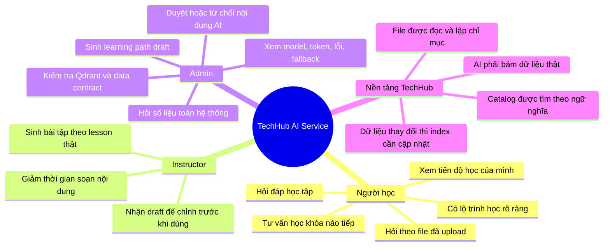

## 3. Sơ Đồ Tư Duy Kỹ Thuật

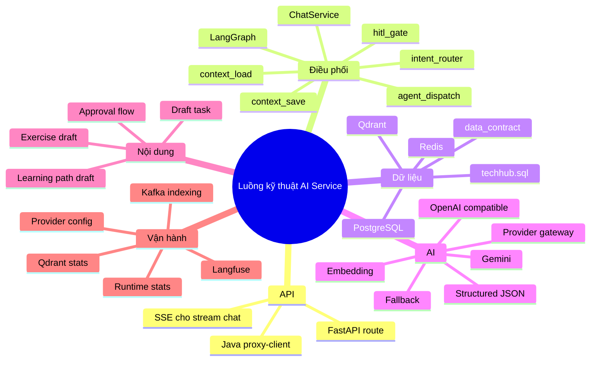

## 4. Các Khái Niệm Cần Nắm

| Khái niệm | Hiểu đơn giản | Trong code hiện tại |
|---|---|---|
| Data contract | Bản đồ nói rõ AI được đọc bảng/cột nào, join thế nào, bảng nào AI được ghi trực tiếp. | `app/services/data_contract/` |
| LangGraph node | Một bước nhỏ trong luồng chat. Mỗi node làm một việc: nạp ngữ cảnh, phân loại ý định, hỏi lại, gọi agent, lưu ngữ cảnh. | `app/orchestration/graph/chat_orchestrator_graph.py` và `app/orchestration/nodes/` |
| Intent | Ý định của câu hỏi: hỏi chung, gợi ý khóa học, hỏi kiến thức, hỏi số liệu, vẽ biểu đồ, phân tích file. | `intent_node.py`, `intent_router.py` |
| HITL | Hỏi lại người dùng khi câu hỏi mơ hồ hoặc rủi ro. | `hitl_gate_node.py`, `conversation_agent_node.py` |
| Chunk | Cắt tài liệu dài thành đoạn nhỏ để tìm kiếm và đưa vào prompt vừa đủ. | `vector_service._chunk_text()` |
| Embedding | Biến text thành vector số để tìm theo ý nghĩa, không chỉ theo từ khóa. | `llm_gateway.generate_embeddings()` |
| Qdrant | Nơi lưu vector của course, lesson, profile, file chunk. Dùng để tìm ngữ nghĩa, không dùng để join hay tính số liệu chính xác. | `vector_service.py` |
| RAG | Tìm dữ liệu liên quan trước, rồi mới đưa dữ liệu đó vào AI trả lời. | `rag_retriever_node.py`, `rag_response_node.py`, `file_agent_node.py` |
| Rerank | Sắp xếp lại kết quả tìm kiếm theo tín hiệu cá nhân như lịch sử học, kỹ năng, rating. | `recommendation_service.py`, `rag_retriever_node.py` |
| Structured JSON | Bắt AI trả về JSON có cấu trúc để backend kiểm tra và frontend render được. | `llm_gateway.generate_structured_json()` |
| Draft | Nội dung AI sinh ra nhưng chưa ghi vào bảng production. Con người cần duyệt trước. | `ai_generation_tasks`, `draft_service.py` |
| SSE | Cách stream câu trả lời từng phần từ server về frontend. | `chat.py`, `chat_service.stream_message()` |
| Fallback | Khi LLM, Qdrant hoặc dữ liệu thiếu, service vẫn trả kết quả có kiểm soát thay vì chết. | Nhiều service có `_fallback_*` |

## 5. Luồng Tổng Quát Một Request AI

### Nghiệp vụ

Người dùng không quan tâm AI dùng model nào. Họ quan tâm:

1. Tôi hỏi một câu.
2. Hệ thống hiểu tôi đang muốn gì.
3. Hệ thống lấy đúng dữ liệu của tôi hoặc của TechHub.
4. AI trả lời có căn cứ.
5. Nếu câu hỏi mơ hồ, hệ thống hỏi lại.
6. Nếu kết quả là nội dung quan trọng như bài tập hoặc lộ trình, hệ thống lưu draft để duyệt.

### Kỹ thuật

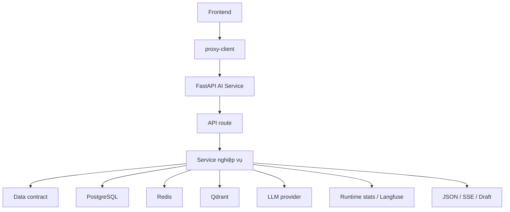

File chính:

- API FastAPI: `app/api/routes/*.py`
- Business service: `app/services/*.py`
- Data contract: `app/services/data_contract/`
- LLM gateway: `app/services/llm_gateway.py`
- Vector store: `app/services/vector_service.py`
- Runtime stats: `app/services/observability_service.py`
- Java proxy: `proxy-client/src/main/java/com/techhub/app/proxyclient/`

## 6. Chat Học Tập Theo Ngữ Cảnh

### Bài toán nghiệp vụ

Người học muốn có một trợ lý học tập biết ngữ cảnh:

- câu trước đó người học hỏi gì,
- người học đang học khóa nào,
- người học đã hoàn thành bài nào,
- có file nào vừa upload không,
- câu hỏi hiện tại là hỏi kiến thức, hỏi gợi ý, hỏi số liệu hay hỏi file.

### Luồng nghiệp vụ

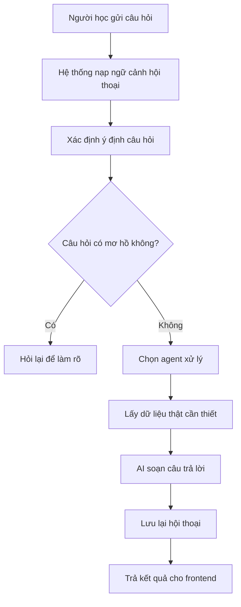

### Luồng kỹ thuật trong code

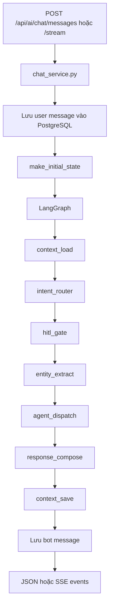

LangGraph nằm ở:

- `app/orchestration/graph/chat_orchestrator_graph.py`

Các node chính:

| Node | Việc làm | File |
|---|---|---|
| `context_load` | Lấy Redis context, active files, user memory, course history, ratings, skill profile. | `context_load_node.py` |
| `intent_router` | Phân loại câu hỏi thành intent. | `intent_node.py`, `intent_router.py` |
| `hitl_gate` | Quyết định có cần hỏi lại không. | `hitl_gate_node.py` |
| `entity_extract` | Lấy entity như topic, level, metric, file reference. | `entity_extraction_node.py` |
| `agent_dispatch` | Chọn agent phù hợp. | `agents/registry.py` |
| `response_compose` | Chuẩn hóa response cuối. | `response_compose_node.py` |
| `context_save` | Lưu recent messages, last intent, active files vào Redis. | `context_save_node.py` |

Agent được chọn theo intent:

| Intent | Agent | Mục đích |
|---|---|---|
| `conversation` | `ConversationAgentNode` | Trả lời thường hoặc hỏi lại. |
| `recommendation` | `RagRetrieverNode` + `RagResponseNode` | Gợi ý khóa học. |
| `knowledge` | `RagRetrieverNode` + `RagResponseNode` | Hỏi kiến thức theo course/lesson liên quan. |
| `data_query` | `SqlAgentNode` | Hỏi số liệu bằng SQL đọc. |
| `visualization` | `SqlAgentNode` + `VizAgentNode` | Hỏi số liệu và sinh chart spec. |
| `file_analysis` | `FileAgentNode` | Hỏi theo file đã upload/index. |

Điểm có thể nâng cấp:

| Muốn nâng cấp nghiệp vụ | Muốn nâng cấp kỹ thuật |
|---|---|
| Chat hiểu rõ hơn câu hỏi học tập, hỏi lại tự nhiên hơn. | Cải thiện `intent_router`, thêm ví dụ intent, thêm test câu hỏi thật. |
| Chat không nhầm hỏi file với hỏi kiến thức chung. | Siết guard ở `intent_node.py` và `FileAgentNode`. |
| Chat cá nhân hóa theo người học tốt hơn. | Step 02: dùng trusted user identity từ proxy/JWT thay vì tin body. |
| Chat có trích dẫn rõ hơn. | Chuẩn hóa citation payload từ RAG, file, SQL. |

## 7. Gợi Ý Khóa Học Cá Nhân Hóa

### Bài toán nghiệp vụ

Người học hỏi: "Tôi nên học gì tiếp?"  
Hệ thống không nên chỉ trả khóa mới nhất. Nó cần xem:

- người học đã học gì,
- tiến độ hiện tại,
- khóa đã hoàn thành,
- rating người học đã cho,
- kỹ năng đã có,
- mục tiêu hoặc chủ đề đang hỏi,
- catalog khóa học thật.

### Luồng nghiệp vụ

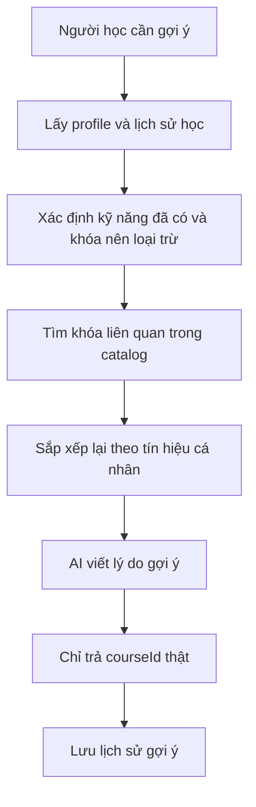

### Luồng kỹ thuật trong code

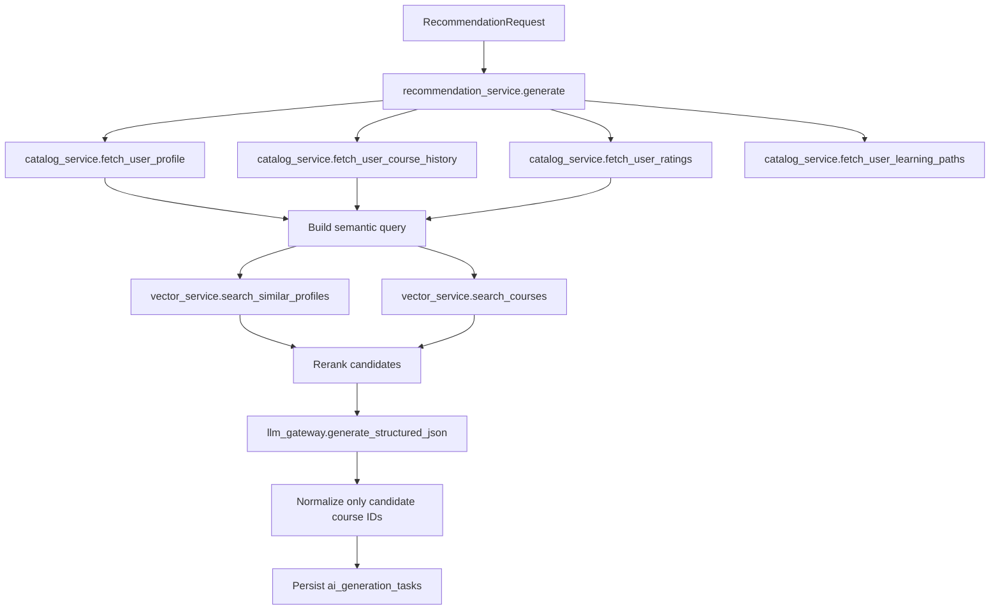

File chính:

- API: `app/api/routes/recommendations.py`
- Service: `app/services/recommendation_service.py`
- Catalog PostgreSQL: `app/services/catalog_service.py`
- Vector search: `app/services/vector_service.py`
- LLM structured JSON: `app/services/llm_gateway.py`
- Schema: `app/schemas/recommendation.py`
- Data contract: `app/services/data_contract/`

Dữ liệu PostgreSQL quan trọng:

- `users`
- `profiles`
- `courses`
- `chapters`
- `lessons`
- `enrollments`
- `progress`
- `ratings`
- `course_skills`
- `skills`
- `learning_paths`
- `path_progress`

Qdrant dùng để:

- tìm course theo ngữ nghĩa,
- tìm profile người học tương đồng,
- không dùng để tính số liệu chính xác,
- không tự biết join bảng.

Điểm có thể nâng cấp:

| Muốn nâng cấp nghiệp vụ | Muốn nâng cấp kỹ thuật |
|---|---|
| Gợi ý theo mục tiêu nghề nghiệp hoặc skill gap rõ hơn. | Thêm bảng/field mục tiêu học tập, skill taxonomy, prerequisite thật. |
| Gợi ý có giải thích vì sao khóa này phù hợp. | Chuẩn hóa `signals`, `reason`, citation course metadata. |
| Tránh gợi ý khóa người học đã hoàn thành. | Siết exclude bằng `enrollments`, `progress`, trusted user ID. |
| Gợi ý theo người học tương đồng tốt hơn. | Hoàn thiện profile embedding và Qdrant payload versioning. |

## 8. Hỏi Số Liệu Và Vẽ Biểu Đồ

### Bài toán nghiệp vụ

Admin hoặc người học hỏi:

- "Tiến độ học của tôi thế nào?"
- "Khóa nào có nhiều người học nhất?"
- "Doanh thu theo khóa?"
- "Vẽ biểu đồ hoàn thành bài học theo tháng."

Đây là bài toán số liệu. Kết quả phải chính xác theo database, không thể để AI tự tưởng tượng.

### Luồng nghiệp vụ

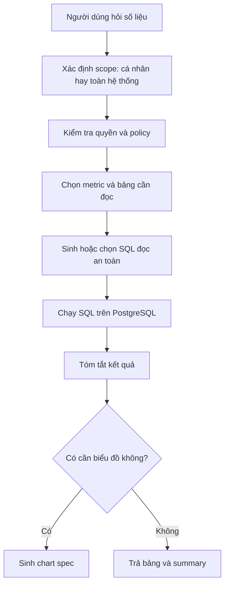

### Luồng kỹ thuật hiện tại

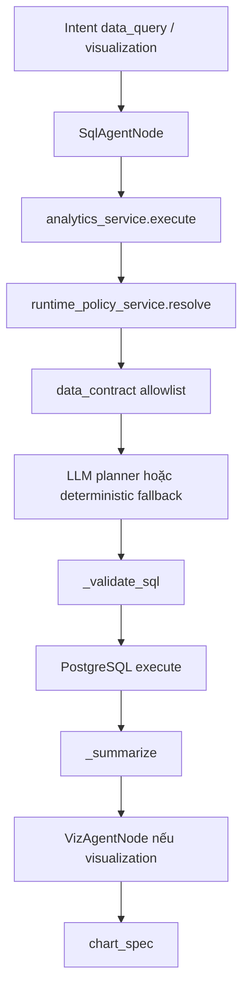

File chính:

- Agent SQL: `app/orchestration/nodes/agents/sql_agent_node.py`
- Agent biểu đồ: `app/orchestration/nodes/agents/viz_agent_node.py`
- Service số liệu: `app/services/analytics_service.py`
- Data contract: `app/services/data_contract/`
- Runtime policy: `app/services/runtime_policy_service.py`
- Chart schema: `app/schemas/analytics_contract.py`

Nguyên tắc quan trọng:

- PostgreSQL là nơi tính số liệu chính xác.
- Qdrant không dùng để join, count, sum, average.
- AI có thể giúp lập kế hoạch SQL, nhưng SQL phải qua allowlist và validate.
- Nếu người dùng hỏi dữ liệu cá nhân, phải dùng trusted user ID ở Step 02.

Điểm hiện tại cần nâng cấp tiếp:

| Muốn nâng cấp nghiệp vụ | Muốn nâng cấp kỹ thuật |
|---|---|
| Hỏi số liệu ổn định theo các câu hỏi phổ biến. | Step 03: tạo semantic layer gồm metric map, join map, SQL template. |
| Admin hỏi doanh thu, học viên, completion rate. | Thêm template cho `transactions`, `transaction_items`, `payments`, `enrollments`, `progress`. |
| Người học hỏi tiến độ cá nhân. | Kết nối trusted identity và policy cá nhân. |
| Biểu đồ dễ render và đúng loại. | Chuẩn hóa `chart_spec`, `columnMeta`, empty state. |

## 9. Phân Tích File Và Tài Liệu Upload

### Bài toán nghiệp vụ

Người học hoặc instructor upload tài liệu rồi hỏi:

- "Tóm tắt file này."
- "Trong tài liệu này nói gì về React?"
- "So sánh nội dung file với lesson hiện tại."

AI không nên chỉ đọc tên file. Nó cần lấy nội dung, cắt thành đoạn, index, rồi tìm lại đoạn liên quan khi người dùng hỏi.

### Luồng nghiệp vụ

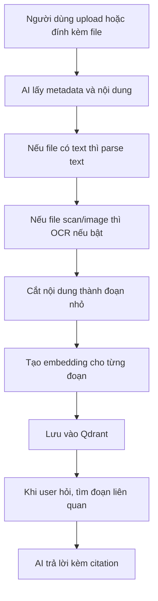

### Luồng kỹ thuật chi tiết

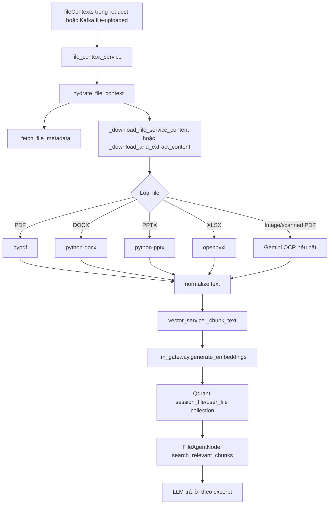

File chính:

- File hydrate/parse/OCR: `app/services/file_context_service.py`
- Chunk và index: `app/services/vector_service.py`
- File agent: `app/orchestration/nodes/agents/file_agent_node.py`
- LLM/OCR/embedding: `app/services/llm_gateway.py`, `file_context_service._ocr_via_gemini()`
- Admin ingest endpoint: `app/api/routes/admin.py`
- Kafka event: `app/services/indexing_event_consumer.py`

Thông số kỹ thuật quan trọng:

| Thông số | Ý nghĩa | Config |
|---|---|---|
| `file_chunk_size` | Độ dài mỗi đoạn text sau khi cắt. | `AI_FILE_CHUNK_SIZE` |
| `file_chunk_overlap` | Số ký tự lặp lại giữa hai đoạn để tránh mất ngữ cảnh ở ranh giới. | `AI_FILE_CHUNK_OVERLAP` |
| `file_max_chars` | Giới hạn text tối đa lấy từ file. | `AI_FILE_MAX_CHARS` |
| `file_excerpt_chars` | Đoạn trích ngắn dùng trong prompt/citation. | `AI_FILE_EXCERPT_CHARS` |
| `ocr_enabled` | Có bật OCR bằng Gemini không. | `AI_OCR_ENABLED` |

Chunk hoạt động như sau:

```text
Tài liệu dài
  -> đoạn 1: ký tự 0..1200
  -> đoạn 2: ký tự 1050..2250
  -> đoạn 3: ký tự 2100..3300
```

Phần overlap giúp câu bị cắt ở cuối đoạn 1 vẫn có thể xuất hiện ở đầu đoạn 2.

Điểm có thể nâng cấp:

| Muốn nâng cấp nghiệp vụ | Muốn nâng cấp kỹ thuật |
|---|---|
| Hỏi file chính xác hơn, có trích dẫn đoạn. | Lưu page number, section title, chunk offset vào payload Qdrant. |
| Hỗ trợ scanned PDF tốt hơn. | Kiểm thử OCR thật, thêm OCR provider hoặc cache OCR result. |
| Phân quyền file theo user/course. | Lọc Qdrant payload theo `user_id`, `session_id`, ownership từ File Service. |
| Hỏi nhiều file cùng lúc. | Thêm file collection scope, rerank multi-file, citation chuẩn. |

## 10. Sinh Learning Path

### Bài toán nghiệp vụ

Admin hoặc người học muốn tạo lộ trình:

- mục tiêu học là gì,
- trình độ hiện tại,
- trình độ muốn đạt,
- thời lượng mong muốn,
- khóa nào nên học trước, khóa nào học sau.

Kết quả không nên ghi thẳng vào production. AI tạo draft để người có trách nhiệm kiểm tra.

### Luồng nghiệp vụ

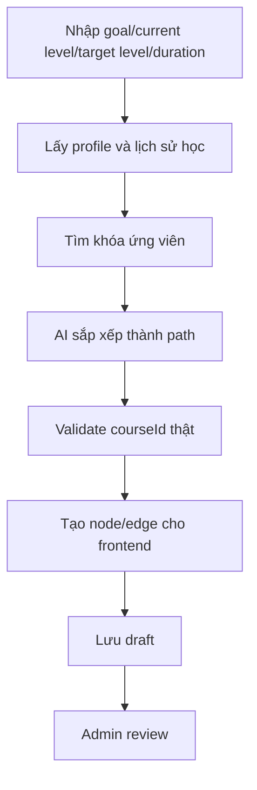

### Luồng kỹ thuật

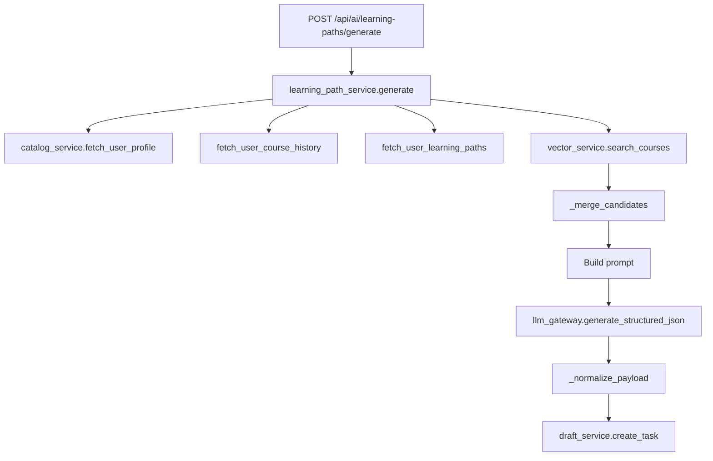

File chính:

- API: `app/api/routes/learning_paths.py`
- Service: `app/services/learning_path_service.py`
- Draft: `app/services/draft_service.py`
- Catalog: `app/services/catalog_service.py`
- Vector: `app/services/vector_service.py`
- Schema: `app/schemas/learning_path.py`

Điểm có thể nâng cấp:

| Muốn nâng cấp nghiệp vụ | Muốn nâng cấp kỹ thuật |
|---|---|
| Lộ trình có prerequisite thật. | Thêm schema quan hệ prerequisite hoặc rule engine. |
| Approve draft tạo learning path thật. | Step 06: gọi Learning Path Service để ghi `learning_paths`, `learning_path_courses`. |
| Path giải thích vì sao khóa A trước khóa B. | Thêm field reasoning per edge/node. |
| Path tránh khóa user đã hoàn thành. | Dùng trusted user ID và course history chặt hơn. |

## 11. Sinh Bài Tập Theo Lesson

### Bài toán nghiệp vụ

Instructor muốn sinh nhanh bài tập theo lesson thật:

- MCQ,
- essay,
- coding,
- test case cho coding.

AI phải bám nội dung lesson, không tự sinh chủ đề xa bài học. Kết quả nên là draft để instructor duyệt.

### Luồng nghiệp vụ

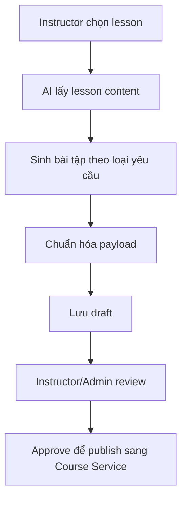

### Luồng kỹ thuật

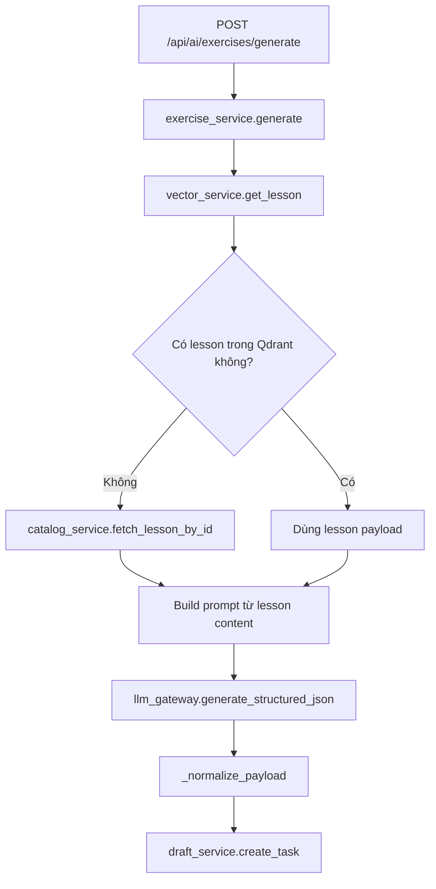

File chính:

- API: `app/api/routes/exercises.py`
- Service: `app/services/exercise_service.py`
- Lesson source: `app/services/vector_service.py`, `app/services/catalog_service.py`
- Draft: `app/services/draft_service.py`
- Schema: `app/schemas/exercise.py`

Điểm có thể nâng cấp:

| Muốn nâng cấp nghiệp vụ | Muốn nâng cấp kỹ thuật |
|---|---|
| Bài tập đúng lesson hơn. | Bắt buộc lesson content đủ dài, thêm lesson asset/context. |
| Coding exercise có test case chạy được. | Thêm validator/test runner hoặc schema test case chặt hơn. |
| Approve draft tạo exercise thật. | Step 07: gọi Course Service để ghi `exercises`, `exercise_test_cases`. |
| Chống bài tập trùng lặp. | So sánh semantic với bài tập cũ trước khi lưu draft. |

## 12. Index Dữ Liệu Bằng Qdrant Và Kafka

### Bài toán nghiệp vụ

Nếu course, lesson, rating, enrollment, learning path hoặc file thay đổi, AI cần biết dữ liệu mới. Nếu index cũ, AI sẽ gợi ý sai hoặc không tìm thấy nội dung mới.

### Luồng nghiệp vụ

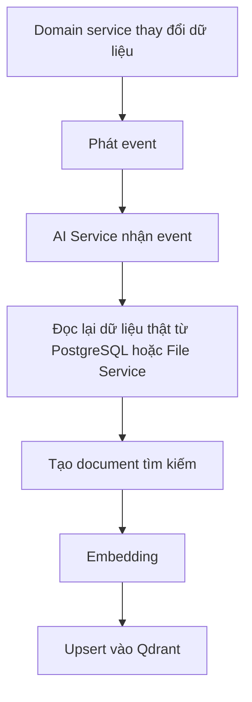

### Luồng kỹ thuật

```mermaid
flowchart TD
    A["Kafka topic"] --> B["indexing_event_consumer.py"]
    B --> C{"Topic"}
    C -->|course-events| D["vector_service.reindex_single_course"]
    C -->|lesson-events| E["vector_service.reindex_single_lesson"]
    C -->|file-uploaded| F["file_context_service.ingest_uploaded_event"]
    C -->|enrollment/rating/path| G["Hiện ghi nhận event, cần hoàn thiện profile reindex"]
    D --> H["catalog_service"]
    E --> H
    H --> I["build search document"]
    I --> J["generate_embeddings"]
    J --> K["Qdrant upsert"]
```

File chính:

- Event consumer: `app/services/indexing_event_consumer.py`
- Vector service: `app/services/vector_service.py`
- Catalog service: `app/services/catalog_service.py`
- File service integration: `app/services/file_context_service.py`
- Config topics: `app/core/config.py`

Qdrant collections hiện tại:

| Logical name | Ý nghĩa |
|---|---|
| `course_embeddings` | Tìm course theo ngữ nghĩa. |
| `lesson_embeddings` | Tìm lesson hoặc lấy lesson context. |
| `user_embeddings` | Tìm profile người học tương đồng. |
| `session_file_embeddings` | File đính kèm trong một session chat. |
| `user_file_embeddings` | File upload cấp user để hỏi lại sau. |

Điểm có thể nâng cấp:

| Muốn nâng cấp nghiệp vụ | Muốn nâng cấp kỹ thuật |
|---|---|
| Course mới publish tìm được ngay. | Hoàn thiện event producer/consumer và retry. |
| Rating/progress đổi thì recommendation đổi. | Rebuild user profile embedding theo userId. |
| Biết index có đủ dữ liệu chưa. | Thêm readiness check theo collection, payload version, point count. |
| Không mất index khi provider lỗi. | Queue retry, dead-letter, lưu trạng thái indexing. |

## 13. Provider, Model, Fallback Và Quan Sát Vận Hành

### Bài toán nghiệp vụ

Admin cần biết:

- AI đang dùng provider/model nào,
- provider có lỗi hay thiếu key không,
- tốn bao nhiêu token,
- request nào fallback,
- Qdrant có hoạt động không,
- Langfuse trace có gì.

### Luồng kỹ thuật

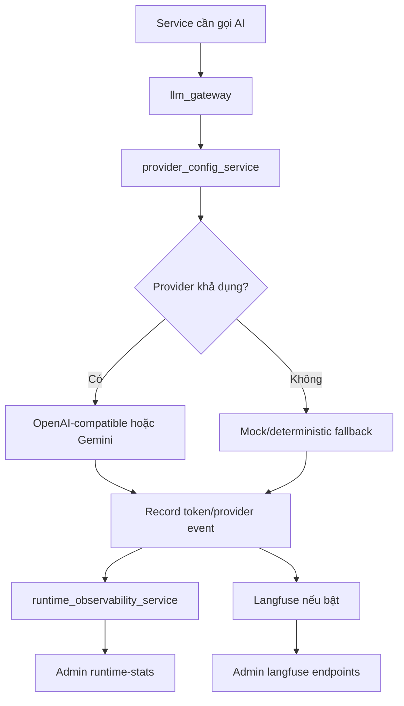

File chính:

- LLM gateway: `app/services/llm_gateway.py`
- Provider config: `app/services/provider_config.py`
- Runtime policy: `app/services/runtime_policy_service.py`
- Observability: `app/services/observability_service.py`
- Langfuse: `app/services/langfuse_service.py`
- Admin route: `app/api/routes/admin.py`

Điểm có thể nâng cấp:

| Muốn nâng cấp nghiệp vụ | Muốn nâng cấp kỹ thuật |
|---|---|
| Admin hiểu chi phí AI theo chức năng. | Tách token/cost theo scope: chat, recommendation, file, exercise. |
| Biết fallback nào ảnh hưởng user. | Gắn `executionMode`, `fallbackReason`, degraded status vào response. |
| Đổi provider an toàn hơn. | Thêm canary model, model policy theo role/tenant. |
| Debug hallucination dễ hơn. | Bắt buộc trace gồm intent, retrieved docs, SQL, citations, model. |

## 14. Bảng Đối Chiếu Nhanh: Nghiệp Vụ Nào Đụng File Nào

| Nghiệp vụ | File route | File service | Dữ liệu chính | Kỹ thuật chính |
|---|---|---|---|---|
| Chat thường/stream | `routes/chat.py` | `chat_service.py` | `chat_sessions`, `chat_messages`, Redis | LangGraph, SSE, Redis memory |
| Gợi ý khóa học | `routes/recommendations.py` | `recommendation_service.py` | course, enrollment, progress, rating, skill | Qdrant, rerank, structured JSON |
| Hỏi kiến thức | `routes/chat.py` | `rag_retriever_node.py`, `rag_response_node.py` | course/lesson vector payload | RAG, citation |
| Hỏi số liệu | `routes/chat.py` | `analytics_service.py` | PostgreSQL analytics/domain tables | SQL validate, data contract |
| Vẽ biểu đồ | `routes/chat.py` | `analytics_service.py`, `viz_agent_node.py` | SQL rows | chart spec |
| Phân tích file | `routes/chat.py`, `routes/admin.py` | `file_context_service.py`, `file_agent_node.py` | files, file chunks | parser, OCR, chunk, embedding |
| Sinh learning path | `routes/learning_paths.py` | `learning_path_service.py` | profile, history, courses, paths | Qdrant, structured JSON, draft |
| Sinh bài tập | `routes/exercises.py` | `exercise_service.py` | lesson, exercise draft | lesson grounding, structured JSON |
| Duyệt draft | `routes/drafts.py` | `draft_service.py` | `ai_generation_tasks` | draft approval |
| Reindex | `routes/admin.py` | `vector_service.py`, `indexing_event_consumer.py` | course, lesson, file, profile | embedding, Qdrant, Kafka |
| Provider/admin | `routes/admin.py` | `provider_config.py`, `observability_service.py` | Redis, runtime memory, Langfuse | provider switch, stats |

## 15. Cách Suy Nghĩ Khi Muốn Nâng Cấp

Khi muốn nâng cấp AI Service, tách câu hỏi thành hai phần.

### 15.1 Nâng cấp nghiệp vụ

Hỏi:

- Người dùng nào được lợi: learner, instructor hay admin?
- Kết quả cuối cùng có phải chỉ là câu trả lời, hay phải tạo record thật?
- Dữ liệu thật nằm ở bảng nào hoặc service nào?
- Có cần người duyệt không?
- Có rủi ro quyền riêng tư hoặc dữ liệu cá nhân không?
- Nếu thiếu dữ liệu, hệ thống nên hỏi lại, báo thiếu, hay fallback?

Ví dụ:

```text
Muốn gợi ý khóa học tốt hơn
  -> cần biết mục tiêu học
  -> cần skill gap
  -> cần course prerequisites
  -> cần lịch sử học và rating thật
  -> cần giải thích vì sao gợi ý
```

### 15.2 Nâng cấp kỹ thuật

Hỏi:

- Luồng này đi qua route/service/agent nào?
- Nó đọc PostgreSQL hay Qdrant?
- Nếu là số liệu, SQL có template và validate chưa?
- Nếu là tìm kiếm ngữ nghĩa, payload Qdrant đã đủ chưa?
- Nếu là file, chunk có metadata đủ chưa?
- Nếu là AI output, có structured JSON và normalize chưa?
- Nếu là nội dung production, đã có publish flow sang owner service chưa?
- Observability đã ghi được fallback, token, latency, error chưa?

Ví dụ:

```text
Muốn hỏi file tốt hơn
  -> đọc file_context_service
  -> kiểm tra parser/OCR
  -> kiểm tra chunk size/overlap
  -> kiểm tra Qdrant payload
  -> kiểm tra FileAgent citation
  -> kiểm tra quyền user/file
```

## 16. Những Ranh Giới Phải Nhớ

- PostgreSQL là nguồn sự thật cho quan hệ và số liệu.
- Qdrant là công cụ tìm theo ý nghĩa, không phải nơi tính toán nghiệp vụ chính xác.
- LangGraph chỉ điều phối chat, không thay thế service nghiệp vụ.
- LLM chỉ được sinh nội dung sau khi backend đã đưa dữ liệu đúng vào prompt.
- Draft không phải production record.
- Fallback giúp hệ thống không chết, nhưng không chứng minh nghiệp vụ đã hoàn thiện.
- Nếu không có trusted user identity, mọi câu hỏi "của tôi" đều chưa đủ an toàn.

## 17. Bản Đồ Nâng Cấp Theo Từng Hướng

| Hướng nâng cấp | Nghiệp vụ được cải thiện | Kỹ thuật cần đụng |
|---|---|---|
| Trusted identity | Câu hỏi cá nhân đúng người, đúng quyền. | `proxy-client`, `runtime_request_context.py`, `runtime_policy_service.py`, chat/recommendation request mapping. |
| Semantic layer cho analytics | Hỏi số liệu đáng tin hơn. | `analytics_service.py`, `data_contract/metrics.py`, SQL template, policy. |
| Profile vector thật | Recommendation cá nhân hóa hơn. | `catalog_service.compute_skill_profile`, `vector_service._reindex_behavior_profiles`, Kafka enrollment/rating events. |
| Publish learning path | Draft thành lộ trình thật. | `learning_path_service.py`, `draft_service.py`, Learning Path Service API/client. |
| Publish exercise | Draft thành bài tập thật. | `exercise_service.py`, `draft_service.py`, Course Service API/client. |
| File citation mạnh hơn | Hỏi file có nguồn rõ ràng. | `file_context_service.py`, `vector_service._index_file_contexts`, `file_agent_node.py`. |
| Index readiness | Biết AI có dữ liệu đủ chưa. | `vector_service.get_collection_stats`, admin endpoints, data contract validate. |
| Observability sâu hơn | Debug được vì sao AI trả lời sai. | `observability_service.py`, `langfuse_service.py`, metadata response. |

## 18. Kết Luận Ngắn

AI Service hiện tại là lớp nối giữa nghiệp vụ học tập và kỹ thuật AI:

- Nghiệp vụ cần cá nhân hóa, hỏi đáp, sinh nội dung, phân tích file, hỏi số liệu.
- Kỹ thuật dùng FastAPI, LangGraph, PostgreSQL, Redis, Qdrant, LLM provider, Kafka, Langfuse.
- Muốn nâng cấp đúng, không bắt đầu từ "đổi model gì", mà bắt đầu từ "nghiệp vụ cần quyết định gì, dữ liệu thật nằm ở đâu, luồng kỹ thuật nào đang chịu trách nhiệm".

Khi hiểu được bản đồ này, có thể nhìn một yêu cầu mới và biết ngay:

- nó thuộc nghiệp vụ nào,
- cần đọc bảng/service nào,
- có cần Qdrant hay SQL không,
- có cần LangGraph agent không,
- có cần draft approval không,
- và phần nào có thể thay thế hoặc nâng cấp mà không phá toàn hệ thống.
